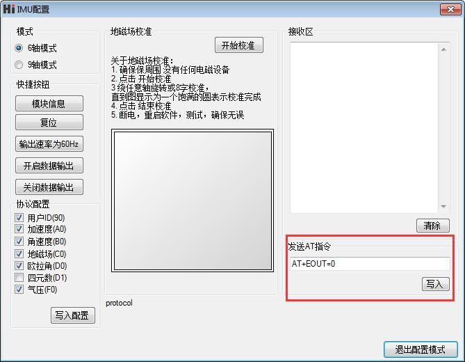

# HI226/HI229 用户手册
<p style="text-align: right;">IMU/VRU/AHRS姿态测量模块, Rev A1


<div style="page-break-after: always;"></div>
[TOC]

<div style="page-break-after: always;"></div>
## 简介

HI226是超核电子推出的一款超低成本、高性能、小体积、低延时的惯性测量单元(IMU)，本产品集成了三轴加速度计、三轴陀螺仪和一款微控制器。可输出经过传感器融合算法计算得到的基于当地地理坐标的三维方位数据，包含无绝对参考的相对航向角，俯仰角和横滚角。同时也可以输出校准过的原始的传感器数据。


典型应用:

* 扫地机/室内机器人航向跟踪/飞鼠/游戏控制器


HI229是超核电子推出的一款低成本、高性能、小体积、低延时的航姿参考单元（AHRS），本产品集成了三轴加速度计、三轴陀螺仪、三轴磁场传感器和一款微控制器。可输出经过传感器融合算法计算得到的基于当地地理坐标的三维方位数据，包含航向角，俯仰角和横滚角。同时也可以输出校准过的原始的传感器数据。本产品具有一定的室内地磁抗干扰性能，在一定强度的地磁场干扰环境下仍可正常工作。


典型应用:

- VR\动作捕捉
- 高动态环境下姿态测量\运动性能评估
- 无人机控制


## 特性

### 板载传感器
- 三轴陀螺仪, 最大量程: ±2000°/s 
- 三轴加速度计, 最大量程:±8G 
- 三轴磁场传感器，最大量程: 800mG (毫高斯)
### 数据处理 
- 加速度和陀螺仪出厂前经过三轴非正交和标度因子校准
- 数据融合算法计算并输出地理坐标系下的旋转四元数及欧拉角等姿态信息
### 通讯接口及供电
- 串口(兼容TTL 可直接与5V 或3.3V 串口设备连接)
- 供电电压：3.3 (+/- 100 mV)
- 最大峰值功耗：32mA
### 其他
- PC端上位机程序，提供实时数据显示，波形，校准及excel 数据记录功能

- 多项模块参数用户可配置

## 硬件及尺寸

### 硬件参数

| 参数           | 描述                                          |
| -------------- | --------------------------------------------- |
| 输出数据接口   | UART(TTL 1.8V - 3.3V)                         |
| 工作电压       | 3.3V (± 100mV)                                |
| 功耗           | 86mW @3.3V                                    |
| 温度范围       | -20℃  - 85 ℃                                  |
| 最大线性加速度 | 0 - 115 $m/s^2$                               |
| 尺寸           | 12 x 12 x 2.6mm (W x L x H)                   |
| 板载传感器     | 三轴加速度计 三轴陀螺仪 三轴磁场传感器(HI229) |

### 尺寸


| 符号 | 最小值 | 典型值 | 最大值 | 单位 |
| ---- | ------ | ------ | ------ | ---- |
| A1   | -      | 11     | -      | mm   |
| B    | -      | 11     | -      | mm   |
| D    | -      | 12     | -      | mm   |
| E    | -      | 12     | -      | mm   |
| H    | 2.5    | 2.6    | 2.7    | mm   |
| a    | -      | 1.5    | -      | mm   |
| b    | -      | 0.9    | -      | mm   |
| c    | -      | 1      | -      | mm   |
| e    | -      | 1.27   | -      | mm   |
| f    | -      | 1      | -      | mm   |


### 引脚定义


| 引脚号 | 名称   | 说明                                  |
| ------ | ------ | ------------------------------------- |
| 5      | N/C | 保留                                  |
| 6      | VCC    | 电源 3.3V                             |
| 7      | SYNC_OUT | 数据输出同步:  数据输出时， 此引脚为高电平，空闲时为低电平。 |
| 8      | RXD    | 模块串口接收 UART RXD(接 MCU 的 TXD)  |
| 9      | TXD    | 模块串口发送 UART TXD (接 MCU 的 RXD) |
| 10     | SYNC_IN | 数据输入同步:  内部下拉，当模块检测到上升沿时, 输出一帧数据。最高同步频率为200Hz，且输出帧率不能超过当前串口波特率下总带宽。 |
| 11     | N/C    | 保留                                  |
| 19     | GND    | GND                                   |
| 20     | RST    | 复位, 内部上拉。>10uS 低电平复位模块。无需要外接阻容，建议接到MCU的GPIO引脚以实现软件复位 |
| 21     | N/C | 保留 |
| 22     | N/C | 保留 |
| 23     | N/C    | 保留                                  |
| 24     | GND | GND                                   |
| 25     | N/C    | 保留                                  |


## 性能指标

### 姿态角输出精度

| 姿态角                                          | 典型值 |
| ----------------------------------------------- | ------ |
| 横滚角\俯仰角 - 静态误差                        | 0.8°   |
| 横滚角\俯仰角 - 动态误差                        | 2.5°   |
| 零偏稳定性                                      | 10°/h  |
| 运动中航向角精度(9轴模式下,无磁干扰,地磁校准后) | 3°     |

### 陀螺仪

| 参数     | 值                  |
| -------- | ------------------- |
| 测量范围 | ±2000°/s            |
| 非线性度 | ±0.1% (25°最佳)     |
| 噪声密度 | 0.08°/s/$\sqrt{Hz}$ |
| 采样率   | 2000Hz              |

### 加速度计

| 参数         | 值                        |
| ------------ | ------------------------- |
| 测量范围     | ±8G (1G = 1x 重力加速度 ) |
| 非线性度     | ±0.5% (25°最佳)           |
| 最大零点偏移 | 10mG                      |
| 噪声密度     | 250 $uG\sqrt{Hz}$         |
| 采样率       | 500Hz                     |

### 磁传感器参数

| 参数           | 值                          |
| -------------- | --------------------------- |
| 测量范围     | ±8Gauss |
| 非线性度     | ±0.1%                             |
| 采样率       | 100Hz                                      |

### 模块数据接口参数

| 参数           | 值                                  |
| -------------- | ----------------------------------- |
| 串口输出波特率 | 4800/9600/115200/460800可选         |
| 帧输出速率     | 0/1/10/25/50/100/200/400/500Hz 可选 |

## 融合及校准算法
### 陀螺仪校准

每一个姿态传感器都单独进行过全测量范围内的校准和测试。陀螺和加速度计的非正交和刻度因子误差参数都会保存在模块内部的Flash中。陀螺仪自动校准需要在上电后静止模块3s 左右以获得最好的校准效果。如果上电静置短于规定时间，则模块陀螺仪零偏校准效果会下降。


姿态传感器内建陀螺零速检测机制，当检测到长时间内三轴陀螺速度均小于1°/s时，模块认为当前为静止状态，陀螺输出为零偏，此次模块会将此时的陀螺读数记录下来作为零偏补偿。所以 **本产品不能用于旋转速度<1°/s的运动场景。**(既旋转速度低于秒针平均转速的1/6)


### 磁干扰，抗干扰及磁校准

#### 磁干扰分类

| 种类                 | 定义                                         | 典型干扰源                                                   | 影响                                                         | 措施                                   |
| -------------------- | -------------------------------------------- | ------------------------------------------------------------ | ------------------------------------------------------------ | -------------------------------------- |
| 空间磁场干扰         | 干扰不随传感器运动而运动，而处于世界坐标系下 | 各种固定的磁干扰源，家具，家用电器，电缆，房屋内的钢筋结构等。一切不随磁传感器运动而运动的干扰源 | 无论磁场传感器是否校准的好，这些空间磁场的干扰(或者说环境磁场不均匀)都会使得空间地磁场发生畸变。地磁补偿会错误并且无法获得正确的航向角。他们是造成室内地磁融合难以使用的主要元凶。这种干扰不能被校准, 会严重影响地磁性能。空间磁场干扰在室内尤其严重。 | 模块内置的匀质磁场检测及屏蔽非匀质磁场 |
| 传感器坐标系下的干扰 | 干扰源随传感器运动而运动                     | 模块PCB，与模块固定在一起的板子，仪器设备，产品等。他们和磁传感器视为同一个刚体，随磁传感器运动而运动 | 对传感器造成硬磁/软磁干扰。这些干扰可以通过地磁校准算法加以很好的消除。 | 地磁校准                               |

下图是一个典型的室内磁场分布图。可以看到：一般室内环境的空间磁场畸变是比较严重的。


**Notes**

在室内环境下，空间磁场干扰尤其严重，而且空间磁干扰并不能通过校准来消除。在室内环境下，尽管模块内置均质磁场检测及屏蔽机制，但9轴模式航向角的准确度很大程度上取决于室内磁场畸变程度，如果室内磁场环境很差(如电脑机房旁，电磁实验室，车间 ，地下车库等等)，即使校准后， 9轴的航向角精度可能还不如6轴甚至会出现大角度误差。

#### 工作模式

正因为地磁场非常容易受到空间干扰，所以使用9轴模式时应非常注意。下表列举了不同的使用场合和工况下的使用建议

| 模式    | 适用环境     | 典型应用                                                     | 优点                                                         | 缺点                                                         | 注意事项                         |
| ------- | ------------ | ------------------------------------------------------------ | ------------------------------------------------------------ | ------------------------------------------------------------ | -------------------------------- |
| 6轴模式 | 各种环境     | 云台等低动态姿态检测，室内机器人                             | 1. 姿态角输出稳定性好 2. 完全不受磁场干扰                    | 航向角随时间缓慢漂移                                         | 航向角会随时间缓慢飘移且无法补偿 |
| 9轴模式 | 无磁干扰环境 | 1.指南针，寻北系统 2. 空旷且磁干扰较少的室内，模块基本不会大范围在室内移动(典型的如摄影棚内动作捕捉，且被测者不会做大范围走动) | 1. 航向角不会随时间漂移 2.一旦检测到地磁场可快速修正航向角指北 | 任何磁干扰都会出现航向角准确度下降。室内干扰严重情况下 航向角无法指向正确方向。另外，移动机器人的金属结构和电机运行时会产生非常强的磁干扰，所以移动机器人平台不适用于9轴模式。 | 首次使用前需要校准地磁传感器     |


### 地磁校准

模块的自动地磁校准系统只能处理和模块安装在一起的，固定的磁场干扰。安装环境如果有磁场干扰，这种干扰必须是固定的，并且这个干扰磁场与模块 安装之后不会再发生距离变化(例：模块安装在一个铁材料之上，因为铁会有磁场干扰， 这时就需要把铁与模块一起旋转校准，并且这个铁在使用当中是不会和罗盘再分开的(发生相对位移)，一 旦分开是需要再重新校准。如果这个铁大小是不固定的，或与罗盘的距离变化也不是固定 的，这种干扰是无法校准，即使校准成功，也会精度非常差，只能避而远之安装。安全距离控制在 40CM 以上)。


本模块集成了主动无干预地磁校准算法。模块会自动收集地磁场信息并进行硬磁软磁校准参数估计，校准成功后校准信息会保存在模块Flash上。用户无须任何操作即可实现地磁在线校准。首次使用时，模块会自动采集周围地磁场，并且尝试估计地磁传感器零偏参数，一旦估算完成。在静止环境下，模块会自动将校准参数写入Flash以便下次直接调用。所以当首次使用模块并且需要使用9轴模式时，应进行如下校准操作：


* 在尽量小范围内，缓慢的让模块运动和旋转，或者进行8字运动 或者分别绕每个轴360度。让模块经历尽量多的姿态。一般情况下，如果地磁干扰在可接受的范围内，即可完成校准。如果后面在同样地磁环境下(同地点)，则无需再次校准。如果始终没能成功校准模块，说明周围地磁场干扰比较大。

地磁校准状态可以使用AT指令来查看：

发送`AT+INFO=HSI` 指令，模块会打印当前地磁校准系统状态：


| HSI参数显示 | 意义                 | 说明                                                         |
| ----------- | -------------------- | ------------------------------------------------------------ |
| valid       | 地磁校准有效标志     | 0: 不存在有效校准参数(没有校准或者从来没有校准成功过)。 5: 存在有效校准参数，但拟合效果不好(校准环境有地磁干扰/校准动作过快/校准时所经历的旋转不足)  13:存在有效的校准参数且校准效果良好 |
| fiterr      | 最近一次拟合残差     | 残差越小，说明参数拟合效果越好，通常在0.05以下说明校准结果已经足够好。如果拟合结果始终>0.1，说明地磁干扰很大，最好再次校准以期得到更好的校准结果。拟合残差会随着时间缓慢增长。 |
| bin_status  | 当前地磁数据采集进度 | 表示最近一次地磁数据采集进度，为百分比： 0-100%。 100%时会尝试拟合地磁校准参数。如果拟合成功, 则会更新valid 和 fiterr。 |
| cal_cnt     | 校准成功次数         | 拟合器校准地磁参数完成的次数，该数据累加，掉电保存           |
| flux        | 拟合器估计的地磁场强 | 最近一次拟合器估计出的地磁场强 ，单位为uT                    |
| inclination | 拟合器估计的地磁倾角 | 最近一次拟合器估计出的磁倾角，单位为°                        |


* 虽然地磁参数估计可以在线自动采集数据，自动的动态拟合地磁校准参数。但是如果周围地磁环境改变(比如需要到另外房间或者室内室外切换)，最好还需重复手工校准操作。


## 安装及焊接

1. 安装位置请远离PCB容易形变点，尽量远离PCB边缘(>30mm)，远离PCB定位螺丝孔(>10mm)等。

   

2. 安装位置请远离强磁设备，如电机，喇叭等强磁器件。

3. 由于MEMS传感器对PCB板应力非常敏感, **建议手工焊接模块，不使用回流焊焊接模块，否则会对传感器性能造成影响**。如果必须使用回流焊，则应注意：用印刷刮板在网板上印刷锡膏，使锡膏通过网板开口漏印到PCB上。为保证回流焊接质量，推荐焊盘部分对应的钢网厚度为0.18mm。

4. 组装好的PCB不得使用超声波清洁仪进行清洁。

5. 本产品不可使用塑封或喷涂三防漆，喷漆或塑封会造成传感器应力改变进而影响性能。

   

6. 推荐回流焊的炉温曲线图如下：


参考: https://ae-bst.resource.bosch.com/media/_tech/media/application_notes/BST-MAS-HS000.pdf


## 参考系定义

本产品采用右手(RH, Right-Hand)坐标系。输出的四元数及欧拉角为  传感器坐标系 到 惯性坐标系(世界坐标系) 的旋转。其中欧拉角旋转顺序为 ZYX(先转Z轴，再转Y轴，最后转X轴)旋转顺序，欧拉角具体定义如下：

- 绕 Z 轴方向旋转: 航向角\Yaw\phi($\psi$) 范围: -180° - 180°
- 绕 Y 轴方向旋转: 俯仰角\Pitch\theta($\theta$) 范围: -90°-90°
- 绕 X 轴方向旋转:横滚角\Roll\psi(  $\phi$)范围: -180°-180°

本产品使用北西天(North-West-Up  NWU) 坐标系统，即视为模块的地理坐标系(世界坐标系)定义如下：

- X 轴正方向指向北
- Y 轴正方向指向西
- Z 轴正方向指向天

当采用 NWU 系时，如果将模块视为飞行器的话。X 轴应视为机头方向。当传感器系与惯性系重合时，欧拉角的理想输出为:Pitch = 0°, Roll = 0°, Yaw = 0°

## 使用指南


### 模块与PC机连接

建议使用评估板与PC机进行连接，评估板板载USB供电及USB转串口功能，可以方便的配合PC机上的评估软件进行性能测试。具体请参见附录中的评估板一节。

### 模块与MCU进行连接

模块与MCU通过TTL电平的串口进行连接，建议模块的RST引脚建议接到MCU的GPIO上。方便MCU强制复位模块。


 !!! note 


1. 如不使用同步输入(SYNC_IN) 和同步输出功能(SYNC_OUT) 可不接SYNC_IN 和 SYNC_OUT。
2. 120欧电阻的作用是为了方便调试，以及防止MCU和模块电平不匹配，可以去掉，建议保留。
3. VCC的电压范围具体参加手册说明


## 串口通讯协议

### 数据包格式

模块资料包中提供了C 和C#的数据解析函数以供参考。模块上电后，模块默认按100Hz (出厂默认输出速率) 输出数据包，数据包格式如下：

|域 | 同步帧头 | 帧类型 | 帧长度 | CRC16 | 帧携带数据 |
|------------ | -------------|------------ |------------ |------------ |------------ |
|名称 | PRE | TYPE | LEN | CRC | REG_ADDR(N) + DATA(N) |
|大小(byte) | 0 | 1 | 2 | 2 | 可变(1-64) |
|偏移(byte) | 0 | 1 | 2 | 4 | 6 |
|值(hex) | 0x5A | 0xA5 | 帧长度 | CRC校验码 | 具体意义参看下节 |
|类型 | uint8_t | uint8_t | uint16_t | uint16_t | - |


* PRE
	固定为0x5A

* TYPE
	固定为0xA5 代表数据帧

* LEN 
	帧中数据域的长度。一帧最大为256 字节LSB(低字节在前)，长度只是值真正数据的长度，不包含`PRE`,`TYPE`,`LEN`,`CRC` 字段。

* CRC
	**除CRC 本身外**其余所有帧数据的16 位CRC 校验和LSB[^LSB]。CRC实现函数：

```
/*
	currectCrc: previous crc value, set 0 if it's first section
	src: source stream data
	lengthInBytes: length
*/
static void crc16_update(uint16_t *currectCrc, const uint8_t *src, uint32_t lengthInBytes)
{
    uint32_t crc = *currectCrc;
    uint32_t j;
    for (j=0; j < lengthInBytes; ++j)
    {
        uint32_t i;
        uint32_t byte = src[j];
        crc ^= byte << 8;
        for (i = 0; i < 8; ++i)
        {
            uint32_t temp = crc << 1;
            if (crc & 0x8000)
            {
                temp ^= 0x1021;
            }
            crc = temp;
        }
    } 
    *currectCrc = crc;
}
```


* REG_ADDR和DATA
	一帧数据可由多个数据包组成，每个数据包包含寄存器地址(REG_ADDR)和寄存器数据(DATA) 两部分。寄存器地址决定了数据的类型及长
度，DATA 为寄存器数据内容。模块支持的寄存器列表如下:

| 寄存器地址 | 寄存器长度(字节) | 名称              | 单位       |
| -------- | ---------- | ----------------- | ---------- |
| 0x90 | 1 | 用户ID | 无 |
| 0xA0     | 6          | 加速度            | 0.001G[^G]  |
| 0xA5 | 6 | 线性加速度 | 0.001G |
| 0xB0     | 6          | 角速度            | 0.1°/s     |
| 0xC0     | 6          | 磁场强度          | 0.001Gauss |
| 0xD0     | 6          | 欧拉角 (整形输出) | 度         |
| 0xD9     | 12         | 欧拉角(浮点输出)  | 度         |
| 0xD1     | 16         | 四元数            | N/A      |
| 0xF0 | 4 | 气压 | Pa |
| 0x71 | 128-256字节可变 | 无线节点四元数集合 | 无 |
| 0x72 | 48-96字节可变 | 无线节点欧拉角集合 | 同0xD0 |
| 0x75 | 48-96字节可变 | 无线节点加速度集合 | 同0xA0 |
| 0x78 | 48-96字节可变 | 无线节点角速度集合 | 同0xB0 |
| 0x61 | 3 | 无线数据帧拓展标识 | N/A |

[^G]: 1G = 1x当地重力加速度

* 0x90 
	用户ID

* 0xA0
	加速度，格式为int16，共三个轴，每个轴占2 个字节，X、Y、Z 三轴共6 个字节，LSB。传感器输出的原始加速度

* 0xA5
	性加速度，格式为int16，共三个轴，每个轴占2 个字节，X、Y、Z 三轴共6 个字节，LSB。地理坐标系下去除重力分量的加速度值

* 0xB0
	角速度，格式为int16，共三个轴，每个轴占2 个字节，X、Y、Z 三轴共6 个字节，LSB。传感器输出的角速度

* 0xC0
	磁场强度，格式为int16，共三个轴，每个轴占2 个字节，X、Y、Z 三轴共6 个字节，LSB。传感器输出的磁场强度

* 0xD0
	欧拉角整形格式，格式为int16，共三个轴，每个轴占2 个字节，顺序为Pitch/Roll/Yaw。LSB。接收到Roll, Pitch 为物理值乘以100 后得到的数值，Yaw 为乘以10 得到的数值举例：当接收到的Yaw = 100 时，表示航向角为10°

* 0xD9
	浮点格式输出的欧拉角。格式为float，共3 个值(Pitch/Roll/Yaw)，每个值占4 字节(float 型单精度
  浮点数)，LSB。

* 0XD1
	四元数，格式为float，共4个值，顺序为:W X Y Z.。每个值占4 字节(float)，整个四元数为4个float，共16字节，LSB。


* 0XF0
	气压。(只针对有气压传感器的产品)

* 0x71
	(仅支持HI221GW)节点四元数集合. 所有节点的四元数， 每个节点16字节，从0到最后一个节点顺序排列。每个节点 4个浮点数，分别为W X Y Z, 每个数用float 型表示，每个float 4字节。float为LSB
	
* 0x72
	(仅支持HI221GW)节点欧拉集合. 所有节点的欧拉角， 每个节点6字节，从0到最后一个节点顺序排列。每个节点欧拉为角整形格式，格式为int16，共三个轴，每个轴占2 个字节，顺序为Pitch/Roll/Yaw。LSB。接收到Roll, Pitch 为物理值乘以100 后得到的数值，Yaw 为乘以10 得到的数值举例：当接收到的Yaw = 100 时，表示航向角为10°
	
* 0x75
	(仅支持HI221GW)节点加速度集合. 每个节点6字节，从0到最后一个节点顺序排列。每个节点3个int16_t 型数据。分别为X Y Z的加速度。每个int16_t 占2字节， LSB
	
* 0x78
	(仅支持HI221GW)节点角速度集合. 每个节点6字节，从0到最后一个节点顺序排列。每个节点3个int16_t 型数据。分别为X Y Z的角速度。每个int16_t 占2字节， LSB
	
* 0x61

  (仅支持HI221GW)数据帧拓展信息标识，共3个字节:

  | 数据帧拓展信息字节偏移 | 值   | 说明                     |
  | ---------------------- | ---- | ------------------------ |
  | 0                      | -    | 保留                     |
  | 1                      | GWID | 接收机GWID               |
  | 2                      | CNT  | 此帧包含无线节点数: 1-16 |
  


### 出厂默认寄存器

出厂默认一帧中携带寄存器数据定义如下：

HI226/HI229:

| 顺序 | 数据包 | 说明             |
| ---- | ------ | ---------------- |
| 1    | 0x90   | 用户ID           |
| 2    | 0xA0   | 加速度           |
| 3    | 0xB0   | 角速度           |
| 4    | 0xC0   | 磁场强度         |
| 5    | 0xD0   | 欧拉角(整形输出) |
| 6    | 0xF0   | 气压             |

HI221GW(无线节点接收机):

| 顺序 | 寄存器 | 说明   |
| ---- | ------ | ------ |
| 1    | 0x71   | 四元数 |
| 2    | 0x75   | 加速度 |


### 数据帧结构示例

假设输出的数据帧带有 `A0,B0,D0` 寄存器，使用串口助手采样一帧数据如下所示:

`5A` `A5` `15` `00` `A9` `8B` `A0` `EA` `FF` `D0` `03` `45` `FF` `B0` `00` `00` `00` `00` `00` `00` `D0` `87` `00` `6F` `27`  `F5` `FF` 

其中：

`5A` `A5`帧头

`15` `00`帧数据域长度：`(0x00<<8) + 0x15 = 21`

`A9` `8B`帧CRC校验值: `(0x8B<<8) + 0xA9 = 0x8BA9`

`A0` `EA` `FF` `D0` `03` `45` `FF` 加速度数据包, `A0`为加速度寄存器地址， 三轴加速度为： 

​	AccX = (int16_t)((0xFF<<8)+ 0xEA) = -22
​	
​	AccY = (int16_t)((0x03<<8)+ 0xD0) = 976
​	
​	AccZ = (int16_t)((0xFF<<8)+ 0x45) = -187

`B0` `00` `00` `00` `00` `00` `00` 角速度数据包, `B0`为角速度寄存器地址， 三轴角速度全为0

`D0` `87` `00` `6F` `27` `F5` `FF` 欧拉角数据包, `D0`为欧拉角寄存器地址

​	Pitch= (int16_t)((0x00<<8)+ 0x87) / 100 = 1.35° 

​    Roll= (int16_t)((0x27<<8)+ 0x6F) / 100 = 100.95°

​    Yaw = (int16_t)((0xFF<<8)+ 0xF5) / 10 = -1.1°


计算CRC校验值：

记上面接收到的一帧数据存为C语言uint8_t 数组 buf:

```
    uint16_t payload_len;
    uint16_t crc;
    
    crc = 0;
    payload_len = buf[2] + (buf[3] << 8);
    
    /* calulate 5A A5 and LEN filed crc */
    crc16_update(&crc, buf, 4);
    
    /* calulate payload crc */
    crc16_update(&crc, buf + 6, payload_len);
```

​    最后计算得 CRC值为 0x8BA9, 与帧携带CRC值相同，帧校验正确。


## 通用AT指令

模块采用AT 指令集配置/查看模块参数。AT 指令总以ASCII 码`AT` 开头，后面跟控制字符，最
后以回车换行`\r\n`结束。可使用串口调试助手进行测试：



通用模块 AT指令如下

| 指令      | 功能                           | 掉电不保存且立即生效(N) / 掉电保存且重启生效(Y) |
| --------- | ------------------------------ | ----------------------------------------------- |
| AT+ID     | 设置模块用户ID                 | Y                                               |
| AT+GWID   | 设置无线网关ID(针对于无线产品) | Y                                               |
| AT+URFR   | 旋转模块传感器坐标系           | Y                                               |
| AT+INFO   | 打印模块信息                   | N                                               |
| AT+ODR    | 设置模块串口输出帧频率         | Y                                               |
| AT+BAUD   | 设置串口波特率                 | Y                                               |
| AT+EOUT   | 数据输出开关                   | N                                               |
| AT+RST    | 复位模块                       | N                                               |
| AT+TRG    | 单次输出触发                   | N                                               |
| AT+SETPEL | 设置输出数据包                 | Y                                               |
| AT+MODE   | 设置模块工作模式               | Y                                               |

##### AT+ID

设置模块用户ID

**例** `AT+ID=1`


##### AT+GWID

 (仅支持HI221)  HI221GW(接收机) 和 HI221(节点) 拥有GWID属性，可通过AT+GWID指令配置，GWID属性决定了接收器和节点的RF频率，只有HI221模块的GWID 和 接收器的 GWID属性相同时，模块和接收器直接才能通讯。GWID相当于无线网段，当在同一地点使用多个接收机组成多个星形网络时，必须保证每个接收器的GWID(网段)不同。


**例** 将一个接收器设置为GWID=3， 并将3个模块的自身ID设置为 0,1,2 并连接到这个接收器上：

接收机配置：`AT+GWID=3`

节点0配置： `AT+GWID=3`  `AT+ID=0`

节点1配置： `AT+GWID=3`  `AT+ID=1`

节点2配置： `AT+GWID=3`  `AT+ID=2`


##### AT+URFR

某些情况下传感器需要倾斜垂直安装，这时候需要旋转传感器坐标系，这条指令提供了旋转传感器坐标系的接口：

`AT+URFR=C00,C01,C02,C10,C11,C12,C20,C21,C22` 

其中  $C_{nn}$  支持浮点数 

$$
\left\{\begin{array}{l}{X} \\ {Y} \\ {Z}\end{array}\right\}_{U}=\left[\begin{array}{lll}{C 00} & {C 01} & {C 02} \\ {C 10} & {C 11} & {C 12} \\ {C 20} & {C 21} & {C 22}\end{array}\right] \cdot\left\{\begin{array}{l}{X} \\ {Y} \\ {Z}\end{array}\right\}_{B}
$$


其中$\left\{\begin{array}{l}{X} \\ {Y} \\ {Z}\end{array}\right\}_{U}$为旋转后的 传感器坐标系下 传感器数据，$\left\{\begin{array}{l}{X} \\ {Y} \\ {Z}\end{array}\right\}_{B}$为旋转前 传感器坐标系下 传感器数据


下面是几种常用旋转举例：

- 新传感器坐标系为 绕原坐标系X轴 旋转 90°， 输入命令：`AT+URFR=1,0,0,0,0,1,0,-1,0`

- 新传感器坐标系为 绕原坐标系X轴 旋转-90°， 输入命令：`AT+URFR=1,0,0,0,0,-1,0,1,0`

- 新传感器坐标系为 绕原坐标系X轴 旋转180°， 输入命令：`AT+URFR=1,0,0,0,-1,0,0,0,-1`

- 新传感器坐标系为 绕原坐标系Y轴 旋转 90°， 输入命令：`AT+URFR= 0,0,-1,0,1,0,1,0,0`

- 新传感器坐标系为 绕原坐标系Y轴 旋转-90°， 输入命令：`AT+URFR= 0,0,1,0,1,0,-1,0,0`

- 新传感器坐标系为 绕原坐标系Y轴 旋转180°， 输入命令：`AT+URFR= -1,0,0,0,1,0,0,0,-1`

- 恢复默认值：`AT+URFR=1,0,0,0,1,0,0,0,1`

  

##### AT+INFO

打印模块信息，包括产品型号，版本，固件发布日期等。AT+INFO可以拓展二级指令实现更多信息的查询

| INFO二级拓展指令 | 功能                 | 示例        |
| ---------------- | -------------------- | ----------- |
| CAL              | 显示模块内部校准参数 | AT+INFO=CAL |
| RF               | 显示无线设备参数     | AT+INFO=RF  |
| VER              | 显示详细版本信息     | AT+INFO=VER |


##### AT+ODR

设置模块串口输出速率。 掉电保存，复位模块生效

**例** 设置串口输出速率为100Hz:  `AT+ODR=100` 

##### AT+BAUD

设置串口波特率，可选值：4800/9600/115200/256000/460800`

**例**  `AT+BAUD=115200`

!!! note "注意"

- 使用此指令需要特别注意，输入错误波特率后可能会导致无法和模块通讯
- 波特率参数设置好后掉电保存，复位模块生效。上位机的波特率也要做相应修改。
- 升级固件时，需要切换回115200 波特率。

##### AT+EOUT

串口输出开关

**例** 打开串口输出 `AT+EOUT=1`   关闭串口输出 `AT+EOUT=0`

##### AT+RST

复位模块

**例** `AT+RST`

##### AT+TRG

触发模块输出一帧数据，可以配合AT+ODR=0来实现单次触发输出。

**例** `AT+TRG`

##### AT+SETPEL

设置输出协议:

模块数据帧中的数据包组成可使用AT指令配置，格式为`AT+SETPTL=<ITEM_ID>,<ITEM_ID>...`
一帧输出可包含最多8个数据包。

**例** 配置模块输出加速度，角速度, 整形格式欧拉角和四元数的指令为：`AT+SETPTL=A0,B1,D0,D1`


##### AT+MODE

设置模块工作模式

**例** 

* 设置模块工作在6轴模式(无磁校准)  `AT+MODE=0`
* 设置模块工作在9轴模式(地磁场传感器参与航向角校正)  `AT+MODE=1`


## 附录A - 评估板


### 评估板简介

评估板提供了快速评估本产品的方法。评估板板子资源包括：

- MicroUSB 接口，提供USB 转串口功能和供电功能
- 板载CP2104 USB-UART 芯片，并且可输出3.3V 100mA 给姿态模块供电

### 使用评估板

安装资料包中的CP2104 USB-UART 驱动程序, 将MicroUSB 线连接电脑和模块，打开资料包中的Uranus 上位机，连接串口，默认状态下，模块会以115200-N-8-N-1 输出出厂默认的数据包。

### 从评估板上取下产品

模块默认被嵌入评估板的PLCC-28 插槽中，如需取出模块，请按如下步骤操作：
- 断电，准备好细螺丝刀或镊子
- 从PLCC 插座或者背面圆形空洞内将模块撬出或顶出。

 

note "注意"

- 评估板的主要作用仅仅是快速评估模块性能，USB 接口本身不适合于工业级或者高运动场合适合的连接，如果您的应用为高运动环境(动作捕捉等)，则不建议在您的产品中直接使用评估板。
- 当使用评估板时，模块的串口与USB-UART 芯片连接，因为UART 只能一对一通讯，不能一个输入对多个输出，所以当使用评估板时，不能再将模块的TX,RX 引脚接到其他串口设备上。否则会造成物理损坏


## 附录B - 四元数-欧拉角转换

### 四元数基础

四元数是一个四维空间上的一点，使用一个实数和三个虚数来代表：$q \in \mathbb{R}^{4}=\mathbb{H}$

四元数有如下几种常用的表示方法：

| 复数表示                                                     | 向量表示                                                     | 四元数表示法1                               | 四元数表示法2                               |
| ------------------------------------------------------------ | ------------------------------------------------------------ | ------------------------------------------- | ------------------------------------------- |
| $q=q_{0}+\mathrm{i} q_{1}+\mathrm{j} q_{2}+\mathrm{k} q_{3}$ | $q=\left[q_{0}, \mathbf{q}\right]=\left[q_{0},\left(\begin{array}{l}{q_{1}} \\ {q_{2}} \\ {q_{3}}\end{array}\right)\right]$ | $q=\left[q_{0}, q_{1}, q_{2}, q_{3}\right]$ | $q=\left[q_{w}, q_{x}, q_{y}, q_{z}\right]$ |

其中：

$$
\mathrm{i}^{2}=\mathrm{j}^{2}=\mathrm{k}^{2}=\mathrm{ijk}=-1
$$

$$
\mathrm{ij}=\mathrm{k}=-\mathrm{ji}, \quad \mathrm{jk}=\mathrm{i}=-\mathrm{kj}, \quad \mathrm{ki}=\mathrm{j}=-\mathrm{ik}
$$


四元数乘法：

$$
\mathbf{p} \otimes \mathbf{q}=\left[\begin{array}{l}{p_{w} q_{w}-p_{x} q_{x}-p_{y} q_{y}-p_{z} q_{z}} \\ {p_{w} q_{x}+p_{x} q_{w}+p_{y} q_{z}-p_{z} q_{y}} \\ {p_{w} q_{y}-p_{x} q_{z}+p_{y} q_{w}+p_{z} q_{x}} \\ {p_{w} q_{z}+p_{x} q_{y}-p_{y} q_{x}+p_{z} q_{w}}\end{array}\right]
$$


一个单位四元数总是可以表示为这种这种形式：$q_{R}(\alpha, \mathbf{u})=\left[\cos \frac{\alpha}{2}, \sin \frac{\alpha}{2} \cdot \mathbf{u}\right]$

其中$\alpha$ 是旋转角度，$\mathbf{u} \in \mathbb{R}^{3}$ 为旋转轴，且$\|\mathbf{u}\|=1$.


### 四元数与旋转矩阵，欧拉角转换

#### 四元数->旋转矩阵

(其中四元数是 b->n,  R为 n->b)

$$
R^{b}_{n} =\left[\begin{array}{ccc}{q_{0}^{2}+q_{1}^{2}-q_{2}^{2}-q_{3}^{2}} & {2\left(q_{1} q_{2}+q_{0} q_{3}\right)} & {2\left(q_{1} q_{3}-q_{0} q_{2}\right)} \\ {2\left(q_{1} q_{2}-q_{0} q_{3}\right)} & {q_{0}^{2}-q_{1}^{2}+q_{2}^{2}-q_{3}^{2}} & {2\left(q_{2} q_{3}+q_{0} q_{1}\right)} \\ {2\left(q_{1} q_{3}+q_{0} q_{2}\right)} & {2\left(q_{2} q_{3}-q_{0} q_{1}\right)} & {q_{0}^{2}-q_{1}^{2}-q_{2}^{2}+q_{3}^{2}}\end{array}\right]
$$


#### 四元数->欧拉角

 旋转矩阵，四元数和欧拉角是表示旋转的三种常用方式，其中另外两种表示形式转换为欧拉角时，必须先指定欧拉角旋转顺序。本产品使用"ZYX"旋转顺序,即先旋转航向角，然后俯仰角，最后横滚角：

  转换公式为：

$$
\left[\begin{array}{c}{\phi}(横滚) \\ {\theta}(俯仰) \\ {\psi}(航向)\end{array}\right] = \left[\begin{array}{c}{\operatorname{atan} 2\left(2 q_{2} q_{3}+2 q_{0} q_{1},  {q_{3}^{2}-q_{2}^{2}-q_{1}^{2}+q_{0}^{2} )}\right.} \\ {-\operatorname{asin}\left(2 q_{1} q_{3}-2 q_{0} q_{2}\right)} \\ {\operatorname{atan} 2\left(2 q_{1} q_{2}+2 q_{0} q_{3}\right)} , {q_{1}^{2}+q_{0}^{2}-q_{3}^{2}-q_{2}^{2} )}\end{array}\right]
$$

#### 欧拉角->四元数

记$s_{\phi}= \sin \frac{\phi}{2}, c_{\phi}= \cos \frac{\phi}{2}$,以此类推：

$$
\mathbf{q}=\left[\begin{array}{c}{c_{\phi / 2} c_{\theta / 2} c_{\psi / 2}+s_{\phi / 2} s_{\theta / 2} s_{\psi / 2}} \\ {-c_{\phi / 2} s_{\theta / 2} s_{\psi / 2}+c_{\theta / 2} c_{\psi / 2} s_{\phi / 2}} \\ {c_{\phi / 2} c_{\psi / 2} s_{\theta / 2}+s_{\phi / 2} c_{\theta / 2} s_{\psi / 2}} \\ {c_{\phi / 2} c_{\theta / 2} s_{\psi / 2}-s_{\phi / 2} c_{\psi / 2} s_{\theta / 2}}\end{array}\right]
$$

#### 欧拉角->旋转矩阵(n->b)

$$
R^{b}_{n} = \left[\begin{array}{ccc}{c_{\theta} c_{\psi}} & {c_{\theta} s_{\psi}} & {-s_{\theta}} \\ {s_{\phi} s_{\theta} c_{\psi}-c_{\phi} s_{\psi}} & {s_{\phi} s_{\theta} s_{\psi}+c_{\phi} c_{\psi}} & {c_{\theta} s_{\phi}} \\ {c_{\phi} s_{\theta} c_{\psi}+s_{\phi} s_{\psi}} & {c_{\phi} s_{\theta} s_{\psi}-s_{\phi} c_{\psi}} & {c_{\theta} c_{\phi}}\end{array}\right]
$$

#### 旋转矩阵(n->b) 到欧拉角

$$
\left[\begin{array}{c}{\phi} \\ {\theta} \\ {\psi}\end{array}\right]=\left[\begin{array}{c}{\operatorname{atan} 2\left(r_{23}, r_{33}\right)} \\ {-\operatorname{asin}\left(r_{13}\right)} \\ {\operatorname{atan} 2\left(r_{12}, r_{11}\right)}\end{array}\right]
$$


## 附录C - 固件升级与恢复出厂设置


本产品支持在线升级固件，请关注超核电子官网www.hipnuc.com 来获取最新固件版本
固件升级步骤:

- 获取最新的固件程序。拓展名为.hex
- 连接模块，打开上位机，将模块和上位机波特率都设置为115200.切换到固件升级窗口
- 点击连接按钮，如出现模块连接信息。则说明升级系统准备就绪，点击文件选择器(…)选择拓
  展名为xxx.hex 的固件，然后点击开始编程。下载完成后会提示编程完成，此时关闭串口，
  重新上电，模块升级完成。


