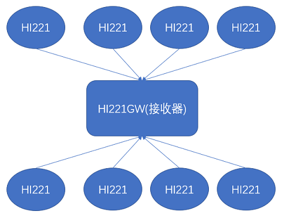

# HI221/HI221GW 用户手册

HI221 无线传输模块及接收器, Rev 0.2

[TOC]

## 简介

H221/HI221GW是超核电子推出的一款低成本、高性能、小体积、低延时的惯性测量单元（IMU），本产品集成了三轴加速度计、三轴陀螺仪以及一款低功耗微处理器。可输出经过传感器融合算法计算得到的基于当地地理坐标的三维方位数据，包含横滚角、俯仰角以及以相对的航向角。同时也可以输出原始的传感器数据。HI221 由**HI221GW(接收机)** 和 **HI221(姿态模块)**组成。一个HI221GW和最多8个HI221模块组成星形网络结构。每个HI221可输出最高达100Hz的实时姿态数据。

## 特性

### 板载传感器

- 三轴陀螺仪, 最大量程: ±2000°/s 输出速率 2000Hz
- 三轴加速度计, 最大量程:±8g 输出速率 125Hz
- 三轴地磁场传感器，最大量程: 800mG 内部采样率 100Hz

### 数据处理 

- 加速度出厂前经过校准
- 数据融合算法计算并输出地理坐标系下的旋转四元数及欧拉角

### 通讯接口及供电

- 串口(兼容TTL 可直接与5V 或3.3V 串口设备连接)
- 供电电压：3.3 (+/- 100 mV)
- 最大峰值功耗：120mA(RF Tx发射)

### 其他

- PC端上位机程序，提供实时数据显示，波形，校准及excel 数据记录功能
- 多项模块参数用户可配置

## 硬件及尺寸(节点)

### 硬件参数

| 参数               | 值                                       |
| ------------------ | ---------------------------------------- |
| 输出数据接口       | UART(TTL 1.8V - 3.3V) 或者 2.4RF Radio   |
| 工作电压           | 3.3V (± 100mV)                           |
| 工作电流           | 30mA                                     |
| 待机电流           | 20uA                                     |
| 充电后平均工作时长 | 8h                                       |
| 温度范围           | -20℃  - 85 ℃                             |
| 最大线性加速度     | 0 - 115 $m/s^2$                          |
| 尺寸               | 20 x 38 x 8.5mm (W x L x H)              |
| 板载传感器         | 三轴加速度计 三轴陀螺仪 三轴地磁场传感器 |

## 性能指标

### 姿态角输出精度

| 姿态角               | 典型值 | 最大值 |
| -------------------- | ------ | ------ |
| 横滚角\俯仰角 - 静态 | 0.2°   | 0.4°   |
| 横滚角\俯仰角 - 动态 | 0.5°   | 2.0°   |
| 航向角               | -      | -      |

### 陀螺仪

| 参数     | 值                   |
| -------- | -------------------- |
| 测量范围 | ±2000°/s             |
| 非线性度 | ±0.1% (25°最佳)      |
| 噪声密度 | 0.08°/s/$\sqrt{Hz}$ |
| 采样率   | 2000Hz               |

### 加速度计

| 参数         | 值                |
| ------------ | ----------------- |
| 测量范围     | ±8G               |
| 非线性度     | ±0.5% (25°最佳)   |
| 最大零点偏移 | 10mG(校准后)      |
| 噪声密度     | 250 $uG\sqrt{Hz}$ |
| 采样率       | 400Hz             |

### 磁传感器参数

| 参数     | 值      |
| -------- | ------- |
| 测量范围 | ±8Gauss |
| 非线性度 | ±0.1%   |
| 采样率   | 100Hz   |

### 模块数据接口参数(UART)

| 参数           | 值                          |
| -------------- | --------------------------- |
| 串口输出波特率 | 4800/9600/115200/460800可选 |
| 帧输出速率     | 1 - 500Hz                   |

### 模块数据接口参数(2.4G RF)

| 参数                 | 值              |
| -------------------- | --------------- |
| 空中波特率           | 1Mbps/2Mbps可选 |
| 帧输出速率           | 1- 100Hz        |
| 接收器最大连接模块数 | 8               |

