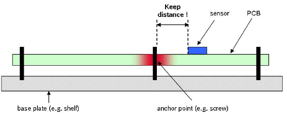

## 安装及焊接

1. 安装位置请远离PCB容易形变点，尽量远离PCB边缘(>30mm)，远离PCB定位螺丝孔(>10mm)等。

   

2. 安装位置请远离强磁设备，如电机，喇叭等强磁器件。

3. 由于MEMS传感器对PCB板应力非常敏感, **建议手工焊接模块，不使用回流焊焊接模块，否则会对传感器性能造成影响**。如果必须使用回流焊，则应注意：用印刷刮板在网板上印刷锡膏，使锡膏通过网板开口漏印到PCB上。为保证回流焊接质量，推荐焊盘部分对应的钢网厚度为0.18mm。

4. 组装好的PCB不得使用超声波清洁仪进行清洁。

5. 本产品不可使用塑封或喷涂三防漆，喷漆或塑封会造成传感器应力改变进而影响性能。

   

6. 推荐回流焊的炉温曲线图如下：

参考: https://ae-bst.resource.bosch.com/media/_tech/media/application_notes/BST-MAS-HS000.pdf

