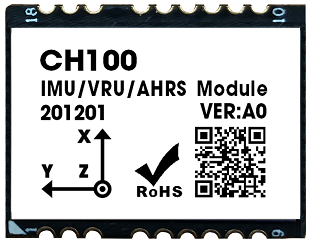
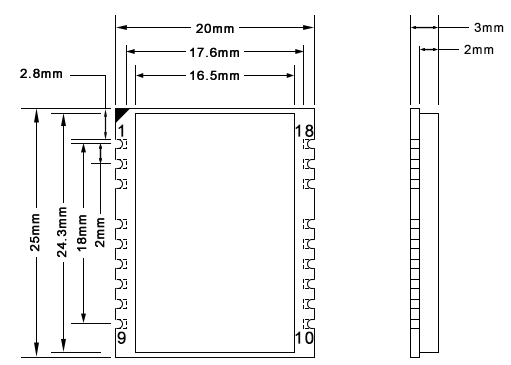
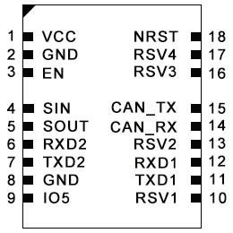
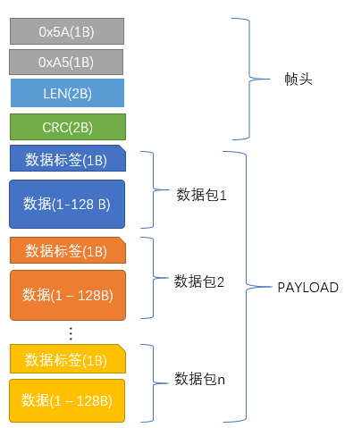

# CH100 用户手册
<p style="text-align: right;">IMU/VRU姿态测量模块, Rev 1.0





<div style="page-break-after: always;"></div>
[TOC]

<div style="page-break-after: always;"></div>
## 简介

CH100是超核电子推出的一款高性能、小体积、低延时的惯性测量单元(IMU)，本产品集成了三轴加速度计、三轴陀螺仪和一款微控制器。可输出经过传感器融合算法计算得到的基于当地地理坐标的三维方位数据，包含无绝对参考的相对航向角，俯仰角和横滚角。同时也可以输出校准过的原始的传感器数据。

典型应用:

* 机器人/AGV DR SLAM应用
* 无人驾驶/组合导航用IMU


## 特性

### 板载传感器
- 三轴陀螺仪, 最大量程: ±500°/s 
- 三轴加速度计, 最大量程:±8G 
### 数据处理 
- 加速度和陀螺仪出厂前经过三轴非正交和标度因子校准
- 数据融合算法计算并输出地理坐标系下的旋转四元数及欧拉角等姿态信息
### 通讯接口及供电
- TTL串口
- 供电电压：3.3V - 5V
### 其他
- PC端上位机程序，提供实时数据显示，波形，校准及excel 数据记录功能

- 多项模块参数用户可配置

## 硬件及尺寸

### 硬件参数

| 参数           | 描述                      |
| -------------- | ------------------------- |
| 输出数据接口   | TTL串口                   |
| 工作电压       | 3.3V - 5V                 |
| 温度范围       | -20℃  - 85℃               |
| 最大线性加速度 | 0 - 115 $m/s^2$           |
| 尺寸           | 20 x 25 x 3mm (W x L x H) |
| 板载传感器     | 三轴加速度计 三轴陀螺仪   |

### 尺寸




### 接口定义



| 引脚号 | 名称   | 说明                                                         |
| ------ | ------ | ------------------------------------------------------------ |
| 1      | VCC    | 电源 3.3V                                                    |
| 2      | GND    | GNS                                                          |
| 3      | EN     | 使能 高电平有效，内部上拉，不需要可悬空                      |
| 4      | SIN    | 保留,必须悬空                                                |
| 5      | SOUT   | 保留,必须悬空                                                |
| 6      | RXD2   | 保留,必须悬空                                                |
| 7      | TXD2   | 保留,必须悬空                                                |
| 8      | GND    | GND                                                          |
| 9      | IO5    | 保留,必须悬空                                                |
| 10     | RSV1   | 保留,必须悬空                                                |
| 11     | TXD1   | 模块串口发送 UART TXD (接 MCU 的 RXD)                        |
| 12     | RXD1   | 模块串口接收 UART RXD(接 MCU 的 TXD)                         |
| 13     | RSV2   | 保留,必须悬空                                                |
| 14     | CAN_RX | CAN_RX                                                       |
| 15     | CAN_TX | CAN_TX                                                       |
| 16     | RSV3   | 保留,必须悬空                                                |
| 17     | RSV4   | 保留,必须悬空                                                |
| 18     | NRST   | 复位, 内部上拉。>10uS 低电平复位模块。无需外接阻容，建议接到MCU的GPIO引脚以实现软件复位 |

## 坐标系定义

载体系使用 右-前-上(RFU)坐标系， 地理坐标系使用 东-北-天(ENU)坐标系。其中欧拉角旋转顺序为东-北-天-312(先转Z轴，再转X轴，最后转Y轴)旋转顺序。具体定义如下：

- 绕 Z 轴方向旋转: 航向角\Yaw\phi($\psi$) 范围: -180° - 180°
- 绕 X 轴方向旋转:俯仰角\Pitch\theta($\theta$) 范围: -90°-90°
- 绕 Y 轴方向旋转: 横滚角\Roll\psi(  $\phi$)范围: -180°-180°

如果将模块视为飞行器的话。Y轴正方向应视为机头方向。当传感器系与惯性系重合时，欧拉角的理想输出为:Pitch = 0°, Roll = 0°, Yaw = 0°


## 性能指标

### 姿态角输出精度

| 姿态角                   | 典型值    | 备注                           |
| ------------------------ | --------- | ------------------------------ |
| 横滚角\俯仰角 - 静态误差 | 0.4°      | 载体低机动平稳运动             |
| 横滚角\俯仰角 - 动态误差 | 1.0°      | 载体低机动平稳运动             |
| 运动中航向角精度         | 4° @20min | 载体水平平稳运动且上电后静止3s |

### 陀螺仪

| 参数          | 值                  | 备注           |
| ------------- | ------------------- | -------------- |
| 测量范围      | ±500°/s             |                |
| 零偏稳定性X轴 | 3.5°/h            | @25°,1$\sigma$ |
| 零偏稳定性Y轴 | 2°/h | @25°,1$\sigma$ |
| 零偏稳定性Z轴 | 2°/h | @25°,1$\sigma$ |
| 零偏重复性 | 0.035°/s | @25°,1$\sigma$ |
| 非正交误差 | ±0.1% |  |
| 随机游走X轴 | 0.3$°/s\sqrt{h}$ | @25°,1$\sigma$ |
| 随机游走Y轴 | 0.3$°/s\sqrt{h}$ | @25°,1$\sigma$ |
| 随机游走Z轴 | 0.25$°/s\sqrt{h}$ | @25°,1$\sigma$ |
| 刻度非线性度  | ±0.1%     | 满量程时(最大) |
| 刻度系数误差 | ±0.4% | 出厂前校准后 |
| 加速度敏感性  | 0.1°/s/g          |                |

陀螺Allan方差曲线


### 加速度计

| 参数             | 值                        | 备注           |
| ---------------- | ------------------------- | -------------- |
| 测量范围         | ±8G (1G = 1x 重力加速度 ) |                |
| 零偏稳定性X轴    | 30uG                      | @25°,1$\sigma$ |
| 零偏稳定性Y轴    | 30uG                      | @25°,1$\sigma$ |
| 零偏稳定性Z轴    | 40uG                      | @25°,1$\sigma$ |
| 零偏重复性       | 1.8mG                     | @25°,1$\sigma$ |
| 非正交误差       | ±0.1%                     | ±0.1%          |
| 随机游走X轴      | 0.04$m/s\sqrt{h}$         | @25°,1$\sigma$ |
| 随机游走Y轴      | 0.04$m/s\sqrt{h}$         | @25°,1$\sigma$ |
| 随机游走Z轴      | 0.06$m/s\sqrt{h}$         | @25°,1$\sigma$ |
| 刻度系数误差     | ±0.3% (满量程时)          |                |
| 全温范围温度变化 | 2mg                       | -20  - 85°     |

加速度Allan方差曲线


### 模块数据接口参数

| 参数           | 值                            |
| -------------- | ----------------------------- |
| 串口输出波特率 | 9600/115200/460800/921600可选 |
| 帧输出速率     | 1/50/100/200/400Hz 可选       |
| 启动时间       | <1s                           |


## 传感器校准

1. 加速度计和陀螺仪在出厂前经过比例因子误差和非正交误差校准，校准参数保存在模块内部。

2. 陀螺仪的输出每次上电后会有一个随机的不为0的bias，称之为零偏重复性。这个随机bias不能在出厂前被校准。系统在启动后1S内认为处于静止状态并采集1S的陀螺仪角速度作为初始bias。这个过程称之为陀螺仪上电自校准。自校准在上电后静止模块3s 左右可获得最好的校准效果。**如上电1s内模块处于运动状态(包括缓慢转动，振动等)则航向角飘移现象会显著增大**。 建议使用时每次上电后静止至少1s。

3. 磁传感器(部分型号支持)出厂前经过椭球校准，但磁传感器很容易受到外界环境磁场干扰，一般都需要客户重新校准，出厂校准参数意义不大。详见地磁校准章节。


## 串口通讯协议

模块上电后，默认按出厂帧率(通常为100)输出帧数据，帧格式如下：


| 域名称  | 值    | 长度(字节) | 说明                                                         |
| ------- | ----- | ---------- | ------------------------------------------------------------ |
| PRE     | 0x5A  | 1          | 固定为0x5A                                                   |
| TYPE    | 0xA5  | 1          | 固定为0xA5                                                   |
| LEN     | 1-512 | 2          | 帧中数据域的长度，低字节在前。长度表示数据域(PAYLOAD)的长度，不包含`PRE`,`TYPE`,`LEN`,`CRC` 字段。 |
| CRC     | -     | 2          | 除CRC 本身外其余所有字段(`PRE,TYPE,LEN, PAYLOAD`)帧数据的16 位CRC 校验和。LSB(低字节在前) |
| PAYLOAD | -     | 1-512      | 一帧携带的数据。PAYLOAD域 由若干个**子数据包**组成。每个数据包包含数据包标签和数据两部分。标签决定了数据的类型及长度。 |




CRC实现函数：

```
/*
	currectCrc: previous crc value, set 0 if it's first section
	src: source stream data
	lengthInBytes: length
*/
static void crc16_update(uint16_t *currectCrc, const uint8_t *src, uint32_t lengthInBytes)
{
    uint32_t crc = *currectCrc;
    uint32_t j;
    for (j=0; j < lengthInBytes; ++j)
    {
        uint32_t i;
        uint32_t byte = src[j];
        crc ^= byte << 8;
        for (i = 0; i < 8; ++i)
        {
            uint32_t temp = crc << 1;
            if (crc & 0x8000)
            {
                temp ^= 0x1021;
            }
            crc = temp;
        }
    } 
    *currectCrc = crc;
}
```


## 数据包

#### 数据包总览

| 数据包标签 | 数据包长度(包含标签1字节) | 名称                | 备注 |
| ---------- | ------------------------- | ------------------- | ---- |
| 0x91       | 76                        | IMUSOL(IMU数据集合) |      |

#### 产品支持数据包列表

#### 0X91( IMUSOL)

共76字节。集成了IMU的传感器原始输出和姿态解算数据。

| 字节偏移 | 类型     | 大小 | 单位                 | 说明                                                         |
| -------- | -------- | ---- | -------------------- | ------------------------------------------------------------ |
| 0        | uint8_t  | 1    | -                    | 数据包标签:0x91                                              |
| 1        | uint8_t  | 1    | -                    | ID                                                           |
| 2        | -        | 6    | -                    | 保留                                                         |
| 8        | uint32_t | 4    | ms                   | 时间戳信息，从系统开机开始累加，每毫秒增加1                  |
| 12       | float    | 12   | 1G(1G = 1重力加速度) | 加速度,顺序为：XYZ(注意单位和0xA0包不同)                     |
| 24       | float    | 12   | deg/s                | 角速度,顺序为： XYZ(注意单位和0xB0包不同)                    |
| 36       | float    | 12   | uT                   | 磁强度,顺序为： XYZ(注意单位和0xC0包不同)                    |
| 48       | float    | 12   | deg                  | 节点欧拉角 顺序为：横滚角(Roll)，俯仰角(Pitch)，航向角(Yaw)(注意顺序和单位与0xD0包不同) |
| 60       | float    | 16   | -                    | 节点四元数集合,顺序为WXYZ                                    |

### 出厂默认数据包

出厂默认一帧中携带数据包数据定义如下：

| 产品  | 默认输出数据包 |
| ----- | -------------- |
| CH100 | 91             |
| CH110 | 91             |

### 数据帧结构示例

#### 数据帧配置为 `0x91` 数据包

使用串口助手采样一帧数据,共82字节, 前6字节为帧头, 长度和CRC校验值。剩余76字节为数据域。假设数据接收到C语言数组`buf`中。如下所示:

5A A5 4C 00 6C 51 **91** 00 A0 3B 01 A8 02 97 BD BB 04 00 9C A0 65 3E A2 26 45 3F 5C E7 30 3F E2 D4 5A C2 E5 9D A0 C1 EB 23 EE C2 78 77 99 41 AB AA D1 C1 AB 2A 0A C2 8D E1 42 42 8F 1D A8 C1 1E 0C 36 C2 E6 E5 5A 3F C1 94 9E 3E B8 C0 9E BE BE DF 8D BE

* 第一步：判断帧头，得到数据域长度和帧CRC：

帧头:`5A` `A5`

帧数据域长度:`4C` `00`: (0x00<<8) + 0x4C = 76

帧CRC校验值:`6C` `51`:(0x51<<8) + 0x6C = 0x516C

* 第二步： 校验CRC

```
    uint16_t payload_len;
    uint16_t crc;
    
    crc = 0;
    payload_len = buf[2] + (buf[3] << 8);
    
    /* calulate 5A A5 and LEN filed crc */
    crc16_update(&crc, buf, 4);
    
    /* calulate payload crc */
    crc16_update(&crc, buf + 6, payload_len);
```

得到CRC值为0x516C, 与帧中携带CRC值相同，帧CRC校验通过。

* 第三步：接收数据

从`0x91`开始为数据包的数据域。在C语言中可以定义结构体来方便的读取数据：

定义0x91数据包结构体如下：

```
__packed typedef struct
{
    uint8_t     tag;                /* 数据标签:0x91 */
    uint8_t     id;					/* 模块ID */
    uint8_t     rev[6];             /* reserved */
    uint32_t    ts;                 /* 时间戳 */
    float       acc[3];				/* 加速度 */
    float       gyr[3];				/* 角速度 */
    float       mag[3];				/* 地磁 */
    float       eul[3];             /* 欧拉角: Roll,Pitch,Yaw */
    float       quat[4];            /* 四元数 */
}id0x91_t;
```

`__packed` 为编译器关键字(Keil下)，表示结构体按字节紧对齐，结构体每一个元素一一对应0x91数据包的结构定义。接收数据时将接收到的数组直接memcpy到结构体即可：(注意定义结构体时必须4字节对齐), 其中`buf `指向帧头, `buf[6]`指向帧中数据域 。

```
    /* 接收数据并使用0x91数据包结构定义来解释数据 */
    __align(4) id0x91_t dat;    /* struct must be 4 byte aligned */
    memcpy(&dat, &buf[6], sizeof(id0x91_t));
```

最后得到dat数据结果：

```
id              : 0
timestamp       : 310205
acc             :    0.224    0.770    0.691
gyr             :  -54.708  -20.077 -119.070
mag             :   19.183  -26.208  -34.542
eul(R/P/Y)      :   48.720  -21.014  -45.512
quat            :    0.855    0.310   -0.310   -0.277
```


## AT指令

当使用串口与模块通讯时, 模块支持AT 指令集配置/查看模块参数。AT 指令总以ASCII 码`AT` 开头，后面跟控制字符，最
后以回车换行`\r\n`结束。可使用串口调试助手进行测试：


通用模块 AT指令如下

| 指令      | 功能                   | 掉电保存(Y) | 立即生效(Y),复位生效(R) | 备注         |
| --------- | ---------------------- | ----------- | ----------------------- | ------------ |
| AT+ID     | 设置模块用户ID         | Y           | R                       |              |
| AT+INFO   | 打印模块信息           | N           | Y                       |              |
| AT+ODR    | 设置模块串口输出帧频率 | Y           | R                       |              |
| AT+BAUD   | 设置串口波特率         | Y           | R                       |              |
| AT+EOUT   | 数据输出开关           | N           | Y                       |              |
| AT+RST    | 复位模块               | N           | Y                       |              |
| AT+TRG    | 单次输出触发           | N           | Y                       | 部分型号支持 |
| AT+SETPTL | 设置输出数据包         | Y           | Y                       | 部分型号支持 |
| AT+MODE   | 设置模块工作模式       | Y           | R                       | 部分型号支持 |
| AT+GWID   | 设置无线网关ID         | Y           | R                       | 部分型号支持 |


##### AT+ID

设置模块用户ID

**例** `AT+ID=1`

##### AT+INFO

打印模块信息，包括产品型号，版本，固件发布日期等。


##### AT+ODR

设置模块串口输出速率。 掉电保存，复位模块生效

**例** 设置串口输出速率为100Hz:  `AT+ODR=100` 

注意：当ODR设置为比较高时(如200),默认的115200波特率可能不满足输出带宽要求，此时需要将模块波特率设高(如921600)后，模块才能按设置的ODR输出数据帧。

##### AT+BAUD

设置串口波特率，可选值：9600/115200/460800/921600`

**例**  `AT+BAUD=115200`

**注意**

- 使用此指令需要特别注意，输入错误波特率后会导致无法和模块通讯
- 波特率参数设置好后掉电保存，复位模块生效。上位机的波特率也要做相应修改。
- 升级固件时，需要切换回115200 波特率。

##### AT+EOUT

串口输出开关

**例** 打开串口输出 `AT+EOUT=1`   关闭串口输出 `AT+EOUT=0`

##### AT+RST

复位模块

**例** `AT+RST`

##### AT+URFR

这条指令提供了旋转传感器XYZ轴的接口：

`AT+URFR=C00,C01,C02,C10,C11,C12,C20,C21,C22` 

其中  $C_{nn}$  支持浮点数 

$$
\left\{\begin{array}{l}{X} \\ {Y} \\ {Z}\end{array}\right\}_{U}=\left[\begin{array}{lll}{C 00} & {C 01} & {C 02} \\ {C 10} & {C 11} & {C 12} \\ {C 20} & {C 21} & {C 22}\end{array}\right] \cdot\left\{\begin{array}{l}{X} \\ {Y} \\ {Z}\end{array}\right\}_{B}
$$


其中$\left\{\begin{array}{l}{X} \\ {Y} \\ {Z}\end{array}\right\}_{U}$为旋转后的 传感器坐标系下 传感器数据，$\left\{\begin{array}{l}{X} \\ {Y} \\ {Z}\end{array}\right\}_{B}$为旋转前 传感器坐标系下 传感器数据


下面是几种常用旋转举例：

- 新传感器坐标系为 绕原坐标系X轴 旋转 90°， 输入命令：`AT+URFR=1,0,0,0,0,1,0,-1,0`
- 新传感器坐标系为 绕原坐标系X轴 旋转-90°， 输入命令：`AT+URFR=1,0,0,0,0,-1,0,1,0`
- 新传感器坐标系为 绕原坐标系X轴 旋转180°， 输入命令：`AT+URFR=1,0,0,0,-1,0,0,0,-1`
- 新传感器坐标系为 绕原坐标系Y轴 旋转 90°， 输入命令：`AT+URFR= 0,0,-1,0,1,0,1,0,0`
- 新传感器坐标系为 绕原坐标系Y轴 旋转-90°， 输入命令：`AT+URFR= 0,0,1,0,1,0,-1,0,0`
- 新传感器坐标系为 绕原坐标系Y轴 旋转180°， 输入命令：`AT+URFR= -1,0,0,0,1,0,0,0,-1`
- 新传感器坐标系为 绕原坐标系Z轴 旋转90°， 输入命令：`AT+URFR= 0,-1,0,1,0,0,0,0,1`
- 恢复默认值：`AT+URFR=1,0,0,0,1,0,0,0,1`


## CAN通讯协议

本产品CAN接口遵循以下标准：

* CAN接口符合CANopen协议，所有通讯均使用标准数据帧，只使用PTO1-4 传输数据，所有传输均采用标准数据帧，不接收远程帧和拓展数据帧
* PTO采用异步定时触发模式, 默认输出速率为20Hz
* 当模块上电时，按照CANopen协议，模块会主动发送一条(一次)节点上线报文。节点上电处于预操作状态(pre-operational), 需要主机发送NMT协议将节点设置为operation状态才会开始发送数据


### CANopen 默认设置

| CANopen默认配置 | 值          |
| --------------- | ----------- |
| CAN 波特率      | 500KHz      |
| CANopen节点ID   | 8           |
| 初始化状态      | Operational |
| 心跳包          | 无          |


### CANopen TPTO

| PTO通道 | PTO 帧ID | 长度 | PTO 传输方式   | 异步输出频率（Hz） | 发送数据 | 说明                                                         |
| ------- | -------- | ---- | -------------- | ------------------ | -------- | ------------------------------------------------------------ |
| TPDO1   | 0x180+ID | 6    | 异步定时(0xFE) | 20                 | 加速度   | 每轴数据类型为(INT16,低字节在前)，分别为X,Y,Z轴加速度，单位为mG(0.001重力加速度) |
| TPDO2   | 0x280+ID | 6    | 异步定时(0xFE) | 20                 | 角速度   | 每轴数据类型为(INT16,低字节在前)，分别为X,Y,Z轴角速度，单位为0.1DPS(°/s) |
| TPDO3   | 0x380+ID | 6    | 异步定时(0xFE) | 20                 | 欧拉角   | 每轴数据类型为(INT16,低字节在前)，顺序分别为横滚角(Roll,绕X轴旋转),俯仰角(Pitch,绕Y轴旋转),航向角(Yaw绕Z轴旋转)。欧拉角单位为0.01° |
| TPDO4   | 0x480+ID | 8    | 异步定时(0xFE) | 20                 | 四元数   | 每轴数据类型为(INT16,低字节在前)，分别为$$ q_{w} \ q_{x}\ q_{y}\ q_{z}$$ 。单位四元数扩大10000倍后结果。如四元数为1,0,0,0 时, 输出10000,0,0,0. |


使用USB-CAN工具抓取默认CAN输出包截图如下：


其中欧拉角(PTO3) CAN帧ID =0x380 + 8(默认ID) = 0x388， 数据为:

* X轴： (0x00 <<8)+ 0x8F = 0x008F = 1.43°
* Y轴： (0xFF<<8)+ 0xCF = 0xFFCF = -0.49°
* Z轴：(0x0F<<8)+ 0xB9 = 0x0FB9=  40.25°


  ### CAN接口编程示例

#### 1. 使能数据输出(开启异步触发)

发送标准CANopen协议帧，使用NMT: Start Remote Node命令:

`ID=0x000,DLC=2,DATA=0x01,0x08`

其中 0x01为Start Remote Node指令， 0x08为节点ID


#### 2. 修改CAN波特率，输出速率及输出帧信息
数据字典以下位置存放厂商参数配置数据, 可通过CANopen 发送快速SDO指令修改，**掉电保存，重新上电生效**。

| 数据字典位置 | 子偏移 | 名称     | 值类型    | 默认值 | 说明          |
| ------------ | ------ | -------- | --------- | ------ | ------------- |
| 0x2100       | 0      | CAN_BAUD | INTEGER32 | 500000 | CAN总线波特率 |
| 0x2101       | 0      | NodeID   | INTEGER32 | 8      | 节点ID        |

以上配置操作均使用快速SDO来写数据字典, 其中TPDO通道与其对应的参数索引为：

| PTO通道 | PTO 帧ID | TPDO参数索引地址(CANopen协议默认定义) |
| ------- | -------- | ------------------------------------- |
| TPDO1   | 0x180+ID | 0x1800                                |
| TPDO2   | 0x280+ID | 0x1801                                |
| TPDO3   | 0x380+ID | 0x1802                                |
| TPDO4   | 0x480+ID | 0x1803                                |

##### 示例1: 修改CAN波特率

如将CAN波特率修改为125K, 则发送：

`ID=0x608 ,DLC=8,DATA=0x23,0x00,0x21,0x00,0x48,0xE8,0x01,0x00`(ID=0x608, 长度为8的标准数据帧)

* 0x23为SDO写四个字节指令 
* 0x00, 0x21为写0x2100索引
* 0x00, 0x01, 0xE8, 0x48 = (0x00<<24) + (0x01<<16) + (0xE8<<8) + 0x48 = 125000

如将CAN波特率修改为250K, 则发送：

`ID=0x608 ,DLC=8,DATA=0x23,0x00,0x21,0x00,0x90,0xD0,0x03,0x00`

* 0x23为SDO写四个字节指令 
* 0x00, 0x21为写0x2100索引
* 0x00, 0x03, 0xD0, 0x90 = (0x00<<24) + (0x03<<16) + (0xD0<<8) + 0x90 = 250000

##### 示例2: 修改节点ID

如将设备CANopen节点ID改为9, 则发送：

`ID=0x608 ,DLC=8,DATA=0x23,0x01,0x21,0x00,0x09,0x00,0x00,0x00`

* 0x23为SDO写四个字节指令  
* 0x01, 0x21为写0x2101索引
* 0x09 0x00, 0x00, 0x00 = (0x00<<24) + (0x00<<16) + (0x00<<8) + 0x09 = 9

注意，修改节点ID后重新上电生效，且生效后发送启动节点命令(比如节点启动命令数据变为01 09)和SDO指令(发送CAN帧ID变为0x609)时注意为新的地址

##### 示例3: 修改数据输出速率

发送标准CANopen协议帧，使用标准快速SDO指令:(此项配置立即生效)

修改TPDO3(欧拉角)输出速率为20Hz(每50ms输出一次):

`ID=0x608 ,DLC=8,DATA=0x2B,0x02,0x18,0x05,0x32,0x00,0x00,0x00`

其中 

* 0x2B为SDO写两个字节指令 
* 0x02, 0x18为写0x1802索引,
* 0x05为子索引
* 0x00, 0x32= (0x00<<8) + 0x32 = 50(1ms为单位)，后面不足补0.

##### 示例4: 关闭TPDO输出

例：关闭TPDO2定时输出，则需要写0x1801索引，子索引为0x05, 写入值为0x0000:

`ID=0x608 ,DLC=8,DATA=0x2B,0x01,0x18,0x05,0x00,0x00,0x00,0x00`

其中 

* 0x2B为SDO写两个字节指令 
*  0x01, 0x18为写0x1801索引
*  0x05子索引
* 0x00, 0x00= (0x00<<8) + 0x00 = 0，后面不足补0.


## 附录C - 固件升级与恢复出厂设置


本产品支持升级固件。
固件升级步骤:

- 连接模块，打开上位机，将模块和上位机波特率都设置为115200. 打开固件升级窗口
- 点击连接按钮，如出现模块连接信息。则说明升级系统准备就绪，点击文件选择器(…)选择拓
  展名为.hex 的固件，然后点击开始编程。下载完成后会提示编程完成，此时关闭串口，
  重新给模块上电，模块升级完成。


## 附录D-FAQ

FAQ内容随时更新，详见:[FAQ](https://zhuanlan.zhihu.com/p/344884686)


