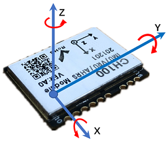
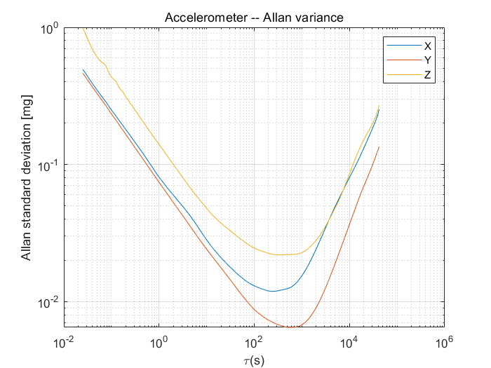

# CH100 用户手册

IMU/VRU姿态测量模块, Rev 1.0

[TOC]

## 简介

CH100是超核电子推出的一款高性能、小体积、低延时的惯性测量单元(IMU)，本产品集成了三轴加速度计、三轴陀螺仪和一款微控制器。可输出经过传感器融合算法计算得到的基于当地地理坐标的三维方位数据，包含无绝对参考的相对航向角，俯仰角和横滚角。同时也可以输出校准过的原始的传感器数据。

典型应用:

* 机器人/AGV DR SLAM应用
* 无人驾驶/组合导航用IMU

## 特性

### 板载传感器
- 三轴陀螺仪, 最大量程: ±500°/s 
- 三轴加速度计, 最大量程:±8G 
### 数据处理 
- 加速度和陀螺仪出厂前经过三轴非正交和标度因子校准
- 数据融合算法计算并输出地理坐标系下的旋转四元数及欧拉角等姿态信息
### 通讯接口及供电
- TTL串口
- 供电电压：3.3V - 5V
### 其他
- PC端上位机程序，提供实时数据显示，波形，校准及excel 数据记录功能

- 多项模块参数用户可配置

## 硬件及尺寸

### 硬件参数

| 参数           | 描述                      |
| -------------- | ------------------------- |
| 输出数据接口   | TTL串口                   |
| 工作电压       | 3.3V - 5V                 |
| 温度范围       | -20℃  - 85℃               |
| 最大线性加速度 | 0 - 115 $m/s^2$           |
| 尺寸           | 20 x 25 x 3mm (W x L x H) |
| 板载传感器     | 三轴加速度计 三轴陀螺仪   |

### 尺寸

### 接口定义

| 引脚号 | 名称   | 说明                                                         |
| ------ | ------ | ------------------------------------------------------------ |
| 1      | VCC    | 电源 3.3V                                                    |
| 2      | GND    | GNS                                                          |
| 3      | EN     | 使能 高电平有效，内部上拉，不需要可悬空                      |
| 4      | SIN    | 保留,必须悬空                                                |
| 5      | SOUT   | 保留,必须悬空                                                |
| 6      | RXD2   | 保留,必须悬空                                                |
| 7      | TXD2   | 保留,必须悬空                                                |
| 8      | GND    | GND                                                          |
| 9      | IO5    | 保留,必须悬空                                                |
| 10     | RSV1   | 保留,必须悬空                                                |
| 11     | TXD1   | 模块串口发送 UART TXD (接 MCU 的 RXD)                        |
| 12     | RXD1   | 模块串口接收 UART RXD(接 MCU 的 TXD)                         |
| 13     | RSV2   | 保留,必须悬空                                                |
| 14     | CAN_RX | CAN_RX                                                       |
| 15     | CAN_TX | CAN_TX                                                       |
| 16     | RSV3   | 保留,必须悬空                                                |
| 17     | RSV4   | 保留,必须悬空                                                |
| 18     | NRST   | 复位, 内部上拉。>10uS 低电平复位模块。无需外接阻容，建议接到MCU的GPIO引脚以实现软件复位 |

## 坐标系定义

载体系使用 右-前-上(RFU)坐标系， 地理坐标系使用 东-北-天(ENU)坐标系。其中欧拉角旋转顺序为东-北-天-312(先转Z轴，再转X轴，最后转Y轴)旋转顺序。具体定义如下：

- 绕 Z 轴方向旋转: 航向角\Yaw\phi($\psi$) 范围: -180° - 180°
- 绕 X 轴方向旋转:俯仰角\Pitch\theta($\theta$) 范围: -90°-90°
- 绕 Y 轴方向旋转: 横滚角\Roll\psi(  $\phi$)范围: -180°-180°

如果将模块视为飞行器的话。Y轴正方向应视为机头方向。当传感器系与惯性系重合时，欧拉角的理想输出为:Pitch = 0°, Roll = 0°, Yaw = 0°

## 性能指标

### 姿态角输出精度

| 姿态角                   | 典型值    | 备注                           |
| ------------------------ | --------- | ------------------------------ |
| 横滚角\俯仰角 - 静态误差 | 0.4°      | 载体低机动平稳运动             |
| 横滚角\俯仰角 - 动态误差 | 1.0°      | 载体低机动平稳运动             |
| 运动中航向角精度         | 4° @20min | 载体水平平稳运动且上电后静止3s |

### 陀螺仪

| 参数          | 值                  | 备注           |
| ------------- | ------------------- | -------------- |
| 测量范围      | ±500°/s             |                |
| 零偏稳定性X轴 | 3.5°/h            | @25°,1$\sigma$ |
| 零偏稳定性Y轴 | 2°/h | @25°,1$\sigma$ |
| 零偏稳定性Z轴 | 2°/h | @25°,1$\sigma$ |
| 零偏重复性 | 0.035°/s | @25°,1$\sigma$ |
| 非正交误差 | ±0.1% |  |
| 随机游走X轴 | 0.3$°/s\sqrt{h}$ | @25°,1$\sigma$ |
| 随机游走Y轴 | 0.3$°/s\sqrt{h}$ | @25°,1$\sigma$ |
| 随机游走Z轴 | 0.25$°/s\sqrt{h}$ | @25°,1$\sigma$ |
| 刻度非线性度  | ±0.1%     | 满量程时(最大) |
| 刻度系数误差 | ±0.4% | 出厂前校准后 |
| 加速度敏感性  | 0.1°/s/g          |                |

陀螺Allan方差曲线

### 加速度计

| 参数             | 值                        | 备注           |
| ---------------- | ------------------------- | -------------- |
| 测量范围         | ±8G (1G = 1x 重力加速度 ) |                |
| 零偏稳定性X轴    | 30uG                      | @25°,1$\sigma$ |
| 零偏稳定性Y轴    | 30uG                      | @25°,1$\sigma$ |
| 零偏稳定性Z轴    | 40uG                      | @25°,1$\sigma$ |
| 零偏重复性       | 1.8mG                     | @25°,1$\sigma$ |
| 非正交误差       | ±0.1%                     | ±0.1%          |
| 随机游走X轴      | 0.04$m/s\sqrt{h}$         | @25°,1$\sigma$ |
| 随机游走Y轴      | 0.04$m/s\sqrt{h}$         | @25°,1$\sigma$ |
| 随机游走Z轴      | 0.06$m/s\sqrt{h}$         | @25°,1$\sigma$ |
| 刻度系数误差     | ±0.3% (满量程时)          |                |
| 全温范围温度变化 | 2mg                       | -20  - 85°     |

加速度Allan方差曲线

### 模块数据接口参数

| 参数           | 值                            |
| -------------- | ----------------------------- |
| 串口输出波特率 | 9600/115200/460800/921600可选 |
| 帧输出速率     | 1/50/100/200/400Hz 可选       |
| 启动时间       | <1s                           |

