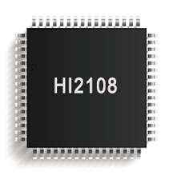
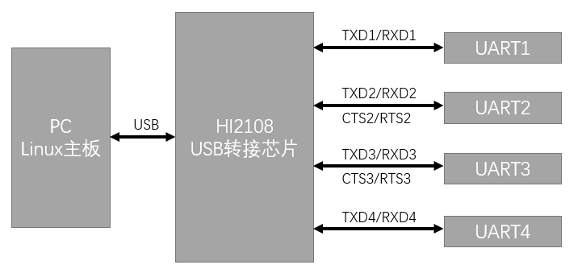
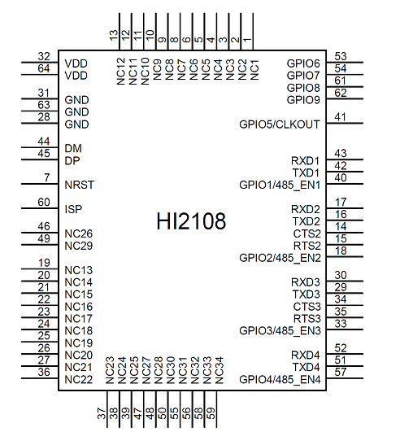
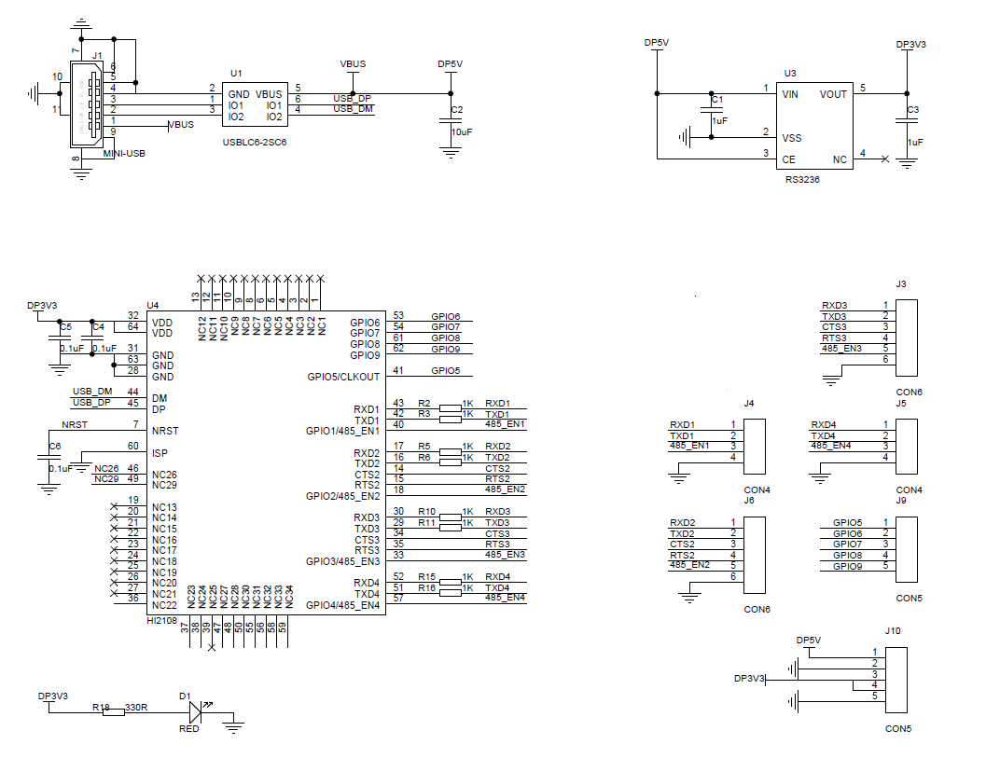

# HI2108 用户手册

USB 转 4 串口芯片, Rev 1.0

[TOC]

## 简介

HI2108是一款 USB 转 4 串口控制芯片，提供 4 组全双工的异步串口 UART1/2/3/4，用于为计算机扩展异步串口，或者将普通的串口设备升级到 USB 总线。HI2108非常适合于Linux工控服务器/树莓派主板等串口/RS232/RS485拓展。

## 主要特性

- 工作电压3.3V。
- 全速USB2.0 接口。
- 无需外部晶振，全温范围内波特率误差<0.2%。
- 支持从300bps到2Mbps的通信波特率。
- LQFP-64 无铅封装，兼容 RoHS。
- 串口驱动支持：Windows XP/Vista/Win7/Win8/Win10/Win server/Linux 等。
- UART2/3支持CTS/RTS信号，所有UART支持485发送接收使能引脚。

## 封装与引脚

### 引脚定义

| 引脚号               | 引脚名称      | 类型      | 说明                                                   |
| -------------------- | ------------- | --------- | ------------------------------------------------------ |
| 31,63,28             | GND           | 电源      | GND                                                    |
| 32,64                | VDD           | 电源      | 3.3V电源                                               |
| 44                   | DM            | USB信号   | 接到USB总线的DM(D-)数据线                              |
| 45                   | DP            | USB信号   | 接到USB总线的DP(D+)数据线                              |
| 7                    | RST           | 输入      | 外部复位输入脚，低电平有效，内置上拉电阻               |
| 60                   | ISP           | 输入      | 固件升级配置引脚，低电平有效，内置下拉电阻，悬空或接地 |
| 40                   | GPIO1/485_EN1 | 输入/输出 | UART1的485发送接收使能引脚                             |
| 18                   | GPIO2/485_EN2 | 输入/输出 | UART2的485发送接收使能引脚                             |
| 33                   | GPIO3/485_EN3 | 输入/输出 | UART2的485发送接收使能引脚                             |
| 57                   | GPIO4/485_EN4 | 输入/输出 | UART2的485发送接收使能引脚                             |
| 41                   | GPIO5/CLKOUT  | 输入/输出 | 通用GPIO, 保留, 悬空                                   |
| 53                   | GPIO6         | 输入/输出 | 通用GPIO, 保留, 悬空                                   |
| 54                   | GPIO7         | 输入/输出 | 通用GPIO, 保留, 悬空                                   |
| 61                   | GPIO8         | 输入/输出 | 通用GPIO, 保留, 悬空                                   |
| 62                   | GPIO9         | 输入/输出 | 通用GPIO, 保留, 悬空                                   |
| 43                   | RXD1          | 输入      | UART1_RXD                                              |
| 42                   | TXD1          | 输出      | UART1_TXD                                              |
| 17                   | RXD2          | 输入      | UART2_RXD                                              |
| 16                   | TXD2          | 输出      | UART2_TXD                                              |
| 14                   | CTS2          | 输入/输出 | UART2_CTS                                              |
| 15                   | RTS2          | 输入/输出 | UART2_RTS                                              |
| 30                   | RXD3          | 输入      | UART3_RXD                                              |
| 29                   | TXD3          | 输出      | UART3_TXD                                              |
| 34                   | CTS3          | 输入/输出 | UART3_CTS                                              |
| 35                   | RTS3          | 输入/输出 | UART3_RTS                                              |
| 52                   | RXD4          | 输入      | UART4_RXD                                              |
| 51                   | TXD4          | 输出      | UART4_TXD                                              |
| 1-6,8-13,19-28,36-39 | NC            | 空脚      | 禁止连接，必须悬空                                     |
| 46-50,55,56,58,59    | NC            | 空脚      | 禁止连接，必须悬空                                     |

### 封装信息

| 封装形式 | 宽度    | 引脚间距       | 封装说明           | 订货型号   |
| -------- | ------- | -------------- | ------------------ | ---------- |
| LQFP-64  | 10x10mm | 0.5mm(19.7mil) | 标准LQFP64贴片封装 | HI2108RBT7 |

## 功能说明

* HI2108内置上电复位电路，RST引脚仅需要外接一个0.1uF电容即可工作。
* HI2108内置时钟产生器，可以产生48MHz USB信号给USB控制器和处理单元，同时可以通过USB总线上的SOF帧信号来动态校准内部时钟电路。工作时，可以保证全温范围内USB和串口的正常工作(其中串口波特率误差<0.2%).

* HI2108提供4组全双工异步串口UART1/2/3/4 其中UART2/3 支持RTS/CTS信号。所有UART支持485自动收发使能信号。4组串口所支持的数据包括1个低电平起始位,5,6,7,8个数据位,1或者2个高电平停止位，支持奇偶校验位. 支持常用波特率2400、4800、9600、19.2K、38.4K、57.6K、11.2K、230.4K、250K、460.8K、500K、921.6K，1M、2M。串口发送信号的波特率误差小于0.2%，串口接收信号的允许波特率误差不大于2%。

## 参数

### 绝对值

| 名称 | 参数说明       | 最小值 | 最大值 | 单位 |
| ---- | -------------- | ------ | ------ | ---- |
| TA   | 工作时环境温度 | -40    | 85     | °C   |
| TS   | 储存时环境温度 | -55    | 125    | °C   |
| VESD | IO引脚ESD耐压  | 2      | -      | KV   |

### 电气参数

| 名称 |    参数说明    | 最小值  | 典型值 | 最大值  | 单位 |
| :--- | :------------: | :-----: | :----: | ------- | ---- |
| VCC  |    电源电压    |   3.0   |  3.3   | 3.6     | V    |
| ICC  |  工作时总电流  |   16    |   21   | 24      | mA   |
| VIL  | 低电平输入电压 |  -0.4   |   -    | 0.7     | V    |
| VIH  | 高电平输入电压 |   2.0   |   -    | VCC+0.4 | V    |
| VOL  | 低电平输出电压 |    -    |   -    | 0.4     | V    |
| VOH  | 高电平输出电压 | VCC-0.4 |   -    | -       | V    |

## 应用

USB转4路TTL串口

上图由HI2108实现转4路TTL串口，其中UART1/2/3/4支持485方向控制，UART2/3支持RTS,CTS信号。

* J1是USB端子，用来供电和接入USB信号。供电方案采用3.3V供电，由USB端子引入的5V电源经连接到5V->3.3V LDO(U3)上。每一个VDD引脚靠近接0.1uF退耦电容，另外NRST引脚也需要外接0.1uF电容。U1为USB信号ESD保护器件 ，设计时可以根据实际情况保留或去掉。
* J3-J6为4个TTL串口输出，可外接MAX3245/SP3243等器件实现TTL转RS232。
* TXR/RXD IO引脚串联1KOhm的作用为防止IO引脚接反导致引脚损坏，设计时候可以根据实际情况保留或去掉。 

* 在设计PCB时，需要注意，退耦电容需要尽量靠近电源引脚，USB DM DP信号线贴近平行布线，尽量在两侧提供地或者覆铜，减少来自外界信号的干扰。

