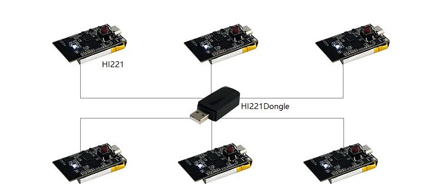

# HI221 用户手册
<p style="text-align: right;">HI221 无线传输模块及接收器, Rev 1.0


<div style="page-break-after: always;"></div>
[TOC]

<div style="page-break-after: always;"></div>
## 简介

H221/HI221Dongle是超核电子推出的一款低成本、高性能、小体积、低延时的惯性测量单元（IMU），本产品集成了三轴加速度计、三轴陀螺仪以及一款低功耗微处理器。可输出经过传感器融合算法计算得到的基于当地地理坐标的三维方位数据，包含横滚角、俯仰角以及以相对的航向角。同时也可以输出原始的传感器数据。HI221 由**HI221Dongle(接收机)** 和 **HI221(姿态模块)**组成。一个HI221Dongle和最多16个HI221模块组成星形网络结构。每个HI221可输出最高达100Hz的实时姿态数据。





## 特性

### 板载传感器

- 三轴陀螺仪, 最大量程: ±2000°/s 输出速率 2000Hz
- 三轴加速度计, 最大量程:±8g 输出速率 125Hz
- 三轴地磁场传感器，最大量程: 800mG 内部采样率 100Hz

### 通讯接口及供电

- 串口(兼容TTL 可直接与5V 或3.3V 串口设备连接)
- 供电电压：3.3 (+/- 100 mV)
- 最大峰值功耗：120mA(RF Tx发射)

## 硬件及尺寸(节点)

### 硬件参数

| 参数               | 值                                       |
| ------------------ | ---------------------------------------- |
| 输出数据接口       | UART(TTL 1.8V - 3.3V) 或者 2.4RF Radio   |
| 工作电压           | 3.3V (± 100mV)                           |
| 工作电流           | 30mA                                     |
| 待机电流           | 20uA                                     |
| 充电后平均工作时长 | 8h                                       |
| 温度范围           | -20℃  - 85 ℃                             |
| 尺寸               | 20 x 38 x 8.5mm (W x L x H)              |
| 板载传感器         | 三轴加速度计 三轴陀螺仪 三轴地磁场传感器 |

## 坐标系定义

载体系使用 前-左-上(FLU)右手坐标系， 地理坐标系使用 北-西-天(NWU)坐标系。其中欧拉角旋转顺序为 ZYX(先转Z轴，再转Y轴，最后转X轴)旋转顺序。具体定义如下：

- 绕 Z 轴方向旋转: 航向角\Yaw\phi($\psi$) 范围: -180° - 180°
- 绕 Y 轴方向旋转: 俯仰角\Pitch\theta($\theta$) 范围: -90°-90°
- 绕 X 轴方向旋转:横滚角\Roll\psi(  $\phi$)范围: -180°-180°

如果将模块视为飞行器的话。X 轴应视为机头方向。当传感器系与惯性系重合时，欧拉角的理想输出为:Pitch = 0°, Roll = 0°, Yaw = 0°

## 性能指标

### 姿态角输出精度

| 姿态角                                      | 典型值 |
| ------------------------------------------- | ------ |
| 横滚角\俯仰角 - 静态                        | 0.8°   |
| 横滚角\俯仰角 - 动态                        | 2.5°   |
| 运动中航向角精度(9轴模式下,无磁干扰,校准后) | 3°     |

### 陀螺仪

| 参数     | 值       |
| -------- | -------- |
| 测量范围 | ±2000°/s |
| 非线性度 | ±0.1%    |
| 采样率   | 2000Hz   |

### 加速度计

| 参数         | 值    |
| ------------ | ----- |
| 测量范围     | ±8G   |
| 非线性度     | ±0.5% |
| 最大零点偏移 | 30mG  |
| 采样率       | 125Hz |

### 磁传感器参数

| 参数     | 值      |
| -------- | ------- |
| 测量范围 | ±8Gauss |
| 非线性度 | ±0.1%   |
| 采样率   | 100Hz   |

### 模块数据接口参数(UART)

| 参数           | 值                       |
| -------------- | ------------------------ |
| 串口输出波特率 | 115200/460800/921600可选 |
| 帧输出速率     | 1/25/50/100Hz 可选       |

### 模块数据接口参数(2.4G RF)

| 参数                     | 值    |
| ------------------------ | ----- |
| 空中波特率               | 2Mbps |
| 帧速率(每个节点均可达到) | 100Hz |
| 接收器最大连接节点数     | 16    |


## 传感器校准

1. 加速度计和陀螺仪在出厂前经过比例因子误差和非正交误差校准，校准参数保存在模块内部。

2. 陀螺仪的输出每次上电后会有一个随机的不为0的bias，称之为零偏重复性。这个随机bias不能在出厂前被校准。系统在启动后1S内认为处于静止状态并采集1S的陀螺仪角速度作为初始bias。这个过程称之为陀螺仪上电自校准。自校准在上电后静止模块3s 左右可获得最好的校准效果。**如上电1s内模块处于运动状态(包括缓慢转动，振动等)则航向角飘移现象会显著增大**。 建议使用时每次上电后静止至少1s。

3. 磁传感器(部分型号支持)出厂前经过椭球校准，但磁传感器很容易受到外界环境磁场干扰，一般都需要客户重新校准，出厂校准参数意义不大。详见地磁校准章节。


### 地磁校准

#### 磁干扰分类

| 种类                 | 定义                                         | 典型干扰源                                                   | 影响                                                         | 措施                                   |
| -------------------- | -------------------------------------------- | ------------------------------------------------------------ | ------------------------------------------------------------ | -------------------------------------- |
| 空间磁场干扰         | 干扰不随传感器运动而运动，而处于世界坐标系下 | 各种固定的磁干扰源，家具，家用电器，电缆，房屋内的钢筋结构等。一切不随磁传感器运动而运动的干扰源 | 无论磁场传感器是否校准的好，这些空间磁场的干扰(或者说环境磁场不均匀)都会使得空间地磁场发生畸变。地磁补偿会错误并且无法获得正确的航向角。他们是造成室内地磁融合难以使用的主要元凶。这种干扰不能被校准, 会严重影响地磁性能。空间磁场干扰在室内尤其严重。 | 模块内置的匀质磁场检测及屏蔽非匀质磁场 |
| 传感器坐标系下的干扰 | 干扰源随传感器运动而运动                     | 模块PCB，与模块固定在一起的板子，仪器设备，产品等。他们和磁传感器视为同一个刚体，随磁传感器运动而运动 | 对传感器造成硬磁/软磁干扰。这些干扰可以通过地磁校准算法加以很好的消除。 | 地磁校准                               |

下图是一个典型的室内磁场分布图。可以看到：一般室内环境的空间磁场畸变是比较严重的。


**注意**

在室内环境下，空间磁场干扰尤其严重，而且空间磁干扰并不能通过校准来消除。在室内环境下，尽管模块内置均质磁场检测及屏蔽机制，但9轴模式航向角的准确度很大程度上取决于室内磁场畸变程度，如果室内磁场环境很差(如电脑机房旁，电磁实验室，车间 ，地下车库等等)，即使校准后， 9轴的航向角精度可能还不如6轴甚至会出现大角度误差。

#### 6轴和9轴模式区别

正因为地磁场非常容易受到空间干扰，所以使用9轴模式时应非常注意。下表列举了不同的使用场合和工况下的使用建议

| 模式    | 适用环境     | 典型应用                                                     | 优点                                                         | 缺点                                                         | 注意事项                         |
| ------- | ------------ | ------------------------------------------------------------ | ------------------------------------------------------------ | ------------------------------------------------------------ | -------------------------------- |
| 6轴模式 | 各种环境     | 云台等低动态姿态检测，室内机器人                             | 1. 姿态角输出稳定性好 2. 完全不受磁场干扰                    | 航向角随时间缓慢漂移                                         | 航向角会随时间缓慢飘移且无法补偿 |
| 9轴模式 | 无磁干扰环境 | 1.指南针，寻北系统 2. 空旷且磁干扰较少的室内，模块基本不会大范围在室内移动(典型的如摄影棚内动作捕捉，且被测者不会做大范围走动) | 1. 航向角不会随时间漂移 2.一旦检测到地磁场可快速修正航向角指北 | 任何磁干扰都会出现航向角准确度下降。室内干扰严重情况下 航向角无法指向正确方向。另外，移动机器人的金属结构和电机运行时会产生非常强的磁干扰，所以移动机器人平台不适用于9轴模式。 | 首次使用前需要校准地磁传感器     |


模块的自动地磁校准系统只能处理和模块安装在一起的，固定的磁场干扰。安装环境如果有磁场干扰，这种干扰必须是固定的，并且这个干扰磁场与模块 安装之后不会再发生距离变化(例：模块安装在一个铁材料之上，因为铁会有磁场干扰， 这时就需要把铁与模块一起旋转校准，并且这个铁在使用当中是不会和罗盘再分开的(发生相对位移)，一 旦分开是需要再重新校准。如果这个铁大小是不固定的，或与罗盘的距离变化也不是固定 的，这种干扰是无法校准，即使校准成功，也会精度非常差，只能避而远之安装。安全距离控制在 40CM 以上)。

#### 校准方法

本模块集成了主动无干预地磁校准算法,模块会自动收集地磁场信息并进行硬磁软磁校准参数估计，校准成功后校准信息会保存在模块Flash上。**用户无须任何操作/指令即可实现地磁校准**。首次使用时，模块会自动采集周围地磁场，并尝试计算地磁传感器校准参数。当首次使用模块并且需要使用9轴模式时，应进行如下校准操作：


在尽量小范围内，缓慢的让模块运动和旋转，或者进行8字运动 或者分别绕每个轴360度，让模块经历尽量多的姿态。一般情况下，如果地磁干扰在可接受的范围内，即可完成校准。如果后面在同样地磁环境下(同地点)，则无需再次校准。如果始终没能成功校准模块，说明周围地磁场干扰比较大。


地磁校准状态可以使用AT指令来查看：

发送`AT+INFO=HSI` 指令，模块会打印当前地磁校准系统状态：


| 参数显示    | 意义       | 说明                                                         |
| ----------- | ---------- | ------------------------------------------------------------ |
| valid       | 有效标志   | 0: 不存在有效校准参数(没有校准或者从来没有校准成功过)。非0：地磁校准完成 |
| fiterr      | 拟合残差   | 残差越小，说明参数拟合效果越好，通常在0.03以下说明校准结果已经足够好。如果拟合结果始终>0.1，说明地磁干扰很大，最好再次校准以期得到更好的校准结果。拟合残差会随着时间缓慢增长。 |
| flux        | 当地磁场   | 最近一次拟合器估计出的地磁场强 ，单位为uT                    |
| inclination | 当地磁倾角 | 最近一次拟合器估计出的磁倾角，单位为°                        |


* 虽然地磁参数估计可以在线自动采集数据，自动的动态拟合地磁校准参数。但是如果周围地磁环境改变(比如需要到另外房间或者室内室外切换)，最好还需重复手工校准操作。


## 串口通讯协议

模块上电后，默认按出厂帧率(通常为100)输出帧数据，帧格式如下：


| 域名称  | 值    | 长度(字节) | 说明                                                         |
| ------- | ----- | ---------- | ------------------------------------------------------------ |
| PRE     | 0x5A  | 1          | 固定为0x5A                                                   |
| TYPE    | 0xA5  | 1          | 固定为0xA5                                                   |
| LEN     | 1-512 | 2          | 帧中数据域的长度，低字节在前。长度表示数据域(PAYLOAD)的长度，不包含`PRE`,`TYPE`,`LEN`,`CRC` 字段。 |
| CRC     | -     | 2          | 除CRC 本身外其余所有字段(`PRE,TYPE,LEN, PAYLOAD`)帧数据的16 位CRC 校验和。LSB(低字节在前) |
| PAYLOAD | -     | 1-512      | 一帧携带的数据。PAYLOAD域 由若干个**子数据包**组成。每个数据包包含数据包标签和数据两部分。标签决定了数据的类型及长度。 |


CRC实现函数：

```
/*
	currectCrc: previous crc value, set 0 if it's first section
	src: source stream data
	lengthInBytes: length
*/
static void crc16_update(uint16_t *currectCrc, const uint8_t *src, uint32_t lengthInBytes)
{
    uint32_t crc = *currectCrc;
    uint32_t j;
    for (j=0; j < lengthInBytes; ++j)
    {
        uint32_t i;
        uint32_t byte = src[j];
        crc ^= byte << 8;
        for (i = 0; i < 8; ++i)
        {
            uint32_t temp = crc << 1;
            if (crc & 0x8000)
            {
                temp ^= 0x1021;
            }
            crc = temp;
        }
    } 
    *currectCrc = crc;
}
```


## 数据包

#### 数据包总览

| 数据标签 | 数据包长度(包含标签1字节) | 名称                    | 备注                  |
| -------- | ------------------------- | ----------------------- | --------------------- |
| 0x91     | 76                        | IMUSOL(IMU数据集合)     | HI221输出数据包       |
| 0x62     | 变长                      | GWSOL(无线节点数据集合) | HI221Dongle输出数据包 |


#### 0X91( IMUSOL)

共76字节。集成了IMU的传感器原始输出和姿态解算数据。

| 字节偏移 | 类型     | 大小 | 单位                 | 说明                                                         |
| -------- | -------- | ---- | -------------------- | ------------------------------------------------------------ |
| 0        | uint8_t  | 1    | -                    | 数据包标签:0x91                                              |
| 1        | uint8_t  | 1    | -                    | ID                                                           |
| 2        | -        | 6    | -                    | 保留                                                         |
| 8        | uint32_t | 4    | ms                   | 时间戳信息，从系统开机开始累加，每毫秒增加1                  |
| 12       | float    | 12   | 1G(1G = 1重力加速度) | X,Y,Z轴的加速度                                              |
| 24       | float    | 12   | deg/s                | X,Y,Z轴的角速度                                              |
| 36       | float    | 12   | uT                   | X,Y,Z轴的磁场强度                                            |
| 48       | float    | 12   | deg                  | 节点欧拉角集合, 顺序为：横滚角(Roll)，俯仰角(Pitch)，航向角(Yaw) |
| 60       | float    | 16   | -                    | 节点四元数集合,顺序为WXYZ                                    |

#### 0x62(GWSOL)

新版本无线接收机支持此数据包。数据包前8个字节为接收机信息。后面分为N个数据块。每个数据块描述一个节点的姿态数据(最大支持16个节点)。每个数据块大小为76字节，数据结构同0x91。

此协议包数据量较大，建议将HI221Dongle波特率调整至460800或921600以获得最高的帧率输出。格式如下：

| 字节偏移                 | 大小 | 类型    | 单位 | 说明                      |
| ------------------------ | ---- | ------- | ---- | ------------------------- |
| 0                        | 1    | uint8_t | -    | 数据包标签:0x62           |
| 1                        | 1    | uint8_t | -    | GWID, 接收机网络ID        |
| 2                        | 1    | uint8_t | -    | N, 此帧包含节点数据块个数 |
| 3                        | 5    | -       | -    | 保留                      |
| *----节点数据块开始----* | -    | -       | -    | *数据结构同0x91*          |
| 8+76*N(N=0-15)           | 1    | uint8_t | -    | 数据包标签:0x91           |
| 9+76*N(N=0-15)           | 1    | uint8_t | -    | 节点N的ID                 |
| 10+76*N                  | 10   | -       | -    | 保留                      |
| 20+76*N                  | 12   | float   | -    | 节点N三轴加速度           |
| 32+76*N                  | 12   | float   | -    | 节点N三轴角速度           |
| 44+76*N                  | 12   | float   | -    | 节点N轴磁场强度           |
| 56+76*N                  | 12   | float   | -    | 节点N欧拉角               |
| 68+76*N                  | 16   | float   | -    | 节点N四元数               |
| *----节点数据块结束----* | -    | -       | -    | -----------               |

### 出厂默认数据包

出厂默认一帧中携带数据包数据定义如下：

| 产品        | 默认输出数据包 |
| ----------- | -------------- |
| HI221       | 0x91           |
| HI221Dongle | 0x62           |

### 数据帧结构示例

#### 数据帧配置为 `0x91` 数据包

使用串口助手采样一帧数据,共82字节, 前6字节为帧头, 长度和CRC校验值。剩余76字节为数据域。假设数据接收到C语言数组`buf`中。如下所示:

5A A5 4C 00 6C 51 **91** 00 A0 3B 01 A8 02 97 BD BB 04 00 9C A0 65 3E A2 26 45 3F 5C E7 30 3F E2 D4 5A C2 E5 9D A0 C1 EB 23 EE C2 78 77 99 41 AB AA D1 C1 AB 2A 0A C2 8D E1 42 42 8F 1D A8 C1 1E 0C 36 C2 E6 E5 5A 3F C1 94 9E 3E B8 C0 9E BE BE DF 8D BE

* 第一步：判断帧头，得到数据域长度和帧CRC：

帧头:`5A` `A5`

帧数据域长度:`4C` `00`: (0x00<<8) + 0x4C = 76

帧CRC校验值:`6C` `51`:(0x51<<8) + 0x6C = 0x516C

* 第二步： 校验CRC

```
    uint16_t payload_len;
    uint16_t crc;
    
    crc = 0;
    payload_len = buf[2] + (buf[3] << 8);
    
    /* calulate 5A A5 and LEN filed crc */
    crc16_update(&crc, buf, 4);
    
    /* calulate payload crc */
    crc16_update(&crc, buf + 6, payload_len);
```

得到CRC值为0x516C. 帧CRC校验通过。

* 第三步：接收数据

从`0x91`开始为数据包的数据域。在C语言中可以定义结构体来方便的读取数据：

定义0x91数据包结构体如下：

```
__packed typedef struct
{
    uint8_t     tag;                /* data packet tag */
    uint8_t     id;
    uint8_t     rev[6];             /* reserved */
    uint32_t    ts;                 /* timestamp */
    float       acc[3];
    float       gyr[3];
    float       mag[3];
    float       eul[3];             /* eular angles: Roll,Pitch,Yaw */
    float       quat[4];            /* quaternion */
}id0x91_t;
```

`__packed` 为编译器关键字(Keil下)，表示结构体按字节紧对齐，结构体每一个元素一一对应0x91数据包的结构定义。接收数据时将接收到的数组直接memcpy到结构体即可：(注意定义结构体时必须4字节对齐), 其中`buf `指向帧头, `buf[6]`指向帧中数据域 。

```
    /* 接收数据并使用0x91数据包结构定义来解释数据 */
    __align(4) id0x91_t dat;    /* struct must be 4 byte aligned */
    memcpy(&dat, &buf[6], sizeof(id0x91_t));
```

最后得到dat数据结果：

```
id              : 0
timestamp       : 310205
acc             :    0.224    0.770    0.691
gyr             :  -54.708  -20.077 -119.070
mag             :   19.183  -26.208  -34.542
eul(R/P/Y)      :   48.720  -21.014  -45.512
quat            :    0.855    0.310   -0.310   -0.277
```


#### 数据帧配置为 0x62 数据包

使用串口助手采样一帧数据,共166字节, 前6字节为帧头, 长度和CRC校验值。剩余160字节为数据域。假设数据接收到C语言数组`buf`中。如下所示:

5A A5 A0 00 B5 DC **62** **00** **02** 00 00 00 00 00 **91** 01 00 00 00 00 00 00 00 00 00 00 EC 51 B8 BD 12 83 40 3E 64 3B 8F 3F 33 33 E7 C2 CD CC 3C C1 33 33 0B C1 9A 99 99 41 9A 99 A9 40 CD CC 94 C1 80 D3 28 41 E8 CD 9B 40 B1 45 2C C0 78 97 7E 3F 83 20 BE 3D 14 5C 24 3D 32 69 DF BC **91** 04 00 00 00 00 00 00 00 00 00 00 CD CC CC 3E 6F 12 83 3C 56 0E 6D 3F 9A 99 C7 C2 33 33 63 41 9A 99 35 42 00 00 94 41 33 33 63 41 00 00 D0 C1 F6 E6 A1 40 C0 93 A6 C1 FB 73 F5 C0 00 1D 7B 3F C8 E7 FF 3C DA 6C 3B BE 5E 99 6C BD 

* 第一步：判断帧头，得到数据域长度和帧CRC：

帧头:`5A` `A5`

帧数据域长度:`A0` `00`: (0x00<<8) + 0xA0 = 160

帧CRC校验值:`B5` `DC`:(0xDC<<8) + 0xB5 = 0xDCB5

* 第二步： 校验CRC, 过程同0x91数据包

计算得到CRC值为0xDCB5. 帧CRC校验通过。

* 第三步：获得0x62帧网段，节点数等信息

      uint8_t gwsol_tag = buf[6];
      uint8_t gwid = buf[7]; /* GWID网段 */
      uint8_t node_cnt = buf[8]; /* 接收到的节点数 */
  GWSOL标签: `0x62` = 0x62

  接收机网段: `0x00` = 0

  本帧节点数: `0x02` = 2

* 第四步：接收每个节点数据

0x62数据包实际上是多个0x91数据包拼在一起，头部再加接收机消息组成。在C语言中可以定义0x91结构体来方便的读取数据：

定义0x91数据包结构体如下：(以Keil为例)

```
__packed typedef struct
{
    uint8_t     tag;                /* data packet tag */
    uint8_t     id;
    uint8_t     rev[6];             /* reserved */
    uint32_t    ts;                 /* timestamp */
    float       acc[3];
    float       gyr[3];
    float       mag[3];
    float       eul[3];             /* eular angles:R/P/Y */
    float       quat[4];            /* quaternion */
}id0x91_t;

```

`__packed` 为编译器关键字(Keil下)，表示结构体按字节紧对齐，结构体每一个元素一一对应0x91数据包的结构定义。接收数据时将接收到的数组直接memcpy到结构体即可：(注意定义结构体时必须4字节对齐), 其中`buf `指向数据头。

```
    /* 接收数据并使用0x91数据包结构定义来解释数据 */
    __align(4) id0x91_t id0x91;    /* struct must be 4 byte aligned */
    
    int i;
    for(i=0; i<node_cnt; i++)
    {
        memcpy(&id0x91, &buf[8+6] + i*sizeof(id0x91_t), sizeof(id0x91_t)); /* 8+6: 6为帧头信息长度，8为0x62数据包中的接收机包头长度 */
        
        /*处理该包数据
        ...
        printf("node_id:%d\r\n", id0x91->id);
         */
    }
```

最后得到数据结果:  这帧数据包含2个节点，ID分别为1和4，具体信息如下：

```
id              : 1
timestamp       : 0
acc             :   -0.090    0.188    1.119
gyr             : -115.600  -11.800   -8.700
mag             :   19.200    5.300  -18.600
eul(R/P/Y)      :   10.552    4.869   -2.692
quat            :    0.994    0.093    0.040   -0.027

id              : 4
timestamp       : 0
acc             :    0.400    0.016    0.926
gyr             :  -99.800   14.200   45.400
mag             :   18.500   14.200  -26.000
eul(R/P/Y)      :    5.059  -20.822   -7.670
quat            :    0.981    0.031   -0.183   -0.058
```


## AT指令

当使用串口与模块通讯时, 模块支持AT 指令集配置/查看模块参数。AT 指令总以ASCII 码`AT` 开头，后面跟控制字符，最
后以回车换行`\r\n`结束。可使用串口调试助手进行测试：


通用模块 AT指令如下

| 指令      | 功能                   | 掉电保存(Y) | 立即生效(Y),复位生效(R) | 备注         |
| --------- | ---------------------- | ----------- | ----------------------- | ------------ |
| AT+ID     | 设置模块用户ID         | Y           | R                       |              |
| AT+INFO   | 打印模块信息           | N           | Y                       |              |
| AT+ODR    | 设置模块串口输出帧频率 | Y           | R                       |              |
| AT+BAUD   | 设置串口波特率         | Y           | R                       |              |
| AT+EOUT   | 数据输出开关           | N           | Y                       |              |
| AT+RST    | 复位模块               | N           | Y                       |              |
| AT+TRG    | 单次输出触发           | N           | Y                       | 部分型号支持 |
| AT+SETPTL | 设置输出数据包         | Y           | Y                       | 部分型号支持 |
| AT+MODE   | 设置模块工作模式       | Y           | R                       | 部分型号支持 |
| AT+GWID   | 设置无线网关ID         | Y           | R                       | 部分型号支持 |


##### AT+ID

设置模块用户ID

**例** `AT+ID=1`

##### AT+INFO

打印模块信息，包括产品型号，版本，固件发布日期等。


##### AT+ODR

设置模块串口输出速率。 掉电保存，复位模块生效

**例** 设置串口输出速率为100Hz:  `AT+ODR=100` 

注意：当ODR设置为比较高时(如200),默认的115200波特率可能不满足输出带宽要求，此时需要将模块波特率设高(如921600)后，模块才能按设置的ODR输出数据帧。

##### AT+BAUD

设置串口波特率，可选值：9600/115200/460800/921600`

**例**  `AT+BAUD=115200`

**注意**

- 使用此指令需要特别注意，输入错误波特率后会导致无法和模块通讯
- 波特率参数设置好后掉电保存，复位模块生效。上位机的波特率也要做相应修改。
- 升级固件时，需要切换回115200 波特率。

##### AT+EOUT

串口输出开关

**例** 打开串口输出 `AT+EOUT=1`   关闭串口输出 `AT+EOUT=0`

##### AT+RST

复位模块

**例** `AT+RST`

##### AT+GWID

可通过AT+GWID指令配置，GWID属性决定了接收器和节点的RF频率，只有节点的GWID 和接收器的 GWID相同时模块和接收器才能通讯。GWID相当于无线网段，当在同一地点使用多个接收机组成多个星形网络时，必须保证每个接收器的GWID(网段)不同。


**例**  三个HI221节点和一个HI221Dongle接收机。 将HI221Dongle网段设置为GWID=0， 将3个HI221节点的自身ID分别设置为 0,1,2 并连接到HI221Dongle上：

硬件准备： 一根USB线, 一台安装好上位机的PC。


1. USB线连接接收机(HI221Dongle)到PC,打开上位机配置界面, 依次发送AT指令：

* `AT+GWID=0`
* `AT+RST`

2. USB线连接节点0(HI221)到PC,打开上位机配置界面, 依次发送AT指令： 

* `AT+GWID=0`
* `AT+ID=0`
* `AT+RST`

3. USB线连接节点1(HI221)到PC,打开上位机配置界面, 依次发送AT指令：

* `AT+GWID=0`
* `AT+ID=1`
* `AT+RST`

4. USB线连接节点2(HI221)到PC,打开上位机配置界面, ,依次发送AT指令：

* `AT+GWID=0` 
* `AT+ID=2`
* `AT+RST`


注：

* 最后发送AT+RST是因为所有配置更改后复位才能生效，如果不发送AT+RST，则需要重新上电生效。
* USB线连接到每一个节点和接收机时最好将其他的设备全部拔掉，避免多串口选择错误。


##### AT+MODE

设置模块工作模式

**例** 

* 设置模块工作在6轴模式(无磁校准)  `AT+MODE=0`
* 设置模块工作在9轴模式(地磁场传感器参与航向角校正)  `AT+MODE=1`


## 附录C - 固件升级与恢复出厂设置


本产品支持升级固件。
固件升级步骤:

- 连接模块，打开上位机，将模块和上位机波特率都设置为115200. 打开固件升级窗口
- 点击连接按钮，如出现模块连接信息。则说明升级系统准备就绪，点击文件选择器(…)选择拓
  展名为.hex 的固件，然后点击开始编程。下载完成后会提示编程完成，此时关闭串口，
  重新给模块上电，模块升级完成。


## 附录D-FAQ

FAQ内容随时更新，详见:[FAQ](https://zhuanlan.zhihu.com/p/344884686)


