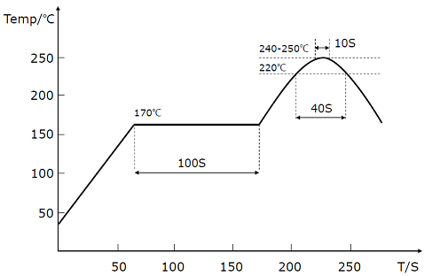
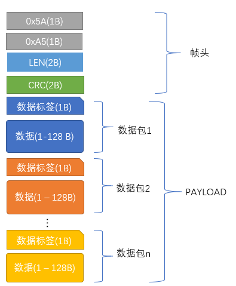
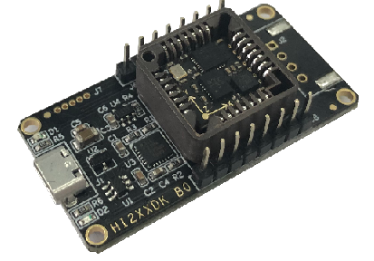

# HI226 用户手册
<p style="text-align: right;">IMU/VRU姿态测量模块, Rev 1.0


<div style="page-break-after: always;"></div>
[TOC]

<div style="page-break-after: always;"></div>
## 简介

HI226是超核电子推出的一款超低成本、高性能、小体积、低延时的惯性测量单元(IMU)，本产品集成了三轴加速度计、三轴陀螺仪和一款微控制器。可输出经过传感器融合算法计算得到的基于当地地理坐标的三维方位数据，包含无绝对参考的相对航向角，俯仰角和横滚角。同时也可以输出校准过的原始的传感器数据。

典型应用:

* 扫地机/大型机器人航向角检测/低速云台控制


## 主要特性

### 板载传感器
- 三轴陀螺仪, 最大量程: ±2000°/s 
- 三轴加速度计, 最大量程:±8G 
### 通讯接口及供电
- 串口(兼容TTL 可直接与5V 或3.3V 串口设备连接)
- 供电电压：3.3 (+/- 100 mV)
- 最大峰值功耗：32mA
## 硬件参数

| 参数           | 描述                        |
| -------------- | --------------------------- |
| 输出数据接口   | UART(TTL 1.8V - 3.3V)       |
| 工作电压       | 3.3V (± 100mV)              |
| 功耗           | 86mW @3.3V                  |
| 温度范围       | -20℃  - 85 ℃                |
| 最大线性加速度 | 0 - 115 $m/s^2$             |
| 尺寸           | 12 x 12 x 2.6mm (W x L x H) |
| 板载传感器     | 三轴加速度计 三轴陀螺仪     |


| 符号 | 最小值 | 典型值 | 最大值 | 单位 |
| ---- | ------ | ------ | ------ | ---- |
| A1   | -      | 11     | -      | mm   |
| B    | -      | 11     | -      | mm   |
| D    | -      | 12     | -      | mm   |
| E    | -      | 12     | -      | mm   |
| H    | 2.5    | 2.6    | 2.7    | mm   |
| a    | -      | 1.5    | -      | mm   |
| b    | -      | 0.9    | -      | mm   |
| c    | -      | 1      | -      | mm   |
| e    | -      | 1.27   | -      | mm   |
| f    | -      | 1      | -      | mm   |


| 引脚号 | 名称   | 说明                                  |
| ------ | ------ | ------------------------------------- |
| 5      | N/C | 保留                                  |
| 6      | VCC    | 电源 3.3V                             |
| 7      | SYNC_OUT | 数据输出同步:  数据输出时， 此引脚为高电平，空闲时为低电平。 |
| 8      | RXD    | 模块串口接收 UART RXD(接 MCU 的 TXD)  |
| 9      | TXD    | 模块串口发送 UART TXD (接 MCU 的 RXD) |
| 10     | SYNC_IN | 数据输入同步:  内部下拉，当模块检测到上升沿时, 输出一帧数据。 |
| 11     | N/C    | 保留                                  |
| 19     | GND    | GND                                   |
| 20     | RST    | 复位, 内部上拉。>10uS 低电平复位模块。无需要外接阻容，建议接到MCU的GPIO引脚以实现软件复位 |
| 21     | N/C | 保留 |
| 22     | N/C | 保留 |
| 23     | N/C    | 保留                                  |
| 24     | GND | GND                                   |
| 25     | N/C    | 保留                                  |

## 坐标系定义

载体系使用 前-左-上(FLU)右手坐标系。其中欧拉角旋转顺序为 ZYX(先转Z轴，再转Y轴，最后转X轴)旋转顺序。具体定义如下：

- 绕 Z 轴方向旋转: 航向角\Yaw\phi($\psi$) 范围: -180° - 180°
- 绕 Y 轴方向旋转: 俯仰角\Pitch\theta($\theta$) 范围: -90°-90°
- 绕 X 轴方向旋转:横滚角\Roll\psi(  $\phi$)范围: -180°-180°

如果将模块视为飞行器的话。X 轴应视为机头方向。当传感器系与惯性系重合时，欧拉角的理想输出为:Pitch = 0°, Roll = 0°, Yaw = 0°


## 性能指标

### 姿态角输出精度

| 姿态角                                                | 典型值 |
| ----------------------------------------------------- | ------ |
| 横滚角\俯仰角 - 静态误差                              | 0.8°   |
| 横滚角\俯仰角 - 动态误差                              | 2.5°   |
| 运动中航向角精度(30min,水平平稳运动,类扫地机运动模式) | <10°   |

### 陀螺仪

| 参数         | 值              |
| ------------ | --------------- |
| 测量范围     | ±2000°/s        |
| 零偏稳定性   | 10°/h           |
| 刻度非线性度 | ±0.3%(满量程时) |
| 加速度敏感性 | 0.1°/s/g        |

### 加速度计

| 参数     | 值                        |
| -------- | ------------------------- |
| 测量范围 | ±8G (1G = 1x 重力加速度 ) |
| 非线性度 | ±0.5% (满量程时)          |

### 模块数据接口参数

| 参数           | 值                            |
| -------------- | ----------------------------- |
| 串口输出波特率 | 9600/115200/460800/921600可选 |
| 帧输出速率     | 1/25/50/100/200/400Hz 可选    |


## 传感器校准

1. 加速度计和陀螺仪在出厂前经过比例因子误差和非正交误差校准，校准参数保存在模块内部。

2. 陀螺仪的输出每次上电后会有一个随机的不为0的bias，称之为零偏重复性。这个随机bias不能在出厂前被校准。系统在启动后1S内认为处于静止状态并采集1S的陀螺仪角速度作为初始bias。这个过程称之为陀螺仪上电自校准。自校准在上电后静止模块3s 左右可获得最好的校准效果。**如上电1s内模块处于运动状态(包括缓慢转动，振动等)则航向角飘移现象会显著增大**。 建议使用时每次上电后静止至少1s。

3. 磁传感器(部分型号支持)出厂前经过椭球校准，但磁传感器很容易受到外界环境磁场干扰，一般都需要客户重新校准，出厂校准参数意义不大。详见地磁校准章节。


## 安装及焊接

1. 安装位置请远离PCB容易形变点，尽量远离PCB边缘(>30mm)，远离PCB定位螺丝孔(>10mm)等。

   

2. 安装位置请远离强磁设备，如电机，喇叭等强磁器件。

4. 组装好的PCB不得使用超声波清洁仪进行清洁。

5. 本产品不可使用塑封或喷涂三防漆，喷漆或塑封会造成传感器应力改变进而影响性能。

   

6. 推荐回流焊的炉温曲线图如下：



**注意**

回流焊最后阶段需要自然冷却，不能开启炉子强制风冷却，否则严重影响产品性能。


## 应用指南

### 模块与PC机连接

建议使用评估板与PC机进行连接，评估板板载USB供电及USB转串口功能，可以方便的配合PC机上的评估软件进行性能测试。具体请参见附录中的评估板一节。

### 模块与MCU进行连接

模块与MCU通过TTL电平的串口进行连接，建议模块的RST引脚建议接到MCU的GPIO上。方便MCU强制复位模块。


**注意**


1. 如不使用同步输入(SYNC_IN) 和同步输出功能(SYNC_OUT) 可不接SYNC_IN 和 SYNC_OUT。
2. 120欧电阻的作用是为了方便调试，并防止MCU和模块电平不匹配，可以去掉，建议保留。
3. VCC的电压范围具体参加手册说明
4. 模块内置上电复位电路，RST可以不接，但是建议接到主机一个GPIO上来实现软件复位。


## 串口通讯协议

模块上电后，默认按出厂帧率(通常为100)输出帧数据，帧格式如下：


| 域名称  | 值    | 长度(字节) | 说明                                                         |
| ------- | ----- | ---------- | ------------------------------------------------------------ |
| PRE     | 0x5A  | 1          | 固定为0x5A                                                   |
| TYPE    | 0xA5  | 1          | 固定为0xA5                                                   |
| LEN     | 1-512 | 2          | 帧中数据域的长度，低字节在前。长度表示数据域(PAYLOAD)的长度，不包含`PRE`,`TYPE`,`LEN`,`CRC` 字段。 |
| CRC     | -     | 2          | 除CRC 本身外其余所有字段(`PRE,TYPE,LEN, PAYLOAD`)帧数据的16 位CRC 校验和。LSB(低字节在前) |
| PAYLOAD | -     | 1-512      | 一帧携带的数据。PAYLOAD域 由若干个**子数据包**组成。每个数据包包含数据包标签和数据两部分。标签决定了数据的类型及长度。 |




CRC实现函数：

```
/*
	currectCrc: previous crc value, set 0 if it's first section
	src: source stream data
	lengthInBytes: length
*/
static void crc16_update(uint16_t *currectCrc, const uint8_t *src, uint32_t lengthInBytes)
{
    uint32_t crc = *currectCrc;
    uint32_t j;
    for (j=0; j < lengthInBytes; ++j)
    {
        uint32_t i;
        uint32_t byte = src[j];
        crc ^= byte << 8;
        for (i = 0; i < 8; ++i)
        {
            uint32_t temp = crc << 1;
            if (crc & 0x8000)
            {
                temp ^= 0x1021;
            }
            crc = temp;
        }
    } 
    *currectCrc = crc;
}
```


## 数据包

#### 数据包总览

| 数据包标签 | 数据包长度(包含标签1字节) | 名称                | 备注     |
| ---------- | ------------------------- | ------------------- | -------- |
| 0x90       | 2                         | 用户ID              |          |
| 0xA0       | 7                         | 加速度              |          |
| 0xB0       | 7                         | 角速度              |          |
| 0xC0       | 7                         | 磁场强度            |          |
| 0xD0       | 7                         | 欧拉角              |          |
| 0xD1       | 17                        | 四元数              |          |
| 0xF0       | 5                         | 气压                | 输出0    |
| 0x91       | 76                        | IMUSOL(IMU数据集合) | 推荐使用 |

#### 产品支持数据包列表

#### 0x90(用户ID)

共2字节，用户设置的ID。

| 字节偏移 | 类型    | 大小 | 单位 | 说明            |
| -------- | ------- | ---- | ---- | --------------- |
| 0        | uint8_t | 1    | -    | 数据包标签:0x90 |
| 1        | uint8_t | 1    | -    | 用户ID          |

#### 0xA0(加速度)

共7 个字节，LSB。输出传感器的原始加速度

| 字节偏移 | 类型    | 大小 | 单位                     | 说明            |
| -------- | ------- | ---- | ------------------------ | --------------- |
| 0        | uint8_t | 1    | -                        | 数据包标签:0xA0 |
| 1        | int16_t | 2    | 0.001G(1G = 1重力加速度) | X轴加速度       |
| 3        | int16_t | 2    | 0.001G                   | Y轴加速度       |
| 5        | int16_t | 2    | 0.001G                   | Z轴加速度       |

#### 0xB0(角速度)

共7字节，LSB。输出传感器的原始角速度

| 字节偏移 | 类型    | 大小 | 单位   | 说明             |
| -------- | ------- | ---- | ------ | ---------------- |
| 0        | uint8_t | 1    | -      | 数据包标签：0xB0 |
| 1        | int16_t | 2    | 0.1°/s | X轴角速度        |
| 3        | int16_t | 2    | 0.1°/s | Y轴角速度        |
| 5        | int16_t | 2    | 0.1°/s | Z轴角速度        |

#### 0xC0(磁场强度)

共7字节，LSB。输出传感器的原始磁场强度

| 字节偏移 | 类型    | 大小 | 单位       | 说明            |
| -------- | ------- | ---- | ---------- | --------------- |
| 0        | uint8_t | 1    | -          | 数据包标签:0xC0 |
| 1        | int16_t | 2    | 0.001Gauss | X轴磁场强度     |
| 3        | int16_t | 2    | 0.001Gauss | Y轴磁场强度     |
| 5        | int16_t | 2    | 0.001Gauss | Z轴磁场强度     |

#### 0xD0(欧拉角)

共7字节，LSB。格式为int16，共三个轴，每个轴占2 个字节，顺序为Pitch/Roll/Yaw。接收到Roll, Pitch 为物理值乘以100 后得到的数值，Yaw 为乘以10 得到的数值。

例：当接收到的Yaw = 100 时，表示航向角为10°

| 字节偏移 | 类型    | 大小 | 单位  | 说明            |
| -------- | ------- | ---- | ----- | --------------- |
| 0        | uint8_t | 1    | -     | 数据包标签:0xD0 |
| 1        | int16_t | 2    | 0.01° | Pitch(俯仰角)   |
| 3        | int16_t | 2    | 0.01° | Roll(横滚角)    |
| 5        | int16_t | 2    | 0.1°  | Yaw(航向角)     |

#### 0XD1(四元数)

共17字节，格式为float，共4个值，顺序为:W X Y Z.。每个值占4 字节(float)，整个四元数为4个float，LSB。

| 字节偏移 | 类型    | 大小 | 单位 | 说明            |
| -------- | ------- | ---- | ---- | --------------- |
| 0        | uint8_t | 1    | -    | 数据包标签:0xD1 |
| 1        | float   | 4    | -    | W               |
| 5        | float   | 4    | -    | X               |
| 9        | float   | 4    | -    | Y               |
| 13       | float   | 4    | -    | Z               |

#### 0XF0(气压)

共5字节，格式为float。(只针对有气压传感器的产品)

| 字节偏移 | 类型    | 大小 | 单位 | 说明            |
| -------- | ------- | ---- | ---- | --------------- |
| 0        | uint8_t | 1    | -    | 数据包标签:0xF0 |
| 1        | float   | 4    | Pa   | 大气压          |

#### 0X91( IMUSOL)

共76字节，新加入的数据包，用于替代A0,B0,C0,D0,D1等数据包。集成了IMU的传感器原始输出和姿态解算数据。

| 字节偏移 | 类型     | 大小 | 单位                 | 说明                                                         |
| -------- | -------- | ---- | -------------------- | ------------------------------------------------------------ |
| 0        | uint8_t  | 1    | -                    | 数据包标签:0x91                                              |
| 1        | uint8_t  | 1    | -                    | ID                                                           |
| 2        | -        | 6    | -                    | 保留                                                         |
| 8        | uint32_t | 4    | ms                   | 时间戳信息，从系统开机开始累加，每毫秒增加1                  |
| 12       | float    | 12   | 1G(1G = 1重力加速度) | 加速度,顺序为：XYZ(注意单位和0xA0包不同)                     |
| 24       | float    | 12   | deg/s                | 角速度,顺序为： XYZ(注意单位和0xB0包不同)                    |
| 36       | float    | 12   | uT                   | 磁强度,顺序为： XYZ(注意单位和0xC0包不同)                    |
| 48       | float    | 12   | deg                  | 节点欧拉角 顺序为：横滚角(Roll)，俯仰角(Pitch)，航向角(Yaw)(注意顺序和单位与0xD0包不同) |
| 60       | float    | 16   | -                    | 节点四元数集合,顺序为WXYZ                                    |


### 出厂默认数据包

出厂默认一帧中携带数据包数据定义如下：

| 产品  | 默认输出数据包    |
| ----- | ----------------- |
| HI226 | 90,A0,B0,C0,D0,F0 |
| HI229 | 90,A0,B0,C0,D0,F0 |
| CH100 | 91                |
| CH110 | 91                |

### 数据帧结构示例

#### 数据帧配置为 `0x90,0xA0,0xB0,0xC0,0xD0,0xF0` 数据包

使用串口助手采样一帧数据,共41字节, 前6字节为帧头, 长度和CRC校验值。剩余35字节为数据域。假设数据接收到C语言数组`buf`中。如下所示:

5A A5 23 00 FD 61 **90** 00 **A0** 55 02 3D 01 E2 02 **B0** FE FF 17 00 44 00 **C0** 80 FF 60 FF 32 FF **D0** 64 F2 6C 0E BB 01 **F0** 00 00 00 00

* 第一步：判断帧头，得到数据域长度和帧CRC：

帧头:`5A` `A5`

帧数据域长度:`23` `00`: (0x00<<8) + 0x23 = 35

帧CRC校验值:`FD` `61`:(0x61<<8) + 0xFD = 0x61FD

* 第二步： 校验CRC

```
    uint16_t payload_len;
    uint16_t crc;
    
    crc = 0;
    payload_len = buf[2] + (buf[3] << 8);
    
    /* calulate 5A A5 and LEN filed crc */
    crc16_update(&crc, buf, 4);
    
    /* calulate payload crc */
    crc16_update(&crc, buf + 6, payload_len);
```

得到CRC值为0x61FD, 与帧携带的CRC值相同, 帧CRC校验通过。

* 第三步：接收数据

`90 00`：ID 数据包, 0x90为数据包标签, ID = 0x00.

`A0 55 02 3D 01 E2 02`:加速度数据包,0xA0为数据包标签，三轴加速度为：

X轴加速度=  (int16_t)((0x02<<8)+ 0x55) = 597(单位为mG)

Y轴加速度 = (int16_t)((0x01<<8)+ 0x3D) = 317

Z轴加速度= (int16_t)((0x02<<8)+ 0xE2) = 738

`B0 FE FF 17 00 44 00` :角速度数据包,0xB0为数据包标签，三轴角速度为：

X轴角速度=  (int16_t)((0xFF<<8)+ 0xFE) = -2(单位为0.1°/s)

Y轴角速度 = (int16_t)((0x00<<8)+ 0x17) = 23

Z轴角速度= (int16_t)((0x00<<8)+ 0x44) = 68

`C0 80 FF 60 FF 32 FF` :磁场数据包,0xC0为数据包标签，三轴磁场为：

X轴角速度=  (int16_t)((0xFF<<8)+ 0x80) = -128 (单位为0.001Gauss)

Y轴角速度 = (int16_t)((0xFF<<8)+ 0x60) =  -160

Z轴角速度= (int16_t)((0xFF<<8)+ 0x32) =  -206

`D0 64 F2 6C 0E BB 01` 欧拉角数据包, 0xD0为数据包标签

Pitch= (int16_t)((0xF2<<8)+ 0x64) / 100 = -3484 / 100 = -34.84 ° 

Roll= (int16_t)((0x0E<<8)+ 0x6C) / 100 =  3692 / 100 = 36.92°

Yaw = (int16_t)((0x01<<8)+ 0xBB) / 10 =  443 /10 = 44.3°

`F0 00 00 00 00`气压数据包，0xF0为数据包标签

```
float prs;
prs = memcpy(&prs, &buf[37], 4);
```

最后得到结果：

```
id              : 0
acc(G)          :    0.597    0.317    0.738
gyr(deg/s)      :   -0.200    2.300    6.800
mag(uT)         :  -12.800  -16.000  -20.600
eul(R/P/Y)      :   36.920  -34.840   44.300
```


#### 数据帧配置为 `0x91` 数据包

使用串口助手采样一帧数据,共82字节, 前6字节为帧头, 长度和CRC校验值。剩余76字节为数据域。假设数据接收到C语言数组`buf`中。如下所示:

5A A5 4C 00 6C 51 **91** 00 A0 3B 01 A8 02 97 BD BB 04 00 9C A0 65 3E A2 26 45 3F 5C E7 30 3F E2 D4 5A C2 E5 9D A0 C1 EB 23 EE C2 78 77 99 41 AB AA D1 C1 AB 2A 0A C2 8D E1 42 42 8F 1D A8 C1 1E 0C 36 C2 E6 E5 5A 3F C1 94 9E 3E B8 C0 9E BE BE DF 8D BE

* 第一步：判断帧头，得到数据域长度和帧CRC：

帧头:`5A` `A5`

帧数据域长度:`4C` `00`: (0x00<<8) + 0x4C = 76

帧CRC校验值:`6C` `51`:(0x51<<8) + 0x6C = 0x516C

* 第二步： 校验CRC

```
    uint16_t payload_len;
    uint16_t crc;
    
    crc = 0;
    payload_len = buf[2] + (buf[3] << 8);
    
    /* calulate 5A A5 and LEN filed crc */
    crc16_update(&crc, buf, 4);
    
    /* calulate payload crc */
    crc16_update(&crc, buf + 6, payload_len);
```

得到CRC值为0x516C. 帧CRC校验通过。

* 第三步：接收数据

从`0x91`开始为数据包的数据域。在C语言中可以定义结构体来方便的读取数据：

定义0x91数据包结构体如下：

```
__packed typedef struct
{
    uint8_t     tag;                /* 数据标签:0x91 */
    uint8_t     id;					/* 模块ID */
    uint8_t     rev[6];             /* reserved */
    uint32_t    ts;                 /* 时间戳 */
    float       acc[3];				/* 加速度 */
    float       gyr[3];				/* 角速度 */
    float       mag[3];				/* 地磁 */
    float       eul[3];             /* 欧拉角: Roll,Pitch,Yaw */
    float       quat[4];            /* 四元数 */
}id0x91_t;
```

`__packed` 为编译器关键字(Keil下)，表示结构体按字节紧对齐，结构体每一个元素一一对应0x91数据包的结构定义。接收数据时将接收到的数组直接memcpy到结构体即可：(注意定义结构体时必须4字节对齐), 其中`buf `指向帧头, `buf[6]`指向帧中数据域 。

```
    /* 接收数据并使用0x91数据包结构定义来解释数据 */
    __align(4) id0x91_t dat;    /* struct must be 4 byte aligned */
    memcpy(&dat, &buf[6], sizeof(id0x91_t));
```

最后得到dat数据结果：

```
id              : 0
timestamp       : 310205
acc             :    0.224    0.770    0.691
gyr             :  -54.708  -20.077 -119.070
mag             :   19.183  -26.208  -34.542
eul(R/P/Y)      :   48.720  -21.014  -45.512
quat            :    0.855    0.310   -0.310   -0.277
```


## AT指令

当使用串口与模块通讯时, 模块支持AT 指令集配置/查看模块参数。AT 指令总以ASCII 码`AT` 开头，后面跟控制字符，最
后以回车换行`\r\n`结束。可使用串口调试助手进行测试：


通用模块 AT指令如下

| 指令      | 功能                   | 掉电保存(Y) | 立即生效(Y),复位生效(R) | 备注         |
| --------- | ---------------------- | ----------- | ----------------------- | ------------ |
| AT+ID     | 设置模块用户ID         | Y           | R                       |              |
| AT+INFO   | 打印模块信息           | N           | Y                       |              |
| AT+ODR    | 设置模块串口输出帧频率 | Y           | R                       |              |
| AT+BAUD   | 设置串口波特率         | Y           | R                       |              |
| AT+EOUT   | 数据输出开关           | N           | Y                       |              |
| AT+RST    | 复位模块               | N           | Y                       |              |
| AT+TRG    | 单次输出触发           | N           | Y                       | 部分型号支持 |
| AT+SETPTL | 设置输出数据包         | Y           | Y                       | 部分型号支持 |
| AT+MODE   | 设置模块工作模式       | Y           | R                       | 部分型号支持 |
| AT+GWID   | 设置无线网关ID         | Y           | R                       | 部分型号支持 |


##### AT+ID

设置模块用户ID

**例** `AT+ID=1`

##### AT+INFO

打印模块信息，包括产品型号，版本，固件发布日期等。


##### AT+ODR

设置模块串口输出速率。 掉电保存，复位模块生效

**例** 设置串口输出速率为100Hz:  `AT+ODR=100` 

注意：当ODR设置为比较高时(如200),默认的115200波特率可能不满足输出带宽要求，此时需要将模块波特率设高(如921600)后，模块才能按设置的ODR输出数据帧。

##### AT+BAUD

设置串口波特率，可选值：9600/115200/460800/921600`

**例**  `AT+BAUD=115200`

**注意**

- 使用此指令需要特别注意，输入错误波特率后会导致无法和模块通讯
- 波特率参数设置好后掉电保存，复位模块生效。上位机的波特率也要做相应修改。
- 升级固件时，需要切换回115200 波特率。

##### AT+EOUT

串口输出开关

**例** 打开串口输出 `AT+EOUT=1`   关闭串口输出 `AT+EOUT=0`

##### AT+RST

复位模块

**例** `AT+RST`

##### AT+SETPTL

设置输出协议:

设置一帧中所包含的数据包：格式为`AT+SETPTL=<ITEM_ID>,<ITEM_ID>...`

**例**

* 配置模块输出: 91数据包(IMUSOL),指令为:`AT+SETPTL=91`
* 配置模块输出:加速度(A0)，角速度(B0), 整形格式欧拉角(D0)和四元数(D1)的指令为：`AT+SETPTL=A0,B0,D0,D1`


##### AT+TRG

触发模块输出一帧数据，可以配合AT+ODR=0来实现单次触发输出。

**例** `AT+TRG`


## 附录A - 评估板



### 评估板简介

评估板板载USB-UART芯片(CP2104)以及供电LDO，并将模块接口引出方便调试。资料包中包含CP2104 USB-UART 驱动程序, 将USB线连接电脑和模块，打开资料包中的Uranus 上位机，连接串口，默认状态下，模块会以115200-N-8-N-1 输出出厂默认的数据包。


### 尺寸


### 从评估板上取下产品

模块默认被嵌入评估板的PLCC28 插槽中，如需取出模块，请按如下步骤操作：
- 断电，准备好细螺丝刀或镊子
- 从PLCC 插座或者背面圆形空洞内将模块撬出或顶出。

 

**注意**

- 评估板是为了快速验证，评估模块性能。本身不带有任何其他计算功能。
- USB 接口本身不适合于工业级场景或者高运动场合的电气连接，如果您的应用为高运动环境(动作捕捉等)，不建议在您的产品中直接使用评估板。


## 附录C - 固件升级与恢复出厂设置


本产品支持升级固件。
固件升级步骤:

- 连接模块，打开上位机，将模块和上位机波特率都设置为115200. 打开固件升级窗口
- 点击连接按钮，如出现模块连接信息。则说明升级系统准备就绪，点击文件选择器(…)选择拓
  展名为.hex 的固件，然后点击开始编程。下载完成后会提示编程完成，此时关闭串口，
  重新给模块上电，模块升级完成。


## 附录D-FAQ

FAQ内容随时更新，详见:[FAQ](https://zhuanlan.zhihu.com/p/344884686)


