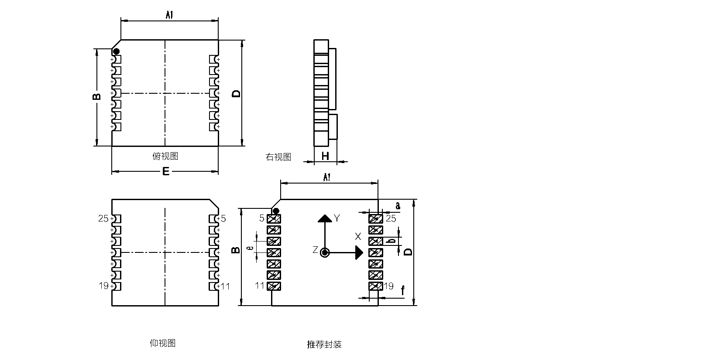

# HI226 用户手册

IMU/VRU姿态测量模块, Rev 1.0

[TOC]

## 简介

HI226是超核电子推出的一款超低成本、高性能、小体积、低延时的惯性测量单元(IMU)，本产品集成了三轴加速度计、三轴陀螺仪和一款微控制器。可输出经过传感器融合算法计算得到的基于当地地理坐标的三维方位数据，包含无绝对参考的相对航向角，俯仰角和横滚角。同时也可以输出校准过的原始的传感器数据。

典型应用:

* 扫地机/大型机器人航向角检测/低速云台控制

## 主要特性

### 板载传感器
- 三轴陀螺仪, 最大量程: ±2000°/s 
- 三轴加速度计, 最大量程:±8G 
### 通讯接口及供电
- 串口(兼容TTL 可直接与5V 或3.3V 串口设备连接)
- 供电电压：3.3 (+/- 100 mV)
- 最大峰值功耗：32mA
## 硬件参数

| 参数           | 描述                        |
| -------------- | --------------------------- |
| 输出数据接口   | UART(TTL 1.8V - 3.3V)       |
| 工作电压       | 3.3V (± 100mV)              |
| 功耗           | 86mW @3.3V                  |
| 温度范围       | -20℃  - 85 ℃                |
| 最大线性加速度 | 0 - 115 $m/s^2$             |
| 尺寸           | 12 x 12 x 2.6mm (W x L x H) |
| 板载传感器     | 三轴加速度计 三轴陀螺仪     |

| 符号 | 最小值 | 典型值 | 最大值 | 单位 |
| ---- | ------ | ------ | ------ | ---- |
| A1   | -      | 11     | -      | mm   |
| B    | -      | 11     | -      | mm   |
| D    | -      | 12     | -      | mm   |
| E    | -      | 12     | -      | mm   |
| H    | 2.5    | 2.6    | 2.7    | mm   |
| a    | -      | 1.5    | -      | mm   |
| b    | -      | 0.9    | -      | mm   |
| c    | -      | 1      | -      | mm   |
| e    | -      | 1.27   | -      | mm   |
| f    | -      | 1      | -      | mm   |

| 引脚号 | 名称   | 说明                                  |
| ------ | ------ | ------------------------------------- |
| 5      | N/C | 保留                                  |
| 6      | VCC    | 电源 3.3V                             |
| 7      | SYNC_OUT | 数据输出同步:  数据输出时， 此引脚为高电平，空闲时为低电平。 |
| 8      | RXD    | 模块串口接收 UART RXD(接 MCU 的 TXD)  |
| 9      | TXD    | 模块串口发送 UART TXD (接 MCU 的 RXD) |
| 10     | SYNC_IN | 数据输入同步:  内部下拉，当模块检测到上升沿时, 输出一帧数据。 |
| 11     | N/C    | 保留                                  |
| 19     | GND    | GND                                   |
| 20     | RST    | 复位, 内部上拉。>10uS 低电平复位模块。无需要外接阻容，建议接到MCU的GPIO引脚以实现软件复位 |
| 21     | N/C | 保留 |
| 22     | N/C | 保留 |
| 23     | N/C    | 保留                                  |
| 24     | GND | GND                                   |
| 25     | N/C    | 保留                                  |

## 坐标系定义

载体系使用 前-左-上(FLU)右手坐标系。其中欧拉角旋转顺序为 ZYX(先转Z轴，再转Y轴，最后转X轴)旋转顺序。具体定义如下：

- 绕 Z 轴方向旋转: 航向角\Yaw\phi($\psi$) 范围: -180° - 180°
- 绕 Y 轴方向旋转: 俯仰角\Pitch\theta($\theta$) 范围: -90°-90°
- 绕 X 轴方向旋转:横滚角\Roll\psi(  $\phi$)范围: -180°-180°

如果将模块视为飞行器的话。X 轴应视为机头方向。当传感器系与惯性系重合时，欧拉角的理想输出为:Pitch = 0°, Roll = 0°, Yaw = 0°

## 性能指标

### 姿态角输出精度

| 姿态角                                                | 典型值 |
| ----------------------------------------------------- | ------ |
| 横滚角\俯仰角 - 静态误差                              | 0.8°   |
| 横滚角\俯仰角 - 动态误差                              | 2.5°   |
| 运动中航向角精度(30min,水平平稳运动,类扫地机运动模式) | <10°   |

### 陀螺仪

| 参数         | 值              |
| ------------ | --------------- |
| 测量范围     | ±2000°/s        |
| 零偏稳定性   | 10°/h           |
| 刻度非线性度 | ±0.3%(满量程时) |
| 加速度敏感性 | 0.1°/s/g        |

### 加速度计

| 参数     | 值                        |
| -------- | ------------------------- |
| 测量范围 | ±8G (1G = 1x 重力加速度 ) |
| 非线性度 | ±0.5% (满量程时)          |

### 模块数据接口参数

| 参数           | 值                            |
| -------------- | ----------------------------- |
| 串口输出波特率 | 9600/115200/460800/921600可选 |
| 帧输出速率     | 1/25/50/100/200/400Hz 可选    |

