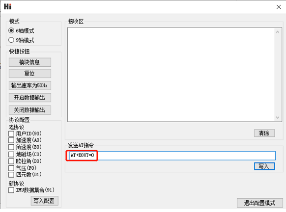

## AT指令

当使用串口与模块通讯时, 模块支持AT 指令集配置/查看模块参数。AT 指令总以ASCII 码`AT` 开头，后面跟控制字符，最
后以回车换行`\r\n`结束。可使用串口调试助手进行测试：

通用模块 AT指令如下

| 指令      | 功能                   | 掉电保存(Y) | 立即生效(Y),复位生效(R) | 备注         |
| --------- | ---------------------- | ----------- | ----------------------- | ------------ |
| AT+ID     | 设置模块用户ID         | Y           | R                       |              |
| AT+INFO   | 打印模块信息           | N           | Y                       |              |
| AT+ODR    | 设置模块串口输出帧频率 | Y           | R                       |              |
| AT+BAUD   | 设置串口波特率         | Y           | R                       |              |
| AT+EOUT   | 数据输出开关           | N           | Y                       |              |
| AT+RST    | 复位模块               | N           | Y                       |              |
| AT+TRG    | 单次输出触发           | N           | Y                       | 部分型号支持 |
| AT+SETPTL | 设置输出数据包         | Y           | Y                       | 部分型号支持 |
| AT+MODE   | 设置模块工作模式       | Y           | R                       | 部分型号支持 |
| AT+GWID   | 设置无线网关ID         | Y           | R                       | 部分型号支持 |

##### AT+ID

设置模块用户ID

**例** `AT+ID=1`

##### AT+INFO

打印模块信息，包括产品型号，版本，固件发布日期等。

##### AT+ODR

设置模块串口输出速率。 掉电保存，复位模块生效

**例** 设置串口输出速率为100Hz:  `AT+ODR=100` 

注意：当ODR设置为比较高时(如200),默认的115200波特率可能不满足输出带宽要求，此时需要将模块波特率设高(如921600)后，模块才能按设置的ODR输出数据帧。

##### AT+BAUD

设置串口波特率，可选值：9600/115200/460800/921600`

**例**  `AT+BAUD=115200`

**注意**

- 使用此指令需要特别注意，输入错误波特率后会导致无法和模块通讯
- 波特率参数设置好后掉电保存，复位模块生效。上位机的波特率也要做相应修改。
- 升级固件时，需要切换回115200 波特率。

##### AT+EOUT

串口输出开关

**例** 打开串口输出 `AT+EOUT=1`   关闭串口输出 `AT+EOUT=0`

##### AT+RST

复位模块

**例** `AT+RST`