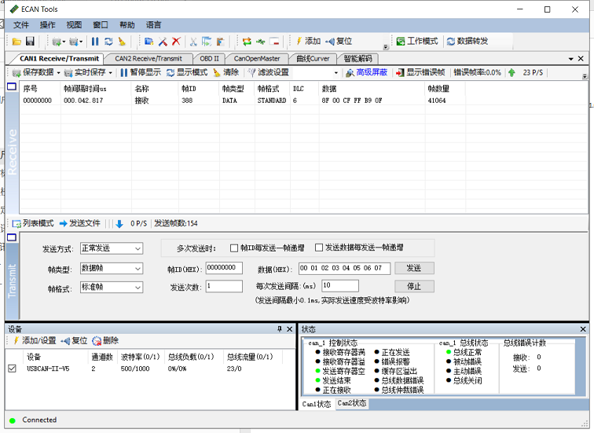

## CAN通讯协议

本产品CAN接口遵循以下标准：

* CAN接口符合CANopen协议，所有通讯均使用标准数据帧，只使用PTO1-4 传输数据，所有传输均采用标准数据帧，不接收远程帧和拓展数据帧
* PTO采用异步定时触发模式, 默认输出速率为20Hz
* 当模块上电时，按照CANopen协议，模块会主动发送一条(一次)节点上线报文。节点上电处于预操作状态(pre-operational), 需要主机发送NMT协议将节点设置为operation状态才会开始发送数据

### CANopen 默认设置

| CANopen默认配置 | 值          |
| --------------- | ----------- |
| CAN 波特率      | 500KHz      |
| CANopen节点ID   | 8           |
| 初始化状态      | Operational |
| 心跳包          | 无          |

### CANopen TPTO

| PTO通道 | PTO 帧ID | 长度 | PTO 传输方式   | 异步输出频率（Hz） | 发送数据 | 说明                                                         |
| ------- | -------- | ---- | -------------- | ------------------ | -------- | ------------------------------------------------------------ |
| TPDO1   | 0x180+ID | 6    | 异步定时(0xFE) | 20                 | 加速度   | 每轴数据类型为(INT16,低字节在前)，分别为X,Y,Z轴加速度，单位为mG(0.001重力加速度) |
| TPDO2   | 0x280+ID | 6    | 异步定时(0xFE) | 20                 | 角速度   | 每轴数据类型为(INT16,低字节在前)，分别为X,Y,Z轴角速度，单位为0.1DPS(°/s) |
| TPDO3   | 0x380+ID | 6    | 异步定时(0xFE) | 20                 | 欧拉角   | 每轴数据类型为(INT16,低字节在前)，顺序分别为横滚角(Roll,绕X轴旋转),俯仰角(Pitch,绕Y轴旋转),航向角(Yaw绕Z轴旋转)。欧拉角单位为0.01° |
| TPDO4   | 0x480+ID | 8    | 异步定时(0xFE) | 20                 | 四元数   | 每轴数据类型为(INT16,低字节在前)，分别为$$ q_{w} \ q_{x}\ q_{y}\ q_{z}$$ 。单位四元数扩大10000倍后结果。如四元数为1,0,0,0 时, 输出10000,0,0,0. |

使用USB-CAN工具抓取默认CAN输出包截图如下：

其中欧拉角(PTO3) CAN帧ID =0x380 + 8(默认ID) = 0x388， 数据为:

* X轴： (0x00 <<8)+ 0x8F = 0x008F = 1.43°
* Y轴： (0xFF<<8)+ 0xCF = 0xFFCF = -0.49°
* Z轴：(0x0F<<8)+ 0xB9 = 0x0FB9=  40.25°

  ### CAN接口编程示例

#### 1. 使能数据输出(开启异步触发)

发送标准CANopen协议帧，使用NMT: Start Remote Node命令:

`ID=0x000,DLC=2,DATA=0x01,0x08`

其中 0x01为Start Remote Node指令， 0x08为节点ID

#### 2. 修改CAN波特率，输出速率及输出帧信息
数据字典以下位置存放厂商参数配置数据, 可通过CANopen 发送快速SDO指令修改，**掉电保存，重新上电生效**。

| 数据字典位置 | 子偏移 | 名称     | 值类型    | 默认值 | 说明          |
| ------------ | ------ | -------- | --------- | ------ | ------------- |
| 0x2100       | 0      | CAN_BAUD | INTEGER32 | 500000 | CAN总线波特率 |
| 0x2101       | 0      | NodeID   | INTEGER32 | 8      | 节点ID        |

以上配置操作均使用快速SDO来写数据字典, 其中TPDO通道与其对应的参数索引为：

| PTO通道 | PTO 帧ID | TPDO参数索引地址(CANopen协议默认定义) |
| ------- | -------- | ------------------------------------- |
| TPDO1   | 0x180+ID | 0x1800                                |
| TPDO2   | 0x280+ID | 0x1801                                |
| TPDO3   | 0x380+ID | 0x1802                                |
| TPDO4   | 0x480+ID | 0x1803                                |

##### 示例1: 修改CAN波特率

如将CAN波特率修改为125K, 则发送：

`ID=0x608 ,DLC=8,DATA=0x23,0x00,0x21,0x00,0x48,0xE8,0x01,0x00`(ID=0x608, 长度为8的标准数据帧)

* 0x23为SDO写四个字节指令 
* 0x00, 0x21为写0x2100索引
* 0x00, 0x01, 0xE8, 0x48 = (0x00<<24) + (0x01<<16) + (0xE8<<8) + 0x48 = 125000

如将CAN波特率修改为250K, 则发送：

`ID=0x608 ,DLC=8,DATA=0x23,0x00,0x21,0x00,0x90,0xD0,0x03,0x00`

* 0x23为SDO写四个字节指令 
* 0x00, 0x21为写0x2100索引
* 0x00, 0x03, 0xD0, 0x90 = (0x00<<24) + (0x03<<16) + (0xD0<<8) + 0x90 = 250000

##### 示例2: 修改节点ID

如将设备CANopen节点ID改为9, 则发送：

`ID=0x608 ,DLC=8,DATA=0x23,0x01,0x21,0x00,0x09,0x00,0x00,0x00`

* 0x23为SDO写四个字节指令  
* 0x01, 0x21为写0x2101索引
* 0x09 0x00, 0x00, 0x00 = (0x00<<24) + (0x00<<16) + (0x00<<8) + 0x09 = 9

注意，修改节点ID后重新上电生效，且生效后发送启动节点命令(比如节点启动命令数据变为01 09)和SDO指令(发送CAN帧ID变为0x609)时注意为新的地址

##### 示例3: 修改数据输出速率

发送标准CANopen协议帧，使用标准快速SDO指令:(此项配置立即生效)

修改TPDO3(欧拉角)输出速率为20Hz(每50ms输出一次):

`ID=0x608 ,DLC=8,DATA=0x2B,0x02,0x18,0x05,0x32,0x00,0x00,0x00`

其中 

* 0x2B为SDO写两个字节指令 
* 0x02, 0x18为写0x1802索引,
* 0x05为子索引
* 0x00, 0x32= (0x00<<8) + 0x32 = 50(1ms为单位)，后面不足补0.

##### 示例4: 关闭TPDO输出

例：关闭TPDO2定时输出，则需要写0x1801索引，子索引为0x05, 写入值为0x0000:

`ID=0x608 ,DLC=8,DATA=0x2B,0x01,0x18,0x05,0x00,0x00,0x00,0x00`

其中 

* 0x2B为SDO写两个字节指令 
*  0x01, 0x18为写0x1801索引
*  0x05子索引
* 0x00, 0x00= (0x00<<8) + 0x00 = 0，后面不足补0.

