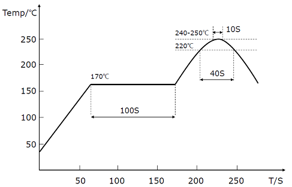

## 安装及焊接

1. 安装位置请远离PCB容易形变点，尽量远离PCB边缘(>30mm)，远离PCB定位螺丝孔(>10mm)等。

   

2. 安装位置请远离强磁设备，如电机，喇叭等强磁器件。

4. 组装好的PCB不得使用超声波清洁仪进行清洁。

5. 本产品不可使用塑封或喷涂三防漆，喷漆或塑封会造成传感器应力改变进而影响性能。

   

6. 推荐回流焊的炉温曲线图如下：

**注意**

回流焊最后阶段需要自然冷却，不能开启炉子强制风冷却，否则严重影响产品性能。

