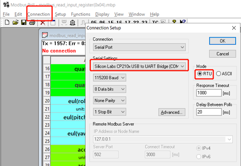
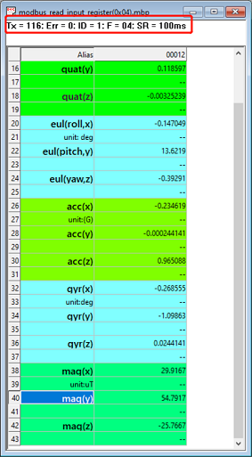

## MODBUS通讯协议

MODBUS通讯接口遵循以下标准：

1. 符合MODBUS APPLICATION PROTOCOL SPECIFICATION V1.1a 从站协议(RTU, 不支持ASCII)
2. 默认MODBUS ID为1,  默认波特率115200
3. 只支持3种功能码:  (3) Read Holding Registers,  (4) Read Input Registers, (16) Write Multiple registers
4. 一帧最大传输128字节

**注意**

* MODBUS通讯接口只存在于支持RS232和RS485接口的产品上
* MODBUS协议定义每个寄存器长度为2bytes, 所以一个float需要用两个MODBUS寄存器来表示。
* MODBUS规定从机地址范围为1-247。而模块出厂ID=0，此时请按ID=1处理(模块内部将ID=0转换为ID=1)

### MODBUS寄存器地址定义

所有数据类型均采用小端存储(低序字节存储在低位编址), 无特殊说明均为float型(4字节)

| MODBUS寄存器地址 | 说明                 |
| ---------------- | -------------------- |
| 12               | 四元数W              |
| 14               | 四元数X              |
| 16               | 四元数Y              |
| 18               | 四元数Z              |
| 20               | 欧拉角,横滚角(Roll)  |
| 22               | 欧拉角,俯仰角(Pitch) |
| 24               | 欧拉角,航向角(Yaw)   |
| 26               | 加速度X，单位为G     |
| 28               | 加速度Y，单位为G     |
| 30               | 加速度Z，单位为G     |
| 32               | 角速度X，单位为deg   |
| 34               | 角速度Y，单位为deg   |
| 36               | 角速度Z，单位为deg   |
| 38               | 磁场X, 单位为uT      |
| 40               | 磁场Y, 单位为uT      |
| 42               | 磁场Z, 单位为uT      |

### 使用ModbusPoll接收MODBUS总线数据

使用ModbusPoll软件可以非常方便的读取MODBUS数据，设置从机ID和BAUD。在资料包中example目录也提供了读取模块的ModbusPoll的profile文件。下面介绍如何使用ModbusPoll软件接收RS485接口数据

1. 安装ModbusPoll 6.3.1
2. 打开ModbusPoll软件，点击Connection,设置COM口和波特率

example/modbus 共有三个ModbusPoll Profile文件：

| 文件                                 | 说明                                                  |
| ------------------------------------ | ----------------------------------------------------- |
| modbus_read_input_register(0x04).mbp | 通过功能码4读取传感器数据的Profile示例文件            |
| set_modbus_baud(0x03).mbp            | 通过功能码3读取BAUD寄存器数值，并通过功能码16配置BAUD |
| set_modebus_id(0x03).mbp             | 通过功能码3读取ID寄存器数值，并通过功能码16配置ID     |

3. 打开modbus_read_input_register(0x04).mbp 文件，ModbusPoll会自动按10Hz频率读取传感器数据。鼠标右击选择"Read Write Definition" 可设置改Profile的各个参数(默认已经设置好)

4. 设置ID或波特率(可选)： 打开set_modbus_baud(0x03).mbp 或者set_modebus_id(0x03).mbp, 软件会自动按1Hz读取当前BAUD和ID寄存器数据，双击ID值或BAUD值可以写入新的设置值，所有配置掉电保存，重新上电生效。

