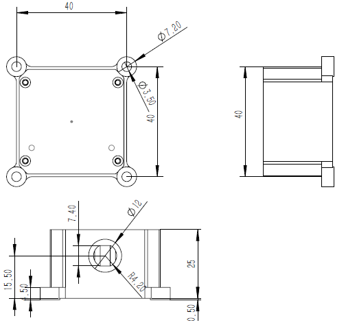

# CH110 用户手册

IMU/VRU姿态测量模块, Rev 1.0

[TOC]

## 简介

CH110是超核电子推出的一款超低成本、高性能、小体积、低延时的惯性测量单元(IMU)，本产品集成了三轴加速度计、三轴陀螺仪和一款微控制器。可输出经过传感器融合算法计算得到的基于当地地理坐标的三维方位数据，包含无绝对参考的相对航向角，俯仰角和横滚角。同时也可以输出校准过的原始的传感器数据。

典型应用:

* 机器人航向跟踪/无人驾驶等

## 特性

### 板载传感器
- 三轴陀螺仪, 最大量程: ±2000°/s 
- 三轴加速度计, 最大量程:±8G 
### 数据处理 
- 加速度和陀螺仪出厂前经过三轴非正交和标度因子校准
- 数据融合算法计算并输出地理坐标系下的旋转四元数及欧拉角等姿态信息
### 通讯接口及供电
- RS232串行接口/CAN2.0总线
- 供电电压：5-24V
### 其他
- PC端上位机程序，提供实时数据显示，波形，校准及excel 数据记录功能

- 多项模块参数用户可配置

## 硬件及尺寸

### 硬件参数

| 参数           | 描述                       |
| -------------- | -------------------------- |
| 输出数据接口   | RS232串行接口              |
| 工作电压       | 5-24V                      |
| 温度范围       | -20℃  - 85 ℃               |
| 最大线性加速度 | 0 - 115 $m/s^2$            |
| 尺寸           | 40 x 40 x 25mm (W x L x H) |
| 板载传感器     | 三轴加速度计 三轴陀螺仪    |

### 尺寸

### 接口定义

| 引脚号 | 序号 | 功能(RS232+CA)                 | 功能(RS485+CAN) |
| ------ | ------ | ------------------------------------- | ------ |
| 红    | 1 | Vin                         | Vin |
| 黑 | 2 | GND | GND |
| 蓝 | 3 | RS232 TX | 485 A |
| 灰 | 4 | RS232 RX | 485 B |
| 白 | 5 | 同步输出 | 同步输出 |
| 棕 | 6 | 同步输入 | 同步输入 |
| 绿 | 7 | CAN_H | CAN_H |
| 黄 | 8 | CAN_L | CAN_L |

## 性能指标

### 姿态角输出精度

| 姿态角                   | 典型值 |
| ------------------------ | ------ |
| 横滚角\俯仰角 - 静态误差 | 0.8°   |
| 横滚角\俯仰角 - 动态误差 | 2.5°   |
| 零偏稳定性               | 10°/h  |

### 陀螺仪

| 参数     | 值                  |
| -------- | ------------------- |
| 测量范围 | ±2000°/s            |
| 非线性度 | ±0.1% (25°最佳)     |
| 噪声密度 | 0.08°/s/$\sqrt{Hz}$ |
| 采样率   | 500Hz               |

### 加速度计

| 参数         | 值                        |
| ------------ | ------------------------- |
| 测量范围     | ±8G (1G = 1x 重力加速度 ) |
| 非线性度     | ±0.5% (25°最佳)           |
| 最大零点偏移 | 30mG                      |
| 噪声密度     | 250 $uG\sqrt{Hz}$         |
| 采样率       | 500Hz                     |

### 模块数据接口参数

| 参数           | 值               |
| -------------- | ---------------- |
| 串口输出波特率 | 9600/115200可选  |
| 帧输出速率     | 10/50/100Hz 可选 |

## 融合及校准算法
### 陀螺仪校准

每一个姿态传感器都单独进行过全测量范围内的校准和测试。陀螺和加速度计的非正交和刻度因子误差参数都会保存在模块内部的Flash中。陀螺仪自动校准需要在上电后静止模块3s 左右以获得最好的校准效果。如果上电静置短于规定时间，则模块陀螺仪零偏校准效果会下降。

姿态传感器内建陀螺零速检测机制，当检测到长时间内三轴陀螺速度均小于1°/s时，模块认为当前为静止状态，陀螺输出为零偏，此次模块会将此时的陀螺读数记录下来作为零偏补偿。所以 **本产品不能用于旋转速度<1°/s的运动场景。**(既旋转速度低于秒针平均转速的1/6)

