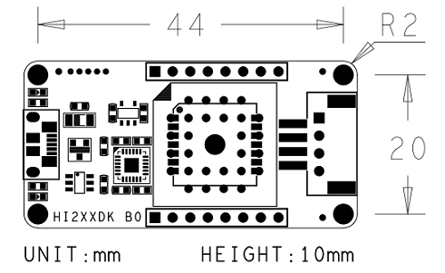

# HI226/HI229 用户手册
<p style="text-align: right;">IMU/VRU/AHRS姿态测量模块, Rev 1.0


<div style="page-break-after: always;"></div>
[TOC]

<div style="page-break-after: always;"></div>
## 简介

HI226是超核电子推出的一款超低成本、高性能、小体积、低延时的惯性测量单元(IMU)，本产品集成了三轴加速度计、三轴陀螺仪和一款微控制器。可输出经过传感器融合算法计算得到的基于当地地理坐标的三维方位数据，包含无绝对参考的相对航向角，俯仰角和横滚角。同时也可以输出校准过的原始的传感器数据。


典型应用:

* 扫地机/机器人航向跟踪/飞鼠/游戏控制器


HI229是超核电子推出的一款低成本、高性能、小体积、低延时的航姿参考单元（AHRS），本产品集成了三轴加速度计、三轴陀螺仪、三轴磁场传感器和一款微控制器。可输出经过传感器融合算法计算得到的基于当地地理坐标的三维方位数据，包含航向角，俯仰角和横滚角。同时也可以输出校准过的原始的传感器数据。本产品具有一定的室内地磁抗干扰性能，在一定强度的地磁场干扰环境下仍可正常工作。


典型应用:

- VR\动作捕捉
- 高动态环境下姿态测量\运动性能评估
- 无人机控制


## 特性

### 板载传感器
- 三轴陀螺仪, 最大量程: ±2000°/s 
- 三轴加速度计, 最大量程:±8G 
- 三轴磁场传感器，最大量程: 800mG (毫高斯)
### 数据处理 
- 加速度和陀螺仪出厂前经过三轴非正交和标度因子校准
- 数据融合算法计算并输出地理坐标系下的旋转四元数及欧拉角等姿态信息
### 通讯接口及供电
- 串口(兼容TTL 可直接与5V 或3.3V 串口设备连接)
- 供电电压：3.3 (+/- 100 mV)
- 最大峰值功耗：32mA
### 其他
- PC端上位机程序，提供实时数据显示，波形，校准及excel 数据记录功能

- 多项模块参数用户可配置

## 硬件及尺寸

### 硬件参数

| 参数           | 描述                                         |
| -------------- | -------------------------------------------- |
| 输出数据接口   | UART(TTL 1.8V - 3.3V)                        |
| 工作电压       | 3.3V (± 100mV)                               |
| 功耗           | 86mW @3.3V                                   |
| 温度范围       | -20℃  - 85 ℃                                 |
| 最大线性加速度 | 0 - 115 $m/s^2$                              |
| 尺寸           | 12 x 12 x 2.6mm (W x L x H)                  |
| 板载传感器     | 三轴加速度计 三轴陀螺仪 三轴磁场传感器(可选) |

### 尺寸


| 符号 | 最小值 | 典型值 | 最大值 | 单位 |
| ---- | ------ | ------ | ------ | ---- |
| A1   | -      | 11     | -      | mm   |
| B    | -      | 11     | -      | mm   |
| D    | -      | 12     | -      | mm   |
| E    | -      | 12     | -      | mm   |
| H    | 2.5    | 2.6    | 2.7    | mm   |
| a    | -      | 1.5    | -      | mm   |
| b    | -      | 0.9    | -      | mm   |
| c    | -      | 1      | -      | mm   |
| e    | -      | 1.27   | -      | mm   |
| f    | -      | 1      | -      | mm   |


### 引脚定义


| 引脚号 | 名称   | 说明                                  |
| ------ | ------ | ------------------------------------- |
| 5      | N/C | 保留                                  |
| 6      | VCC    | 电源 3.3V                             |
| 7      | SYNC_OUT | 数据输出同步:  数据输出时， 此引脚为高电平，空闲时为低电平。 |
| 8      | RXD    | 模块串口接收 UART RXD(接 MCU 的 TXD)  |
| 9      | TXD    | 模块串口发送 UART TXD (接 MCU 的 RXD) |
| 10     | SYNC_IN | 数据输入同步:  内部下拉，当模块检测到上升沿时, 输出一帧数据。最高同步频率为200Hz，且输出帧率不能超过当前串口波特率下总带宽。 |
| 11     | N/C    | 保留                                  |
| 19     | GND    | GND                                   |
| 20     | RST    | 复位, 内部上拉。>10uS 低电平复位模块。无需要外接阻容，建议接到MCU的GPIO引脚以实现软件复位 |
| 21     | N/C | 保留 |
| 22     | N/C | 保留 |
| 23     | N/C    | 保留                                  |
| 24     | GND | GND                                   |
| 25     | N/C    | 保留                                  |


## 性能指标

### 姿态角输出精度

| 姿态角                                      | 典型值 |
| ------------------------------------------- | ------ |
| 横滚角\俯仰角 - 静态误差                    | 0.8°   |
| 横滚角\俯仰角 - 动态误差                    | 2.5°   |
| 运动中航向角精度(9轴模式下,无磁干扰,校准后) | 3°     |

### 陀螺仪

| 参数         | 值                  |
| ------------ | ------------------- |
| 测量范围     | ±2000°/s            |
| 零偏稳定性   | 10°/h               |
| 刻度非线性度 | ±0.1%(满量程时)     |
| 噪声密度     | 0.08°/s/$\sqrt{Hz}$ |
| 加速度敏感性 | 0.001°/s/g          |

### 加速度计

| 参数       | 值                        |
| ---------- | ------------------------- |
| 测量范围   | ±8G (1G = 1x 重力加速度 ) |
| 零偏稳定性 | 30mG                      |
| 非线性度   | ±0.5% (满量程时)          |
| 噪声密度   | 120 $uG\sqrt{Hz}$         |

### 磁传感器参数

| 参数           | 值                          |
| -------------- | --------------------------- |
| 测量范围     | ±8G(Gauss) |
| 非线性度     | ±0.1%                             |
| 分辨率 | 0.25mG |

### 模块数据接口参数

| 参数           | 值                                 |
| -------------- | ---------------------------------- |
| 串口输出波特率 | 4800/9600/115200/460800/921600可选 |
| 帧输出速率     | 1/25/50/100/200Hz 可选             |

## 融合及校准算法
### 加速度陀螺仪校准

每一个姿态传感器都单独进行过全测量范围内的校准和测试。陀螺和加速度计的非正交和刻度因子误差参数都会保存在模块内部的Flash中。陀螺仪自动校准需要在上电后静止模块3s 左右以获得最好的校准效果。如果上电静置短于规定时间，则模块陀螺仪零偏校准效果会下降。


姿态传感器内建陀螺零速检测机制，当检测到长时间内三轴陀螺速度均小于1°/s时，模块认为当前为静止状态，陀螺输出为零偏，此次模块会将此时的陀螺读数记录下来作为零偏补偿。所以 **本产品不能用于旋转速度<1°/s的运动场景。**(既旋转速度低于秒针平均转速的1/6)


### 地磁校准

#### 磁干扰分类

| 种类                 | 定义                                         | 典型干扰源                                                   | 影响                                                         | 措施                                   |
| -------------------- | -------------------------------------------- | ------------------------------------------------------------ | ------------------------------------------------------------ | -------------------------------------- |
| 空间磁场干扰         | 干扰不随传感器运动而运动，而处于世界坐标系下 | 各种固定的磁干扰源，家具，家用电器，电缆，房屋内的钢筋结构等。一切不随磁传感器运动而运动的干扰源 | 无论磁场传感器是否校准的好，这些空间磁场的干扰(或者说环境磁场不均匀)都会使得空间地磁场发生畸变。地磁补偿会错误并且无法获得正确的航向角。他们是造成室内地磁融合难以使用的主要元凶。这种干扰不能被校准, 会严重影响地磁性能。空间磁场干扰在室内尤其严重。 | 模块内置的匀质磁场检测及屏蔽非匀质磁场 |
| 传感器坐标系下的干扰 | 干扰源随传感器运动而运动                     | 模块PCB，与模块固定在一起的板子，仪器设备，产品等。他们和磁传感器视为同一个刚体，随磁传感器运动而运动 | 对传感器造成硬磁/软磁干扰。这些干扰可以通过地磁校准算法加以很好的消除。 | 地磁校准                               |

下图是一个典型的室内磁场分布图。可以看到：一般室内环境的空间磁场畸变是比较严重的。


**Notes**

在室内环境下，空间磁场干扰尤其严重，而且空间磁干扰并不能通过校准来消除。在室内环境下，尽管模块内置均质磁场检测及屏蔽机制，但9轴模式航向角的准确度很大程度上取决于室内磁场畸变程度，如果室内磁场环境很差(如电脑机房旁，电磁实验室，车间 ，地下车库等等)，即使校准后， 9轴的航向角精度可能还不如6轴甚至会出现大角度误差。

#### 6轴和9轴模式区别

正因为地磁场非常容易受到空间干扰，所以使用9轴模式时应非常注意。下表列举了不同的使用场合和工况下的使用建议

| 模式    | 适用环境     | 典型应用                                                     | 优点                                                         | 缺点                                                         | 注意事项                         |
| ------- | ------------ | ------------------------------------------------------------ | ------------------------------------------------------------ | ------------------------------------------------------------ | -------------------------------- |
| 6轴模式 | 各种环境     | 云台等低动态姿态检测，室内机器人                             | 1. 姿态角输出稳定性好 2. 完全不受磁场干扰                    | 航向角随时间缓慢漂移                                         | 航向角会随时间缓慢飘移且无法补偿 |
| 9轴模式 | 无磁干扰环境 | 1.指南针，寻北系统 2. 空旷且磁干扰较少的室内，模块基本不会大范围在室内移动(典型的如摄影棚内动作捕捉，且被测者不会做大范围走动) | 1. 航向角不会随时间漂移 2.一旦检测到地磁场可快速修正航向角指北 | 任何磁干扰都会出现航向角准确度下降。室内干扰严重情况下 航向角无法指向正确方向。另外，移动机器人的金属结构和电机运行时会产生非常强的磁干扰，所以移动机器人平台不适用于9轴模式。 | 首次使用前需要校准地磁传感器     |


模块的自动地磁校准系统只能处理和模块安装在一起的，固定的磁场干扰。安装环境如果有磁场干扰，这种干扰必须是固定的，并且这个干扰磁场与模块 安装之后不会再发生距离变化(例：模块安装在一个铁材料之上，因为铁会有磁场干扰， 这时就需要把铁与模块一起旋转校准，并且这个铁在使用当中是不会和罗盘再分开的(发生相对位移)，一 旦分开是需要再重新校准。如果这个铁大小是不固定的，或与罗盘的距离变化也不是固定 的，这种干扰是无法校准，即使校准成功，也会精度非常差，只能避而远之安装。安全距离控制在 40CM 以上)。

#### 校准方法

本模块集成了主动无干预地磁校准算法,模块会自动收集地磁场信息并进行硬磁软磁校准参数估计，校准成功后校准信息会保存在模块Flash上。**用户无须任何操作/指令即可实现地磁校准**。首次使用时，模块会自动采集周围地磁场，并尝试计算地磁传感器校准参数。当首次使用模块并且需要使用9轴模式时，应进行如下校准操作：


在尽量小范围内，缓慢的让模块运动和旋转，或者进行8字运动 或者分别绕每个轴360度，让模块经历尽量多的姿态。一般情况下，如果地磁干扰在可接受的范围内，即可完成校准。如果后面在同样地磁环境下(同地点)，则无需再次校准。如果始终没能成功校准模块，说明周围地磁场干扰比较大。


地磁校准状态可以使用AT指令来查看：

发送`AT+INFO=HSI` 指令，模块会打印当前地磁校准系统状态：


| 参数显示    | 意义       | 说明                                                         |
| ----------- | ---------- | ------------------------------------------------------------ |
| valid       | 有效标志   | 0: 不存在有效校准参数(没有校准或者从来没有校准成功过)。非0：地磁校准完成 |
| fiterr      | 拟合残差   | 残差越小，说明参数拟合效果越好，通常在0.03以下说明校准结果已经足够好。如果拟合结果始终>0.1，说明地磁干扰很大，最好再次校准以期得到更好的校准结果。拟合残差会随着时间缓慢增长。 |
| flux        | 当地磁场   | 最近一次拟合器估计出的地磁场强 ，单位为uT                    |
| inclination | 当地磁倾角 | 最近一次拟合器估计出的磁倾角，单位为°                        |


* 虽然地磁参数估计可以在线自动采集数据，自动的动态拟合地磁校准参数。但是如果周围地磁环境改变(比如需要到另外房间或者室内室外切换)，最好还需重复手工校准操作。


## 安装及焊接

1. 安装位置请远离PCB容易形变点，尽量远离PCB边缘(>30mm)，远离PCB定位螺丝孔(>10mm)等。

   

2. 安装位置请远离强磁设备，如电机，喇叭等强磁器件。

3. 由于MEMS传感器对PCB板应力非常敏感, **建议手工焊接模块，不使用回流焊焊接模块，否则会对传感器性能造成影响**。如果必须使用回流焊，则应注意：用印刷刮板在网板上印刷锡膏，使锡膏通过网板开口漏印到PCB上。为保证回流焊接质量，推荐焊盘部分对应的钢网厚度为0.18mm。

4. 组装好的PCB不得使用超声波清洁仪进行清洁。

5. 本产品不可使用塑封或喷涂三防漆，喷漆或塑封会造成传感器应力改变进而影响性能。

   

6. 推荐回流焊的炉温曲线图如下：


参考: https://ae-bst.resource.bosch.com/media/_tech/media/application_notes/BST-MAS-HS000.pdf


## 参考系定义

本产品采用右手(RH, Right-Hand)坐标系。输出的四元数及欧拉角为  传感器坐标系 到 惯性坐标系(世界坐标系) 的旋转。其中欧拉角旋转顺序为 ZYX(先转Z轴，再转Y轴，最后转X轴)旋转顺序，欧拉角具体定义如下：

- 绕 Z 轴方向旋转: 航向角\Yaw\phi($\psi$) 范围: -180° - 180°
- 绕 Y 轴方向旋转: 俯仰角\Pitch\theta($\theta$) 范围: -90°-90°
- 绕 X 轴方向旋转:横滚角\Roll\psi(  $\phi$)范围: -180°-180°

本产品使用北西天(North-West-Up  NWU) 坐标系统，即视为模块的地理坐标系(世界坐标系)定义如下：

- X 轴正方向指向北
- Y 轴正方向指向西
- Z 轴正方向指向天

当采用 NWU 系时，如果将模块视为飞行器的话。X 轴应视为机头方向。当传感器系与惯性系重合时，欧拉角的理想输出为:Pitch = 0°, Roll = 0°, Yaw = 0°

## 使用指南


### 模块与PC机连接

建议使用评估板与PC机进行连接，评估板板载USB供电及USB转串口功能，可以方便的配合PC机上的评估软件进行性能测试。具体请参见附录中的评估板一节。

### 模块与MCU进行连接

模块与MCU通过TTL电平的串口进行连接，建议模块的RST引脚建议接到MCU的GPIO上。方便MCU强制复位模块。


**注意**


1. 如不使用同步输入(SYNC_IN) 和同步输出功能(SYNC_OUT) 可不接SYNC_IN 和 SYNC_OUT。
2. 120欧电阻的作用是为了方便调试，并且防止MCU和模块电平不匹配，可以去掉，建议保留。
3. VCC的电压范围具体参加手册说明
4. 模块内置上电复位电路，RST可以不接，但是建议接到主机一个GPIO上以实现软件复位。


## 串口通讯协议

模块上电后，模块默认按100Hz (出厂默认输出速率) 输出帧数据，帧格式如下：


其中：

| 域      | 值    | 长度(字节) | 说明                                                         |
| ------- | ----- | ---------- | ------------------------------------------------------------ |
| PRE     | 0x5A  | 1          | 固定为0x5A                                                   |
| TYPE    | 0xA5  | 1          | 固定为0xA5                                                   |
| LEN     | 1-512 | 2          | 帧中数据域的长度。LSB(低字节在前)，长度表示数据域的长度，不包含`PRE`,`TYPE`,`LEN`,`CRC` 字段。 |
| CRC     | -     | 2          | 除CRC 本身外其余所有帧数据的16 位CRC 校验和。LSB(低字节在前) |
| PAYLOAD | -     | 1-512      | 一帧携带的数据。PAYLOAD 由若干个**子数据包**组成。每个数据包 包含：数据包标签(DATA_ID)和数据(DATA) 两部分。DATA_ID决定了数据的类型及长度，DATA 为数据包内容。 |


CRC实现函数：

```
/*
	currectCrc: previous crc value, set 0 if it's first section
	src: source stream data
	lengthInBytes: length
*/
static void crc16_update(uint16_t *currectCrc, const uint8_t *src, uint32_t lengthInBytes)
{
    uint32_t crc = *currectCrc;
    uint32_t j;
    for (j=0; j < lengthInBytes; ++j)
    {
        uint32_t i;
        uint32_t byte = src[j];
        crc ^= byte << 8;
        for (i = 0; i < 8; ++i)
        {
            uint32_t temp = crc << 1;
            if (crc & 0x8000)
            {
                temp ^= 0x1021;
            }
            crc = temp;
        }
    } 
    *currectCrc = crc;
}
```


## 数据包

#### 数据包总览

| 数据包标签(DATA_ID) | 数据包长度(包含标签1字节) | 名称                | 备注     |
| ------------------- | ------------------------- | ------------------- | -------- |
| 0x90                | 2                         | 用户ID              |          |
| 0xA0                | 7                         | 加速度              |          |
| 0xB0                | 7                         | 角速度              |          |
| 0xC0                | 7                         | 磁场强度            |          |
| 0xD0                | 7                         | 欧拉角              |          |
| 0xD1                | 17                        | 四元数              |          |
| 0xF0                | 5                         | 气压                | 输出0    |
| 0x91                | 76                        | IMUSOL(IMU数据集合) | 推荐使用 |

#### 产品支持数据包列表

下表列出所有产品支持的数据包, ***** 表示支持 **-**表示不支持

| 产品  | 90   | A0   | B0   | C0   | D0   | D1   | F0   | 91   |
| ----- | :--- | :--- | :--- | ---- | ---- | ---- | ---- | ---- |
| HI226 | *    | *    | *    | *    | *    | *    | -    | *    |
| HI229 | *    | *    | *    | *    | *    | *    | -    | *    |
| CH110 | -    | -    | -    | -    | -    | -    | -    | *    |


#### 0x90(用户ID)

共2字节，用户设置的ID。

| 字节偏移 | 类型    | 大小 | 单位 | 说明            |
| -------- | ------- | ---- | ---- | --------------- |
| 0        | uint8_t | 1    | -    | 数据包标签:0x90 |
| 1        | uint8_t | 1    | -    | 用户ID          |

#### 0xA0(加速度)

共7 个字节，LSB。输出传感器的原始加速度

| 字节偏移 | 类型    | 大小 | 单位                     | 说明            |
| -------- | ------- | ---- | ------------------------ | --------------- |
| 0        | uint8_t | 1    | -                        | 数据包标签:0xA0 |
| 1        | int16_t | 2    | 0.001G(1G = 1重力加速度) | X轴加速度       |
| 3        | int16_t | 2    | 0.001G                   | Y轴加速度       |
| 5        | int16_t | 2    | 0.001G                   | Z轴加速度       |

#### 0xB0(角速度)

共7字节，LSB。输出传感器的原始角速度

| 字节偏移 | 类型    | 大小 | 单位   | 说明             |
| -------- | ------- | ---- | ------ | ---------------- |
| 0        | uint8_t | 1    | -      | 数据包标签：0xB0 |
| 1        | int16_t | 2    | 0.1°/s | X轴角速度        |
| 3        | int16_t | 2    | 0.1°/s | Y轴角速度        |
| 5        | int16_t | 2    | 0.1°/s | Z轴角速度        |

#### 0xC0(磁场强度)

共7字节，LSB。输出传感器的原始磁场强度

| 字节偏移 | 类型    | 大小 | 单位       | 说明            |
| -------- | ------- | ---- | ---------- | --------------- |
| 0        | uint8_t | 1    | -          | 数据包标签:0xC0 |
| 1        | int16_t | 2    | 0.001Gauss | X轴磁场强度     |
| 3        | int16_t | 2    | 0.001Gauss | Y轴磁场强度     |
| 5        | int16_t | 2    | 0.001Gauss | Z轴磁场强度     |

#### 0xD0(欧拉角)

共7字节，LSB。格式为int16，共三个轴，每个轴占2 个字节，顺序为Pitch/Roll/Yaw。接收到Roll, Pitch 为物理值乘以100 后得到的数值，Yaw 为乘以10 得到的数值。

例：当接收到的Yaw = 100 时，表示航向角为10°

| 字节偏移 | 类型    | 大小 | 单位  | 说明            |
| -------- | ------- | ---- | ----- | --------------- |
| 0        | uint8_t | 1    | -     | 数据包标签:0xD0 |
| 1        | int16_t | 2    | 0.01° | Pitch(俯仰角)   |
| 3        | int16_t | 2    | 0.01° | Roll(横滚角)    |
| 5        | int16_t | 2    | 0.1°  | Yaw(航向角)     |

#### 0XD1(四元数)

共17字节，格式为float，共4个值，顺序为:W X Y Z.。每个值占4 字节(float)，整个四元数为4个float，LSB。

| 字节偏移 | 类型    | 大小 | 单位 | 说明            |
| -------- | ------- | ---- | ---- | --------------- |
| 0        | uint8_t | 1    | -    | 数据包标签:0xD1 |
| 1        | float   | 4    | -    | W               |
| 5        | float   | 4    | -    | X               |
| 9        | float   | 4    | -    | Y               |
| 13       | float   | 4    | -    | Z               |

#### 0XF0(气压)

共5字节，格式为float。(只针对有气压传感器的产品)

| 字节偏移 | 类型    | 大小 | 单位 | 说明            |
| -------- | ------- | ---- | ---- | --------------- |
| 0        | uint8_t | 1    | -    | 数据包标签:0xF0 |
| 1        | float   | 4    | Pa   | 大气压          |

#### 0X91( IMUSOL)

共76字节，新加入的数据包，用于替代A0,B0,C0,D0,D1等数据包。集成了IMU的传感器原始输出和姿态解算数据。

| 字节偏移 | 类型     | 大小 | 单位                 | 说明                                                         |
| -------- | -------- | ---- | -------------------- | ------------------------------------------------------------ |
| 0        | uint8_t  | 1    | -                    | 数据包标签:0x91                                              |
| 1        | uint8_t  | 1    | -                    | ID                                                           |
| 2        | -        | 6    | -                    | 保留                                                         |
| 8        | uint32_t | 4    | ms                   | 时间戳信息，从系统开机开始累加，每毫秒增加1                  |
| 12       | float    | 12   | 1G(1G = 1重力加速度) | X,Y,Z轴的加速度，注意单位和0xA0不同                          |
| 24       | float    | 12   | deg/s                | X,Y,Z轴的角速度，注意单位和0xB0不同                          |
| 36       | float    | 12   | uT                   | X,Y,Z轴的磁场强度(HI229支持,注意单位和0xC0不同)              |
| 48       | float    | 12   | deg                  | 节点欧拉角集合, 顺序为：横滚角(Roll)，俯仰角(Pitch)，航向角(Yaw)(注意顺序和单位与0xD0数据包不同) |
| 60       | float    | 16   | -                    | 节点四元数集合,顺序为WXYZ                                    |


### 出厂默认数据包

出厂默认一帧中携带数据包数据定义如下：

| 产品  | 默认输出数据包    |
| ----- | ----------------- |
| HI226 | 90,A0,B0,C0,D0,F0 |
| HI229 | 90,A0,B0,C0,D0,F0 |
| CH110 | 90,A0,B0,C0,D0,F0 |

### 数据帧结构示例

#### 数据帧配置为 `0x90,0xA0,0xB0,0xC0,0xD0,0xF0` 数据包

使用串口助手采样一帧数据,共41字节, 前6字节为帧头, 长度和CRC校验值。剩余35字节为数据域。假设数据接收到C语言数组`buf`中。如下所示:

5A A5 23 00 FD 61 **90** 00 **A0** 55 02 3D 01 E2 02 **B0** FE FF 17 00 44 00 **C0** 80 FF 60 FF 32 FF **D0** 64 F2 6C 0E BB 01 **F0** 00 00 00 00

* 第一步：判断帧头，得到数据域长度和帧CRC：

帧头:`5A` `A5`

帧数据域长度:`23` `00`: (0x00<<8) + 0x23 = 35

帧CRC校验值:`FD` `61`:(0x61<<8) + 0xFD = 0x61FD

* 第二步： 校验CRC

```
    uint16_t payload_len;
    uint16_t crc;
    
    crc = 0;
    payload_len = buf[2] + (buf[3] << 8);
    
    /* calulate 5A A5 and LEN filed crc */
    crc16_update(&crc, buf, 4);
    
    /* calulate payload crc */
    crc16_update(&crc, buf + 6, payload_len);
```

得到CRC值为0x61FD, 与帧携带的CRC值相同, 帧CRC校验通过。

* 第三步：接收数据

`90 00`：ID 数据包, 0x90为数据包标签, ID = 0x00.

`A0 55 02 3D 01 E2 02`:加速度数据包,0xA0为数据包标签，三轴加速度为：

X轴加速度=  (int16_t)((0x02<<8)+ 0x55) = 597(单位为mG)

Y轴加速度 = (int16_t)((0x01<<8)+ 0x3D) = 317

Z轴加速度= (int16_t)((0x02<<8)+ 0xE2) = 738

`B0 FE FF 17 00 44 00` :角速度数据包,0xB0为数据包标签，三轴角速度为：

X轴角速度=  (int16_t)((0xFF<<8)+ 0xFE) = -2(单位为0.1°/s)

Y轴角速度 = (int16_t)((0x00<<8)+ 0x17) = 23

Z轴角速度= (int16_t)((0x00<<8)+ 0x44) = 68

`C0 80 FF 60 FF 32 FF` :磁场数据包,0xC0为数据包标签，三轴磁场为：

X轴角速度=  (int16_t)((0xFF<<8)+ 0x80) = -128 (单位为0.001Gauss)

Y轴角速度 = (int16_t)((0xFF<<8)+ 0x60) =  -160

Z轴角速度= (int16_t)((0xFF<<8)+ 0x32) =  -206

`D0 64 F2 6C 0E BB 01` 欧拉角数据包, 0xD0为数据包标签

Pitch= (int16_t)((0xF2<<8)+ 0x64) / 100 = -3484 / 100 = -34.84 ° 

Roll= (int16_t)((0x0E<<8)+ 0x6C) / 100 =  3692 / 100 = 36.92°

Yaw = (int16_t)((0x01<<8)+ 0xBB) / 10 =  443 /10 = 44.3°

`F0 00 00 00 00`气压数据包，0xF0为数据包标签

```
float prs;
prs = memcpy(&prs, &buf[37], 4);
```

最后得到结果：

```
id              : 0
acc(G)          :    0.597    0.317    0.738
gyr(deg/s)      :   -0.200    2.300    6.800
mag(uT)         :  -12.800  -16.000  -20.600
eul(R/P/Y)      :   36.920  -34.840   44.300
```


#### 数据帧配置为 `0x91` 数据包

使用串口助手采样一帧数据,共82字节, 前6字节为帧头, 长度和CRC校验值。剩余76字节为数据域。假设数据接收到C语言数组`buf`中。如下所示:

5A A5 4C 00 6C 51 **91** 00 A0 3B 01 A8 02 97 BD BB 04 00 9C A0 65 3E A2 26 45 3F 5C E7 30 3F E2 D4 5A C2 E5 9D A0 C1 EB 23 EE C2 78 77 99 41 AB AA D1 C1 AB 2A 0A C2 8D E1 42 42 8F 1D A8 C1 1E 0C 36 C2 E6 E5 5A 3F C1 94 9E 3E B8 C0 9E BE BE DF 8D BE

* 第一步：判断帧头，得到数据域长度和帧CRC：

帧头:`5A` `A5`

帧数据域长度:`4C` `00`: (0x00<<8) + 0x4C = 76

帧CRC校验值:`6C` `51`:(0x51<<8) + 0x6C = 0x516C

* 第二步： 校验CRC

```
    uint16_t payload_len;
    uint16_t crc;
    
    crc = 0;
    payload_len = buf[2] + (buf[3] << 8);
    
    /* calulate 5A A5 and LEN filed crc */
    crc16_update(&crc, buf, 4);
    
    /* calulate payload crc */
    crc16_update(&crc, buf + 6, payload_len);
```

得到CRC值为0x516C. 帧CRC校验通过。

* 第三步：接收数据

从`0x91`开始为数据包的数据域。在C语言中可以定义结构体来方便的读取数据：

定义0x91数据包结构体如下：

```
__packed typedef struct
{
    uint8_t     tag;                /* data packet tag */
    uint8_t     id;
    uint8_t     rev[6];             /* reserved */
    uint32_t    ts;                 /* timestamp */
    float       acc[3];
    float       gyr[3];
    float       mag[3];
    float       eul[3];             /* eular angles: Roll,Pitch,Yaw */
    float       quat[4];            /* quaternion */
}id0x91_t;
```

`__packed` 为编译器关键字(Keil下)，表示结构体按字节紧对齐，结构体每一个元素一一对应0x91数据包的结构定义。接收数据时将接收到的数组直接memcpy到结构体即可：(注意定义结构体时必须4字节对齐), 其中`buf `指向帧头, `buf[6]`指向帧中数据域 。

```
    /* 接收数据并使用0x91数据包结构定义来解释数据 */
    __align(4) id0x91_t dat;    /* struct must be 4 byte aligned */
    memcpy(&dat, &buf[6], sizeof(id0x91_t));
```

最后得到dat数据结果：

```
id              : 0
timestamp       : 310205
acc             :    0.224    0.770    0.691
gyr             :  -54.708  -20.077 -119.070
mag             :   19.183  -26.208  -34.542
eul(R/P/Y)      :   48.720  -21.014  -45.512
quat            :    0.855    0.310   -0.310   -0.277
```


## AT指令

当使用串口与模块通讯时, 模块支持AT 指令集配置/查看模块参数。AT 指令总以ASCII 码`AT` 开头，后面跟控制字符，最
后以回车换行`\r\n`结束。可使用串口调试助手进行测试：


通用模块 AT指令如下

| 指令      | 功能                   | 掉电保存(Y) | 立即生效(Y),复位生效(R) |
| --------- | ---------------------- | ----------- | ----------------------- |
| AT+ID     | 设置模块用户ID         | Y           | R                       |
| AT+URFR   | 旋转模块传感器坐标系   | Y           | R                       |
| AT+INFO   | 打印模块信息           | N           | Y                       |
| AT+ODR    | 设置模块串口输出帧频率 | Y           | R                       |
| AT+BAUD   | 设置串口波特率         | Y           | R                       |
| AT+EOUT   | 数据输出开关           | N           | Y                       |
| AT+RST    | 复位模块               | N           | Y                       |
| AT+TRG    | 单次输出触发           | N           | Y                       |
| AT+SETPEL | 设置输出数据包         | Y           | Y                       |
| AT+MODE   | 设置模块工作模式       | Y           | R                       |
| AT+GWID   | 设置无线网关ID         | Y           | R                       |
| AT+GWCFG  | 设置接收机无线网络属性 | Y           | R                       |


#### 产品支持数据包列表

下表列出所有产品支持的数据包, ***** 表示支持 **-**表示不支持

| 产品    | ID   | URFR | INFO | ODR  | BAUD | EOUT | RST  | TRG  | SETPTL | MODE | GWID | GWCFG |
| ------- | :--- | :--- | :--- | ---- | ---- | ---- | ---- | ---- | ------ | ---- | ---- | ----- |
| HI226   | *    | *    | *    | *    | *    | *    | *    | *    | *      | -    | -    | -     |
| HI229   | *    | *    | *    | *    | *    | *    | *    | *    | *      | *    | -    | -     |
| CH110   | *    | *    | *    | *    | *    | *    | *    | -    | *      | -    | -    | -     |
| HI221   | *    | *    | *    | *    | *    | *    | *    | -    | -      | -    | *    | -     |
| HI221GW | *    | *    | *    | *    | *    | *    | *    | -    | -      | -    | *    | *     |


##### AT+ID

设置模块用户ID

**例** `AT+ID=1`


##### AT+URFR

某些情况下传感器需要倾斜垂直安装，这时候需要旋转传感器坐标系，这条指令提供了旋转传感器坐标系的接口：

`AT+URFR=C00,C01,C02,C10,C11,C12,C20,C21,C22` 

其中  $C_{nn}$  支持浮点数 

$$
\left\{\begin{array}{l}{X} \\ {Y} \\ {Z}\end{array}\right\}_{U}=\left[\begin{array}{lll}{C 00} & {C 01} & {C 02} \\ {C 10} & {C 11} & {C 12} \\ {C 20} & {C 21} & {C 22}\end{array}\right] \cdot\left\{\begin{array}{l}{X} \\ {Y} \\ {Z}\end{array}\right\}_{B}
$$


其中$\left\{\begin{array}{l}{X} \\ {Y} \\ {Z}\end{array}\right\}_{U}$为旋转后的 传感器坐标系下 传感器数据，$\left\{\begin{array}{l}{X} \\ {Y} \\ {Z}\end{array}\right\}_{B}$为旋转前 传感器坐标系下 传感器数据


下面是几种常用旋转举例：

- 新传感器坐标系为 绕原坐标系X轴 旋转 90°， 输入命令：`AT+URFR=1,0,0,0,0,1,0,-1,0`

- 新传感器坐标系为 绕原坐标系X轴 旋转-90°， 输入命令：`AT+URFR=1,0,0,0,0,-1,0,1,0`

- 新传感器坐标系为 绕原坐标系X轴 旋转180°， 输入命令：`AT+URFR=1,0,0,0,-1,0,0,0,-1`

- 新传感器坐标系为 绕原坐标系Y轴 旋转 90°， 输入命令：`AT+URFR= 0,0,-1,0,1,0,1,0,0`

- 新传感器坐标系为 绕原坐标系Y轴 旋转-90°， 输入命令：`AT+URFR= 0,0,1,0,1,0,-1,0,0`

- 新传感器坐标系为 绕原坐标系Y轴 旋转180°， 输入命令：`AT+URFR= -1,0,0,0,1,0,0,0,-1`

- 恢复默认值：`AT+URFR=1,0,0,0,1,0,0,0,1`

  

##### AT+INFO

打印模块信息，包括产品型号，版本，固件发布日期等。AT+INFO可以拓展二级指令实现更多信息的查询

| INFO二级拓展指令 | 功能                 | 示例        |
| ---------------- | -------------------- | ----------- |
| CAL              | 显示模块内部校准参数 | AT+INFO=CAL |
| RF               | 显示无线设备参数     | AT+INFO=RF  |
| VER              | 显示详细版本信息     | AT+INFO=VER |


##### AT+ODR

设置模块串口输出速率。 掉电保存，复位模块生效

**例** 设置串口输出速率为100Hz:  `AT+ODR=100` 

##### AT+BAUD

设置串口波特率，可选值：4800/9600/115200/256000/460800`

**例**  `AT+BAUD=115200`

!!! note "注意"

- 使用此指令需要特别注意，输入错误波特率后可能会导致无法和模块通讯
- 波特率参数设置好后掉电保存，复位模块生效。上位机的波特率也要做相应修改。
- 升级固件时，需要切换回115200 波特率。

##### AT+EOUT

串口输出开关

**例** 打开串口输出 `AT+EOUT=1`   关闭串口输出 `AT+EOUT=0`

##### AT+RST

复位模块

**例** `AT+RST`

##### AT+TRG

触发模块输出一帧数据，可以配合AT+ODR=0来实现单次触发输出。

**例** `AT+TRG`

##### AT+SETPEL

设置输出协议:

模块数据帧中的数据包组成可使用AT指令配置，格式为`AT+SETPTL=<ITEM_ID>,<ITEM_ID>...`
一帧输出可包含最多8个数据包。

**例** 配置模块输出加速度，角速度, 整形格式欧拉角和四元数的指令为：`AT+SETPTL=A0,B1,D0,D1`


##### AT+MODE

设置模块工作模式

**例** 

* 设置模块工作在6轴模式(无磁校准)  `AT+MODE=0`
* 设置模块工作在9轴模式(地磁场传感器参与航向角校正)  `AT+MODE=1`


##### AT+GWID

可通过AT+GWID指令配置，GWID属性决定了接收器和节点的RF频率，只有节点的GWID 和接收器的 GWID相同时，模块和接收器直接才能通讯。GWID相当于无线网段，当在同一地点使用多个接收机组成多个星形网络时，必须保证每个接收器的GWID(网段)不同。


**例** 将一个接收器设置为GWID=3， 并将3个模块的自身ID设置为 0,1,2 并连接到这个接收器上：


接收机配置：

`AT+GWID=3`


节点0配置： 

`AT+GWID=3`  

`AT+ID=0`


节点1配置：

 `AT+GWID=3`  

`AT+ID=1`


节点2配置：

 `AT+GWID=3` 

 `AT+ID=2`

最后所有接收机节点复位/重新上电生效。

##### AT+GWCFG

配置接收机支持的节点数和无线通讯频率。接收机默认支持8个节点，每个节点100Hz通讯频率。(通讯频率乘以节点)的乘积受到RF带宽的限制，错误的配置将会导致无法输出数据。推荐的配置如下：

| 配置选项    | 通讯频率(Hz,每个节点) | 支持的节点数 |
| ----------- | --------------------- | ------------ |
| 1(出厂默认) | 100                   | 8            |
| 2           | 200                   | 4            |
| 3           | 30                    | 16           |

**例** 配置接收机支持的最大节点数为16，每个节点接收频率为30Hz，依次输入:

`AT+GWCFG=FRQ,30`

`AT+GWCFG=CNT,16`


## 附录A - 评估板


### 评估板简介

评估板提供了快速评估本产品的方法。板载USB-UART芯片(CP2104)以及供电LDO，并将模块接口引出方便调试评估。

安装资料包中的CP2104 USB-UART 驱动程序, 将USB线连接电脑和模块，打开资料包中的Uranus 上位机，连接串口，默认状态下，模块会以115200-N-8-N-1 输出出厂默认的数据包。


### 尺寸




### 从评估板上取下产品

模块默认被嵌入评估板的PLCC28 插槽中，如需取出模块，请按如下步骤操作：
- 断电，准备好细螺丝刀或镊子
- 从PLCC 插座或者背面圆形空洞内将模块撬出或顶出。

 

**注意**

- 评估板的主要作用仅仅是快速评估模块性能, USB 接口本身不适合于工业级场景或者高运动场合的电气连接，如果您的应用为高运动环境(动作捕捉等)，则不建议在您的产品中直接使用评估板。


## 附录C - 固件升级与恢复出厂设置


本产品支持升级固件。
固件升级步骤:

- 连接模块，打开上位机，将模块和上位机波特率都设置为115200. 打开固件升级窗口
- 点击连接按钮，如出现模块连接信息。则说明升级系统准备就绪，点击文件选择器(…)选择拓
  展名为.hex 的固件，然后点击开始编程。下载完成后会提示编程完成，此时关闭串口，
  重新给模块上电，模块升级完成。


