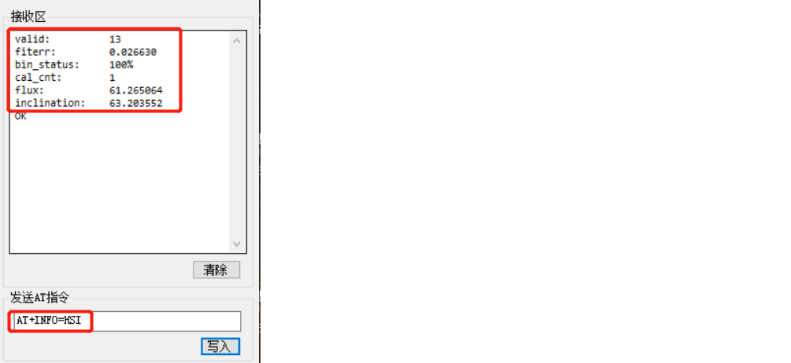

# HI226/HI229 用户手册

IMU/VRU/AHRS姿态测量模块, Rev A1

[TOC]

## 简介

HI226是超核电子推出的一款超低成本、高性能、小体积、低延时的惯性测量单元(IMU)，本产品集成了三轴加速度计、三轴陀螺仪和一款微控制器。可输出经过传感器融合算法计算得到的基于当地地理坐标的三维方位数据，包含无绝对参考的相对航向角，俯仰角和横滚角。同时也可以输出校准过的原始的传感器数据。

典型应用:

* 扫地机/机器人航向跟踪/飞鼠/游戏控制器

HI229是超核电子推出的一款低成本、高性能、小体积、低延时的航姿参考单元（AHRS），本产品集成了三轴加速度计、三轴陀螺仪、三轴磁场传感器和一款微控制器。可输出经过传感器融合算法计算得到的基于当地地理坐标的三维方位数据，包含航向角，俯仰角和横滚角。同时也可以输出校准过的原始的传感器数据。本产品具有一定的室内地磁抗干扰性能，在一定强度的地磁场干扰环境下仍可正常工作。

典型应用:

- VR\动作捕捉
- 高动态环境下姿态测量\运动性能评估
- 无人机控制

## 特性

### 板载传感器
- 三轴陀螺仪, 最大量程: ±2000°/s 
- 三轴加速度计, 最大量程:±8G 
- 三轴磁场传感器，最大量程: 800mG (毫高斯)
### 数据处理 
- 加速度和陀螺仪出厂前经过三轴非正交和标度因子校准
- 数据融合算法计算并输出地理坐标系下的旋转四元数及欧拉角等姿态信息
### 通讯接口及供电
- 串口(兼容TTL 可直接与5V 或3.3V 串口设备连接)
- 供电电压：3.3 (+/- 100 mV)
- 最大峰值功耗：32mA
### 其他
- PC端上位机程序，提供实时数据显示，波形，校准及excel 数据记录功能

- 多项模块参数用户可配置

## 硬件及尺寸

### 硬件参数

| 参数           | 描述                                          |
| -------------- | --------------------------------------------- |
| 输出数据接口   | UART(TTL 1.8V - 3.3V)                         |
| 工作电压       | 3.3V (± 100mV)                                |
| 功耗           | 86mW @3.3V                                    |
| 温度范围       | -20℃  - 85 ℃                                  |
| 最大线性加速度 | 0 - 115 $m/s^2$                               |
| 尺寸           | 12 x 12 x 2.6mm (W x L x H)                   |
| 板载传感器     | 三轴加速度计 三轴陀螺仪 三轴磁场传感器(HI229) |

### 尺寸

| 符号 | 最小值 | 典型值 | 最大值 | 单位 |
| ---- | ------ | ------ | ------ | ---- |
| A1   | -      | 11     | -      | mm   |
| B    | -      | 11     | -      | mm   |
| D    | -      | 12     | -      | mm   |
| E    | -      | 12     | -      | mm   |
| H    | 2.5    | 2.6    | 2.7    | mm   |
| a    | -      | 1.5    | -      | mm   |
| b    | -      | 0.9    | -      | mm   |
| c    | -      | 1      | -      | mm   |
| e    | -      | 1.27   | -      | mm   |
| f    | -      | 1      | -      | mm   |

### 引脚定义

| 引脚号 | 名称   | 说明                                  |
| ------ | ------ | ------------------------------------- |
| 5      | N/C | 保留                                  |
| 6      | VCC    | 电源 3.3V                             |
| 7      | SYNC_OUT | 数据输出同步:  数据输出时， 此引脚为高电平，空闲时为低电平。 |
| 8      | RXD    | 模块串口接收 UART RXD(接 MCU 的 TXD)  |
| 9      | TXD    | 模块串口发送 UART TXD (接 MCU 的 RXD) |
| 10     | SYNC_IN | 数据输入同步:  内部下拉，当模块检测到上升沿时, 输出一帧数据。最高同步频率为200Hz，且输出帧率不能超过当前串口波特率下总带宽。 |
| 11     | N/C    | 保留                                  |
| 19     | GND    | GND                                   |
| 20     | RST    | 复位, 内部上拉。>10uS 低电平复位模块。无需要外接阻容，建议接到MCU的GPIO引脚以实现软件复位 |
| 21     | N/C | 保留 |
| 22     | N/C | 保留 |
| 23     | N/C    | 保留                                  |
| 24     | GND | GND                                   |
| 25     | N/C    | 保留                                  |

## 性能指标

### 姿态角输出精度

| 姿态角                                          | 典型值 |
| ----------------------------------------------- | ------ |
| 横滚角\俯仰角 - 静态误差                        | 0.8°   |
| 横滚角\俯仰角 - 动态误差                        | 2.5°   |
| 零偏稳定性                                      | 10°/h  |
| 运动中航向角精度(9轴模式下,无磁干扰,地磁校准后) | 3°     |

### 陀螺仪

| 参数     | 值                  |
| -------- | ------------------- |
| 测量范围 | ±2000°/s            |
| 非线性度 | ±0.1% (25°最佳)     |
| 噪声密度 | 0.08°/s/$\sqrt{Hz}$ |
| 采样率   | 2000Hz              |

### 加速度计

| 参数         | 值                        |
| ------------ | ------------------------- |
| 测量范围     | ±8G (1G = 1x 重力加速度 ) |
| 非线性度     | ±0.5% (25°最佳)           |
| 最大零点偏移 | 10mG                      |
| 噪声密度     | 250 $uG\sqrt{Hz}$         |
| 采样率       | 500Hz                     |

### 磁传感器参数

| 参数           | 值                          |
| -------------- | --------------------------- |
| 测量范围     | ±8Gauss |
| 非线性度     | ±0.1%                             |
| 采样率       | 100Hz                                      |

### 模块数据接口参数

| 参数           | 值                                  |
| -------------- | ----------------------------------- |
| 串口输出波特率 | 4800/9600/115200/460800可选         |
| 帧输出速率     | 0/1/10/25/50/100/200/400/500Hz 可选 |

## 融合及校准算法
### 陀螺仪校准

每一个姿态传感器都单独进行过全测量范围内的校准和测试。陀螺和加速度计的非正交和刻度因子误差参数都会保存在模块内部的Flash中。陀螺仪自动校准需要在上电后静止模块3s 左右以获得最好的校准效果。如果上电静置短于规定时间，则模块陀螺仪零偏校准效果会下降。

姿态传感器内建陀螺零速检测机制，当检测到长时间内三轴陀螺速度均小于1°/s时，模块认为当前为静止状态，陀螺输出为零偏，此次模块会将此时的陀螺读数记录下来作为零偏补偿。所以 **本产品不能用于旋转速度<1°/s的运动场景。**(既旋转速度低于秒针平均转速的1/6)

### 磁干扰，抗干扰及磁校准

#### 磁干扰分类

| 种类                 | 定义                                         | 典型干扰源                                                   | 影响                                                         | 措施                                   |
| -------------------- | -------------------------------------------- | ------------------------------------------------------------ | ------------------------------------------------------------ | -------------------------------------- |
| 空间磁场干扰         | 干扰不随传感器运动而运动，而处于世界坐标系下 | 各种固定的磁干扰源，家具，家用电器，电缆，房屋内的钢筋结构等。一切不随磁传感器运动而运动的干扰源 | 无论磁场传感器是否校准的好，这些空间磁场的干扰(或者说环境磁场不均匀)都会使得空间地磁场发生畸变。地磁补偿会错误并且无法获得正确的航向角。他们是造成室内地磁融合难以使用的主要元凶。这种干扰不能被校准, 会严重影响地磁性能。空间磁场干扰在室内尤其严重。 | 模块内置的匀质磁场检测及屏蔽非匀质磁场 |
| 传感器坐标系下的干扰 | 干扰源随传感器运动而运动                     | 模块PCB，与模块固定在一起的板子，仪器设备，产品等。他们和磁传感器视为同一个刚体，随磁传感器运动而运动 | 对传感器造成硬磁/软磁干扰。这些干扰可以通过地磁校准算法加以很好的消除。 | 地磁校准                               |

下图是一个典型的室内磁场分布图。可以看到：一般室内环境的空间磁场畸变是比较严重的。

**Notes**

在室内环境下，空间磁场干扰尤其严重，而且空间磁干扰并不能通过校准来消除。在室内环境下，尽管模块内置均质磁场检测及屏蔽机制，但9轴模式航向角的准确度很大程度上取决于室内磁场畸变程度，如果室内磁场环境很差(如电脑机房旁，电磁实验室，车间 ，地下车库等等)，即使校准后， 9轴的航向角精度可能还不如6轴甚至会出现大角度误差。

#### 工作模式

正因为地磁场非常容易受到空间干扰，所以使用9轴模式时应非常注意。下表列举了不同的使用场合和工况下的使用建议

| 模式    | 适用环境     | 典型应用                                                     | 优点                                                         | 缺点                                                         | 注意事项                         |
| ------- | ------------ | ------------------------------------------------------------ | ------------------------------------------------------------ | ------------------------------------------------------------ | -------------------------------- |
| 6轴模式 | 各种环境     | 云台等低动态姿态检测，室内机器人                             | 1. 姿态角输出稳定性好 2. 完全不受磁场干扰                    | 航向角随时间缓慢漂移                                         | 航向角会随时间缓慢飘移且无法补偿 |
| 9轴模式 | 无磁干扰环境 | 1.指南针，寻北系统 2. 空旷且磁干扰较少的室内，模块基本不会大范围在室内移动(典型的如摄影棚内动作捕捉，且被测者不会做大范围走动) | 1. 航向角不会随时间漂移 2.一旦检测到地磁场可快速修正航向角指北 | 任何磁干扰都会出现航向角准确度下降。室内干扰严重情况下 航向角无法指向正确方向。另外，移动机器人的金属结构和电机运行时会产生非常强的磁干扰，所以移动机器人平台不适用于9轴模式。 | 首次使用前需要校准地磁传感器     |

### 地磁校准

模块的自动地磁校准系统只能处理和模块安装在一起的，固定的磁场干扰。安装环境如果有磁场干扰，这种干扰必须是固定的，并且这个干扰磁场与模块 安装之后不会再发生距离变化(例：模块安装在一个铁材料之上，因为铁会有磁场干扰， 这时就需要把铁与模块一起旋转校准，并且这个铁在使用当中是不会和罗盘再分开的(发生相对位移)，一 旦分开是需要再重新校准。如果这个铁大小是不固定的，或与罗盘的距离变化也不是固定 的，这种干扰是无法校准，即使校准成功，也会精度非常差，只能避而远之安装。安全距离控制在 40CM 以上)。

本模块集成了主动无干预地磁校准算法。模块会自动收集地磁场信息并进行硬磁软磁校准参数估计，校准成功后校准信息会保存在模块Flash上。用户无须任何操作即可实现地磁在线校准。首次使用时，模块会自动采集周围地磁场，并且尝试估计地磁传感器零偏参数，一旦估算完成。在静止环境下，模块会自动将校准参数写入Flash以便下次直接调用。所以当首次使用模块并且需要使用9轴模式时，应进行如下校准操作：

* 在尽量小范围内，缓慢的让模块运动和旋转，或者进行8字运动 或者分别绕每个轴360度。让模块经历尽量多的姿态。一般情况下，如果地磁干扰在可接受的范围内，即可完成校准。如果后面在同样地磁环境下(同地点)，则无需再次校准。如果始终没能成功校准模块，说明周围地磁场干扰比较大。

地磁校准状态可以使用AT指令来查看：

发送`AT+INFO=HSI` 指令，模块会打印当前地磁校准系统状态：

| HSI参数显示 | 意义                 | 说明                                                         |
| ----------- | -------------------- | ------------------------------------------------------------ |
| valid       | 地磁校准有效标志     | 0: 不存在有效校准参数(没有校准或者从来没有校准成功过)。 5: 存在有效校准参数，但拟合效果不好(校准环境有地磁干扰/校准动作过快/校准时所经历的旋转不足)  13:存在有效的校准参数且校准效果良好 |
| fiterr      | 最近一次拟合残差     | 残差越小，说明参数拟合效果越好，通常在0.05以下说明校准结果已经足够好。如果拟合结果始终>0.1，说明地磁干扰很大，最好再次校准以期得到更好的校准结果。拟合残差会随着时间缓慢增长。 |
| bin_status  | 当前地磁数据采集进度 | 表示最近一次地磁数据采集进度，为百分比： 0-100%。 100%时会尝试拟合地磁校准参数。如果拟合成功, 则会更新valid 和 fiterr。 |
| cal_cnt     | 校准成功次数         | 拟合器校准地磁参数完成的次数，该数据累加，掉电保存           |
| flux        | 拟合器估计的地磁场强 | 最近一次拟合器估计出的地磁场强 ，单位为uT                    |
| inclination | 拟合器估计的地磁倾角 | 最近一次拟合器估计出的磁倾角，单位为°                        |

* 虽然地磁参数估计可以在线自动采集数据，自动的动态拟合地磁校准参数。但是如果周围地磁环境改变(比如需要到另外房间或者室内室外切换)，最好还需重复手工校准操作。

