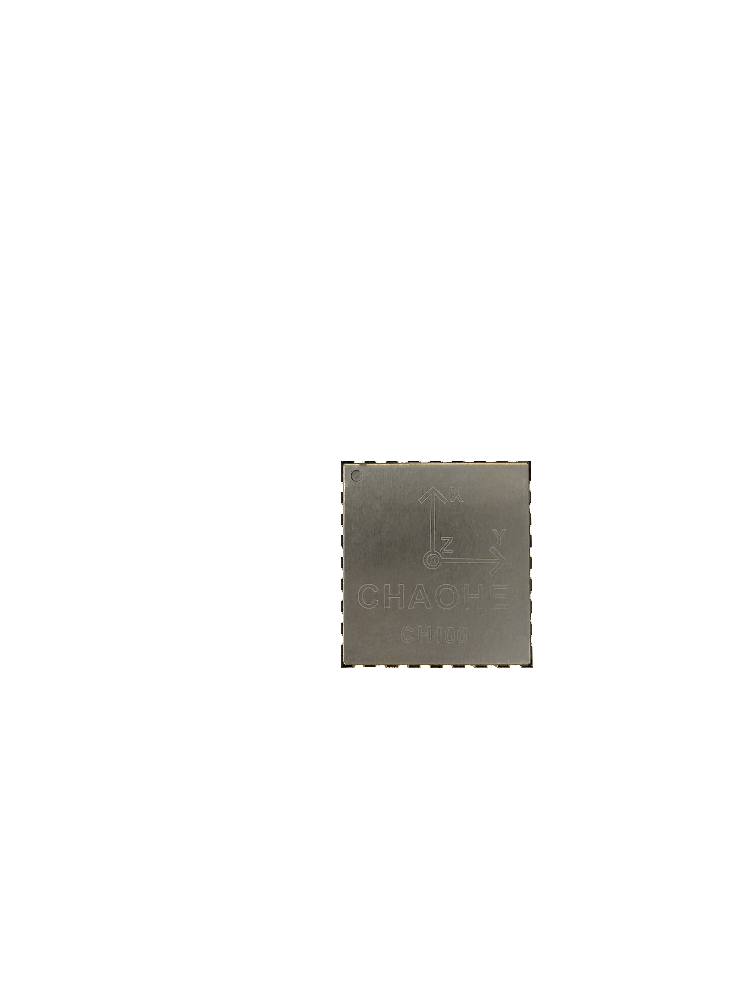

# CH100用户手册

IMU/AHRS姿态测量模块, Rev 0.1

[TOC]

## 简介

CH100是超核电子推出的一款低成本、高性能、小体积、低延时的惯性测量单元（IMU/AHRS），本产品集成了三轴加速度计、三轴陀螺仪以及一款低功耗微处理器。可输出经过传感器融合算法计算得到的基于当地地理坐标的三维方位数据，包含横滚角、俯仰角和相对的航向角。同时也可以输出原始的传感器数据。

典型应用：

- 室内扫地机/机器人

## 特性

### 板载传感器
- 三轴陀螺仪, 最大量程: ±2000°/s
- 三轴加速度计, 最大量程:±8g
### 数据处理 
- 加速度计出厂前经过校准
- 数据融合算法计算并输出地理坐标系下的欧拉角
### 通讯接口及供电
- 串口(兼容TTL 可直接与5V 或3.3V 串口设备连接)
- 供电电压：5.0V(+/- 100 mV)
- 最大峰值功耗：32mA
### 其他
- PC端上位机程序，提供实时数据显示，波形，校准及excel 数据记录功能
- 多项模块参数用户可配置

## 硬件及尺寸

### 硬件参数

| 参数           | 描述                                     |
| -------------- | ---------------------------------------- |
| 输出数据接口   | UART(TTL 1.8V - 3.3V)                    |
| 工作电压       | 5.0V (± 100mV)                           |
| 功耗           | 86mW @3.3V                               |
| 温度范围       | -20℃  - 85 ℃                             |
| 最大线性加速度 | 0 - 115 $m/s^2$                          |
| 尺寸           | 24 x 22 x 3mm (W x L x H)                |
| 板载传感器     | 三轴加速度计 三轴陀螺仪 三轴地磁场传感器 |

### 尺寸

TBD

### 引脚定义

| 引脚号 | 名称   | 说明                                  |
| ------ | ------ | ------------------------------------- |
| 1      | GND |                            |
| 2      | NRST | 复位 低电平>10us 有效 |
| 3      | N/A |     |
| 4     | N/A |     |
| 5  | N/A |                                   |
| 6  | N/A |               |
| 7    | N/A |                                   |
| 8 | GND |  |
| 9 | GND |  |
| 10 | N/A |  |
| 11 | N/A |  |
| 12 | N/A |  |
| 13 | GND |  |
| 14 | N/A |  |
| 15 | N/A |  |
| 16 | GND |  |
| 17 | GND |  |
| 18 | N/A |  |
| 19 | N/A |  |
| 20 | N/A |  |
| 21 | N/A |  |
| 22 | N/A |  |
| 23 | N/A |  |
| 24 | N/A |  |
| 25 | GND |  |
| 26 | VCC |  |
| 27 | EN | 使能 高电平有效，内部上拉，不使用时悬空或上拉 |
| 28 | N/A |  |
| 29 | N/A |  |
| 30 | N/A |  |
| 31 | UART_TX | 模块串口发送 UART TXD (接 MCU 的 RXD) |
| 32 | UART_RX | 模块串口接收 UART RXD (接 MCU 的 TXD) |

## 性能指标

### 姿态角输出精度

| 姿态角               | 典型值                   | 最大值                   |
| -------------------- | ------------------------ | ------------------------ |
| 横滚角\俯仰角 - 静态 | 0.2°                     | 0.4°                     |
| 横滚角\俯仰角 - 动态 | 0.5°                     | 2.0°                     |
| 航向角               | 1.0º(9轴模式,绝对航向角) | 2.0º(9轴模式,绝对航向角) |

### 陀螺仪

| 参数     | 值                   |
| -------- | -------------------- |
| 测量范围 | ±1000 deg/s          |
| 非线性度 | ±0.1% (25°最佳)      |
| 噪声密度 | 0.08°/s/$$ \sqrt{Hz}$$ |
| 采样率   | 400Hz       |

### 加速度计

| 参数         | 值                      |
| ------------ | ----------------------- |
| 测量范围     | ±8G(1G = 1x 重力加速度) |
| 非线性度     | ±0.1% (25°最佳)         |
| 最大零点偏移 | 10mG(校准后)            |
| 噪声密度     | 250  uG\sqrt{Hz}        |
| 采样率       | 100Hz                   |

### 模块数据接口参数

| 参数           | 值                    |
| -------------- | --------------------- |
| 串口输出波特率 | 9600/19200/115200可选 |
| 帧输出速率     | 1- 400Hz              |

## 融合及校准算法
### 校准

每一个CH100模块都经过出厂前的 加速度和陀螺仪的刻度因子以及三轴非正交性以及零偏校准，这些校准参数会记录到模块上CPU的内部非失存储器上。一般情况下，用户无需再对加速度和陀螺仪进行校准。陀螺仪自动校准需要在上电后静止模块1S 左右，以获得最好的校准效果。如果上电静置短于规定时间，则模块陀螺仪零偏校准效果会下降。

### 融合算法输出

模块板载处理器将三轴陀螺仪、三轴加速度计数据进行融合，该算法包含稳健的姿态解算、误差动态估计和自主航位稳定。

