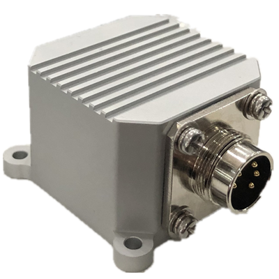
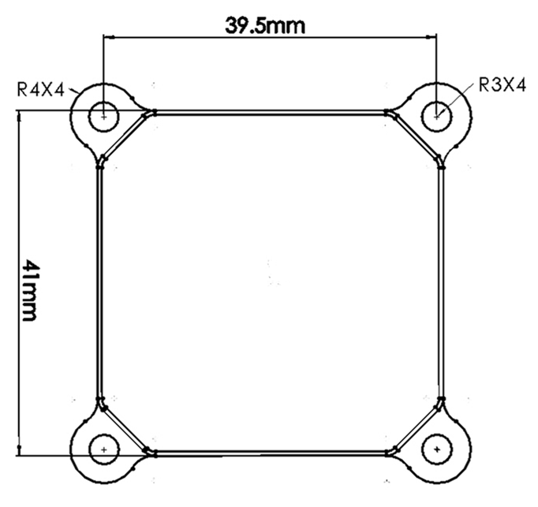
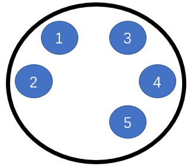
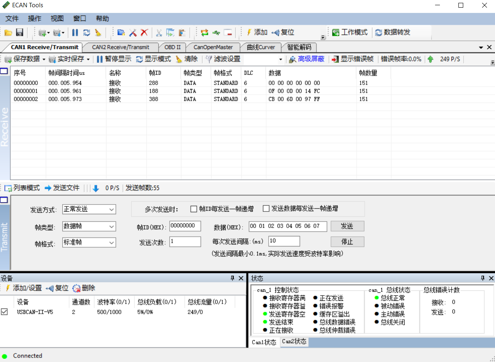
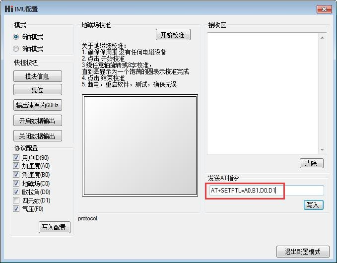

# HI316用户手册
<p style="text-align: right;">VRU/IMU姿态测量模块, Rev Beta




<div style="page-break-after: always;"></div>
[TOC]

<div style="page-break-after: always;"></div>
## 简介

HI316是超核电子推出的一款低成本、高性能、小体积、低延时的惯性测量单元（IMU），本产品集成了三轴加速度计、三轴陀螺仪以及一款低功耗微处理器。可输出经过传感器融合算法计算得到的基于当地地理坐标的三维方位数据，包含横滚角、俯仰角和相对的航向角。同时也可以输出原始的传感器数据。

典型应用：

- 定制产品


## 特性

### 板载传感器
- 三轴陀螺仪, 最大量程: ±1000°/s
- 三轴加速度计, 最大量程:±3g
### 数据处理 
- 加速度计出厂前经过校准
- 数据融合算法计算并输出地理坐标系下的欧拉角
### 通讯接口及供电
- RS485
- 供电电压：5 - 24V
### 其他
- PC端上位机程序，提供实时数据显示，波形，校准及excel 数据记录功能
- 多项模块参数用户可配置

## 硬件及尺寸

### 硬件参数

| 参数           | 描述                    |
| -------------- | ----------------------- |
| 输出数据接口   | RS485                   |
| 工作电压       | 5 - 24V                 |
| 温度范围       | -20℃  - 85 ℃            |
| 最大线性加速度 | 0 - 115 $m/s^2$         |
| 尺寸           | 50x 50x30mm (W x L x H) |
| 板载传感器     | 三轴加速度计 三轴陀螺仪 |

### 尺寸




### 方向


### 引脚定义



| 引脚号 | 名称   | 说明                                  |
| ------ | ------ | ------------------------------------- |
| 1     | VCC | 电源正极                              |
| 2     | VSS    | 电源负极                   |
| 3    | GND | GND  与外壳或大地连接                       |
| 4     | 485A | 485A  |
| 5     | 485B | 485B |


### 参考系定义

本产品采用右手(RH, Right-Hand)坐标系。输出的四元数及欧拉角为  惯性坐标系(世界坐标系) -> 传感器坐标系的旋转。其中欧拉角旋转顺序为 ZYX(也称 321)旋转顺序，欧拉角具体定义如下：

- 绕 Z 轴方向旋转: 航向角\Yaw\phi($\psi$) 范围: -180° - 180°
- 绕 Y 轴方向旋转: 俯仰角\Pitch\theta($\theta$) 范围: -90°-90°
- 绕 X 轴方向旋转:横滚角\Roll\psi(  $\phi$)范围: -180°-180°

本产品使用 右手系 笛卡儿 北西天(NWU) 坐标系统，即视为模块的地理坐标系(世界坐标系)定义如下：

- X 轴正方向指向北
- Y 轴正方向指向西
- Z 轴正方向指向天

当采用 NWU 系时，如果将模块视为飞行器的话。X 轴应视为机头方向。当传感器系与惯性系重合时，欧拉角的理想输出为:Pitch = 0°, Roll = 0°, Yaw = 0°

**注意**，以上定义中只在绝对航向角模式下才有意义，在没有地磁场校准的在相对航向角模式下(如HI316 或者HI219工作在6轴模式时)，航向角在模块启动后既输出为 0°，与地理方位无任何关系。换句话说：俯仰角，横滚角因为有地球重力场校准，可以获得绝对角度，并且没有漂移。而与地球重力场正交方向的角度(航向角)没有恒定向量场参考，所以长时间工作会产生漂移。这种模式下也称作 VRU模块(垂直测量参考单元)

## 性能指标

### 姿态角输出精度

| 姿态角               | 典型值               | 最大值               |
| -------------------- | -------------------- | -------------------- |
| 横滚角\俯仰角 - 静态 | 0.2°                 | 0.4°                 |
| 横滚角\俯仰角 - 动态 | 0.5°                 | 2.0°                 |
| 航向角               | 相对航向角无参考标准 | 相对航向角无参考标准 |

### 陀螺仪

| 参数     | 值                   |
| -------- | -------------------- |
| 测量范围 | ±1000 deg/s          |
| 非线性度 | ±0.1% (25°最佳)      |
| 噪声密度 | 0.08°/s/$$ \sqrt{Hz}$$ |
| 采样率   | 400Hz       |


### 加速度计

| 参数         | 值                      |
| ------------ | ----------------------- |
| 测量范围     | ±3G(1G = 1x 重力加速度) |
| 非线性度     | ±0.1% (25°最佳)         |
| 最大零点偏移 | 30mG(校准后)            |
| 噪声密度     | 250  uG\sqrt{Hz}        |
| 采样率       | 400Hz                   |


### 模块数据接口参数

| 参数           | 值                    |
| -------------- | --------------------- |
| 串口输出波特率 | 9600/19200/115200可选 |
| 帧输出速率     | 1- 20Hz               |

## 融合及校准算法
### 校准

每一个HI316模块都经过出厂前的 加速度和陀螺仪的刻度因子以及三轴非正交性以及零偏校准，这些校准参数会记录到模块上CPU的内部非失存储器上。一般情况下，用户无需再对加速度和陀螺仪进行校准。陀螺仪自动校准需要在上电后静止模块1S 左右，以获得最好的校准效果。如果上电静置短于规定时间，则模块陀螺仪零偏校准效果会下降。

### 融合算法输出

模块板载处理器将三轴陀螺仪、三轴加速度计数据进行融合，该算法包含稳健的姿态解算、误差动态估计和自主航位稳定。


## 串口通讯协议

### 数据包格式

模块资料包中提供了C 和C#的数据解析函数以供参考。模块上电后，模块默认按100Hz (出厂默认输出速率) 输出数据包，数据包格式如下：

|域 | 同步帧头 | 帧类型 | 帧长度 | CRC16 | 帧携带数据 |
|------------ | -------------|------------ |------------ |------------ |------------ |
|名称 | PRE | TYPE | LEN | CRC | REG_ADDR(N) + DATA(N) |
|大小(byte) | 0 | 1 | 2 | 2 | 可变(1-64) |
|偏移(byte) | 0 | 1 | 2 | 4 | 6 |
|值(hex) | 0x5A | 0xA5 | 帧长度 | CRC校验码 | 具体意义参看下节 |
|类型 | uint8_t | uint8_t | uint16_t | uint16_t | - |


* PRE
	固定为0x5A

* TYPE
	固定为0xA5 代表数据帧

* LEN 
	帧中数据域的长度。一帧最大为256 字节LSB(低字节在前)，长度只是值真正数据的长度，不包含`PRE`,`TYPE`,`LEN`,`CRC` 字段。

* CRC
	**除CRC 本身外**其余所有帧数据的16 位CRC 校验和LSB[^LSB]。CRC实现函数：

```
/*
	currectCrc: previous crc value, set 0 if it's first section
	src: source stream data
	lengthInBytes: length
*/
static void crc16_update(uint16_t *currectCrc, const uint8_t *src, uint32_t lengthInBytes)
{
    uint32_t crc = *currectCrc;
    uint32_t j;
    for (j=0; j < lengthInBytes; ++j)
    {
        uint32_t i;
        uint32_t byte = src[j];
        crc ^= byte << 8;
        for (i = 0; i < 8; ++i)
        {
            uint32_t temp = crc << 1;
            if (crc & 0x8000)
            {
                temp ^= 0x1021;
            }
            crc = temp;
        }
    } 
    *currectCrc = crc;
}
```


* REG_ADDR和DATA
	一帧数据可由多个数据包组成，每个数据包包含寄存器地址(REG_ADDR)和寄存器数据(DATA) 两部分。寄存器地址决定了数据的类型及长
度，DATA 为寄存器数据内容。模块支持的寄存器列表如下:

| 寄存器地址 | 寄存器长度(字节) | 名称              | 单位       |
| -------- | ---------- | ----------------- | ---------- |
| 0x90 | 1 | 用户ID | 无 |
| 0xA0     | 6          | 加速度            | 0.001G[^G]  |
| 0xA5 | 6 | 线性加速度 | 0.001G |
| 0xB0     | 6          | 角速度            | 0.1°/s     |
| 0xC0     | 6          | 磁场强度          | 0.001Gauss |
| 0xD0     | 6          | 欧拉角 (整形输出) | 度         |
| 0xD9     | 12         | 欧拉角(浮点输出)  | 度         |
| 0xD1     | 16         | 四元数            | N/A      |
| 0xF0 | 4 | 气压 | Pa |
| 0x71 | 128-256字节可变 | 无线节点四元数集合 | 无 |
| 0x72 | 48-96字节可变 | 无线节点欧拉角集合 | 同0xD0 |
| 0x75 | 48-96字节可变 | 无线节点加速度集合 | 同0xA0 |
| 0x78 | 48-96字节可变 | 无线节点角速度集合 | 同0xB0 |
| 0x61 | 3 | 无线数据帧拓展标识 | N/A |

[^G]: 1G = 1x当地重力加速度

* 0x90 
	用户ID

* 0xA0
	加速度，格式为int16，共三个轴，每个轴占2 个字节，X、Y、Z 三轴共6 个字节，LSB。传感器输出的原始加速度

* 0xA5
	性加速度，格式为int16，共三个轴，每个轴占2 个字节，X、Y、Z 三轴共6 个字节，LSB。地理坐标系下去除重力分量的加速度值

* 0xB0
	角速度，格式为int16，共三个轴，每个轴占2 个字节，X、Y、Z 三轴共6 个字节，LSB。传感器输出的角速度

* 0xC0
	磁场强度，格式为int16，共三个轴，每个轴占2 个字节，X、Y、Z 三轴共6 个字节，LSB。传感器输出的磁场强度

* 0xD0
	欧拉角整形格式，格式为int16，共三个轴，每个轴占2 个字节，顺序为Pitch/Roll/Yaw。LSB。接收到Roll, Pitch 为物理值乘以100 后得到的数值，Yaw 为乘以10 得到的数值举例：当接收到的Yaw = 100 时，表示航向角为10°

* 0xD9
	浮点格式输出的欧拉角。格式为float，共3 个值(Pitch/Roll/Yaw)，每个值占4 字节(float 型单精度
  浮点数)，LSB。

* 0XD1
	四元数，格式为float，共4个值，顺序为:W X Y Z.。每个值占4 字节(float)，整个四元数为4个float，共16字节，LSB。


* 0XF0
	气压。(只针对有气压传感器的产品)

* 0x71
	(仅支持HI221GW)节点四元数集合. 所有节点的四元数， 每个节点16字节，从0到最后一个节点顺序排列。每个节点 4个浮点数，分别为W X Y Z, 每个数用float 型表示，每个float 4字节。float为LSB
	
* 0x72
	(仅支持HI221GW)节点欧拉集合. 所有节点的欧拉角， 每个节点6字节，从0到最后一个节点顺序排列。每个节点欧拉为角整形格式，格式为int16，共三个轴，每个轴占2 个字节，顺序为Pitch/Roll/Yaw。LSB。接收到Roll, Pitch 为物理值乘以100 后得到的数值，Yaw 为乘以10 得到的数值举例：当接收到的Yaw = 100 时，表示航向角为10°
	
* 0x75
	(仅支持HI221GW)节点加速度集合. 每个节点6字节，从0到最后一个节点顺序排列。每个节点3个int16_t 型数据。分别为X Y Z的加速度。每个int16_t 占2字节， LSB
	
* 0x78
	(仅支持HI221GW)节点角速度集合. 每个节点6字节，从0到最后一个节点顺序排列。每个节点3个int16_t 型数据。分别为X Y Z的角速度。每个int16_t 占2字节， LSB
	
* 0x61

  (仅支持HI221GW)数据帧拓展信息标识，共3个字节:

  | 数据帧拓展信息字节偏移 | 值   | 说明                     |
  | ---------------------- | ---- | ------------------------ |
  | 0                      | -    | 保留                     |
  | 1                      | GWID | 接收机GWID               |
  | 2                      | CNT  | 此帧包含无线节点数: 1-16 |
  


### 出厂默认寄存器

出厂默认一帧中携带寄存器数据定义如下：

HI226/HI229:

| 顺序 | 数据包 | 说明             |
| ---- | ------ | ---------------- |
| 1    | 0x90   | 用户ID           |
| 2    | 0xA0   | 加速度           |
| 3    | 0xB0   | 角速度           |
| 4    | 0xC0   | 磁场强度         |
| 5    | 0xD0   | 欧拉角(整形输出) |
| 6    | 0xF0   | 气压             |

HI221GW(无线节点接收机):

| 顺序 | 寄存器 | 说明   |
| ---- | ------ | ------ |
| 1    | 0x71   | 四元数 |
| 2    | 0x75   | 加速度 |


### 数据帧结构示例

假设输出的数据帧带有 `A0,B0,D0` 寄存器，使用串口助手采样一帧数据如下所示:

`5A` `A5` `15` `00` `A9` `8B` `A0` `EA` `FF` `D0` `03` `45` `FF` `B0` `00` `00` `00` `00` `00` `00` `D0` `87` `00` `6F` `27`  `F5` `FF` 

其中：

`5A` `A5`帧头

`15` `00`帧数据域长度：`(0x00<<8) + 0x15 = 21`

`A9` `8B`帧CRC校验值: `(0x8B<<8) + 0xA9 = 0x8BA9`

`A0` `EA` `FF` `D0` `03` `45` `FF` 加速度数据包, `A0`为加速度寄存器地址， 三轴加速度为： 

​	AccX = (int16_t)((0xFF<<8)+ 0xEA) = -22
​	
​	AccY = (int16_t)((0x03<<8)+ 0xD0) = 976
​	
​	AccZ = (int16_t)((0xFF<<8)+ 0x45) = -187

`B0` `00` `00` `00` `00` `00` `00` 角速度数据包, `B0`为角速度寄存器地址， 三轴角速度全为0

`D0` `87` `00` `6F` `27` `F5` `FF` 欧拉角数据包, `D0`为欧拉角寄存器地址

​	Pitch= (int16_t)((0x00<<8)+ 0x87) / 100 = 1.35° 

​    Roll= (int16_t)((0x27<<8)+ 0x6F) / 100 = 100.95°

​    Yaw = (int16_t)((0xFF<<8)+ 0xF5) / 10 = -1.1°


计算CRC校验值：

记上面接收到的一帧数据存为C语言uint8_t 数组 buf:

```
    uint16_t payload_len;
    uint16_t crc;
    
    crc = 0;
    payload_len = buf[2] + (buf[3] << 8);
    
    /* calulate 5A A5 and LEN filed crc */
    crc16_update(&crc, buf, 4);
    
    /* calulate payload crc */
    crc16_update(&crc, buf + 6, payload_len);
```

​    最后计算得 CRC值为 0x8BA9, 与帧携带CRC值相同，帧校验正确。


## CAN通讯协议

CAN通讯协议遵循CANopen协议。基本配置如下：

* 只使用PTO1, PTO2, PTO3, PTO4 传输姿态数据,节点不接收或发送远程帧，所有传输均采用标准数据帧。

* PTO采用异步定时触发模式, 默认输出速率为100Hz

* 节点上电处于预操作状态(pre-operational) 需要主机发送NMT协议将节点设置为operation状态才会开始发送数据

  
  
### CAN默认设置

| 默认配置   | 值                                                           |
| ---------- | ------------------------------------------------------------ |
| CAN 波特率 | 500KHz                                                       |
| 节点ID     | 8                                                            |
| 初始化状态 | 预操作(Pre-operational),需要发送Start Remote Node命令模块才能开始输出 |
| 心跳包     | 无                                                           |

  


### PTO传输细节

| PTO通道 | PTO 帧ID | 长度 | PTO 传输方式    | 发送数据 | 说明                                                         |
| ------- | -------- | ---- | --------------- | -------- | ------------------------------------------------------------ |
| TPDO1   | 0x180+ID | 6    | 循环同步(0x01)  | 加速度   | 每轴数据类型为(INT16)，分别为X,Y,Z轴加速度，单位为mG(0.001重力加速度) |
| TPDO2   | 0x280+ID | 6    | 循环同步(0x01)  | 角速度   | 每轴数据类型为(INT16)，分别为X,Y,Z轴角速度，单位为0.1DPS(°/s) |
| TPDO3   | 0x380+ID | 6    | 异步定时(0xFE)  | 欧拉角   | 每轴数据类型为(INT16)，顺序分别为横滚角(Roll,绕X轴旋转),俯仰角(Pitch,绕Y轴旋转),航向角(Yaw绕Z轴旋转)。欧拉角单位为0.01° 旋转顺序为ZYX(先转Z然后Y最后X) |
| TPDO4   | 0x380+ID | 8    | 循环同步(0x01)) | 四元数   | 每轴数据类型为(INT16)，分别为$$ q_{w} \ q_{x}\ q_{y}\ q_{z}$$ 。单位四元数扩大10000倍后结果。如四元数为1,0,0,0 时, 输出10000,0,0,0. |


使用USB-CAN工具抓取默认CAN输出包截图如下：





  ### 修改配置

数据字典以下位置存放厂商参数配置数据, 可通过CANopen主站修改，掉电保存，重启生效

| 地址   | 名称     | 值类型    | 默认值 | 说明          |
| ------ | -------- | --------- | ------ | ------------- |
| 0x2100 | CAN_BAUD | INTEGER32 | 500000 | CAN总线波特率 |
| 0x2101 | NodeID   | INTEGER32 | 8      | 节点ID        |


## 通用AT指令

模块采用AT 指令集配置/查看模块参数。AT 指令总以ASCII 码`AT` 开头，后面跟控制字符，最
后以回车换行`\r\n`结束。可使用串口调试助手进行测试：


通用模块 AT指令如下

| 指令      | 功能                           | 掉电不保存且立即生效(N) / 掉电保存且重启生效(Y) |
| --------- | ------------------------------ | ----------------------------------------------- |
| AT+ID     | 设置模块用户ID                 | Y                                               |
| AT+GWID   | 设置无线网关ID(针对于无线产品) | Y                                               |
| AT+URFR   | 旋转模块传感器坐标系           | Y                                               |
| AT+INFO   | 打印模块信息                   | N                                               |
| AT+ODR    | 设置模块串口输出帧频率         | Y                                               |
| AT+BAUD   | 设置串口波特率                 | Y                                               |
| AT+EOUT   | 数据输出开关                   | N                                               |
| AT+RST    | 复位模块                       | N                                               |
| AT+TRG    | 单次输出触发                   | N                                               |
| AT+SETPEL | 设置输出数据包                 | Y                                               |
| AT+MODE   | 设置模块工作模式               | Y                                               |

##### AT+ID

设置模块用户ID

**例** `AT+ID=1`


##### AT+GWID

 (仅支持HI221)  HI221GW(接收机) 和 HI221(节点) 拥有GWID属性，可通过AT+GWID指令配置，GWID属性决定了接收器和节点的RF频率，只有HI221模块的GWID 和 接收器的 GWID属性相同时，模块和接收器直接才能通讯。GWID相当于无线网段，当在同一地点使用多个接收机组成多个星形网络时，必须保证每个接收器的GWID(网段)不同。


**例** 将一个接收器设置为GWID=3， 并将3个模块的自身ID设置为 0,1,2 并连接到这个接收器上：

接收机配置：`AT+GWID=3`

节点0配置： `AT+GWID=3`  `AT+ID=0`

节点1配置： `AT+GWID=3`  `AT+ID=1`

节点2配置： `AT+GWID=3`  `AT+ID=2`


##### AT+URFR

某些情况下传感器需要倾斜垂直安装，这时候需要旋转传感器坐标系，这条指令提供了旋转传感器坐标系的接口：

`AT+URFR=C00,C01,C02,C10,C11,C12,C20,C21,C22` 

其中 $\C_{nn}$ 支持浮点数 

$$
\left\{\begin{array}{l}{X} \\ {Y} \\ {Z}\end{array}\right\}_{U}=\left[\begin{array}{lll}{C 00} & {C 01} & {C 02} \\ {C 10} & {C 11} & {C 12} \\ {C 20} & {C 21} & {C 22}\end{array}\right] \cdot\left\{\begin{array}{l}{X} \\ {Y} \\ {Z}\end{array}\right\}_{B}
$$

$$
其中\left\{\begin{array}{l}{X} \\ {Y} \\ {Z}\end{array}\right\}_{U} 为旋转后的 传感器坐标系下 传感器数据，\cdot\left\{\begin{array}{l}{X} \\ {Y} \\ {Z}\end{array}\right\}_{B} 为旋转前 传感器坐标系下 传感器数据
$$

下面是几种常用旋转举例：

- 新传感器坐标系为 绕原坐标系X轴 旋转 90°， 输入命令：`AT+URFR=1,0,0,0,0,1,0,-1,0`

- 新传感器坐标系为 绕原坐标系X轴 旋转-90°， 输入命令：`AT+URFR=1,0,0,0,0,-1,0,1,0`

- 新传感器坐标系为 绕原坐标系X轴 旋转180°， 输入命令：`AT+URFR=1,0,0,0,-1,0,0,0,-1`

- 新传感器坐标系为 绕原坐标系Y轴 旋转 90°， 输入命令：`AT+URFR= 0,0,-1,0,1,0,1,0,0`

- 新传感器坐标系为 绕原坐标系Y轴 旋转-90°， 输入命令：`AT+URFR= 0,0,1,0,1,0,-1,0,0`

- 新传感器坐标系为 绕原坐标系Y轴 旋转180°， 输入命令：`AT+URFR= -1,0,0,0,1,0,0,0,-1`

- 恢复默认值：`AT+URFR=1,0,0,0,1,0,0,0,1`

  

##### AT+INFO

打印模块信息，包括产品型号，版本，固件发布日期等。AT+INFO可以拓展二级指令实现更多信息的查询

| INFO二级拓展指令 | 功能                 | 示例        |
| ---------------- | -------------------- | ----------- |
| CAL              | 显示模块内部校准参数 | AT+INFO=CAL |
| RF               | 显示无线设备参数     | AT+INFO=RF  |
| VER              | 显示详细版本信息     | AT+INFO=VER |


##### AT+ODR

设置模块串口输出速率。 掉电保存，复位模块生效

**例** 设置串口输出速率为100Hz:  `AT+ODR=100` 

##### AT+BAUD

设置串口波特率，可选值：4800/9600/115200/256000/460800`

**例**  `AT+BAUD=115200`

!!! note "注意"

- 使用此指令需要特别注意，输入错误波特率后可能会导致无法和模块通讯
- 波特率参数设置好后掉电保存，复位模块生效。上位机的波特率也要做相应修改。
- 升级固件时，需要切换回115200 波特率。

##### AT+EOUT

串口输出开关

**例** 打开串口输出 `AT+EOUT=1`   关闭串口输出 `AT+EOUT=0`

##### AT+RST

复位模块

**例** `AT+RST`

##### AT+TRG

触发模块输出一帧数据，可以配合AT+ODR=0来实现单次触发输出。

**例** `AT+TRG`

##### AT+SETPEL

设置输出协议:

模块数据帧中的数据包组成可使用AT指令配置，格式为`AT+SETPTL=<ITEM_ID>,<ITEM_ID>...`
一帧输出可包含最多8个数据包。

**例** 配置模块输出加速度，角速度, 整形格式欧拉角和四元数的指令为：`AT+SETPTL=A0,B1,D0,D1`



##### AT+MODE

设置模块工作模式

**例** 

* 设置模块工作在6轴模式(无磁校准)  `AT+MODE=0`
* 设置模块工作在9轴模式(地磁场传感器参与航向角校正)  `AT+MODE=1`


## 附录B - 四元数-欧拉角转换

### 四元数基础

四元数是一个四维空间上的一点，使用一个实数和三个虚数来代表：$q \in \mathbb{R}^{4}=\mathbb{H}$

四元数有如下几种常用的表示方法：

| 复数表示                                                     | 向量表示                                                     | 四元数表示法1                               | 四元数表示法2                               |
| ------------------------------------------------------------ | ------------------------------------------------------------ | ------------------------------------------- | ------------------------------------------- |
| $q=q_{0}+\mathrm{i} q_{1}+\mathrm{j} q_{2}+\mathrm{k} q_{3}$ | $q=\left[q_{0}, \mathbf{q}\right]=\left[q_{0},\left(\begin{array}{l}{q_{1}} \\ {q_{2}} \\ {q_{3}}\end{array}\right)\right]$ | $q=\left[q_{0}, q_{1}, q_{2}, q_{3}\right]$ | $q=\left[q_{w}, q_{x}, q_{y}, q_{z}\right]$ |

其中：

$$
\mathrm{i}^{2}=\mathrm{j}^{2}=\mathrm{k}^{2}=\mathrm{ijk}=-1
$$

$$
\mathrm{ij}=\mathrm{k}=-\mathrm{ji}, \quad \mathrm{jk}=\mathrm{i}=-\mathrm{kj}, \quad \mathrm{ki}=\mathrm{j}=-\mathrm{ik}
$$


四元数乘法：

$$
\mathbf{p} \otimes \mathbf{q}=\left[\begin{array}{l}{p_{w} q_{w}-p_{x} q_{x}-p_{y} q_{y}-p_{z} q_{z}} \\ {p_{w} q_{x}+p_{x} q_{w}+p_{y} q_{z}-p_{z} q_{y}} \\ {p_{w} q_{y}-p_{x} q_{z}+p_{y} q_{w}+p_{z} q_{x}} \\ {p_{w} q_{z}+p_{x} q_{y}-p_{y} q_{x}+p_{z} q_{w}}\end{array}\right]
$$


一个单位四元数总是可以表示为这种这种形式：$q_{R}(\alpha, \mathbf{u})=\left[\cos \frac{\alpha}{2}, \sin \frac{\alpha}{2} \cdot \mathbf{u}\right]$

其中$\alpha$ 是旋转角度，$\mathbf{u} \in \mathbb{R}^{3}$ 为旋转轴，且$\|\mathbf{u}\|=1$.


### 四元数与旋转矩阵，欧拉角转换

#### 四元数->旋转矩阵

(其中四元数是 b->n,  R为 n->b)

$$
R^{b}_{n} =\left[\begin{array}{ccc}{q_{0}^{2}+q_{1}^{2}-q_{2}^{2}-q_{3}^{2}} & {2\left(q_{1} q_{2}+q_{0} q_{3}\right)} & {2\left(q_{1} q_{3}-q_{0} q_{2}\right)} \\ {2\left(q_{1} q_{2}-q_{0} q_{3}\right)} & {q_{0}^{2}-q_{1}^{2}+q_{2}^{2}-q_{3}^{2}} & {2\left(q_{2} q_{3}+q_{0} q_{1}\right)} \\ {2\left(q_{1} q_{3}+q_{0} q_{2}\right)} & {2\left(q_{2} q_{3}-q_{0} q_{1}\right)} & {q_{0}^{2}-q_{1}^{2}-q_{2}^{2}+q_{3}^{2}}\end{array}\right]
$$


#### 四元数->欧拉角

 旋转矩阵，四元数和欧拉角是表示旋转的三种常用方式，其中另外两种表示形式转换为欧拉角时，必须先指定欧拉角旋转顺序。本产品使用"ZYX"旋转顺序,即先旋转航向角，然后俯仰角，最后横滚角：

  转换公式为：

$$
\left[\begin{array}{c}{\phi}(横滚) \\ {\theta}(俯仰) \\ {\psi}(航向)\end{array}\right] = \left[\begin{array}{c}{\operatorname{atan} 2\left(2 q_{2} q_{3}+2 q_{0} q_{1},  {q_{3}^{2}-q_{2}^{2}-q_{1}^{2}+q_{0}^{2} )}\right.} \\ {-\operatorname{asin}\left(2 q_{1} q_{3}-2 q_{0} q_{2}\right)} \\ {\operatorname{atan} 2\left(2 q_{1} q_{2}+2 q_{0} q_{3}\right)} , {q_{1}^{2}+q_{0}^{2}-q_{3}^{2}-q_{2}^{2} )}\end{array}\right]
$$

#### 欧拉角->四元数

记$s_{\phi}= \sin \frac{\phi}{2}, c_{\phi}= \cos \frac{\phi}{2}$,以此类推：

$$
\mathbf{q}=\left[\begin{array}{c}{c_{\phi / 2} c_{\theta / 2} c_{\psi / 2}+s_{\phi / 2} s_{\theta / 2} s_{\psi / 2}} \\ {-c_{\phi / 2} s_{\theta / 2} s_{\psi / 2}+c_{\theta / 2} c_{\psi / 2} s_{\phi / 2}} \\ {c_{\phi / 2} c_{\psi / 2} s_{\theta / 2}+s_{\phi / 2} c_{\theta / 2} s_{\psi / 2}} \\ {c_{\phi / 2} c_{\theta / 2} s_{\psi / 2}-s_{\phi / 2} c_{\psi / 2} s_{\theta / 2}}\end{array}\right]
$$

#### 欧拉角->旋转矩阵(n->b)

$$
R^{b}_{n} = \left[\begin{array}{ccc}{c_{\theta} c_{\psi}} & {c_{\theta} s_{\psi}} & {-s_{\theta}} \\ {s_{\phi} s_{\theta} c_{\psi}-c_{\phi} s_{\psi}} & {s_{\phi} s_{\theta} s_{\psi}+c_{\phi} c_{\psi}} & {c_{\theta} s_{\phi}} \\ {c_{\phi} s_{\theta} c_{\psi}+s_{\phi} s_{\psi}} & {c_{\phi} s_{\theta} s_{\psi}-s_{\phi} c_{\psi}} & {c_{\theta} c_{\phi}}\end{array}\right]
$$

#### 旋转矩阵(n->b) 到欧拉角

$$
\left[\begin{array}{c}{\phi} \\ {\theta} \\ {\psi}\end{array}\right]=\left[\begin{array}{c}{\operatorname{atan} 2\left(r_{23}, r_{33}\right)} \\ {-\operatorname{asin}\left(r_{13}\right)} \\ {\operatorname{atan} 2\left(r_{12}, r_{11}\right)}\end{array}\right]
$$


## 附录C - 固件升级与恢复出厂设置


本产品支持在线升级固件，请关注超核电子官网www.hipnuc.com 来获取最新固件版本
固件升级步骤:

- 获取最新的固件程序。拓展名为.hex
- 连接模块，打开上位机，将模块和上位机波特率都设置为115200.切换到固件升级窗口
- 点击连接按钮，如出现模块连接信息。则说明升级系统准备就绪，点击文件选择器(…)选择拓
  展名为xxx.hex 的固件，然后点击开始编程。下载完成后会提示编程完成，此时关闭串口，
  重新上电，模块升级完成。


