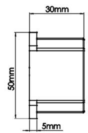

# HI316用户手册

VRU/IMU姿态测量模块, Rev Beta

[TOC]

## 简介

HI316是超核电子推出的一款低成本、高性能、小体积、低延时的惯性测量单元（IMU），本产品集成了三轴加速度计、三轴陀螺仪以及一款低功耗微处理器。可输出经过传感器融合算法计算得到的基于当地地理坐标的三维方位数据，包含横滚角、俯仰角和相对的航向角。同时也可以输出原始的传感器数据。

典型应用：

- 定制产品

## 特性

### 板载传感器
- 三轴陀螺仪, 最大量程: ±1000°/s
- 三轴加速度计, 最大量程:±3g
### 数据处理 
- 加速度计出厂前经过校准
- 数据融合算法计算并输出地理坐标系下的欧拉角
### 通讯接口及供电
- RS485
- 供电电压：5 - 24V
### 其他
- PC端上位机程序，提供实时数据显示，波形，校准及excel 数据记录功能
- 多项模块参数用户可配置

## 硬件及尺寸

### 硬件参数

| 参数           | 描述                    |
| -------------- | ----------------------- |
| 输出数据接口   | RS485                   |
| 工作电压       | 5 - 24V                 |
| 温度范围       | -20℃  - 85 ℃            |
| 最大线性加速度 | 0 - 115 $m/s^2$         |
| 尺寸           | 50x 50x30mm (W x L x H) |
| 板载传感器     | 三轴加速度计 三轴陀螺仪 |

### 尺寸

### 方向

### 引脚定义

| 引脚号 | 名称   | 说明                                  |
| ------ | ------ | ------------------------------------- |
| 1     | VCC | 电源正极                              |
| 2     | VSS    | 电源负极                   |
| 3    | GND | GND  与外壳或大地连接                       |
| 4     | 485A | 485A  |
| 5     | 485B | 485B |

### 参考系定义

本产品采用右手(RH, Right-Hand)坐标系。输出的四元数及欧拉角为  惯性坐标系(世界坐标系) -> 传感器坐标系的旋转。其中欧拉角旋转顺序为 ZYX(也称 321)旋转顺序，欧拉角具体定义如下：

- 绕 Z 轴方向旋转: 航向角\Yaw\phi($\psi$) 范围: -180° - 180°
- 绕 Y 轴方向旋转: 俯仰角\Pitch\theta($\theta$) 范围: -90°-90°
- 绕 X 轴方向旋转:横滚角\Roll\psi(  $\phi$)范围: -180°-180°

本产品使用 右手系 笛卡儿 北西天(NWU) 坐标系统，即视为模块的地理坐标系(世界坐标系)定义如下：

- X 轴正方向指向北
- Y 轴正方向指向西
- Z 轴正方向指向天

当采用 NWU 系时，如果将模块视为飞行器的话。X 轴应视为机头方向。当传感器系与惯性系重合时，欧拉角的理想输出为:Pitch = 0°, Roll = 0°, Yaw = 0°

**注意**，以上定义中只在绝对航向角模式下才有意义，在没有地磁场校准的在相对航向角模式下(如HI316 或者HI219工作在6轴模式时)，航向角在模块启动后既输出为 0°，与地理方位无任何关系。换句话说：俯仰角，横滚角因为有地球重力场校准，可以获得绝对角度，并且没有漂移。而与地球重力场正交方向的角度(航向角)没有恒定向量场参考，所以长时间工作会产生漂移。这种模式下也称作 VRU模块(垂直测量参考单元)

## 性能指标

### 姿态角输出精度

| 姿态角               | 典型值               | 最大值               |
| -------------------- | -------------------- | -------------------- |
| 横滚角\俯仰角 - 静态 | 0.2°                 | 0.4°                 |
| 横滚角\俯仰角 - 动态 | 0.5°                 | 2.0°                 |
| 航向角               | 相对航向角无参考标准 | 相对航向角无参考标准 |

### 陀螺仪

| 参数     | 值                   |
| -------- | -------------------- |
| 测量范围 | ±1000 deg/s          |
| 非线性度 | ±0.1% (25°最佳)      |
| 噪声密度 | 0.08°/s/$$ \sqrt{Hz}$$ |
| 采样率   | 400Hz       |

### 加速度计

| 参数         | 值                      |
| ------------ | ----------------------- |
| 测量范围     | ±3G(1G = 1x 重力加速度) |
| 非线性度     | ±0.1% (25°最佳)         |
| 最大零点偏移 | 30mG(校准后)            |
| 噪声密度     | 250  uG\sqrt{Hz}        |
| 采样率       | 400Hz                   |

### 模块数据接口参数

| 参数           | 值                    |
| -------------- | --------------------- |
| 串口输出波特率 | 9600/19200/115200可选 |
| 帧输出速率     | 1- 20Hz               |

## 融合及校准算法
### 校准

每一个HI316模块都经过出厂前的 加速度和陀螺仪的刻度因子以及三轴非正交性以及零偏校准，这些校准参数会记录到模块上CPU的内部非失存储器上。一般情况下，用户无需再对加速度和陀螺仪进行校准。陀螺仪自动校准需要在上电后静止模块1S 左右，以获得最好的校准效果。如果上电静置短于规定时间，则模块陀螺仪零偏校准效果会下降。

### 融合算法输出

模块板载处理器将三轴陀螺仪、三轴加速度计数据进行融合，该算法包含稳健的姿态解算、误差动态估计和自主航位稳定。

