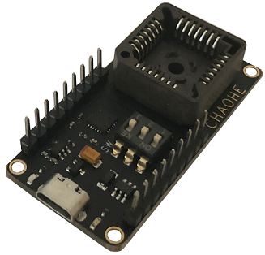

## 附录A - 评估板

### 评估板简介

评估板提供了快速评估本产品的方法。板载USB-UART芯片(CP2104)以及供电LDO，并将模块接口引出方便调试评估。

安装资料包中的CP2104 USB-UART 驱动程序, 将MicroUSB 线连接电脑和模块，打开资料包中的Uranus 上位机，连接串口，默认状态下，模块会以115200-N-8-N-1 输出出厂默认的数据包。

### 从评估板上取下产品

模块默认被嵌入评估板的PLCC28 插槽中，如需取出模块，请按如下步骤操作：
- 断电，准备好细螺丝刀或镊子
- 从PLCC 插座或者背面圆形空洞内将模块撬出或顶出。

 

note "注意"

- 评估板的主要作用仅仅是快速评估模块性能，Micro-USB 接口本身不适合于工业级场景或者高运动场合的电气连接，如果您的应用为高运动环境(动作捕捉等)，则不建议在您的产品中直接使用评估板。
