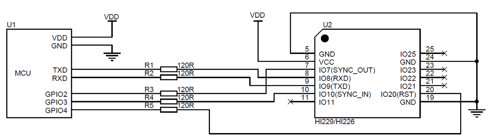

## 使用指南

### 模块与PC机连接

建议使用评估板与PC机进行连接，评估板板载USB供电及USB转串口功能，可以方便的配合PC机上的评估软件进行性能测试。具体请参见附录中的评估板一节。

### 模块与MCU进行连接

模块与MCU通过TTL电平的串口进行连接，建议模块的RST引脚建议接到MCU的GPIO上。方便MCU强制复位模块。

**注意**

1. 如不使用同步输入(SYNC_IN) 和同步输出功能(SYNC_OUT) 可不接SYNC_IN 和 SYNC_OUT。
2. 120欧电阻的作用是为了方便调试，并且防止MCU和模块电平不匹配，可以去掉，建议保留。
3. VCC的电压范围具体参加手册说明
4. 模块内置上电复位电路，RST可以不接，但是建议接到主机一个GPIO上以实现软件复位。

