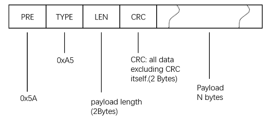
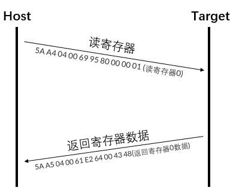
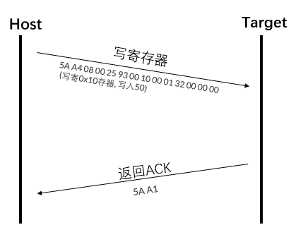

## 寄存器

### 寄存器总览

寄存器采用16位宽编址，所有寄存器长度均为4字节或4字节整倍数。

| 寄存器地址               | 寄存器名称          | 长度 | 只读(RO),读写(RW),只写(WO) | 备注                     |
| ------------------------ | ------------------- | ---- | -------------------------- | ------------------------ |
| **设备信息寄存器组**     | -                   | -    | -                          | -                        |
| 0x0000                   | INFO_DEV            | 4    | RO                         | 产品信息                 |
| 0x0004                   | INFO_VER            | 4    | RO                         | 版本信息                 |
| 0x0008                   | INFO_UUID           | 8    | RO                         | 产品唯一识别码           |
| 0x0010                   | INFO_ID             | 4    | RW                         | 用户ID                   |
| 0x0014                   | INFO_CPU            | 4    | RO                         | CPU信息                  |
| 0x0018                   | INFO_MISC           | 4    | RO                         | 保留                     |
| **通讯控制寄存器组**     | -                   | -    | -                          | -                        |
| 0x0020                   | COMM_UART_CTL       | 4    | RW                         | 串口控制                 |
| 0x0024                   | COMM_UART_BAUD      | 4    | RW                         | 波特率配置               |
| 0x0028                   | COMM_UART_CFG       | 4    | RW                         | 串口输出协议包及帧率配置 |
| 0x0030                   | COMM_CAN_CTL        | 4    | RW                         | CAN控制                  |
| 0x0034                   | COMM_CAN_ID         | 4    | RW                         | CAN节点ID                |
| 0x0038                   | COMM_CAN_BAUD       | 4    | RW                         | CAN波特率                |
| **系统控制寄存器组**     | -                   | -    | -                          | -                        |
| 0x0040                   | SYSCTL_CTL          | 4    | RW                         | 系统控制                 |
| 0x0044                   | SYSCTL_FUS_CFG      | 4    | RW                         | 融合引擎控制             |
| 0x0048                   | SYSCTL_APP_MODE     | 4    | RW                         | legcy support。 不要修改 |
| **IMU控制寄存器组**      | -                   | -    | -                          | -                        |
| 0x0060                   | IMUCTL_CTL          | 4    | RW                         | IMU控制寄存器            |
| 0x0064                   | IMUCTL_GYR_LMF_THR  | 4    | RW                         | 陀螺仪限幅滤波阈值       |
| 0x0068                   | IMUCTL_GYR_BIAS_THR | 4    | RW                         | 静态零偏计算阈值         |
| **地磁校准控制寄存器组** | -                   | -    | -                          | -                        |
| 0x0080                   | MAGCAL_CTL          | 4    | RW                         | 地磁校准控制寄存器       |
| 0x0084                   | MAGCAL_STAT         | 4    | RO                         | 地磁校准状态寄存器       |
| 0x0088                   | MAGCAL_FITERR       | 4    | RO                         | 校准拟合残差             |
| 0x008C                   | MAGCAL_MAGB         | 4    | RO                         | 估计出的当地磁场大小     |
| 0x0090                   | MAGCAL_THETA        | 4    | RO                         | 估计出的当地磁场磁倾角   |
| **无线节点控制寄存器组** | -                   | -    | -                          | -                        |
| 0x00B0                   | RF_GWCTL            | 4    | RW                         | 无线节点控制             |
| **校准参数寄存器组**     | -                   | -    | -                          | -                        |
| 0x0120                   | CAL_URFR            | 48   | RW                         | 用户坐标系旋转           |
| 0x0150                   | CAL_ACC             | 48   | RO                         | 加速度传感器校准参数     |
| 0x0180                   | CAL_GYR             | 48   | RO                         | 陀螺仪传感器校准参数     |
| 0x01B0                   | CAL_MAG             | 48   | RO                         | 磁传感器校准参数         |


### 设备信息寄存器组

#### 0x0000(INFO_DEV)

| 名称    | 大小 | 类型     | 说明       | 默认值 |
| ------- | ---- | -------- | ---------- | ------ |
| PROD_ID | 2    | uint16_t | 产品识别码 | -      |
| VEND_ID | 2    | uint16_t | 厂商识别码 | 0x4843 |

#### 0x0004(INFO_VER)

| 名称   | 大小 | 类型     | 说明     | 默认值 |
| ------ | ---- | -------- | -------- | ------ |
| HW_VER | 2    | uint16_t | 硬件版本 | -      |
| SW_VER | 2    | uint16_t | 软件版本 | -      |

#### 0x0008(INFO_UUID)

| 名称 | 大小 | 类型       | 说明       | 默认值 |
| ---- | ---- | ---------- | ---------- | ------ |
| UUID | 8    | byte array | 硬件唯一ID | -      |

#### 0x0010( INFO_ID)

| 名称 | 大小 | 类型     | 说明   | 默认值 |
| ---- | ---- | -------- | ------ | ------ |
| ID   | 4    | uint32_t | 用户ID | 0      |

#### 0x0014( INFO_CPU)

| 名称       | 大小 | 类型     | 说明              | 默认值 |
| ---------- | ---- | -------- | ----------------- | ------ |
| CPU_FRQ    | 2    | uint16_t | CPU 主频，单位MHZ | 120    |
| CPU_INF_BM | 2    | bitmap   | 状态位，见下表    | 0x0001 |

| CPU_INF_BM | 说明                                    |
| ---------- | --------------------------------------- |
| 0-3        | 时钟状态 0:内部时钟,  1:外部时钟        |
| 4          | 复位状态:0:上电复位,  1:软件/看门狗复位 |
| 5-31       | 保留                                    |

#### 0x0018( INFO_MISC)

| 名称           | 大小 | 类型     | 说明             | 默认值 |
| -------------- | ---- | -------- | ---------------- | ------ |
| REG_LAYOUT_VER | 4    | uint32_t | 寄存器layout版本 | 0      |

### 通讯控制寄存器组
#### 0x0020(COMM_UART_CTL)

| 名称     | 大小 | 类型     | 说明                               | 默认值 |
| -------- | ---- | -------- | ---------------------------------- | ------ |
| UART_CTL | 4    | uint32_t | 1：使能串口输出    0：关闭串口输出 | 1      |


#### 0x0024(COMM_UART_BAUD)

| 名称      | 大小 | 类型     | 说明                                                  | 默认值 |
| --------- | ---- | -------- | ----------------------------------------------------- | ------ |
| UART_BAUD | 4    | uint32_t | 波特率，可选值为4800,9600,115200,256000,460800,921600 | 115200 |

#### 0x0028(COMM_UART_CFG)

| 名称        | 大小 | 类型     | 说明                                                         | 默认值 |
| ----------- | ---- | -------- | ------------------------------------------------------------ | ------ |
| OUT_MASK_BM | 2    | bitmap   | 数据包输出位选项，见下表。对应位1：使能对应数据包输出    0：关闭对应数据包输出 | -      |
| ODR         | 2    | uint16_t | 串口周期输出数据包速率。可选值为 0/10/50/100/200Hz           | 50     |

| OUT_MASK_BM | 数据包 | 说明             |
| ----------- | ------ | ---------------- |
| 0           | 0x91   | IMU_SOL          |
| 1           | 0x90   | 用户ID           |
| 2           | 0xA0   | 加速度           |
| 3           | 0xB0   | 角速度           |
| 4           | 0xC0   | 磁场             |
| 5           | 0xD0   | 欧拉角           |
| 6           | 0xD1   | 四元数           |
| 7           | 0xF0   | 气压             |
| 8           | 0x62   | GW_SOL           |
| 13          | 0xD9   | 浮点数欧拉角     |
| 14          | 0x60   | test8f(内部使用) |
| 15          | -      | 保留             |
| 16          | -      | 保留             |

#### 0x0030(COMM_CAN_CTL)

| 名称    | 大小 | 类型   | 说明 | 默认值 |
| ------- | ---- | ------ | ---- | ------ |
| CAN_CTL | 4    | bitmap | 保留 | 0      |

#### 0x0034(COMM_CAN_ID)

| 名称   | 大小 | 类型     | 说明           | 默认值 |
| ------ | ---- | -------- | -------------- | ------ |
| CAN_ID | 4    | uint32_t | CANOpen 节点ID | 8      |

#### 0x0038(COMM_CAN_BAUD)

| 名称     | 大小 | 类型     | 说明          | 默认值 |
| -------- | ---- | -------- | ------------- | ------ |
| CAN_BAUD | 4    | uint32_t | CAN波特率(Hz) | 500000 |

### 系统控制寄存器组

#### 0x0040(SYSCTL_CTL)

| 名称  | 大小 | 类型 | 说明   | 默认值 |
| ----- | ---- | ------ | ------ | ------ |
| SYSCTL_CTL | 4    | bitmap | 保留 | - |


#### 0x0044(SYSCTL_FUS_CFG)

| 名称  | 大小 | 类型 | 说明   | 默认值 |
| ----- | ---- | ------ | ------ | ------ |
| SYSCTL_FUS_CFG_BM | 4    | bitmap | 融合使能开关: 1:开启融合该数据 0:关闭融合该数据 | 0x00000001 |

| FUSION_BM | 名称         | 说明                                                         |
| --------- | ------------ | ------------------------------------------------------------ |
| 0         | 重力融合     | 固定为1                                                      |
| 1         | 地磁航向融合 | 姿态解算器配置: 1:开启地磁融合, 可以获得基于磁北极的绝对航向角(9轴模式) |


### IMU控制寄存器组

#### 0x0064(IMUCTL_GYR_LMF_THR)

| 名称    | 大小 | 类型  | 说明                        | 默认值 |
| ------- | ---- | ----- | --------------------------- | ------ |
| LMF_THR | 4    | float | 陀螺限幅滤波阈值,单位为DPS. | 0.6    |

#### 0x0068(IMUCTL_GYR_BIAS_THR)

| 名称     | 大小 | 类型  | 说明                    | 默认值 |
| -------- | ---- | ----- | ----------------------- | ------ |
| BIAS_THR | 4    | float | 陀螺零偏阈值，单位为DPS | 1.0    |


### 地磁校准控制寄存器组

#### 0x0080(MAGCAL_CTL)

| 名称       | 大小 | 类型     | 说明 | 默认值 |
| ---------- | ---- | -------- | ---- | ------ |
| MAGCAL_CTL | 4    | uint32_t | 保留 | -      |

#### 0x0084(MAGCAL_STAT)

| 名称     | 大小 | 类型     | 说明                                                         | 默认值 |
| -------- | ---- | -------- | ------------------------------------------------------------ | ------ |
| BIN_STAT | 1    | uint8_t  | 当前搜集的地磁数据 0-100 0:表示没有数据，  100表示已经手机满数据。通常用作地磁校准进度指示 | 0      |
| RES      | 1    | uint8_t  | 地磁校准标识0:未校准  非0:校准成功                           | 0      |
| -        | 2    | uint16_t | 保留                                                         | 0      |


### 无线节点配置寄存器组

#### 0x00B0(RF_GWCTL)

| 名称          | 大小 | 类型    | 说明                                               | 默认值 |
| ------------- | ---- | ------- | -------------------------------------------------- | ------ |
| GWID          | 1    | uint8_t | 网络号，相同网络号的节点和接收机才能互相通讯并组网 | 0      |
| MAX_NODE_SIZE | 1    | uint8_t | 最大支持的节点数, 固定为8                          | 8      |
| GW_FRQ        | 1    | uint8_t | 空中帧率，单位为Hz. 通常设置为50 或100             | 50     |
| -             | 1    | uint8_t | 保留                                               | -      |


### 校准参数寄存器组

#### 0x0120(CAL_URFR)

| 名称     | 大小 | 类型        | 说明                                                         | 默认值 |
| -------- | ---- | ----------- | ------------------------------------------------------------ | ------ |
| CAL_URFR | 48   | float array | 共12个float, 前9个参数为用户设置的坐标旋转矩阵，后3个参数为用户设置的bias | 单位阵 |

#### 0x0150(CAL_ACC)

| 名称    | 大小 | 类型        | 说明                                                         |
| ------- | ---- | ----------- | ------------------------------------------------------------ |
| CAL_ACC | 48   | float array | 共12个float, 前9个参数为加速度计校准矩阵，后3个参数为加速度计零偏 |

#### 0x0180(CAL_GYR)

| 名称    | 大小 | 类型        | 说明                                                         |
| ------- | ---- | ----------- | ------------------------------------------------------------ |
| CAL_GYR | 48   | float array | 共12个float, 前9个参数为陀螺仪校准矩阵，后3个参数为陀螺仪计零偏 |

#### 0x01B0(CAL_MAG)

| 名称    | 大小 | 类型        | 说明                                                         |
| ------- | ---- | ----------- | ------------------------------------------------------------ |
| CAL_MAG | 48   | float array | 共12个float, 前9个参数为磁场传感器校准矩阵，后3个参数为磁场传感器零偏 |

## CHX二进制协议

### 数据帧和命令帧格式

模块上电后，模块默认按100Hz (出厂默认输出速率) 输出帧数据，帧格式如下：



CRC实现函数：

```
/*
	currectCrc: previous crc value, set 0 if it's first section
	src: source stream data
	lengthInBytes: length
*/
static void crc16_update(uint16_t *currectCrc, const uint8_t *src, uint32_t lengthInBytes)
{
    uint32_t crc = *currectCrc;
    uint32_t j;
    for (j=0; j < lengthInBytes; ++j)
    {
        uint32_t i;
        uint32_t byte = src[j];
        crc ^= byte << 8;
        for (i = 0; i < 8; ++i)
        {
            uint32_t temp = crc << 1;
            if (crc & 0x8000)
            {
                temp ^= 0x1021;
            }
            crc = temp;
        }
    } 
    *currectCrc = crc;
}
```


#### 数据帧

| 域      | 值    | 长度(字节) | 说明                                                         |
| ------- | ----- | ---------- | ------------------------------------------------------------ |
| PRE     | 0x5A  | 1          | 固定为0x5A                                                   |
| TYPE    | 0xA5  | 1          | 固定为0xA5                                                   |
| LEN     | 1-512 | 2          | 帧中数据域的长度。LSB(低字节在前)，长度表示数据域的长度，不包含`PRE`,`TYPE`,`LEN`,`CRC` 字段。 |
| CRC     | -     | 2          | 除CRC 本身外其余所有帧数据的16 位CRC 校验和。LSB(低字节在前) |
| PAYLOAD | -     | 1-256      | 数据帧携带数据                                               |

#### 应答帧

应答帧分为ACK或NAK帧. 长度为2字节。当从机成功响应命令后，返回数据帧或ACK帧, 若发生错误返回NAK帧.

* ACK帧：5A A1
* NAK帧：5A A2

#### 读寄存器命令帧

读寄存器指令共7字节，描述如下表。从机接收到正确的读寄存器指令后，会返回数据帧。

| 域   | 值   | 长度(字节) | 说明                                                    |
| ---- | ---- | ---------- | ------------------------------------------------------- |
| PRE  | 0x5A | 1          | 固定为0x5A                                              |
| TYPE | 0xA4 | 1          | 固定为0xA4                                              |
| LEN  | 0x04 | 2          | 帧中数据域的长度                                        |
| CRC  | -    | 2          | 除CRC 本身外其余所有帧数据的16 位CRC 校验和(低字节在前) |
| CMD  | 0x80 | 1          | 写寄存器命令                                            |
| ADDR | -    | 2          | 寄存器地址(低字节在前, 必须4字节对齐)                   |
| CNT  | -    | 1          | 需要读取的寄存器个数                                    |



例:单寄存器读取

* 主机(PC)发送命令帧 读寄存器0: 

  5A A4 04 00 69 95 80 00 00 01 

* 从机(模块)返回数据帧  寄存器0内容: 

  5A A5 04 00 61 E2 64 00 43 48 

解析得到寄存器0内容：

```
dev_info        : 0x48430064
```

例:多寄存器读取

* 主机(PC)发送命令帧,从寄存器0开始，连续读取5个寄存器:

  5A A4 04 00 ED D5 **80 00 00 05** 
* 从机(模块)返回数据帧  寄存器0-4内容: 
  
  5A A5 14 00 51 43 **64 00 43 48 01 00 66 00 68 F5 98 51 04 D7 79 2B 00 00 00 00** 

解析得到寄存器0-4内容：

```
dev_info        : 0x48430064
ver_info        : 0x660001
uuid_l          : 0x5198F568
uuid_h          : 0x2B79D704
id              : 0x0
```


#### 写寄存器命令帧

| 域   | 值   | 长度(字节) | 说明                                                    |
| ---- | ---- | ---------- | ------------------------------------------------------- |
| PRE  | 0x5A | 1          | 固定为0x5A                                              |
| TYPE | 0xA4 | 1          | 固定为0xA4                                              |
| LEN  | -    | 2          | 帧中数据域的长度                                        |
| CRC  | -    | 2          | 除CRC 本身外其余所有帧数据的16 位CRC 校验和(低字节在前) |
| CMD  | 0x00 | 1          | 读寄存器命令                                            |
| ADDR | -    | 2          | 寄存器地址(低字节在前)                                  |
| CNT  | -    | 1          | 需要读取的寄存器个数                                    |
| DATA | -    | 4*CNT      | 写入寄存器的数据                                        |




例

* 主机发送写寄存器0x10命令，将用户ID改为50:

  5A A4 08 00 25 93 00 10 00 01 32 00 00 00 

* 从机收到命令并返回ACK帧

  5A A1


