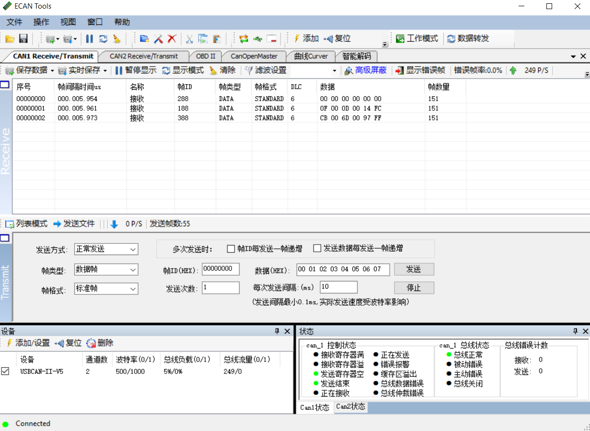

## CAN通讯协议

模块CAN接口遵循以下标准：

* CAN接口符合CANopen协议，所有通讯均使用标准数据帧

* 只使用PTO1-4 传输姿态数据，所有传输均采用标准数据帧，不接收远程帧和拓展数据帧。

* PTO采用异步定时触发模式, 默认输出速率为20Hz

* 当模块上电时，按照CANopen协议，模块会主动发送一条(一次)节点上线报文。节点上电处于预操作状态(pre-operational) 需要主机发送NMT协议将节点设置为operation状态才会开始发送数据

### CANopen 默认设置

| CANopen默认配置 | 值                                                           |
| --------------- | ------------------------------------------------------------ |
| CAN 波特率      | 500KHz                                                       |
| CANopen节点ID   | 8                                                            |
| 初始化状态      | 预操作(Pre-operational),需要发送Start Remote Node命令模块才能开始输出数据 |
| 心跳包          | 无                                                           |

### CANopen PTO传输细节

| PTO通道 | PTO 帧ID | 长度 | PTO 传输方式    | 发送数据 | 说明                                                         |
| ------- | -------- | ---- | --------------- | -------- | ------------------------------------------------------------ |
| TPDO1   | 0x180+ID | 6    | 循环同步(0x01)  | 加速度   | 每轴数据类型为(INT16,低字节在前)，分别为X,Y,Z轴加速度，单位为mG(0.001重力加速度) |
| TPDO2   | 0x280+ID | 6    | 循环同步(0x01)  | 角速度   | 每轴数据类型为(INT16,低字节在前)，分别为X,Y,Z轴角速度，单位为0.1DPS(°/s) |
| TPDO3   | 0x380+ID | 6    | 异步定时(0xFE)  | 欧拉角   | 每轴数据类型为(INT16,低字节在前)，顺序分别为横滚角(Roll,绕X轴旋转),俯仰角(Pitch,绕Y轴旋转),航向角(Yaw绕Z轴旋转)。欧拉角单位为0.01° |
| TPDO4   | 0x380+ID | 8    | 循环同步(0x01)) | 四元数   | 每轴数据类型为(INT16,低字节在前)，分别为$$ q_{w} \ q_{x}\ q_{y}\ q_{z}$$ 。单位四元数扩大10000倍后结果。如四元数为1,0,0,0 时, 输出10000,0,0,0. |

使用USB-CAN工具抓取默认CAN输出包截图如下：

其中 欧拉角(PTO3) CAN帧ID =0x380 + 8(默认ID) = 0x388， 数据为:

* X轴： (0x00 <<8)+ 0x8F = 0x008F = 1.43°
* Y轴： (0xFF<<8)+ 0xCF = 0xFFCF = -0.49°
* Z轴：(0x0F<<8)+ 0xB9 = 0x0FB9=  40.25°

  ### 修改CAN接口配置

数据字典以下位置存放厂商参数配置数据, 可通过CANopen主站修改，掉电保存，重启生效

| 数据字典位置 | 名称     | 值类型    | 默认值 | 说明          |
| ------------ | -------- | --------- | ------ | ------------- |
| 0x2100       | CAN_BAUD | INTEGER32 | 500000 | CAN总线波特率 |
| 0x2101       | NodeID   | INTEGER32 | 8      | 节点ID        |

#### 使能异步触发数据输出

发送标准CANopen协议帧，使用NMT: Start Remote Node命令:

`ID=0x000,DLC=2,DATA=0x01,0x08`

其中 0x01为Start Remote Node指令， 0x08为节点ID

#### 修改CAN波特率

发送标准CANopen协议帧，使用标准快速SDO指令

如将CAN波特率修改为125K, 则发送：

`ID=0x608 ,DLC=8,DATA=0x23,0x00,0x21,0x00,0x48,0xE8,0x01,0x00`(ID=0x608, 长度为8的标准数据帧)

其中 0x01, 0xE8, 0x48 = (0x01<<16) + (0xE8<<8) + 0x48 = 125000, 注意发送ID为(0x600+ID,写SDO命令帧)

如将CAN波特率修改为250K, 则发送：

`ID=0x608 ,DLC=8,DATA=0x23,0x00,0x21,0x00,0x90,0xD0,0x03,0x00`

其中 0x03, 0xD0, 0x90 = (0x03<<16) + (0xD0<<8) + 0x90 = 250000

#### 修改输出速率

发送标准CANopen协议帧，使用标准快速SDO指令:

如修改TPDO3(欧拉角)输出速率为100Hz:(10ms event触发)

`ID=0x608 ,DLC=8,DATA=0x2B,0x02,0x18,0x05,0x0A,0x00,0x00,0x00`

其中 0x00, 0x0A = (0x00<<8) + 0x0A = 10(10ms触发=100Hz)

