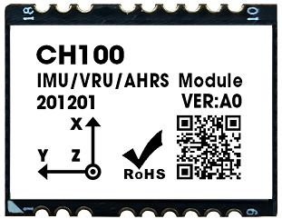
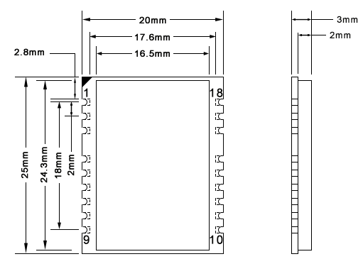

# CH100 用戶手冊
<p style="text-align: right;">IMU/VRU姿態測量模組, Rev 1.0


## 晶片



## 模組

 


<div style="page-break-after: always;"></div>
[TOC]

<div style="page-break-after: always;"></div>
## 簡介

CH100是超核電子推出的一款高性能、小體積、低延時的慣性測量單元(IMU)，本產品整合了三軸加速度計、三軸陀螺儀和一款微控制器。可輸出經過感測器融合算法計算得到的基於當地地理坐標的三維方位數據，包含無絕對參考的相對航向角，俯仰角和橫滾角。同時也可以輸出校準過的原始的感測器數據。

典型應用:

* 機器人/AGV DR SLAM應用
* 無人駕駛/組合導航用IMU


## 特性

### 板載感測器
- 三軸陀螺儀, 最大量程: ±500°/s 
- 三軸加速度計, 最大量程:±8G 
### 數據處理 
- 加速度和陀螺儀出廠前經過三軸非正交和標度因子校準
- 數據融合算法計算並輸出地理坐標系下的旋轉四元數及歐拉角等姿態資訊
### 通訊接口及供電
- TTL序列埠
- 供電電壓：3.3V - 5V
### 其他
- PC端 CH-Center 軟體程序，提供即時數據顯示，波形，校準及excel 數據記錄功能

- 多項模組參數用戶可配置

## 硬體及尺寸

### 硬體參數

| 參數           | 描述                      |
| -------------- | ------------------------- |
| 輸出數據接口   | TTL序列埠                   |
| 工作電壓       | 3.3V - 5V                 |
| 溫度範圍       | -20℃  - 85℃               |
| 最大線性加速度 | 0 - 115 $m/s^2$           |
| 尺寸           | 20 x 25 x 3mm (W x L x H) |
| 板載感測器     | 三軸加速度計 三軸陀螺儀   |

### 尺寸




### 接口定義


| 引腳號 | 名稱   | 說明                                                         |
| ------ | ------ | ------------------------------------------------------------ |
| 1      | VCC    | 電源 3.3V                                                    |
| 2      | GND    | GNS                                                          |
| 3      | EN     | 使能 高電平有效，內部上拉，不需要可懸空                      |
| 4      | SOUT   | 保留,必須懸空                                                |
| 5      | SIN    | 保留,必須懸空                                                |
| 6      | RXD2   | 保留,必須懸空                                                |
| 7      | TXD2   | 保留,必須懸空                                                |
| 8      | GND    | GND                                                          |
| 9      | IO5    | 保留,必須懸空                                                |
| 10     | RSV1   | 保留,必須懸空                                                |
| 11     | TXD1   | 模組序列埠發送 UART TXD (接 MCU 的 RXD)                        |
| 12     | RXD1   | 模組序列埠接收 UART RXD(接 MCU 的 TXD)                         |
| 13     | RSV2   | 保留,必須懸空                                                |
| 14     | CAN_RX | CAN_RX                                                       |
| 15     | CAN_TX | CAN_TX                                                       |
| 16     | RSV3   | 保留,必須懸空                                                |
| 17     | RSV4   | 保留,必須懸空                                                |
| 18     | NRST   | 復位, 內部上拉。>10uS 低電平復位模組。無需外接阻容，建議接到MCU的GPIO引腳以實現軟體復位 |

## 坐標系定義

載體系使用 右-前-上(RFU)坐標系， 地理坐標系使用 東-北-天(ENU)坐標系。其中歐拉角旋轉順序為東-北-天-312(先轉Z軸，再轉X軸，最後轉Y軸)旋轉順序。具體定義如下：

- 繞 Z 軸方向旋轉: 航向角\Yaw\phi($\psi$) 範圍: -180° - 180°
- 繞 X 軸方向旋轉:俯仰角\Pitch\theta($\theta$) 範圍: -90°-90°
- 繞 Y 軸方向旋轉: 橫滾角\Roll\psi(  $\phi$)範圍: -180°-180°

如果將模組視為飛行器的話。Y軸正方向應視為機頭方向。當感測器系與慣性系重合時，歐拉角的理想輸出為:Pitch = 0°, Roll = 0°, Yaw = 0°


## 性能指標

### 姿態角輸出精度

| 姿態角                   | 典型值    | 備註                           |
| ------------------------ | --------- | ------------------------------ |
| 橫滾角\俯仰角 - 靜態誤差 | 0.4°      | 載體低機動平穩運動             |
| 橫滾角\俯仰角 - 動態誤差 | 1.0°      | 載體低機動平穩運動             |
| 運動中航向角精度         | 4° @20min | 載體水平平穩運動且上電後靜止3s |

### 陀螺儀

| 參數          | 值                  | 備註           |
| ------------- | ------------------- | -------------- |
| 測量範圍      | ±500°/s             |                |
| 零偏穩定性X軸 | 3.5°/h            | @25°,1$\sigma$ |
| 零偏穩定性Y軸 | 2°/h | @25°,1$\sigma$ |
| 零偏穩定性Z軸 | 2°/h | @25°,1$\sigma$ |
| 零偏重複性 | 0.035°/s | @25°,1$\sigma$ |
| 非正交誤差 | ±0.1% |  |
| 隨機遊走X軸 | 0.3$°/s\sqrt{h}$ | @25°,1$\sigma$ |
| 隨機遊走Y軸 | 0.3$°/s\sqrt{h}$ | @25°,1$\sigma$ |
| 隨機遊走Z軸 | 0.25$°/s\sqrt{h}$ | @25°,1$\sigma$ |
| 刻度非線性度  | ±0.1%     | 滿量程時(最大) |
| 刻度係數誤差 | ±0.4% | 出廠前校準後 |
| 加速度敏感性  | 0.1°/s/g          |                |

陀螺Allan方差曲線


### 加速度計

| 參數             | 值                        | 備註           |
| ---------------- | ------------------------- | -------------- |
| 測量範圍         | ±8G (1G = 1x 重力加速度 ) |                |
| 零偏穩定性X軸    | 30uG                      | @25°,1$\sigma$ |
| 零偏穩定性Y軸    | 30uG                      | @25°,1$\sigma$ |
| 零偏穩定性Z軸    | 40uG                      | @25°,1$\sigma$ |
| 零偏重複性       | 1.8mG                     | @25°,1$\sigma$ |
| 非正交誤差       | ±0.1%                     | ±0.1%          |
| 隨機遊走X軸      | 0.04$m/s\sqrt{h}$         | @25°,1$\sigma$ |
| 隨機遊走Y軸      | 0.04$m/s\sqrt{h}$         | @25°,1$\sigma$ |
| 隨機遊走Z軸      | 0.06$m/s\sqrt{h}$         | @25°,1$\sigma$ |
| 刻度係數誤差     | ±0.3% (滿量程時)          |                |
| 全溫範圍溫度變化 | 2mg                       | -20  - 85°     |

加速度Allan方差曲線


### 模組數據接口參數

| 參數           | 值                            |
| -------------- | ----------------------------- |
| 序列埠輸出鮑率 | 9600/115200/460800/921600可選 |
| 幀輸出速率     | 1/50/100/200/400Hz 可選       |
| 啟動時間       | <1s                           |


## 感測器校準

1. 加速度計和陀螺儀在出廠前經過比例因子誤差和非正交誤差校準，校準參數保存在模組內部。

2. 陀螺儀的輸出每次上電後會有一個隨機的不為0的bias，稱之為零偏重複性。這個隨機bias不能在出廠前被校準。系統在啟動後1S內認為處於靜止狀態並採集1S的陀螺儀角速度作為初始bias。這個過程稱之為陀螺儀上電自校準。自校準在上電後靜止模組3s 左右可獲得最好的校準效果。**如上電1s內模組處於運動狀態(包括緩慢轉動，振動等)則航向角飄移現象會顯著增大**。 建議使用時每次上電後靜止至少1s。

3. 磁感測器(部分型號支援)出廠前經過橢球校準，但磁感測器很容易受到外界環境磁場干擾，一般都需要客戶重新校準，出廠校準參數意義不大。詳見地磁校準章節。


## 序列埠通訊協議

模組上電後，默認按出廠幀率(通常為100)輸出幀數據，幀格式如下：


| 域名稱  | 值    | 長度(字節) | 說明                                                         |
| ------- | ----- | ---------- | ------------------------------------------------------------ |
| PRE     | 0x5A  | 1          | 固定為0x5A                                                   |
| TYPE    | 0xA5  | 1          | 固定為0xA5                                                   |
| LEN     | 1-512 | 2          | 幀中數據域的長度，低字節在前。長度表示數據域(PAYLOAD)的長度，不包含`PRE`,`TYPE`,`LEN`,`CRC` 字段。 |
| CRC     | -     | 2          | 除CRC 本身外其餘所有字段(`PRE,TYPE,LEN, PAYLOAD`)幀數據的16 位CRC 校驗和。LSB(低字節在前) |
| PAYLOAD | -     | 1-512      | 一幀攜帶的數據。PAYLOAD域 由若干個**子數據包**組成。每個數據包包含數據包標籤和數據兩部分。標籤決定了數據的類型及長度。 |


CRC實現函數：

```
/*
	currectCrc: previous crc value, set 0 if it's first section
	src: source stream data
	lengthInBytes: length
*/
static void crc16_update(uint16_t *currectCrc, const uint8_t *src, uint32_t lengthInBytes)
{
    uint32_t crc = *currectCrc;
    uint32_t j;
    for (j=0; j < lengthInBytes; ++j)
    {
        uint32_t i;
        uint32_t byte = src[j];
        crc ^= byte << 8;
        for (i = 0; i < 8; ++i)
        {
            uint32_t temp = crc << 1;
            if (crc & 0x8000)
            {
                temp ^= 0x1021;
            }
            crc = temp;
        }
    } 
    *currectCrc = crc;
}
```


## 數據包

#### 數據包總覽

| 數據包標籤 | 數據包長度(包含標籤1字節) | 名稱                | 備註     |
| ---------- | ------------------------- | ------------------- | -------- |
| 0x90       | 2                         | 用戶ID              |          |
| 0xA0       | 7                         | 加速度              |          |
| 0xB0       | 7                         | 角速度              |          |
| 0xC0       | 7                         | 磁場強度            |          |
| 0xD0       | 7                         | 歐拉角              |          |
| 0xD1       | 17                        | 四元數              |          |
| 0xF0       | 5                         | 氣壓                | 輸出0    |
| 0x91       | 76                        | IMUSOL(IMU數據集合) | 推薦使用 |

#### 產品支援數據包列表

#### 0x90(用戶ID)

共2字節，用戶設置的ID。

| 字節偏移 | 類型    | 大小 | 單位 | 說明            |
| -------- | ------- | ---- | ---- | --------------- |
| 0        | uint8_t | 1    | -    | 數據包標籤:0x90 |
| 1        | uint8_t | 1    | -    | 用戶ID          |

#### 0xA0(加速度)

共7 個字節，LSB。輸出感測器的原始加速度

| 字節偏移 | 類型    | 大小 | 單位                     | 說明            |
| -------- | ------- | ---- | ------------------------ | --------------- |
| 0        | uint8_t | 1    | -                        | 數據包標籤:0xA0 |
| 1        | int16_t | 2    | 0.001G(1G = 1重力加速度) | X軸加速度       |
| 3        | int16_t | 2    | 0.001G                   | Y軸加速度       |
| 5        | int16_t | 2    | 0.001G                   | Z軸加速度       |

#### 0xB0(角速度)

共7字節，LSB。輸出感測器的原始角速度

| 字節偏移 | 類型    | 大小 | 單位   | 說明             |
| -------- | ------- | ---- | ------ | ---------------- |
| 0        | uint8_t | 1    | -      | 數據包標籤：0xB0 |
| 1        | int16_t | 2    | 0.1°/s | X軸角速度        |
| 3        | int16_t | 2    | 0.1°/s | Y軸角速度        |
| 5        | int16_t | 2    | 0.1°/s | Z軸角速度        |

#### 0xC0(磁場強度)

共7字節，LSB。輸出感測器的原始磁場強度

| 字節偏移 | 類型    | 大小 | 單位       | 說明            |
| -------- | ------- | ---- | ---------- | --------------- |
| 0        | uint8_t | 1    | -          | 數據包標籤:0xC0 |
| 1        | int16_t | 2    | 0.001Gauss | X軸磁場強度     |
| 3        | int16_t | 2    | 0.001Gauss | Y軸磁場強度     |
| 5        | int16_t | 2    | 0.001Gauss | Z軸磁場強度     |

#### 0xD0(歐拉角)

共7字節，LSB。格式為int16，共三個軸，每個軸占2 個字節，順序為Pitch/Roll/Yaw。接收到Roll, Pitch 為物理值乘以100 後得到的數值，Yaw 為乘以10 得到的數值。

例：當接收到的Yaw = 100 時，表示航向角為10°

| 字節偏移 | 類型    | 大小 | 單位  | 說明            |
| -------- | ------- | ---- | ----- | --------------- |
| 0        | uint8_t | 1    | -     | 數據包標籤:0xD0 |
| 1        | int16_t | 2    | 0.01° | Pitch(俯仰角)   |
| 3        | int16_t | 2    | 0.01° | Roll(橫滾角)    |
| 5        | int16_t | 2    | 0.1°  | Yaw(航向角)     |

#### 0XD1(四元數)

共17字節，格式為float，共4個值，順序為:W X Y Z.。每個值占4 字節(float)，整個四元數為4個float，LSB。

| 字節偏移 | 類型    | 大小 | 單位 | 說明            |
| -------- | ------- | ---- | ---- | --------------- |
| 0        | uint8_t | 1    | -    | 數據包標籤:0xD1 |
| 1        | float   | 4    | -    | W               |
| 5        | float   | 4    | -    | X               |
| 9        | float   | 4    | -    | Y               |
| 13       | float   | 4    | -    | Z               |

#### 0XF0(氣壓)

共5字節，格式為float。(只針對有氣壓感測器的產品)

| 字節偏移 | 類型    | 大小 | 單位 | 說明            |
| -------- | ------- | ---- | ---- | --------------- |
| 0        | uint8_t | 1    | -    | 數據包標籤:0xF0 |
| 1        | float   | 4    | Pa   | 大氣壓          |

#### 0X91( IMUSOL)

共76字節，新加入的數據包，用於替代A0,B0,C0,D0,D1等數據包。整合了IMU的感測器原始輸出和姿態解算數據。

| 字節偏移 | 類型     | 大小 | 單位                 | 說明                                                         |
| -------- | -------- | ---- | -------------------- | ------------------------------------------------------------ |
| 0        | uint8_t  | 1    | -                    | 數據包標籤:0x91                                              |
| 1        | uint8_t  | 1    | -                    | ID                                                           |
| 2        | -        | 6    | -                    | 保留                                                         |
| 8        | uint32_t | 4    | ms                   | 時間戳資訊，從系統開機開始累加，每毫秒增加1                  |
| 12       | float    | 12   | 1G(1G = 1重力加速度) | 加速度,順序為：XYZ(注意單位和0xA0包不同)                     |
| 24       | float    | 12   | deg/s                | 角速度,順序為： XYZ(注意單位和0xB0包不同)                    |
| 36       | float    | 12   | uT                   | 磁強度,順序為： XYZ(注意單位和0xC0包不同)                    |
| 48       | float    | 12   | deg                  | 節點歐拉角 順序為：橫滾角(Roll)，俯仰角(Pitch)，航向角(Yaw)(注意順序和單位與0xD0包不同) |
| 60       | float    | 16   | -                    | 節點四元數集合,順序為WXYZ                                    |


### 出廠默認數據包

出廠默認一幀中攜帶數據包數據定義如下：

| 產品  | 默認輸出數據包    |
| ----- | ----------------- |
| HI226 | 90,A0,B0,C0,D0,F0 |
| HI229 | 90,A0,B0,C0,D0,F0 |
| CH100 | 91                |
| CH110 | 91                |

### 數據幀結構示例

#### 數據幀配置為 `0x90,0xA0,0xB0,0xC0,0xD0,0xF0` 數據包

使用序列埠助手採樣一幀數據,共41字節, 前6字節為幀頭, 長度和CRC校驗值。剩餘35字節為數據域。假設數據接收到C語言陣列`buf`中。如下所示:

5A A5 23 00 FD 61 **90** 00 **A0** 55 02 3D 01 E2 02 **B0** FE FF 17 00 44 00 **C0** 80 FF 60 FF 32 FF **D0** 64 F2 6C 0E BB 01 **F0** 00 00 00 00

* 第一步：判斷幀頭，得到數據域長度和幀CRC：

幀頭:`5A` `A5`

幀數據域長度:`23` `00`: (0x00<<8) + 0x23 = 35

幀CRC校驗值:`FD` `61`:(0x61<<8) + 0xFD = 0x61FD

* 第二步： 校驗CRC

```
    uint16_t payload_len;
    uint16_t crc;
    
    crc = 0;
    payload_len = buf[2] + (buf[3] << 8);
    
    /* calulate 5A A5 and LEN filed crc */
    crc16_update(&crc, buf, 4);
    
    /* calulate payload crc */
    crc16_update(&crc, buf + 6, payload_len);
```

得到CRC值為0x61FD, 與幀攜帶的CRC值相同, 幀CRC校驗通過。

* 第三步：接收數據

`90 00`：ID 數據包, 0x90為數據包標籤, ID = 0x00.

`A0 55 02 3D 01 E2 02`:加速度數據包,0xA0為數據包標籤，三軸加速度為：

X軸加速度=  (int16_t)((0x02<<8)+ 0x55) = 597(單位為mG)

Y軸加速度 = (int16_t)((0x01<<8)+ 0x3D) = 317

Z軸加速度= (int16_t)((0x02<<8)+ 0xE2) = 738

`B0 FE FF 17 00 44 00` :角速度數據包,0xB0為數據包標籤，三軸角速度為：

X軸角速度=  (int16_t)((0xFF<<8)+ 0xFE) = -2(單位為0.1°/s)

Y軸角速度 = (int16_t)((0x00<<8)+ 0x17) = 23

Z軸角速度= (int16_t)((0x00<<8)+ 0x44) = 68

`C0 80 FF 60 FF 32 FF` :磁場數據包,0xC0為數據包標籤，三軸磁場為：

X軸角速度=  (int16_t)((0xFF<<8)+ 0x80) = -128 (單位為0.001Gauss)

Y軸角速度 = (int16_t)((0xFF<<8)+ 0x60) =  -160

Z軸角速度= (int16_t)((0xFF<<8)+ 0x32) =  -206

`D0 64 F2 6C 0E BB 01` 歐拉角數據包, 0xD0為數據包標籤

Pitch= (int16_t)((0xF2<<8)+ 0x64) / 100 = -3484 / 100 = -34.84 ° 

Roll= (int16_t)((0x0E<<8)+ 0x6C) / 100 =  3692 / 100 = 36.92°

Yaw = (int16_t)((0x01<<8)+ 0xBB) / 10 =  443 /10 = 44.3°

`F0 00 00 00 00`氣壓數據包，0xF0為數據包標籤

```
float prs;
prs = memcpy(&prs, &buf[37], 4);
```

最後得到結果：

```
id              : 0
acc(G)          :    0.597    0.317    0.738
gyr(deg/s)      :   -0.200    2.300    6.800
mag(uT)         :  -12.800  -16.000  -20.600
eul(R/P/Y)      :   36.920  -34.840   44.300
```


#### 數據幀配置為 `0x91` 數據包

使用序列埠助手採樣一幀數據,共82字節, 前6字節為幀頭, 長度和CRC校驗值。剩餘76字節為數據域。假設數據接收到C語言陣列`buf`中。如下所示:

5A A5 4C 00 6C 51 **91** 00 A0 3B 01 A8 02 97 BD BB 04 00 9C A0 65 3E A2 26 45 3F 5C E7 30 3F E2 D4 5A C2 E5 9D A0 C1 EB 23 EE C2 78 77 99 41 AB AA D1 C1 AB 2A 0A C2 8D E1 42 42 8F 1D A8 C1 1E 0C 36 C2 E6 E5 5A 3F C1 94 9E 3E B8 C0 9E BE BE DF 8D BE

* 第一步：判斷幀頭，得到數據域長度和幀CRC：

幀頭:`5A` `A5`

幀數據域長度:`4C` `00`: (0x00<<8) + 0x4C = 76

幀CRC校驗值:`6C` `51`:(0x51<<8) + 0x6C = 0x516C

* 第二步： 校驗CRC

```
    uint16_t payload_len;
    uint16_t crc;
    
    crc = 0;
    payload_len = buf[2] + (buf[3] << 8);
    
    /* calulate 5A A5 and LEN filed crc */
    crc16_update(&crc, buf, 4);
    
    /* calulate payload crc */
    crc16_update(&crc, buf + 6, payload_len);
```

得到CRC值為0x516C. 幀CRC校驗通過。

* 第三步：接收數據

從`0x91`開始為數據包的數據域。在C語言中可以定義結構體來方便的讀取數據：

定義0x91數據包結構體如下：

```
__packed typedef struct
{
    uint8_t     tag;                /* 數據標籤:0x91 */
    uint8_t     id;					/* 模組ID */
    uint8_t     rev[6];             /* reserved */
    uint32_t    ts;                 /* 時間戳 */
    float       acc[3];				/* 加速度 */
    float       gyr[3];				/* 角速度 */
    float       mag[3];				/* 地磁 */
    float       eul[3];             /* 歐拉角: Roll,Pitch,Yaw */
    float       quat[4];            /* 四元數 */
}id0x91_t;
```

`__packed` 為編譯器關鍵字(Keil下)，表示結構體按字節緊對齊，結構體每一個元素一一對應0x91數據包的結構定義。接收數據時將接收到的陣列直接memcpy到結構體即可：(注意定義結構體時必須4字節對齊), 其中`buf `指向幀頭, `buf[6]`指向幀中數據域 。

```
    /* 接收數據並使用0x91數據包結構定義來解釋數據 */
    __align(4) id0x91_t dat;    /* struct must be 4 byte aligned */
    memcpy(&dat, &buf[6], sizeof(id0x91_t));
```

最後得到dat數據結果：

```
id              : 0
timestamp       : 310205
acc             :    0.224    0.770    0.691
gyr             :  -54.708  -20.077 -119.070
mag             :   19.183  -26.208  -34.542
eul(R/P/Y)      :   48.720  -21.014  -45.512
quat            :    0.855    0.310   -0.310   -0.277
```


## CAN通訊協議

本產品CAN接口遵循以下標準：

* CAN接口符合CANopen協議，所有通訊均使用標準數據幀，只使用PTO1-4 傳輸數據，所有傳輸均採用標準數據幀，不接收遠程幀和拓展數據幀
* PTO採用異步定時觸發模式, 默認輸出速率為50Hz
* 當模組上電時，按照CANopen協議，模組會主動發送一條(一次)節點上線報文。節點上電處於預操作狀態(pre-operational), 需要主機發送NMT協議將節點設置為operation狀態才會開始發送數據


### CANopen 默認設置

| CANopen默認配置 | 值                                                           |
| --------------- | ------------------------------------------------------------ |
| CAN 鮑率      | 500KHz                                                       |
| CANopen節點ID   | 8                                                            |
| 初始化狀態      | 預操作(Pre-operational),需要發送Start Remote Node命令模組才能開始輸出數據(見下節) |
| 心跳包          | 無                                                           |


### CANopen TPTO

| PTO通道 | PTO 幀ID | 長度 | PTO 傳輸方式   | 異步輸出頻率（Hz） | 發送數據 | 說明                                                         |
| ------- | -------- | ---- | -------------- | ------------------ | -------- | ------------------------------------------------------------ |
| TPDO1   | 0x180+ID | 6    | 異步定時(0xFE) | 20                 | 加速度   | 每軸數據類型為(INT16,低字節在前)，分別為X,Y,Z軸加速度，單位為mG(0.001重力加速度) |
| TPDO2   | 0x280+ID | 6    | 異步定時(0xFE) | 20                 | 角速度   | 每軸數據類型為(INT16,低字節在前)，分別為X,Y,Z軸角速度，單位為0.1DPS(°/s) |
| TPDO3   | 0x380+ID | 6    | 異步定時(0xFE) | 20                 | 歐拉角   | 每軸數據類型為(INT16,低字節在前)，順序分別為橫滾角(Roll,繞X軸旋轉),俯仰角(Pitch,繞Y軸旋轉),航向角(Yaw繞Z軸旋轉)。歐拉角單位為0.01° |
| TPDO4   | 0x480+ID | 8    | 異步定時(0xFE) | 20                 | 四元數   | 每軸數據類型為(INT16,低字節在前)，分別為$$ q_{w} \ q_{x}\ q_{y}\ q_{z}$$ 。單位四元數擴大10000倍後結果。如四元數為1,0,0,0 時, 輸出10000,0,0,0. |


使用USB-CAN工具抓取默認CAN輸出包截圖如下：


其中歐拉角(PTO3) CAN幀ID =0x380 + 8(默認ID) = 0x388， 數據為:

* X軸： (0x00 <<8)+ 0x8F = 0x008F = 1.43°
* Y軸： (0xFF<<8)+ 0xCF = 0xFFCF = -0.49°
* Z軸：(0x0F<<8)+ 0xB9 = 0x0FB9=  40.25°


  ### CAN接口編程示例

#### 1. 使能數據輸出(開啟異步觸發)

發送標準CANopen協議幀，使用NMT: Start Remote Node命令:

`ID=0x000,DLC=2,DATA=0x01,0x08`

其中 0x01為Start Remote Node指令， 0x08為節點ID


#### 2. 修改CAN鮑率，輸出速率及輸出幀資訊
數據字典以下位置存放廠商參數配置數據, 可通過CANopen 發送快速SDO指令修改，**掉電保存，重新上電生效**。

| 數據字典位置 | 子偏移 | 名稱     | 值類型    | 默認值 | 說明          |
| ------------ | ------ | -------- | --------- | ------ | ------------- |
| 0x2100       | 0      | CAN_BAUD | INTEGER32 | 500000 | CAN總線鮑率 |
| 0x2101       | 0      | NodeID   | INTEGER32 | 8      | 節點ID        |

以上配置操作均使用快速SDO來寫數據字典, 其中TPDO通道與其對應的參數索引為：

| PTO通道 | PTO 幀ID | TPDO參數索引地址(CANopen協議默認定義) |
| ------- | -------- | ------------------------------------- |
| TPDO1   | 0x180+ID | 0x1800                                |
| TPDO2   | 0x280+ID | 0x1801                                |
| TPDO3   | 0x380+ID | 0x1802                                |
| TPDO4   | 0x480+ID | 0x1803                                |

##### 示例1: 修改CAN鮑率

如將CAN鮑率修改為125K, 則發送：

`ID=0x608 ,DLC=8,DATA=0x23,0x00,0x21,0x00,0x48,0xE8,0x01,0x00`(ID=0x608, 長度為8的標準數據幀)

* 0x23為SDO寫四個字節指令 
* 0x00, 0x21為寫0x2100索引
* 0x00, 0x01, 0xE8, 0x48 = (0x00<<24) + (0x01<<16) + (0xE8<<8) + 0x48 = 125000

如將CAN鮑率修改為250K, 則發送：

`ID=0x608 ,DLC=8,DATA=0x23,0x00,0x21,0x00,0x90,0xD0,0x03,0x00`

* 0x23為SDO寫四個字節指令 
* 0x00, 0x21為寫0x2100索引
* 0x00, 0x03, 0xD0, 0x90 = (0x00<<24) + (0x03<<16) + (0xD0<<8) + 0x90 = 250000

##### 示例2: 修改節點ID

如將設備CANopen節點ID改為9, 則發送：

`ID=0x608 ,DLC=8,DATA=0x23,0x01,0x21,0x00,0x09,0x00,0x00,0x00`

* 0x23為SDO寫四個字節指令  
* 0x01, 0x21為寫0x2101索引
* 0x09 0x00, 0x00, 0x00 = (0x00<<24) + (0x00<<16) + (0x00<<8) + 0x09 = 9

注意，修改節點ID後重新上電生效，且生效後發送啟動節點命令(比如節點啟動命令數據變為01 09)和SDO指令(發送CAN幀ID變為0x609)時注意為新的地址

##### 示例3: 修改數據輸出速率

發送標準CANopen協議幀，使用標準快速SDO指令:(此項配置立即生效，掉電不保存)

修改TPDO3(歐拉角)輸出速率為20Hz(每50ms輸出一次):

`ID=0x608 ,DLC=8,DATA=0x2B,0x02,0x18,0x05,0x32,0x00,0x00,0x00`

其中 

* 0x2B為SDO寫兩個字節指令 
* 0x02, 0x18為寫0x1802索引,
* 0x05為子索引
* 0x00, 0x32= (0x00<<8) + 0x32 = 50(1ms為單位)，後面不足補0.

##### 示例4: 關閉TPDO輸出

例：關閉TPDO2定時輸出，則需要寫0x1801索引，子索引為0x05, 寫入值為0x0000:

`ID=0x608 ,DLC=8,DATA=0x2B,0x01,0x18,0x05,0x00,0x00,0x00,0x00`

其中 

* 0x2B為SDO寫兩個字節指令 
*  0x01, 0x18為寫0x1801索引
*  0x05子索引
* 0x00, 0x00= (0x00<<8) + 0x00 = 0，後面不足補0.


## AT指令

當使用序列埠與模組通訊時, 模組支援AT 指令集配置/查看模組參數。AT 指令總以ASCII 碼`AT` 開頭，後面跟控制字符，最
後以回車換行`\r\n`結束。可使用序列埠調試助手進行測試：


通用模組 AT指令如下

| 指令      | 功能                   | 掉電保存(Y) | 立即生效(Y),復位生效(R) | 備註         |
| --------- | ---------------------- | ----------- | ----------------------- | ------------ |
| AT+ID     | 設置模組用戶ID         | Y           | R                       |              |
| AT+INFO   | 打印模組資訊           | N           | Y                       |              |
| AT+ODR    | 設置模組序列埠輸出幀頻率 | Y           | R                       |              |
| AT+BAUD   | 設置序列埠鮑率         | Y           | R                       |              |
| AT+EOUT   | 數據輸出開關           | N           | Y                       |              |
| AT+RST    | 復位模組               | N           | Y                       | 重啟模組 |
| AT+TRG    | 單次輸出觸發           | N           | Y                       | 不支援 |
| AT+SETPTL | 設置輸出數據包         | Y           | Y                       |  |
| AT+MODE   | 設置模組工作模式       | Y           | R                       | 不支援 |
| AT+GWID   | 設置無線接收機ID        | Y           | R                       | 不支援 |


##### AT+ID

設置模組用戶ID

**例** `AT+ID=1`

##### AT+INFO

打印模組資訊，包括產品型號，版本，韌體發佈日期等。


##### AT+ODR

設置模組序列埠輸出速率。 掉電保存，復位模組生效

**例** 設置序列埠輸出速率為100Hz:  `AT+ODR=100` 

注意：當ODR設置為比較高時(如200),默認的115200鮑率可能不滿足輸出頻寬要求，此時需要將模組鮑率設高(如921600)後，模組才能按設置的ODR輸出數據幀。

##### AT+BAUD

設置序列埠鮑率，可選值：9600/115200/460800/921600`

**例**  `AT+BAUD=115200`

**注意**

- 使用此指令需要特別注意，輸入錯誤鮑率後會導致無法和模組通訊
- 鮑率參數設置好後掉電保存，復位模組生效。 CH-Center 軟體的鮑率也要做相應修改。
- 升級韌體時，需要切換回115200 鮑率。

##### AT+EOUT

序列埠輸出開關

**例** 打開序列埠輸出 `AT+EOUT=1`   關閉序列埠輸出 `AT+EOUT=0`

##### AT+RST

復位模組

**例** `AT+RST`

##### AT+SETPTL

設置輸出協議:

設置一幀中所包含的數據包：格式為`AT+SETPTL=<ITEM_ID>,<ITEM_ID>...`

**例**

* 配置模組輸出: 91數據包(IMUSOL),指令為:`AT+SETPTL=91`
* 配置模組輸出:加速度(A0)，角速度(B0), 整形格式歐拉角(D0)和四元數(D1)的指令為：`AT+SETPTL=A0,B0,D0,D1`


##### AT+URFR

這條指令提供了旋轉感測器XYZ軸的接口：

`AT+URFR=C00,C01,C02,C10,C11,C12,C20,C21,C22` 

其中  $C_{nn}$  支援浮點數 

$$
\left\{\begin{array}{l}{X} \\ {Y} \\ {Z}\end{array}\right\}_{U}=\left[\begin{array}{lll}{C 00} & {C 01} & {C 02} \\ {C 10} & {C 11} & {C 12} \\ {C 20} & {C 21} & {C 22}\end{array}\right] \cdot\left\{\begin{array}{l}{X} \\ {Y} \\ {Z}\end{array}\right\}_{B}
$$


其中$\left\{\begin{array}{l}{X} \\ {Y} \\ {Z}\end{array}\right\}_{U}$為旋轉後的 感測器坐標系下 感測器數據，$\left\{\begin{array}{l}{X} \\ {Y} \\ {Z}\end{array}\right\}_{B}$為旋轉前 感測器坐標系下 感測器數據


下面是幾種常用旋轉舉例：

- 新感測器坐標系為 繞原坐標系X軸 旋轉 90°， 輸入命令：`AT+URFR=1,0,0,0,0,1,0,-1,0`
- 新感測器坐標系為 繞原坐標系X軸 旋轉-90°， 輸入命令：`AT+URFR=1,0,0,0,0,-1,0,1,0`
- 新感測器坐標系為 繞原坐標系X軸 旋轉180°， 輸入命令：`AT+URFR=1,0,0,0,-1,0,0,0,-1`
- 新感測器坐標系為 繞原坐標系Y軸 旋轉 90°， 輸入命令：`AT+URFR= 0,0,-1,0,1,0,1,0,0`
- 新感測器坐標系為 繞原坐標系Y軸 旋轉-90°， 輸入命令：`AT+URFR= 0,0,1,0,1,0,-1,0,0`
- 新感測器坐標系為 繞原坐標系Y軸 旋轉180°， 輸入命令：`AT+URFR= -1,0,0,0,1,0,0,0,-1`
- 新感測器坐標系為 繞原坐標系Z軸 旋轉90°， 輸入命令：`AT+URFR= 0,-1,0,1,0,0,0,0,1`
- 恢復默認值：`AT+URFR=1,0,0,0,1,0,0,0,1`


## 附錄A - 韌體升級與恢復出廠設置

本產品支援升級韌體。
韌體升級步驟:

- 連接模組，打開 CH-Center 軟體，將模組和 CH-Center 軟體鮑率都設置為115200. 打開韌體升級窗口
- 點擊連接按鈕，如出現模組連接資訊。則說明升級系統準備就緒，點擊文件選擇器(…)選擇附檔名為.hex 的韌體，然後點擊開始編程。下載完成後會提示編程完成，此時關閉序列埠，重新給模組上電，模組升級完成。


