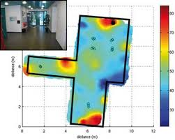
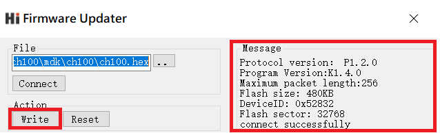

# HI221/HI221 Dongle 用戶手冊
<p style="text-align: right;">HI221 無線傳輸模組及接收器, Rev 1.0


<div style="page-break-after: always;"></div>
[TOC]

<div style="page-break-after: always;"></div>
## 簡介

H221/HI221 Dongle是超核電子推出的一款高性能、小體積、低延遲的慣性測量單元（IMU），本產品整合了三軸加速度計、三軸陀螺儀以及一款低功耗微處理器。可輸出經過感測器融合算法計算得到的基於當地地理坐標的三維方位數據，包含橫滾角、俯仰角以及以相對的航向角。同時也可以輸出原始的感測器數據。HI221 由**HI221 Dongle(接收機)** 和 **HI221(姿態模組)**組成。一個HI221 Dongle和最多16個HI221模組組成星形網絡結構。每個HI221可輸出最高達100Hz的即時姿態數據。


## 特性

### 板載感測器

- 三軸陀螺儀, 最大量程: ±2000°/s 輸出速率 2000Hz
- 三軸加速度計, 最大量程:±8g 輸出速率 125Hz
- 三軸地磁場感測器，最大量程: 800mG 內部採樣率 100Hz

### 通訊接口及供電

- 序列埠(兼容TTL 可直接與5V 或3.3V 序列埠設備連接)
- 供電電壓：3.3 (+/- 100 mV)
- 最大峰值功耗：120mA(RF Tx發射)

## 硬體及尺寸(節點)

### 硬體參數

| 參數               | 值                                       |
| ------------------ | ---------------------------------------- |
| 輸出數據接口       | UART(TTL 1.8V - 3.3V) 或者 2.4RF Radio   |
| 工作電壓           | 3.3V (± 100mV)                           |
| 工作電流           | 30mA                                     |
| 待機電流           | 20uA                                     |
| 充電後平均工作時長 | 8h                                       |
| 溫度範圍           | -20℃  - 85 ℃                             |
| 最大線性加速度     | 0 - 115 $m/s^2$                          |
| 尺寸               | 20 x 38 x 8.5mm (W x L x H)              |
| 板載感測器         | 三軸加速度計 三軸陀螺儀 三軸地磁場感測器 |

## 坐標系定義

載體系使用 前-左-上(FLU)右手坐標系， 地理坐標系使用 北-西-天(NWU)坐標系。其中歐拉角旋轉順序為 ZYX(先轉Z軸，再轉Y軸，最後轉X軸)旋轉順序。具體定義如下：

- 繞 Z 軸方向旋轉: 航向角\Yaw\phi($\psi$) 範圍: -180° - 180°
- 繞 Y 軸方向旋轉: 俯仰角\Pitch\theta($\theta$) 範圍: -90°-90°
- 繞 X 軸方向旋轉:橫滾角\Roll\psi(  $\phi$)範圍: -180°-180°

如果將模組視為飛行器的話。X 軸應視為機頭方向。當感測器系與慣性系重合時，歐拉角的理想輸出為:Pitch = 0°, Roll = 0°, Yaw = 0°

## 性能指標

### 姿態角輸出精度

| 姿態角                                      | 典型值 |
| ------------------------------------------- | ------ |
| 橫滾角\俯仰角 - 靜態                        | 0.8°   |
| 橫滾角\俯仰角 - 動態                        | 2.5°   |
| 運動中航向角精度(9軸模式下,無磁干擾,校準後) | 3°     |

### 陀螺儀

| 參數     | 值       |
| -------- | -------- |
| 測量範圍 | ±2000°/s |
| 非線性度 | ±0.1%    |
| 採樣率   | 2000Hz   |

### 加速度計

| 參數         | 值    |
| ------------ | ----- |
| 測量範圍     | ±8G   |
| 非線性度     | ±0.5% |
| 最大零點偏移 | 30mG  |
| 採樣率       | 125Hz |

### 磁感測器參數

| 參數     | 值      |
| -------- | ------- |
| 測量範圍 | ±8Gauss |
| 非線性度 | ±0.1%   |
| 採樣率   | 100Hz   |

### 模組數據接口參數(UART)

| 參數           | 值                       |
| -------------- | ------------------------ |
| 序列埠輸出鮑率 | 115200/460800/921600可選 |
| 幀輸出速率     | 1/25/50/100Hz 可選       |

### 模組數據接口參數(2.4G RF)

| 參數                     | 值    |
| ------------------------ | ----- |
| 空中鮑率               | 2Mbps |
| 幀速率(每個節點均可達到) | 100Hz |
| 接收器最大連接節點數     | 16    |

## 感測器校準

1. 加速度計和陀螺儀在出廠前經過比例因子誤差和非正交誤差校準，校準參數保存在模組內部。

2. 陀螺儀的輸出每次上電後會有一個隨機的不為0的bias，稱之為零偏重複性。這個隨機bias不能在出廠前被校準。系統在啟動後1S內認為處於靜止狀態並採集1S的陀螺儀角速度作為初始bias。這個過程稱之為陀螺儀上電自校準。自校準在上電後靜止模組3s 左右可獲得最好的校準效果。**如上電1s內模組處於運動狀態(包括緩慢轉動，振動等)則航向角飄移現象會顯著增大**。 建議使用時每次上電後靜止至少1s。

3. 磁感測器(部分型號支援)出廠前經過橢球校準，但磁感測器很容易受到外界環境磁場干擾，一般都需要客戶重新校準，出廠校準參數意義不大。詳見地磁校準章節。


### 地磁校準

#### 磁干擾分類

| 種類                 | 定義                                         | 典型干擾源                                                   | 影響                                                         | 措施                                   |
| -------------------- | -------------------------------------------- | ------------------------------------------------------------ | ------------------------------------------------------------ | -------------------------------------- |
| 空間磁場干擾         | 干擾不隨感測器運動而運動，而處於世界坐標系下 | 各種固定的磁干擾源，傢俱，家用電器，電纜，房屋內的鋼筋結構等。一切不隨磁感測器運動而運動的干擾源 | 無論磁場感測器是否校準的好，這些空間磁場的干擾(或者說環境磁場不均勻)都會使得空間地磁場發生畸變。地磁補償會錯誤並且無法獲得正確的航向角。他們是造成室內地磁融合難以使用的主要元兇。這種干擾不能被校準, 會嚴重影響地磁性能。空間磁場干擾在室內尤其嚴重。 | 模組內置的勻質磁場檢測及屏蔽非勻質磁場 |
| 感測器坐標系下的干擾 | 干擾源隨感測器運動而運動                     | 模組PCB，與模組固定在一起的板子，儀器設備，產品等。他們和磁感測器視為同一個剛體，隨磁感測器運動而運動 | 對感測器造成硬磁/軟磁干擾。這些干擾可以通過地磁校準算法加以很好的消除。 | 地磁校準                               |

下圖是一個典型的室內磁場分佈圖。可以看到：一般室內環境的空間磁場畸變是比較嚴重的。



**注意**

在室內環境下，空間磁場干擾尤其嚴重，而且空間磁干擾並不能通過校準來消除。在室內環境下，儘管模組內置均質磁場檢測及屏蔽機制，但9軸模式航向角的準確度很大程度上取決於室內磁場畸變程度，如果室內磁場環境很差(如電腦機房旁，電磁實驗室，車間 ，地下車庫等等)，即使校準後， 9軸的航向角精度可能還不如6軸甚至會出現大角度誤差。

#### 6軸和9軸模式區別

正因為地磁場非常容易受到空間干擾，所以使用9軸模式時應非常注意。下表列舉了不同的使用場合和工況下的使用建議

| 模式    | 適用環境     | 典型應用                                                     | 優點                                                         | 缺點                                                         | 注意事項                         |
| ------- | ------------ | ------------------------------------------------------------ | ------------------------------------------------------------ | ------------------------------------------------------------ | -------------------------------- |
| 6軸模式 | 各種環境     | 雲台等低動態姿態檢測，室內機器人                             | 1. 姿態角輸出穩定性好 2. 完全不受磁場干擾                    | 航向角隨時間緩慢漂移                                         | 航向角會隨時間緩慢飄移且無法補償 |
| 9軸模式 | 無磁干擾環境 | 1.指南針，尋北系統 2. 空曠且磁干擾較少的室內，模組基本不會大範圍在室內移動(典型的如攝影棚內動作捕捉，且被測者不會做大範圍走動) | 1. 航向角不會隨時間漂移 2.一旦檢測到地磁場可快速修正航向角指北 | 任何磁干擾都會出現航向角準確度下降。室內干擾嚴重情況下 航向角無法指向正確方向。另外，移動機器人的金屬結構和電機運行時會產生非常強的磁干擾，所以移動機器人平台不適用於9軸模式。 | 首次使用前需要校準地磁感測器     |


模組的自動地磁校準系統只能處理和模組安裝在一起的，固定的磁場干擾。安裝環境如果有磁場干擾，這種干擾必須是固定的，並且這個干擾磁場與模組 安裝之後不會再發生距離變化(例：模組安裝在一個鐵材料之上，因為鐵會有磁場干擾， 這時就需要把鐵與模組一起旋轉校準，並且這個鐵在使用當中是不會和羅盤再分開的(發生相對位移)，一 旦分開是需要再重新校準。如果這個鐵大小是不固定的，或與羅盤的距離變化也不是固定 的，這種干擾是無法校準，即使校準成功，也會精度非常差，只能避而遠之安裝。安全距離控制在 40CM 以上)。

#### 校準方法

本模組整合了主動無干預地磁校準算法,模組會自動收集地磁場資訊並進行硬磁軟磁校準參數估計，校準成功後校準資訊會保存在模組Flash上。**用戶無須任何操作/指令即可實現地磁校準**。首次使用時，模組會自動採集周圍地磁場，並嘗試計算地磁感測器校準參數。當首次使用模組並且需要使用9軸模式時，應進行如下校準操作：


在盡量小範圍內，緩慢的讓模組運動和旋轉，或者進行8字運動 或者分別繞每個軸360度，讓模組經歷盡量多的姿態。一般情況下，如果地磁干擾在可接受的範圍內，即可完成校準。如果後面在同樣地磁環境下(同地點)，則無需再次校準。如果始終沒能成功校準模組，說明周圍地磁場干擾比較大。


地磁校準狀態可以使用AT指令來查看：

發送`AT+INFO=HSI` 指令，模組會打印當前地磁校準系統狀態：


| 參數顯示    | 意義       | 說明                                                         |
| ----------- | ---------- | ------------------------------------------------------------ |
| valid       | 有效標誌   | 0: 不存在有效校準參數(沒有校準或者從來沒有校準成功過)。非0：地磁校準完成 |
| fiterr      | 擬合殘差   | 殘差越小，說明參數擬合效果越好，通常在0.03以下說明校準結果已經足夠好。如果擬合結果始終>0.1，說明地磁干擾很大，最好再次校準以期得到更好的校準結果。擬合殘差會隨著時間緩慢增長。 |
| flux        | 當地磁場   | 最近一次擬合器估計出的地磁場強 ，單位為uT                    |
| inclination | 當地磁傾角 | 最近一次擬合器估計出的磁傾角，單位為°                        |


* 雖然地磁參數估計可以在線自動採集數據，自動的動態擬合地磁校準參數。但是如果周圍地磁環境改變(比如需要到另外房間或者室內室外切換)，最好還需重複手工校準操作。


## 序列埠通訊協議

模組上電後，默認按出廠幀率(通常為100)輸出幀數據，幀格式如下：


| 域名稱  | 值    | 長度(字節) | 說明                                                         |
| ------- | ----- | ---------- | ------------------------------------------------------------ |
| PRE     | 0x5A  | 1          | 固定為0x5A                                                   |
| TYPE    | 0xA5  | 1          | 固定為0xA5                                                   |
| LEN     | 1-512 | 2          | 幀中數據域的長度，低字節在前。長度表示數據域(PAYLOAD)的長度，不包含`PRE`,`TYPE`,`LEN`,`CRC` 字段。 |
| CRC     | -     | 2          | 除CRC 本身外其餘所有字段(`PRE,TYPE,LEN, PAYLOAD`)幀數據的16 位CRC 校驗和。LSB(低字節在前) |
| PAYLOAD | -     | 1-512      | 一幀攜帶的數據。PAYLOAD域 由若干個**子數據包**組成。每個數據包包含數據包標籤和數據兩部分。標籤決定了數據的類型及長度。 |


CRC實現函數：

```
/*
	currectCrc: previous crc value, set 0 if it's first section
	src: source stream data
	lengthInBytes: length
*/
static void crc16_update(uint16_t *currectCrc, const uint8_t *src, uint32_t lengthInBytes)
{
    uint32_t crc = *currectCrc;
    uint32_t j;
    for (j=0; j < lengthInBytes; ++j)
    {
        uint32_t i;
        uint32_t byte = src[j];
        crc ^= byte << 8;
        for (i = 0; i < 8; ++i)
        {
            uint32_t temp = crc << 1;
            if (crc & 0x8000)
            {
                temp ^= 0x1021;
            }
            crc = temp;
        }
    } 
    *currectCrc = crc;
}
```


## 數據包

#### 數據包總覽

| 數據標籤 | 數據包長度(包含標籤1字節) | 名稱                    | 備註                  |
| -------- | ------------------------- | ----------------------- | --------------------- |
| 0x91     | 76                        | IMUSOL(IMU數據集合)     | HI221輸出數據包       |
| 0x62     | 變長                      | GWSOL(無線節點數據集合) | HI221Dongle輸出數據包 |


#### 0X91( IMUSOL)

共76字節。整合了IMU的感測器原始輸出和姿態解算數據。

| 字節偏移 | 類型     | 大小 | 單位                 | 說明                                                         |
| -------- | -------- | ---- | -------------------- | ------------------------------------------------------------ |
| 0        | uint8_t  | 1    | -                    | 數據包標籤:0x91                                              |
| 1        | uint8_t  | 1    | -                    | ID                                                           |
| 2        | -        | 6    | -                    | 保留                                                         |
| 8        | uint32_t | 4    | ms                   | 時間戳資訊，從系統開機開始累加，每毫秒增加1                  |
| 12       | float    | 12   | 1G(1G = 1重力加速度) | X,Y,Z軸的加速度                                              |
| 24       | float    | 12   | deg/s                | X,Y,Z軸的角速度                                              |
| 36       | float    | 12   | uT                   | X,Y,Z軸的磁場強度                                            |
| 48       | float    | 12   | deg                  | 節點歐拉角集合, 順序為：橫滾角(Roll)，俯仰角(Pitch)，航向角(Yaw) |
| 60       | float    | 16   | -                    | 節點四元數集合,順序為WXYZ                                    |

#### 0x62(GWSOL)

無線接收機的預設數據包。數據包前8個字節為接收機資訊。後面分為N個數據塊。每個數據塊描述一個節點的姿態數據(最大支援16個節點)。每個數據塊大小為76字節，數據結構同0x91。

此協議包數據量較大，建議將HI221Dongle鮑率調整至460800或921600以獲得最高的幀率輸出。格式如下：

| 字節偏移                 | 大小 | 類型    | 單位 | 說明                      |
| ------------------------ | ---- | ------- | ---- | ------------------------- |
| 0                        | 1    | uint8_t | -    | 數據包標籤:0x62           |
| 1                        | 1    | uint8_t | -    | GWID, 接收機網絡ID        |
| 2                        | 1    | uint8_t | -    | N, 此幀包含節點數據塊個數 |
| 3                        | 5    | -       | -    | 保留                      |
| *----節點數據塊開始----* | -    | -       | -    | *數據結構同0x91*          |
| 8+76*N(N=0-15)           | 1    | uint8_t | -    | 數據包標籤:0x91           |
| 9+76*N(N=0-15)           | 1    | uint8_t | -    | 節點N的ID                 |
| 10+76*N                  | 10   | -       | -    | 保留                      |
| 20+76*N                  | 12   | float   | -    | 節點N三軸加速度           |
| 32+76*N                  | 12   | float   | -    | 節點N三軸角速度           |
| 44+76*N                  | 12   | float   | -    | 節點N軸磁場強度           |
| 56+76*N                  | 12   | float   | -    | 節點N歐拉角               |
| 68+76*N                  | 16   | float   | -    | 節點N四元數               |
| *----節點數據塊結束----* | -    | -       | -    | -----------               |

#### 0x63(GWSOL FOR RAW DATA)

無線接收機支持此數據包，為達成 400Hz 的幀率，僅留下加速度與角速度。數據包前8個字節為接收機資訊。後面分為N個數據塊。每個數據塊描述一個節點的姿態數據(最大支持16個節點)。每個數據塊大小為24字節。

此協議包數據量較大，建議將鮑率調整至 460800 獲得穩定的幀率輸出。格式如下：

| 字節偏移                 | Bytes | 類型    | 單位 | 說明                      |
| ------------------------ | ----- | ------- | ---- | ------------------------- |
| 0                        | 1     | uint8_t | -    | 數據包標籤:0x62           |
| 1                        | 1     | uint8_t | -    | GWID, 接收機網絡ID        |
| 2                        | 1     | uint8_t | -    | N, 此幀包含節點數據塊個數 |
| 3                        | 5     | -       | -    | 保留                      |
| *----節點數據塊開始----* | -     | -       | -    | *數據結構同0x91*          |
| 8+24*N(N=0-15)           | 1     | uint8_t | -    | 數據包標籤:0x91           |
| 9+24*N(N=0-15)           | 1     | uint8_t | -    | 節點N的ID                 |
| 10+24*N                  | 10    | -       | -    | 保留                      |
| 20+24*N                  | 6     | int16_t | -    | 節點N三軸加速度           |
| 26+24*N                  | 6     | int16_t | -    | 節點N三軸角速度           |
| *----節點數據塊結束----* | -     | -       | -    | -----------               |

### 出廠默認數據包

出廠默認一幀中攜帶數據包數據定義如下：

| 產品        | 默認輸出數據包 |
| ----------- | -------------- |
| HI221       | 0x91           |
| HI221Dongle | 0x62           |

### 數據幀結構示例

#### 數據幀配置為 `0x91` 數據包

使用序列埠助手採樣一幀數據,共82字節, 前6字節為幀頭, 長度和CRC校驗值。剩餘76字節為數據域。假設數據接收到C語言陣列`buf`中。如下所示:

5A A5 4C 00 6C 51 **91** 00 A0 3B 01 A8 02 97 BD BB 04 00 9C A0 65 3E A2 26 45 3F 5C E7 30 3F E2 D4 5A C2 E5 9D A0 C1 EB 23 EE C2 78 77 99 41 AB AA D1 C1 AB 2A 0A C2 8D E1 42 42 8F 1D A8 C1 1E 0C 36 C2 E6 E5 5A 3F C1 94 9E 3E B8 C0 9E BE BE DF 8D BE

* 第一步：判斷幀頭，得到數據域長度和幀CRC：

幀頭:`5A` `A5`

幀數據域長度:`4C` `00`: (0x00<<8) + 0x4C = 76

幀CRC校驗值:`6C` `51`:(0x51<<8) + 0x6C = 0x516C

* 第二步： 校驗CRC

```
    uint16_t payload_len;
    uint16_t crc;
    
    crc = 0;
    payload_len = buf[2] + (buf[3] << 8);
    
    /* calulate 5A A5 and LEN filed crc */
    crc16_update(&crc, buf, 4);
    
    /* calulate payload crc */
    crc16_update(&crc, buf + 6, payload_len);
```

得到CRC值為0x516C. 幀CRC校驗通過。

* 第三步：接收數據

從`0x91`開始為數據包的數據域。在C語言中可以定義結構體來方便的讀取數據：

定義0x91數據包結構體如下：

```
__packed typedef struct
{
    uint8_t     tag;                /* data packet tag */
    uint8_t     id;
    uint8_t     rev[6];             /* reserved */
    uint32_t    ts;                 /* timestamp */
    float       acc[3];
    float       gyr[3];
    float       mag[3];
    float       eul[3];             /* eular angles: Roll,Pitch,Yaw */
    float       quat[4];            /* quaternion */
}id0x91_t;
```

`__packed` 為編譯器關鍵字(Keil下)，表示結構體按字節緊對齊，結構體每一個元素一一對應0x91數據包的結構定義。接收數據時將接收到的陣列直接memcpy到結構體即可：(注意定義結構體時必須4字節對齊), 其中`buf `指向幀頭, `buf[6]`指向幀中數據域 。

```
    /* 接收數據並使用0x91數據包結構定義來解釋數據 */
    __align(4) id0x91_t dat;    /* struct must be 4 byte aligned */
    memcpy(&dat, &buf[6], sizeof(id0x91_t));
```

最後得到dat數據結果：

```
id              : 0
timestamp       : 310205
acc             :    0.224    0.770    0.691
gyr             :  -54.708  -20.077 -119.070
mag             :   19.183  -26.208  -34.542
eul(R/P/Y)      :   48.720  -21.014  -45.512
quat            :    0.855    0.310   -0.310   -0.277
```


#### 數據幀配置為 0x62 數據包

使用序列埠助手採樣一幀數據,共166字節, 前6字節為幀頭, 長度和CRC校驗值。剩餘160字節為數據域。假設數據接收到C語言陣列`buf`中。如下所示:

5A A5 A0 00 B5 DC **62** **00** **02** 00 00 00 00 00 **91** 01 00 00 00 00 00 00 00 00 00 00 EC 51 B8 BD 12 83 40 3E 64 3B 8F 3F 33 33 E7 C2 CD CC 3C C1 33 33 0B C1 9A 99 99 41 9A 99 A9 40 CD CC 94 C1 80 D3 28 41 E8 CD 9B 40 B1 45 2C C0 78 97 7E 3F 83 20 BE 3D 14 5C 24 3D 32 69 DF BC **91** 04 00 00 00 00 00 00 00 00 00 00 CD CC CC 3E 6F 12 83 3C 56 0E 6D 3F 9A 99 C7 C2 33 33 63 41 9A 99 35 42 00 00 94 41 33 33 63 41 00 00 D0 C1 F6 E6 A1 40 C0 93 A6 C1 FB 73 F5 C0 00 1D 7B 3F C8 E7 FF 3C DA 6C 3B BE 5E 99 6C BD 

* 第一步：判斷幀頭，得到數據域長度和幀CRC：

幀頭:`5A` `A5`

幀數據域長度:`A0` `00`: (0x00<<8) + 0xA0 = 160

幀CRC校驗值:`B5` `DC`:(0xDC<<8) + 0xB5 = 0xDCB5

* 第二步： 校驗CRC, 過程同0x91數據包

計算得到CRC值為0xDCB5. 幀CRC校驗通過。

* 第三步：獲得0x62幀網段，節點數等資訊

      uint8_t gwsol_tag = buf[6];
      uint8_t gwid = buf[7]; /* GWID網段 */
      uint8_t node_cnt = buf[8]; /* 接收到的節點數 */
  GWSOL標籤: `0x62` = 0x62

  接收機網段: `0x00` = 0

  本幀節點數: `0x02` = 2

* 第四步：接收每個節點數據

0x62數據包實際上是多個0x91數據包拼在一起，頭部再加接收機消息組成。在C語言中可以定義0x91結構體來方便的讀取數據：

定義0x91數據包結構體如下：(以Keil為例)

```
__packed typedef struct
{
    uint8_t     tag;                /* data packet tag */
    uint8_t     id;
    uint8_t     rev[6];             /* reserved */
    uint32_t    ts;                 /* timestamp */
    float       acc[3];
    float       gyr[3];
    float       mag[3];
    float       eul[3];             /* eular angles:R/P/Y */
    float       quat[4];            /* quaternion */
}id0x91_t;

```

`__packed` 為編譯器關鍵字(Keil下)，表示結構體按字節緊對齊，結構體每一個元素一一對應0x91數據包的結構定義。接收數據時將接收到的陣列直接memcpy到結構體即可：(注意定義結構體時必須4字節對齊), 其中`buf `指向數據頭。

```
    /* 接收數據並使用0x91數據包結構定義來解釋數據 */
    __align(4) id0x91_t id0x91;    /* struct must be 4 byte aligned */
    
    int i;
    for(i=0; i<node_cnt; i++)
    {
        memcpy(&id0x91, &buf[8+6] + i*sizeof(id0x91_t), sizeof(id0x91_t)); /* 8+6: 6為幀頭資訊長度，8為0x62數據包中的接收機包頭長度 */
        
        /*處理該包數據
        ...
        printf("node_id:%d\r\n", id0x91->id);
         */
    }
```

最後得到數據結果:  這幀數據包含2個節點，ID分別為1和4，具體資訊如下：

```
id              : 1
timestamp       : 0
acc             :   -0.090    0.188    1.119
gyr             : -115.600  -11.800   -8.700
mag             :   19.200    5.300  -18.600
eul(R/P/Y)      :   10.552    4.869   -2.692
quat            :    0.994    0.093    0.040   -0.027

id              : 4
timestamp       : 0
acc             :    0.400    0.016    0.926
gyr             :  -99.800   14.200   45.400
mag             :   18.500   14.200  -26.000
eul(R/P/Y)      :    5.059  -20.822   -7.670
quat            :    0.981    0.031   -0.183   -0.058
```


## AT指令

當使用序列埠與模組通訊時, 模組支援AT 指令集配置/查看模組參數。AT 指令總以ASCII 碼`AT` 開頭，後面跟控制字符，最
後以回車換行`\r\n`結束。可使用序列埠調試助手進行測試：


通用模組 AT指令如下

| 指令      | 功能                   | 掉電保存(Y) | 立即生效(Y),復位生效(R) | 備註         |
| --------- | ---------------------- | ----------- | ----------------------- | ------------ |
| AT+ID     | 設置模組用戶ID         | Y           | R                       |              |
| AT+INFO   | 打印模組資訊           | N           | Y                       |              |
| AT+ODR    | 設置模組序列埠輸出幀頻率 | Y           | R                       |              |
| AT+BAUD   | 設置序列埠鮑率         | Y           | R                       |              |
| AT+EOUT   | 數據輸出開關           | N           | Y                       |              |
| AT+RST    | 復位模組               | N           | Y                       |              |
| AT+TRG    | 單次輸出觸發           | N           | Y                       |  不支援 |
| AT+SETPTL | 設置輸出數據包         | Y           | Y                       | 預設HI221:0x91, HI221 Dongle:0x62 |
| AT+MODE   | 設置模組工作模式       | Y           | R                       |             |
| AT+GWID   | 設置無線接收器ID        | Y           | R                       |             |


##### AT+ID

設置模組用戶ID

**例** `AT+ID=1`

##### AT+INFO

打印模組資訊，包括產品型號，版本，韌體發佈日期等。


##### AT+ODR

設置模組序列埠輸出幀率。掉電保存，復位模組生效

**例** 設置序列埠輸出速率為100Hz:  `AT+ODR=100` 

注意：當輸出幀率設置比較高時(如200),默認的115200鮑率可能不滿足輸出頻寬要求，此時需要將模組鮑率設高(如921600)後，模組才能穩定輸出高幀率。

##### AT+BAUD

設置序列埠鮑率，可選值：`9600/115200/460800/921600`

當連接超過2個節點，發現幀率不足100Hz，須將BAUD設定為460800

**例**  `AT+BAUD=115200`

**注意**

- 使用此指令需要特別注意，輸入錯誤鮑率後會導致無法和模組通訊
- 鮑率參數設置好後掉電保存，復位模組生效。 CH-Center 軟體的鮑率也要做相應修改。
- 升級韌體時，需要切換回115200 鮑率。

##### AT+EOUT

序列埠輸出開關

**例** 打開序列埠輸出 `AT+EOUT=1`   關閉序列埠輸出 `AT+EOUT=0`

##### AT+RST

復位模組

**例** `AT+RST`

##### AT+GWID

可通過AT+GWID指令配置，GWID屬性決定了接收器和節點的RF頻率，只有節點的GWID 和接收器的 GWID相同時模組和接收器才能通訊。GWID相當於無線網段，當在同一地點使用多個接收機組成多個星形網絡時，必須保證每個接收器的GWID(網段)不同。


**例**  三個HI221節點和一個HI221 Dongle接收機。 將HI221 Dongle網段設置為GWID=0， 將3個HI221節點的自身ID分別設置為 0,1,2 並連接到HI221 Dongle上：

硬體準備： 一根USB線, 一台安裝好 CH-Center 軟體的PC。


1. USB線連接接收機(HI221 Dongle)到PC,打開 CH-Center 軟體配置界面, 依次發送AT指令：

   `AT+GWID=0`
   `AT+RST`

2. USB線連接節點0(HI221)到PC,打開 CH-Center 軟體配置界面, 依次發送AT指令： 

   `AT+GWID=0`
   `AT+ID=0`
   `AT+RST`

3. USB線連接節點1(HI221)到PC,打開 CH-Center 軟體配置界面, 依次發送AT指令：

   `AT+GWID=0`
   `AT+ID=1`
   `AT+RST`

4. USB線連接節點2(HI221)到PC,打開 CH-Center 軟體配置界面, ,依次發送AT指令：

   `AT+GWID=0` 
   `AT+ID=2`
   `AT+RST`


註：

* 最後發送AT+RST是因為所有配置更改後復位才能生效，如果不發送AT+RST，則需要重新上電生效。
* 連接到每一個節點和接收機時最好將其他設備拔掉，避免多序列埠選擇錯誤。


##### AT+MODE

設置模組工作模式

**例** 

* 設置模組工作在6軸模式(無磁校準)  `AT+MODE=0`
* 設置模組工作在9軸模式(地磁場感測器參與航向角校正)  `AT+MODE=1`


## 附錄A - 韌體升級與恢復出廠設置

本產品支援升級韌體。
韌體升級步驟:

- 連接模組，打開 CH-Center 軟體，將模組和 CH-Center 軟體鮑率都設置為115200. 打開韌體升級窗口
- 點擊"連接"，如出現模組連接資訊。則說明升級系統準備就緒，點擊文件選擇器(…)選擇副檔名為.hex 的韌體
- 點擊"開始編程"。下載完成後會提示編程完成，此時關閉序列埠，重新給模組上電，模組升級完成。



