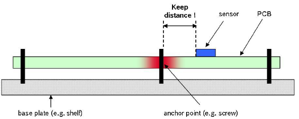
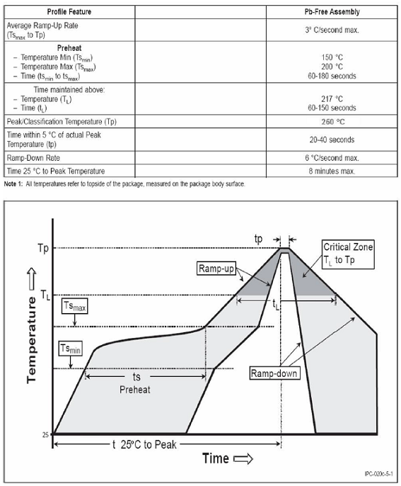

# HI226 用戶手冊
<p style="text-align: right;">IMU/VRU姿態測量模組, Rev 1.0


<div style="page-break-after: always;"></div>
[TOC]

<div style="page-break-after: always;"></div>
## 簡介

HI226是超核電子推出的一款超低成本、高性能、小體積、低延時的慣性測量單元(IMU)，本產品整合了三軸加速度計、三軸陀螺儀和一款微控制器。可輸出經過感測器融合算法計算得到的基於當地地理坐標的三維方位數據，包含無絕對參考的相對航向角，俯仰角和橫滾角。同時也可以輸出校準過的原始的感測器數據。

典型應用:

* 掃地機/大型機器人航向角檢測/低速雲台控制


## 主要特性

### 板載感測器
- 三軸陀螺儀, 最大量程: ±2000°/s 
- 三軸加速度計, 最大量程:±8G 
### 通訊接口及供電
- 序列埠(兼容TTL 可直接與5V 或3.3V 序列埠設備連接)
- 供電電壓：3.3 (+/- 100 mV)
- 最大峰值功耗：32mA
## 硬體參數

| 參數           | 描述                        |
| -------------- | --------------------------- |
| 輸出數據接口   | UART(TTL 1.8V - 3.3V)       |
| 工作電壓       | 3.3V (± 100mV)              |
| 功耗           | 86mW @3.3V                  |
| 溫度範圍       | -20℃  - 85 ℃                |
| 最大線性加速度 | 0 - 115 $m/s^2$             |
| 尺寸           | 12 x 12 x 2.6mm (W x L x H) |
| 板載感測器     | 三軸加速度計 三軸陀螺儀     |


| 符號 | 最小值 | 典型值 | 最大值 | 單位 |
| ---- | ------ | ------ | ------ | ---- |
| A1   | -      | 11     | -      | mm   |
| B    | -      | 11     | -      | mm   |
| D    | -      | 12     | -      | mm   |
| E    | -      | 12     | -      | mm   |
| H    | 2.5    | 2.6    | 2.7    | mm   |
| a    | -      | 1.5    | -      | mm   |
| b    | -      | 0.9    | -      | mm   |
| c    | -      | 1      | -      | mm   |
| e    | -      | 1.27   | -      | mm   |
| f    | -      | 1      | -      | mm   |


| 引腳號 | 名稱   | 說明                                  |
| ------ | ------ | ------------------------------------- |
| 5      | N/C | 保留                                  |
| 6      | VCC    | 電源 3.3V                             |
| 7      | SYNC_OUT | 數據輸出同步:  數據輸出時， 此引腳為高電平，空閒時為低電平。 |
| 8      | RXD    | 模組序列埠接收 UART RXD(接 MCU 的 TXD)  |
| 9      | TXD    | 模組序列埠發送 UART TXD (接 MCU 的 RXD) |
| 10     | SYNC_IN | 數據輸入同步:  內部下拉，當模組檢測到上升沿時, 輸出一幀數據。 |
| 11     | N/C    | 保留                                  |
| 19     | GND    | GND                                   |
| 20     | RST    | 復位, 內部上拉。>10uS 低電平復位模組。無需要外接阻容，建議接到MCU的GPIO引腳以實現軟體復位 |
| 21     | N/C | 保留 |
| 22     | N/C | 保留 |
| 23     | N/C    | 保留                                  |
| 24     | GND | GND                                   |
| 25     | N/C    | 保留                                  |

## 坐標系定義

載體系使用 前-左-上(FLU)右手坐標系。其中歐拉角旋轉順序為 ZYX(先轉Z軸，再轉Y軸，最後轉X軸)旋轉順序。具體定義如下：

- 繞 Z 軸方向旋轉: 航向角\Yaw\phi($\psi$) 範圍: -180° - 180°
- 繞 Y 軸方向旋轉: 俯仰角\Pitch\theta($\theta$) 範圍: -90°-90°
- 繞 X 軸方向旋轉:橫滾角\Roll\psi(  $\phi$)範圍: -180°-180°

如果將模組視為飛行器的話。X 軸應視為機頭方向。當感測器系與慣性系重合時，歐拉角的理想輸出為:Pitch = 0°, Roll = 0°, Yaw = 0°


## 性能指標

### 姿態角輸出精度

| 姿態角                                                | 典型值 |
| ----------------------------------------------------- | ------ |
| 橫滾角\俯仰角 - 靜態誤差                              | 0.8°   |
| 橫滾角\俯仰角 - 動態誤差                              | 2.5°   |
| 運動中航向角精度(30min,水平平穩運動,類掃地機運動模式) | <10°   |

### 陀螺儀

| 參數         | 值              |
| ------------ | --------------- |
| 測量範圍     | ±2000°/s        |
| 零偏穩定性   | 10°/h           |
| 刻度非線性度 | ±0.3%(滿量程時) |
| 加速度敏感性 | 0.1°/s/g        |

### 加速度計

| 參數     | 值                        |
| -------- | ------------------------- |
| 測量範圍 | ±8G (1G = 1x 重力加速度 ) |
| 非線性度 | ±0.5% (滿量程時)          |

### 模組數據接口參數

| 參數           | 值                            |
| -------------- | ----------------------------- |
| 序列埠輸出鮑率 | 9600/115200/460800/921600可選 |
| 幀輸出速率     | 1/25/50/100/200/400Hz 可選    |


## 感測器校準

1. 加速度計和陀螺儀在出廠前經過比例因子誤差和非正交誤差校準，校準參數保存在模組內部。

2. 陀螺儀的輸出每次上電後會有一個隨機的不為0的bias，稱之為零偏重複性。這個隨機bias不能在出廠前被校準。系統在啟動後1S內認為處於靜止狀態並採集1S的陀螺儀角速度作為初始bias。這個過程稱之為陀螺儀上電自校準。自校準在上電後靜止模組3s 左右可獲得最好的校準效果。**如上電1s內模組處於運動狀態(包括緩慢轉動，振動等)則航向角飄移現象會顯著增大**。 建議使用時每次上電後靜止至少1s。

3. 磁感測器(部分型號支援)出廠前經過橢球校準，但磁感測器很容易受到外界環境磁場干擾，一般都需要客戶重新校準，出廠校準參數意義不大。詳見地磁校準章節。


## 安裝及焊接

1. 安裝位置請遠離PCB容易形變點，盡量遠離PCB邊緣(>30mm)，遠離PCB定位螺絲孔(>10mm)等。

   

2. 安裝位置請遠離強磁設備，如電機，喇叭等強磁器件。

4. 組裝好的PCB不得使用超聲波清潔儀進行清潔。

5. 本產品不可使用塑封或噴塗三防漆，噴漆或塑封會造成感測器應力改變進而影響性能。

   

6. 推薦回流焊的爐溫曲線圖如下：



**注意**

回流焊最後階段需要自然冷卻，不能開啟爐子強制風冷卻，否則嚴重影響產品性能。


## 應用指南

### 模組與PC機連接

建議使用評估板與PC機進行連接，評估板板載USB供電及USB轉序列埠功能，可以方便的配合PC機上的評估軟體進行性能測試。具體請參見附錄中的評估板一節。

### 模組與MCU進行連接

模組與MCU通過TTL電平的序列埠進行連接，建議模組的RST引腳建議接到MCU的GPIO上。方便MCU強制復位模組。


**注意**


1. 如不使用同步輸入(SYNC_IN) 和同步輸出功能(SYNC_OUT) 可不接SYNC_IN 和 SYNC_OUT。
2. 120歐電阻的作用是為了方便調試，並防止MCU和模組電平不匹配，可以去掉，建議保留。
3. VCC的電壓範圍具體參加手冊說明
4. 模組內置上電復位電路，RST可以不接，但是建議接到主機一個GPIO上來實現軟體復位。


## 序列埠通訊協議

模組上電後，默認按出廠幀率(通常為100)輸出幀數據，幀格式如下：


| 域名稱  | 值    | 長度(字節) | 說明                                                         |
| ------- | ----- | ---------- | ------------------------------------------------------------ |
| PRE     | 0x5A  | 1          | 固定為0x5A                                                   |
| TYPE    | 0xA5  | 1          | 固定為0xA5                                                   |
| LEN     | 1-512 | 2          | 幀中數據域的長度，低字節在前。長度表示數據域(PAYLOAD)的長度，不包含`PRE`,`TYPE`,`LEN`,`CRC` 字段。 |
| CRC     | -     | 2          | 除CRC 本身外其餘所有字段(`PRE,TYPE,LEN, PAYLOAD`)幀數據的16 位CRC 校驗和。LSB(低字節在前) |
| PAYLOAD | -     | 1-512      | 一幀攜帶的數據。PAYLOAD域 由若干個**子數據包**組成。每個數據包包含數據包標籤和數據兩部分。標籤決定了數據的類型及長度。 |


CRC實現函數：

```
/*
	currectCrc: previous crc value, set 0 if it's first section
	src: source stream data
	lengthInBytes: length
*/
static void crc16_update(uint16_t *currectCrc, const uint8_t *src, uint32_t lengthInBytes)
{
    uint32_t crc = *currectCrc;
    uint32_t j;
    for (j=0; j < lengthInBytes; ++j)
    {
        uint32_t i;
        uint32_t byte = src[j];
        crc ^= byte << 8;
        for (i = 0; i < 8; ++i)
        {
            uint32_t temp = crc << 1;
            if (crc & 0x8000)
            {
                temp ^= 0x1021;
            }
            crc = temp;
        }
    } 
    *currectCrc = crc;
}
```

## 數據包

#### 數據包總覽

| 數據包標籤(DATA_ID) | 數據包長度(包含標籤1字節) | 名稱                | 備註     |
| ------------------- | ------------------------- | ------------------- | -------- |
| 0x90                | 2                         | 用戶ID              |          |
| 0xA0                | 7                         | 加速度              |          |
| 0xB0                | 7                         | 角速度              |          |
| 0xC0                | 7                         | 磁場強度            |          |
| 0xD0                | 7                         | 歐拉角              |          |
| 0xD1                | 17                        | 四元數              |          |
| 0xF0                | 5                         | 氣壓                | 輸出0    |
| 0x91                | 76                        | IMUSOL(IMU數據集合) | 推薦使用 |

#### 產品支援數據包列表

#### 0x90(用戶ID)

共2字節，用戶設置的ID。

| 字節偏移 | 類型    | 大小 | 單位 | 說明            |
| -------- | ------- | ---- | ---- | --------------- |
| 0        | uint8_t | 1    | -    | 數據包標籤:0x90 |
| 1        | uint8_t | 1    | -    | 用戶ID          |

#### 0xA0(加速度)

共7 個字節，LSB。輸出感測器的原始加速度

| 字節偏移 | 類型    | 大小 | 單位                     | 說明            |
| -------- | ------- | ---- | ------------------------ | --------------- |
| 0        | uint8_t | 1    | -                        | 數據包標籤:0xA0 |
| 1        | int16_t | 2    | 0.001G(1G = 1重力加速度) | X軸加速度       |
| 3        | int16_t | 2    | 0.001G                   | Y軸加速度       |
| 5        | int16_t | 2    | 0.001G                   | Z軸加速度       |

#### 0xB0(角速度)

共7字節，LSB。輸出感測器的原始角速度

| 字節偏移 | 類型    | 大小 | 單位   | 說明             |
| -------- | ------- | ---- | ------ | ---------------- |
| 0        | uint8_t | 1    | -      | 數據包標籤：0xB0 |
| 1        | int16_t | 2    | 0.1°/s | X軸角速度        |
| 3        | int16_t | 2    | 0.1°/s | Y軸角速度        |
| 5        | int16_t | 2    | 0.1°/s | Z軸角速度        |

#### 0xC0(磁場強度)

共7字節，LSB。輸出感測器的原始磁場強度

| 字節偏移 | 類型    | 大小 | 單位       | 說明            |
| -------- | ------- | ---- | ---------- | --------------- |
| 0        | uint8_t | 1    | -          | 數據包標籤:0xC0 |
| 1        | int16_t | 2    | 0.001Gauss | X軸磁場強度     |
| 3        | int16_t | 2    | 0.001Gauss | Y軸磁場強度     |
| 5        | int16_t | 2    | 0.001Gauss | Z軸磁場強度     |

#### 0xD0(歐拉角)

共7字節，LSB。格式為int16，共三個軸，每個軸占2 個字節，順序為Pitch/Roll/Yaw。接收到Roll, Pitch 為物理值乘以100 後得到的數值，Yaw 為乘以10 得到的數值。

例：當接收到的Yaw = 100 時，表示航向角為10°

| 字節偏移 | 類型    | 大小 | 單位  | 說明            |
| -------- | ------- | ---- | ----- | --------------- |
| 0        | uint8_t | 1    | -     | 數據包標籤:0xD0 |
| 1        | int16_t | 2    | 0.01° | Pitch(俯仰角)   |
| 3        | int16_t | 2    | 0.01° | Roll(橫滾角)    |
| 5        | int16_t | 2    | 0.1°  | Yaw(航向角)     |

#### 0XD1(四元數)

共17字節，格式為float，共4個值，順序為:W X Y Z.。每個值占4 字節(float)，整個四元數為4個float，LSB。

| 字節偏移 | 類型    | 大小 | 單位 | 說明            |
| -------- | ------- | ---- | ---- | --------------- |
| 0        | uint8_t | 1    | -    | 數據包標籤:0xD1 |
| 1        | float   | 4    | -    | W               |
| 5        | float   | 4    | -    | X               |
| 9        | float   | 4    | -    | Y               |
| 13       | float   | 4    | -    | Z               |

#### 0XF0(氣壓)

共5字節，格式為float。(只針對有氣壓感測器的產品)

| 字節偏移 | 類型    | 大小 | 單位 | 說明            |
| -------- | ------- | ---- | ---- | --------------- |
| 0        | uint8_t | 1    | -    | 數據包標籤:0xF0 |
| 1        | float   | 4    | Pa   | 大氣壓          |

#### 0X91( IMUSOL)

共76字節，新加入的數據包，用於替代A0,B0,C0,D0,D1等數據包。整合了IMU的感測器原始輸出和姿態解算數據。

| 字節偏移 | 類型     | 大小 | 單位                 | 說明                                                         |
| -------- | -------- | ---- | -------------------- | ------------------------------------------------------------ |
| 0        | uint8_t  | 1    | -                    | 數據包標籤:0x91                                              |
| 1        | uint8_t  | 1    | -                    | ID                                                           |
| 2        | -        | 6    | -                    | 保留                                                         |
| 8        | uint32_t | 4    | ms                   | 時間戳資訊，從系統開機開始累加，每毫秒增加1                  |
| 12       | float    | 12   | 1G(1G = 1重力加速度) | X,Y,Z軸的加速度，注意單位和0xA0不同                          |
| 24       | float    | 12   | deg/s                | X,Y,Z軸的角速度，注意單位和0xB0不同                          |
| 36       | float    | 12   | uT                   | X,Y,Z軸的磁場強度(HI229支援,注意單位和0xC0不同)              |
| 48       | float    | 12   | deg                  | 節點歐拉角集合, 順序為：橫滾角(Roll)，俯仰角(Pitch)，航向角(Yaw)(注意順序和單位與0xD0數據包不同) |
| 60       | float    | 16   | -                    | 節點四元數集合,順序為WXYZ                                    |


### 出廠默認數據包

出廠默認一幀中攜帶數據包數據定義如下：

| 產品  | 默認輸出數據包 |
| ----- | -------------- |
| HI226 | 0x91           |

### 數據幀結構示例

#### 數據幀配置為 `0x90,0xA0,0xB0,0xC0,0xD0,0xF0` 數據包

使用序列埠助手採樣一幀數據,共41字節, 前6字節為幀頭, 長度和CRC校驗值。剩餘35字節為數據域。假設數據接收到C語言陣列`buf`中。如下所示:

5A A5 23 00 FD 61 **90** 00 **A0** 55 02 3D 01 E2 02 **B0** FE FF 17 00 44 00 **C0** 80 FF 60 FF 32 FF **D0** 64 F2 6C 0E BB 01 **F0** 00 00 00 00

* 第一步：判斷幀頭，得到數據域長度和幀CRC：

幀頭:`5A` `A5`

幀數據域長度:`23` `00`: (0x00<<8) + 0x23 = 35

幀CRC校驗值:`FD` `61`:(0x61<<8) + 0xFD = 0x61FD

* 第二步： 校驗CRC

```
    uint16_t payload_len;
    uint16_t crc;
    
    crc = 0;
    payload_len = buf[2] + (buf[3] << 8);
    
    /* calulate 5A A5 and LEN filed crc */
    crc16_update(&crc, buf, 4);
    
    /* calulate payload crc */
    crc16_update(&crc, buf + 6, payload_len);
```

得到CRC值為0x61FD, 與幀攜帶的CRC值相同, 幀CRC校驗通過。

* 第三步：接收數據

`90 00`：ID 數據包, 0x90為數據包標籤, ID = 0x00.

`A0 55 02 3D 01 E2 02`:加速度數據包,0xA0為數據包標籤，三軸加速度為：

X軸加速度=  (int16_t)((0x02<<8)+ 0x55) = 597(單位為mG)

Y軸加速度 = (int16_t)((0x01<<8)+ 0x3D) = 317

Z軸加速度= (int16_t)((0x02<<8)+ 0xE2) = 738

`B0 FE FF 17 00 44 00` :角速度數據包,0xB0為數據包標籤，三軸角速度為：

X軸角速度=  (int16_t)((0xFF<<8)+ 0xFE) = -2(單位為0.1°/s)

Y軸角速度 = (int16_t)((0x00<<8)+ 0x17) = 23

Z軸角速度= (int16_t)((0x00<<8)+ 0x44) = 68

`C0 80 FF 60 FF 32 FF` :磁場數據包,0xC0為數據包標籤，三軸磁場為：

X軸角速度=  (int16_t)((0xFF<<8)+ 0x80) = -128 (單位為0.001Gauss)

Y軸角速度 = (int16_t)((0xFF<<8)+ 0x60) =  -160

Z軸角速度= (int16_t)((0xFF<<8)+ 0x32) =  -206

`D0 64 F2 6C 0E BB 01` 歐拉角數據包, 0xD0為數據包標籤

Pitch= (int16_t)((0xF2<<8)+ 0x64) / 100 = -3484 / 100 = -34.84 ° 

Roll= (int16_t)((0x0E<<8)+ 0x6C) / 100 =  3692 / 100 = 36.92°

Yaw = (int16_t)((0x01<<8)+ 0xBB) / 10 =  443 /10 = 44.3°

`F0 00 00 00 00`氣壓數據包，0xF0為數據包標籤

```
float prs;
prs = memcpy(&prs, &buf[37], 4);
```

最後得到結果：

```
id              : 0
acc(G)          :    0.597    0.317    0.738
gyr(deg/s)      :   -0.200    2.300    6.800
mag(uT)         :  -12.800  -16.000  -20.600
eul(R/P/Y)      :   36.920  -34.840   44.300
```


#### 數據幀配置為 `0x91` 數據包

使用序列埠助手採樣一幀數據,共82字節, 前6字節為幀頭, 長度和CRC校驗值。剩餘76字節為數據域。假設數據接收到C語言陣列`buf`中。如下所示:

5A A5 4C 00 6C 51 **91** 00 A0 3B 01 A8 02 97 BD BB 04 00 9C A0 65 3E A2 26 45 3F 5C E7 30 3F E2 D4 5A C2 E5 9D A0 C1 EB 23 EE C2 78 77 99 41 AB AA D1 C1 AB 2A 0A C2 8D E1 42 42 8F 1D A8 C1 1E 0C 36 C2 E6 E5 5A 3F C1 94 9E 3E B8 C0 9E BE BE DF 8D BE

* 第一步：判斷幀頭，得到數據域長度和幀CRC：

幀頭:`5A` `A5`

幀數據域長度:`4C` `00`: (0x00<<8) + 0x4C = 76

幀CRC校驗值:`6C` `51`:(0x51<<8) + 0x6C = 0x516C

* 第二步： 校驗CRC

```
    uint16_t payload_len;
    uint16_t crc;
    
    crc = 0;
    payload_len = buf[2] + (buf[3] << 8);
    
    /* calulate 5A A5 and LEN filed crc */
    crc16_update(&crc, buf, 4);
    
    /* calulate payload crc */
    crc16_update(&crc, buf + 6, payload_len);
```

得到CRC值為0x516C. 幀CRC校驗通過。

* 第三步：接收數據

從`0x91`開始為數據包的數據域。在C語言中可以定義結構體來方便的讀取數據：

定義0x91數據包結構體如下：

```
__packed typedef struct
{
    uint8_t     tag;                /* data packet tag */
    uint8_t     id;
    uint8_t     rev[6];             /* reserved */
    uint32_t    ts;                 /* timestamp */
    float       acc[3];
    float       gyr[3];
    float       mag[3];
    float       eul[3];             /* eular angles: Roll,Pitch,Yaw */
    float       quat[4];            /* quaternion */
}id0x91_t;
```

`__packed` 為編譯器關鍵字(Keil下)，表示結構體按字節緊對齊，結構體每一個元素一一對應0x91數據包的結構定義。接收數據時將接收到的陣列直接memcpy到結構體即可：(注意定義結構體時必須4字節對齊), 其中`buf `指向幀頭, `buf[6]`指向幀中數據域 。

```
    /* 接收數據並使用0x91數據包結構定義來解釋數據 */
    __align(4) id0x91_t dat;    /* struct must be 4 byte aligned */
    memcpy(&dat, &buf[6], sizeof(id0x91_t));
```

最後得到dat數據結果：

```
id              : 0
timestamp       : 310205
acc             :    0.224    0.770    0.691
gyr             :  -54.708  -20.077 -119.070
mag             :   19.183  -26.208  -34.542
eul(R/P/Y)      :   48.720  -21.014  -45.512
quat            :    0.855    0.310   -0.310   -0.277
```


## AT指令

當使用序列埠與模組通訊時, 模組支援AT 指令集配置/查看模組參數。AT 指令總以ASCII 碼`AT` 開頭，後面跟控制字符，最
後以回車換行`\r\n`結束。可使用序列埠調試助手進行測試：


通用模組 AT指令如下

| 指令      | 功能                   | 掉電保存(Y) | 立即生效(Y),復位生效(R) | 備註         |
| --------- | ---------------------- | ----------- | ----------------------- | ------------ |
| AT+ID     | 設置模組用戶ID         | Y           | R                       |              |
| AT+INFO   | 打印模組資訊           | N           | Y                       |              |
| AT+ODR    | 設置模組序列埠輸出幀頻率 | Y           | R                       |              |
| AT+BAUD   | 設置序列埠鮑率         | Y           | R                       |              |
| AT+EOUT   | 數據輸出開關           | N           | Y                       |              |
| AT+RST    | 復位模組               | N           | Y                       |              |
| AT+TRG    | 單次輸出觸發           | N           | Y                       |  |
| AT+SETPTL | 設置輸出數據包         | Y           | Y                       |  |
| AT+MODE   | 設置模組工作模式       | Y           | R                       | 不支援(僅六軸) |
| AT+GWID   | 設置無線接收機ID      | Y           | R                       | 不支援 |


##### AT+ID

設置模組用戶ID

**例** `AT+ID=1`

##### AT+INFO

打印模組資訊，包括產品型號，版本，韌體發佈日期等。


##### AT+ODR

設置模組序列埠輸出幀率。掉電保存，復位模組生效

**例** 設置序列埠輸出速率為100Hz:  `AT+ODR=100` 

注意：當輸出幀率設置比較高時(如200),默認的115200鮑率可能不滿足輸出頻寬要求，此時需要將模組鮑率設高(如921600)後，模組才能穩定輸出高幀率。

##### AT+BAUD

設置序列埠鮑率，可選值：`9600/115200/460800/921600`

**例**  `AT+BAUD=115200`

**注意**

- 使用此指令需要特別注意，輸入錯誤鮑率後會導致無法和模組通訊
- 鮑率參數設置好後掉電保存，復位模組生效。 CH-Center 軟體的鮑率也要做相應修改。
- 升級韌體時，需要切換回115200 鮑率。

##### AT+EOUT

序列埠輸出開關

**例** 打開序列埠輸出 `AT+EOUT=1`   關閉序列埠輸出 `AT+EOUT=0`

##### AT+RST

復位模組

**例** `AT+RST`

##### AT+SETPTL

設置輸出協議:

模組數據幀中的數據包組成可使用AT指令配置，格式為`AT+SETPTL=<ITEM_ID>,<ITEM_ID>...`


**例** 配置模組輸出加速度，角速度, 整形格式歐拉角和四元數的指令為：`AT+SETPTL=A0,B0,D0,D1`


##### AT+TRG

觸發模組輸出一幀數據，可以配合AT+ODR=0來實現單次觸發輸出。

**例** `AT+TRG`

## 附錄A - 評估板


### 評估板簡介

評估板提供了快速評估本產品的方法。板載USB-UART芯片(CP2104)以及供電LDO，並將模組接口引出方便調試評估。

安裝資料包中的CP2104 USB-UART 驅動程序, 將USB線連接電腦和模組，打開 CH-Center 軟體，連接序列埠，默認狀態下，模組會以115200-N-8-N-1 輸出出廠默認的數據包。


### 尺寸


### 從評估板上取下產品

模組默認被嵌入評估板的PLCC28 插槽中，如需取出模組，請按如下步驟操作：
- 斷電，準備好細螺絲刀或鑷子
- 從PLCC 插座或者背面圓形空洞內將模組撬出或頂出。

 

**注意**

- 評估板的主要作用僅僅是快速評估模組性能, USB 接口本身不適合於工業級場景或者高運動場合的電氣連接，如果您的應用為高運動環境(動作捕捉等)，則不建議在您的產品中直接使用評估板。


## 附錄B - 韌體升級與恢復出廠設置

本產品支援升級韌體。
韌體升級步驟:

- 連接模組，打開 CH-Center 軟體，將模組和 CH-Center 軟體鮑率都設置為115200. 打開韌體升級窗口
- 點擊"連接"，如出現模組連接資訊。則說明升級系統準備就緒，點擊文件選擇器(…)選擇副檔名為.hex 的韌體
- 點擊"開始編程"。下載完成後會提示編程完成，此時關閉序列埠，重新給模組上電，模組升級完成。

