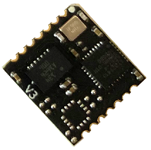
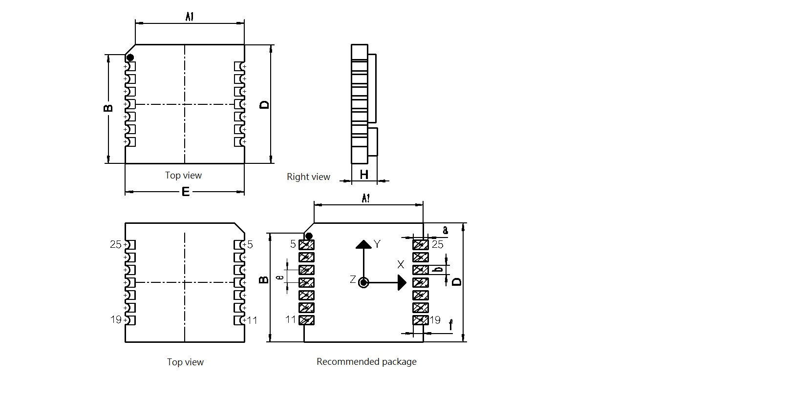
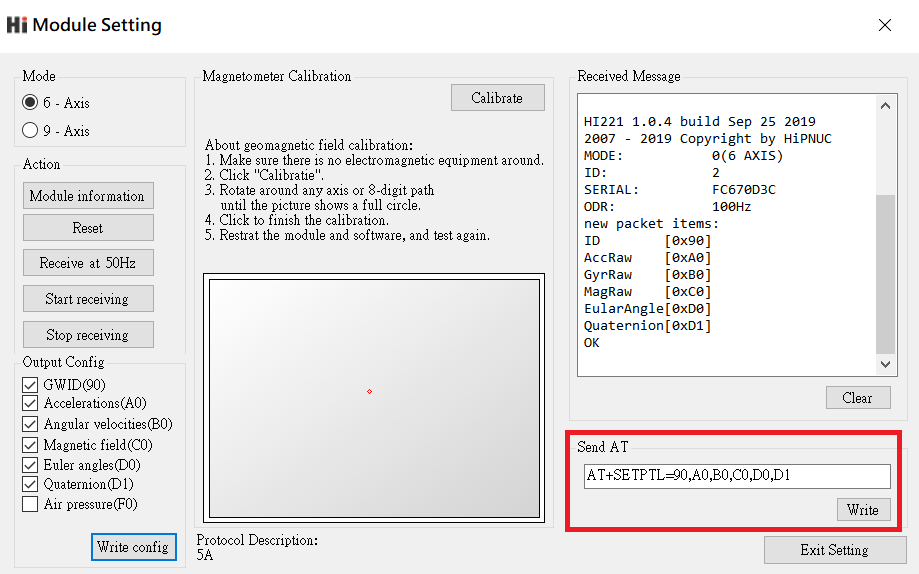
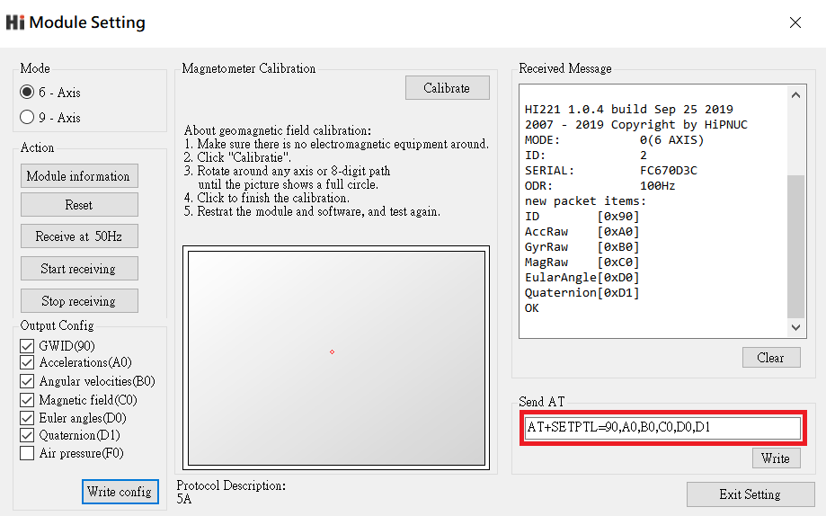

# HI226/HI229 用戶手冊
<p style="text-align: right;">IMU/VRU/AHRS姿態測量模組, Rev A1


<div style="page-break-after: always;"></div>
[TOC]

<div style="page-break-after: always;"></div>
## 簡介

HI226是超核電子推出的一款超低成本、高性能、小體積、低延時的慣性測量單元(IMU)，本產品集成了三軸加速度計、三軸陀螺儀和一款微控制器。可輸出經過傳感器融合算法計算得到的基於當地地理坐標的三維方位數據，包含無絕對參考的相對航向角，俯仰角和橫滾角。同時也可以輸出校準過的原始的傳感器數據。



典型應用:

* 掃地機/室內機器人航向跟蹤/飛鼠/遊戲控制器


HI229是超核電子推出的一款低成本、高性能、小體積、低延時的航姿參考單元（AHRS），本產品集成了三軸加速度計、三軸陀螺儀、三軸磁場傳感器和一款微控制器。可輸出經過傳感器融合算法計算得到的基於當地地理坐標的三維方位數據，包含航向角，俯仰角和橫滾角。同時也可以輸出校準過的原始的傳感器數據。本產品具有一定的室內地磁抗干擾性能，在一定強度的地磁場干擾環境下仍可正常工作。


典型應用:

- VR\動作捕捉
- 高動態環境下姿態測量\運動性能評估
- 無人機控制


## 特性

### 板載傳感器
- 三軸陀螺儀, 最大量程: ±2000°/s 
- 三軸加速度計, 最大量程:±8G 
- 三軸磁場傳感器，最大量程: 800mG (毫高斯)
### 數據處理 
- 加速度和陀螺儀出廠前經過三軸非正交和標度因子校準
- 數據融合算法計算並輸出地理坐標系下的旋轉四元數及歐拉角等姿態資訊
### 通訊接口及供電
- 串口(兼容TTL 可直接與5V 或3.3V 串口設備連接)
- 供電電壓：3.3 (+/- 100 mV)
- 最大峰值功耗：32mA
### 其他
- PC端上位機程序，提供實時數據顯示，波形，校準及excel 數據記錄功能

- 多項模組參數用戶可配置

## 硬體及尺寸

### 硬體參數

| 參數           | 描述                                          |
| -------------- | --------------------------------------------- |
| 輸出數據接口   | UART(TTL 1.8V - 3.3V)                         |
| 工作電壓       | 3.3V (± 100mV)                                |
| 功耗           | 86mW @3.3V                                    |
| 溫度範圍       | -20℃  - 85 ℃                                  |
| 最大線性加速度 | 0 - 115 $m/s^2$                               |
| 尺寸           | 12 x 12 x 2.6mm (W x L x H)                   |
| 板載傳感器     | 三軸加速度計 三軸陀螺儀 三軸磁場傳感器(HI229) |

### 尺寸



| 符號 | 最小值 | 典型值 | 最大值 | 單位 |
| ---- | ------ | ------ | ------ | ---- |
| A1   | -      | 11     | -      | mm   |
| B    | -      | 11     | -      | mm   |
| D    | -      | 12     | -      | mm   |
| E    | -      | 12     | -      | mm   |
| H    | 2.5    | 2.6    | 2.7    | mm   |
| a    | -      | 1.5    | -      | mm   |
| b    | -      | 0.9    | -      | mm   |
| c    | -      | 1      | -      | mm   |
| e    | -      | 1.27   | -      | mm   |
| f    | -      | 1      | -      | mm   |


### 引腳定義


| 引腳號 | 名稱   | 說明                                  |
| ------ | ------ | ------------------------------------- |
| 5      | N/C | 保留                                  |
| 6      | VCC    | 電源 3.3V                             |
| 7      | SYNC_OUT | 數據輸出同步:  數據輸出時， 此引腳為高電平，空閒時為低電平。 |
| 8      | RXD    | 模組串口接收 UART RXD(接 MCU 的 TXD)  |
| 9      | TXD    | 模組串口發送 UART TXD (接 MCU 的 RXD) |
| 10     | SYNC_IN | 數據輸入同步:  內部下拉，當模組檢測到上升沿時, 輸出一幀數據。最高同步頻率為200Hz，且輸出幀率不能超過當前串口波特率下總帶寬。 |
| 11     | N/C    | 保留                                  |
| 19     | GND    | GND                                   |
| 20     | RST    | 復位, 內部上拉。>10uS 低電平復位模組。無需要外接阻容，建議接到MCU的GPIO引腳以實現軟體復位 |
| 21     | N/C | 保留 |
| 22     | N/C | 保留 |
| 23     | N/C    | 保留                                  |
| 24     | GND | GND                                   |
| 25     | N/C    | 保留                                  |


## 性能指標

### 姿態角輸出精度

| 姿態角                                          | 典型值 |
| ----------------------------------------------- | ------ |
| 橫滾角\俯仰角 - 靜態誤差                        | 0.8°   |
| 橫滾角\俯仰角 - 動態誤差                        | 2.5°   |
| 零偏穩定性                                      | 10°/h  |
| 運動中航向角精度(9軸模式下,無磁干擾,地磁校準後) | 3°     |

### 陀螺儀

| 參數     | 值                  |
| -------- | ------------------- |
| 測量範圍 | ±2000°/s            |
| 非線性度 | ±0.1% (25°最佳)     |
| 噪聲密度 | 0.08°/s/$\sqrt{Hz}$ |
| 採樣率   | 2000Hz              |

### 加速度計

| 參數         | 值                        |
| ------------ | ------------------------- |
| 測量範圍     | ±8G (1G = 1x 重力加速度 ) |
| 非線性度     | ±0.5% (25°最佳)           |
| 最大零點偏移 | 10mG                      |
| 噪聲密度     | 250 $uG\sqrt{Hz}$         |
| 採樣率       | 500Hz                     |

### 磁傳感器參數

| 參數           | 值                          |
| -------------- | --------------------------- |
| 測量範圍     | ±8Gauss |
| 非線性度     | ±0.1%                             |
| 採樣率       | 100Hz                                      |

### 模組數據接口參數

| 參數           | 值                                  |
| -------------- | ----------------------------------- |
| 串口輸出波特率 | 4800/9600/115200/460800可選         |
| 幀輸出速率     | 0/1/10/25/50/100/200/400/500Hz 可選 |

## 融合及校準算法
### 陀螺儀校準

每一個姿態傳感器都單獨進行過全測量範圍內的校準和測試。陀螺和加速度計的非正交和刻度因子誤差參數都會保存在模組內部的Flash中。陀螺儀自動校準需要在上電後靜止模組3s 左右以獲得最好的校準效果。如果上電靜置短於規定時間，則模組陀螺儀零偏校準效果會下降。


姿態傳感器內建陀螺零速檢測機制，當檢測到長時間內三軸陀螺速度均小於1°/s時，模組認為當前為靜止狀態，陀螺輸出為零偏，此次模組會將此時的陀螺讀數記錄下來作為零偏補償。所以 **本產品不能用於旋轉速度<1°/s的運動場景。**(既旋轉速度低於秒針平均轉速的1/6)


### 磁干擾，抗干擾及磁校準

#### 磁干擾分類

| 種類                 | 定義                                         | 典型干擾源                                                   | 影響                                                         | 措施                                   |
| -------------------- | -------------------------------------------- | ------------------------------------------------------------ | ------------------------------------------------------------ | -------------------------------------- |
| 空間磁場干擾         | 干擾不隨傳感器運動而運動，而處於世界坐標系下 | 各種固定的磁干擾源，傢俱，家用電器，電纜，房屋內的鋼筋結構等。一切不隨磁傳感器運動而運動的干擾源 | 無論磁場傳感器是否校準的好，這些空間磁場的干擾(或者說環境磁場不均勻)都會使得空間地磁場發生畸變。地磁補償會錯誤並且無法獲得正確的航向角。他們是造成室內地磁融合難以使用的主要元兇。這種干擾不能被校準, 會嚴重影響地磁性能。空間磁場干擾在室內尤其嚴重。 | 模組內置的勻質磁場檢測及屏蔽非勻質磁場 |
| 傳感器坐標系下的干擾 | 干擾源隨傳感器運動而運動                     | 模組PCB，與模組固定在一起的板子，儀器設備，產品等。他們和磁傳感器視為同一個剛體，隨磁傳感器運動而運動 | 對傳感器造成硬磁/軟磁干擾。這些干擾可以通過地磁校準算法加以很好的消除。 | 地磁校準                               |

下圖是一個典型的室內磁場分佈圖。可以看到：一般室內環境的空間磁場畸變是比較嚴重的。


**Notes**

在室內環境下，空間磁場干擾尤其嚴重，而且空間磁干擾並不能通過校準來消除。在室內環境下，儘管模組內置均質磁場檢測及屏蔽機制，但9軸模式航向角的準確度很大程度上取決於室內磁場畸變程度，如果室內磁場環境很差(如電腦機房旁，電磁實驗室，車間 ，地下車庫等等)，即使校準後，9軸的航向角精度可能還不如6軸甚至會出現大角度誤差。

#### 工作模式

正因為地磁場非常容易受到空間干擾，所以使用9軸模式時應非常注意。下表列舉了不同的使用場合和工況下的使用建議

| 模式    | 適用環境     | 典型應用                                                     | 優點                                                         | 缺點                                                         | 注意事項                 |
| ------- | ------------ | ------------------------------------------------------------ | ------------------------------------------------------------ | ------------------------------------------------------------ | ------------------------ |
| 6軸模式 | 各種環境     | 雲台等低動態姿態檢測，室內機器人                             | 1. 姿態角輸出穩定性好 2. 完全不受磁場干擾                    | 航向角隨時間緩慢漂移                                         | N/A                      |
| 9軸模式 | 無磁干擾環境 | 1.指南針，尋北系統 2. 空曠且磁干擾較少的室內，模組基本不會大範圍在室內移動(典型的如攝影棚內動作捕捉，且被測者不會做大範圍走動) | 1. 航向角不會隨時間漂移 2.一旦檢測到地磁場可快速修正航向角指北 | 任何磁干擾都會出現航向角準確度下降。室內干擾嚴重情況下 航向角無法指向正確方向。另外，移動機器人的金屬結構和電機運行時會產生非常強的磁干擾，所以移動機器人平台不適用於9軸模式。 | 使用前需要校準地磁傳感器 |


#### 地磁校準

模組的自動地磁校準系統只能處理和模組安裝在一起的，固定的磁場干擾。安裝環境如果有磁場干擾，這種干擾必須是固定的，並且這個干擾磁場與模組 安裝之後不會再發生距離變化(例：模組安裝在一個鐵材料之上，因為鐵會有磁場干擾， 這時就需要把鐵與模組一起旋轉校準，並且這個鐵在使用當中是不會和羅盤再分開的(發生相對位移)，一 旦分開是需要再重新校準。如果這個鐵大小是不固定的，或與羅盤的距離變化也不是固定 的，這種干擾是無法校準，即使校準成功，也會精度非常差，只能避而遠之安裝。安全距離控制在 40CM 以上)。


本模組集成了主動無干預地磁校準算法。模組會自動收集地磁場資訊並進行硬磁校準(叫做地磁傳感器零偏)，校準成功後校準資訊會保存在模組Flash上。用戶無須任何操作即可實現地磁在線校準。首次使用時，模組會自動採集周圍地磁場，並且嘗試估計地磁傳感器零偏參數，一旦估算完成。在靜止環境下，模組會自動將校準參數寫入Flash以便下次使用。所以當您首次使用模組並且需要使用9軸模式時，應進行以下校準操作：

1. 在盡量小範圍內，緩慢的讓模組進行8字運動或者分別繞每個軸360度，讓模組盡量經歷多種姿態。。
2. 一般情況下，如果地磁干擾在可接受的範圍內，即可完成校準。如果以後在同樣地磁環境下(同地點)，則無需再次校準。如果始終沒能成功校準模組，這說明周圍地磁場干擾非常大。

地磁校準狀態可以使用AT指令來查看：

發送`AT+INFO=HSI` 指令，模組會打印當前地磁校準系統狀態：


| HSI參數顯示 | 意義                 | 說明                                                         |
| ----------- | -------------------- | ------------------------------------------------------------ |
| valid       | 地磁校準有效標誌     | 0: 沒有成功校準過。 非0: 已存在校準參數。                    |
| fiterr      | 擬合殘差             | 殘差越小，說明參數擬合效果越好，通常在0.05以下說明校準結果已經足夠好。如果擬合結果始終>0.1，說明地磁干擾很大 |
| bin_status  | 當前地磁數據採集進度 | 表示最近一次地磁數據採集進度，為百分比： 0-100%。 100%時會嘗試擬合地磁校準參數 |
| cal_cnt     | 校準成功次數         | 擬合器校準地磁參數完成的次數，該數據累加，掉電保存           |
| flux        | 擬合器估計的地磁場強 | 最近一次擬合器估計出的地磁場強 ，單位為uT                    |
| inclination | 擬合器估計的地磁傾角 | 最近一次擬合器估計出的磁傾角，單位為°                        |


* 雖然地磁參數估計可以在線自動採集數據，自動的動態擬合地磁校準參數。但是如果周圍地磁環境改變(比如需要到另外房間或者室內室外切換)，最好還需重複校準操作。

## 安裝及焊接

1. 安裝位置請遠離PCB容易形變點，盡量遠離PCB邊緣(>30mm)，遠離PCB定位螺絲孔(>10mm)等。

   

2. 安裝位置請遠離強磁設備，如電機，喇叭等強磁器件。

3. 由於MEMS傳感器對PCB板應力非常敏感, **建議手工焊接模組，不使用回流焊焊接模組，否則會對傳感器性能造成影響**。如果必須使用回流焊，則應注意：用印刷刮板在網板上印刷錫膏，使錫膏通過網板開口漏印到PCB上。為保證回流焊接質量，推薦焊盤部分對應的鋼網厚度為0.18mm。

4. 組裝好的PCB不得使用超聲波清潔儀進行清潔。

5. 本產品不可使用塑封或噴塗三防漆，噴漆或塑封會造成傳感器應力改變進而影響性能。

   

6. 推薦回流焊的爐溫曲線圖如下：


參考: https://ae-bst.resource.bosch.com/media/_tech/media/application_notes/BST-MAS-HS000.pdf


## 參考系定義

本產品採用右手(RH, Right-Hand)坐標系。輸出的四元數及歐拉角為  傳感器坐標系 到 慣性坐標系(世界坐標系) 的旋轉。其中歐拉角旋轉順序為 ZYX(先轉Z軸，再轉Y軸，最後轉X軸)旋轉順序，歐拉角具體定義如下：

- 繞 Z 軸方向旋轉: 航向角\Yaw\phi($\psi$) 範圍: -180° - 180°
- 繞 Y 軸方向旋轉: 俯仰角\Pitch\theta($\theta$) 範圍: -90°-90°
- 繞 X 軸方向旋轉:橫滾角\Roll\psi(  $\phi$)範圍: -180°-180°

本產品使用北西天(North-West-Up  NWU) 坐標系統，即視為模組的地理坐標系(世界坐標系)定義如下：

- X 軸正方向指向北
- Y 軸正方向指向西
- Z 軸正方向指向天

當採用 NWU 系時，如果將模組視為飛行器的話。X 軸應視為機頭方向。當傳感器系與慣性系重合時，歐拉角的理想輸出為:Pitch = 0°, Roll = 0°, Yaw = 0°

## 使用指南


### 模組與PC機連接

建議使用評估板與PC機進行連接，評估板板載USB供電及USB轉串口功能，可以方便的配合PC機上的評估軟體進行性能測試。具體請參見附錄中的評估板一節。

### 模組與MCU進行連接

模組與MCU通過TTL電平的串口進行連接，建議模組的RST引腳建議接到MCU的GPIO上。方便MCU強制重定模組。


 !!! note 


1. 如不使用同步輸入(SYNC_IN) 和同步輸出功能(SYNC_OUT) 可不接SYNC_IN 和 SYNC_OUT。
2. 120歐電阻的作用是為了方便調試，以及防止MCU和模組電平不匹配，可以去掉，建議保留。
3. VCC的電壓範圍具體參加手冊說明


## 串口通訊協議

### 數據包格式

模組資料包中提供了C 和C#的數據解析函數以供參考。模組上電後，模組默認按100Hz (出廠默認輸出速率) 輸出數據包，數據包格式如下：

|域 | 同步幀頭 | 幀類型 | 幀長度 | CRC16 | 幀攜帶數據 |
|------------ | -------------|------------ |------------ |------------ |------------ |
|名稱 | PRE | TYPE | LEN | CRC | REG_ADDR(N) + DATA(N) |
|大小(byte) | 0 | 1 | 2 | 2 | 可變(1-64) |
|偏移(byte) | 0 | 1 | 2 | 4 | 6 |
|值(hex) | 0x5A | 0xA5 | 幀長度 | CRC校驗碼 | 具體意義參看下節 |
|類型 | uint8_t | uint8_t | uint16_t | uint16_t | - |


* PRE
	固定為0x5A

* TYPE
	固定為0xA5 代表數據幀

* LEN 
	幀中數據域的長度。一幀最大為256 字節LSB(低字節在前)，長度只是值真正數據的長度，不包含`PRE`,`TYPE`,`LEN`,`CRC` 字段。

* CRC
	**除CRC 本身外**其餘所有幀數據的16 位CRC 校驗和LSB[^LSB]。CRC實現函數：

```
/*
	currectCrc: previous crc value, set 0 if it's first section
	src: source stream data
	lengthInBytes: length
*/
static void crc16_update(uint16_t *currectCrc, const uint8_t *src, uint32_t lengthInBytes)
{
    uint32_t crc = *currectCrc;
    uint32_t j;
    for (j=0; j < lengthInBytes; ++j)
    {
        uint32_t i;
        uint32_t byte = src[j];
        crc ^= byte << 8;
        for (i = 0; i < 8; ++i)
        {
            uint32_t temp = crc << 1;
            if (crc & 0x8000)
            {
                temp ^= 0x1021;
            }
            crc = temp;
        }
    } 
    *currectCrc = crc;
}
```


* REG_ADDR和DATA
	一幀數據可由多個數據包組成，每個數據包包含寄存器地址(REG_ADDR)和寄存器數據(DATA) 兩部分。寄存器地址決定了數據的類型及長度，DATA 為寄存器數據內容。模組支持的寄存器列表如下:

| 寄存器地址 | 寄存器長度(字節) | 名稱              | 單位       |
| -------- | ---------- | ----------------- | ---------- |
| 0x90 | 1 | 用戶ID | 無 |
| 0xA0     | 6          | 加速度            | 0.001G[^G]  |
| 0xA5 | 6 | 線性加速度 | 0.001G |
| 0xB0     | 6          | 角速度            | 0.1°/s     |
| 0xC0     | 6          | 磁場強度          | 0.001Gauss |
| 0xD0     | 6          | 歐拉角 (整形輸出) | 度         |
| 0xD9     | 12         | 歐拉角(浮點輸出)  | 度         |
| 0xD1     | 16         | 四元數            | N/A      |
| 0xF0 | 4 | 氣壓 | Pa |
| 0x71 | 128-256字節可變 | 無線節點四元數集合 | 無 |
| 0x72 | 48-96字節可變 | 無線節點歐拉角集合 | 同0xD0 |
| 0x75 | 48-96字節可變 | 無線節點加速度集合 | 同0xA0 |
| 0x78 | 48-96字節可變 | 無線節點角速度集合 | 同0xB0 |
| 0x61 | 3 | 無線數據幀拓展標識 | N/A |

[^G]: 1G = 1x當地重力加速度

* 0x90 
	用戶ID

* 0xA0
	加速度，格式為int16，共三個軸，每個軸占2 個字節，X、Y、Z 三軸共6 個字節，LSB。傳感器輸出的原始加速度

* 0xA5
	性加速度，格式為int16，共三個軸，每個軸占2 個字節，X、Y、Z 三軸共6 個字節，LSB。地理坐標系下去除重力份量的加速度值

* 0xB0
	角速度，格式為int16，共三個軸，每個軸占2 個字節，X、Y、Z 三軸共6 個字節，LSB。傳感器輸出的角速度

* 0xC0
	磁場強度，格式為int16，共三個軸，每個軸占2 個字節，X、Y、Z 三軸共6 個字節，LSB。傳感器輸出的磁場強度

* 0xD0
	歐拉角整形格式，格式為int16，共三個軸，每個軸占2 個字節，順序為Pitch/Roll/Yaw。LSB。接收到Roll, Pitch 為物理值乘以100 後得到的數值，Yaw 為乘以10 得到的數值舉例：當接收到的Yaw = 100 時，表示航向角為10°

* 0xD9
	浮點格式輸出的歐拉角。格式為float，共3 個值(Pitch/Roll/Yaw)，每個值占4 字節(float 型單精度
  浮點數)，LSB。

* 0XD1
	四元數，格式為float，共4個值，順序為:W X Y Z.。每個值占4 字節(float)，整個四元數為4個float，共16字節，LSB。


* 0XF0
	氣壓。(只針對有氣壓傳感器的產品)

* 0x71
	(僅支持HI221GW)節點四元數集合. 所有節點的四元數， 每個節點16字節，從0到最後一個節點順序排列。每個節點 4個浮點數，分別為W X Y Z, 每個數用float 型表示，每個float 4字節。float為LSB
	
* 0x72
	(僅支持HI221GW)節點歐拉集合. 所有節點的歐拉角， 每個節點6字節，從0到最後一個節點順序排列。每個節點歐拉為角整形格式，格式為int16，共三個軸，每個軸占2 個字節，順序為Pitch/Roll/Yaw。LSB。接收到Roll, Pitch 為物理值乘以100 後得到的數值，Yaw 為乘以10 得到的數值舉例：當接收到的Yaw = 100 時，表示航向角為10°
	
* 0x75
	(僅支持HI221GW)節點加速度集合. 每個節點6字節，從0到最後一個節點順序排列。每個節點3個int16_t 型數據。分別為X Y Z的加速度。每個int16_t 占2字節， LSB
	
* 0x78
	(僅支持HI221GW)節點角速度集合. 每個節點6字節，從0到最後一個節點順序排列。每個節點3個int16_t 型數據。分別為X Y Z的角速度。每個int16_t 占2字節， LSB
	
* 0x61

  (僅支持HI221GW)數據幀拓展資訊標識，共3個字節:

  | 數據幀拓展資訊字節偏移 | 值   | 說明                     |
  | ---------------------- | ---- | ------------------------ |
  | 0                      | -    | 保留                     |
  | 1                      | GWID | 接收機GWID               |
  | 2                      | CNT  | 此幀包含無線節點數: 1-16 |
  


### 出廠默認寄存器

出廠默認一幀中攜帶寄存器數據定義如下：

HI226/HI229:

| 順序 | 數據包 | 說明             |
| ---- | ------ | ---------------- |
| 1    | 0x90   | 用戶ID           |
| 2    | 0xA0   | 加速度           |
| 3    | 0xB0   | 角速度           |
| 4    | 0xC0   | 磁場強度         |
| 5    | 0xD0   | 歐拉角(整形輸出) |
| 6    | 0xF0   | 氣壓             |

HI221GW(無線節點接收機):

| 順序 | 寄存器 | 說明   |
| ---- | ------ | ------ |
| 1    | 0x71   | 四元數 |
| 2    | 0x75   | 加速度 |


### 數據幀結構示例

假設輸出的數據幀帶有 `A0,B0,D0` 寄存器，使用串口助手採樣一幀數據如下所示:

`5A` `A5` `15` `00` `A9` `8B` `A0` `EA` `FF` `D0` `03` `45` `FF` `B0` `00` `00` `00` `00` `00` `00` `D0` `87` `00` `6F` `27`  `F5` `FF` 

其中：

`5A` `A5`幀頭

`15` `00`幀數據域長度：`(0x00<<8) + 0x15 = 21`

`A9` `8B`幀CRC校驗值: `(0x8B<<8) + 0xA9 = 0x8BA9`

`A0` `EA` `FF` `D0` `03` `45` `FF` 加速度數據包, `A0`為加速度寄存器地址， 三軸加速度為： 

​	AccX = (int16_t)((0xFF<<8)+ 0xEA) = -22
​	
​	AccY = (int16_t)((0x03<<8)+ 0xD0) = 976
​	
​	AccZ = (int16_t)((0xFF<<8)+ 0x45) = -187

`B0` `00` `00` `00` `00` `00` `00` 角速度數據包, `B0`為角速度寄存器地址， 三軸角速度全為0

`D0` `87` `00` `6F` `27` `F5` `FF` 歐拉角數據包, `D0`為歐拉角寄存器地址

​	Pitch= (int16_t)((0x00<<8)+ 0x87) / 100 = 1.35° 

​    Roll= (int16_t)((0x27<<8)+ 0x6F) / 100 = 100.95°

​    Yaw = (int16_t)((0xFF<<8)+ 0xF5) / 10 = -1.1°


計算CRC校驗值：

記上面接收到的一幀數據存為C語言uint8_t 數組 buf:

```
    uint16_t payload_len;
    uint16_t crc;
    
    crc = 0;
    payload_len = buf[2] + (buf[3] << 8);
    
    /* calulate 5A A5 and LEN filed crc */
    crc16_update(&crc, buf, 4);
    
    /* calulate payload crc */
    crc16_update(&crc, buf + 6, payload_len);
```

最後計算得 CRC值為 0x8BA9, 與幀攜帶CRC值相同，幀校驗正確。


## 通用AT指令

模組採用AT 指令集配置/查看模組參數。AT 指令總以ASCII 碼`AT` 開頭，後面跟控制字元，最
後以回車換行`\r\n`結束。可使用串口調試助手進行測試：



通用模組 AT指令如下

| 指令      | 功能                           | 掉電不保存且立即生效(N) / 掉電保存且重啟生效(Y) |
| --------- | ------------------------------ | ----------------------------------------------- |
| AT+ID     | 設置模組使用者ID                 | Y                                               |
| AT+GWID   | 設置無線閘道ID(針對於無線產品) | Y                                               |
| AT+URFR   | 旋轉模組感測器坐標系           | Y                                               |
| AT+INFO   | 列印模組資訊                   | N                                               |
| AT+ODR    | 設置模組串口輸出幀頻率         | Y                                               |
| AT+BAUD   | 設置串口串列傳輸速率                 | Y                                               |
| AT+EOUT   | 資料輸出開關                   | N                                               |
| AT+RST    | 重定模組                       | N                                               |
| AT+TRG    | 單次輸出觸發                   | N                                               |
| AT+SETPEL | 設置輸出資料包                 | Y                                               |
| AT+MODE   | 設置模組工作模式               | Y                                               |

##### AT+ID

設置模組使用者ID

**例** `AT+ID=1`


##### AT+GWID

 (僅支持HI221)  HI221GW(接收機) 和 HI221(節點) 擁有GWID屬性，可通過AT+GWID指令配置，GWID屬性決定了接收器和節點的RF頻率，只有HI221模組的GWID 和 接收器的 GWID屬性相同時，模組和接收器直接才能通訊。GWID相當於無線網段，當在同一地點使用多個接收機組成多個星形網路時，必須保證每個接收器的GWID(網段)不同。


**例** 將一個接收器設置為GWID=3， 並將3個模組的自身ID設置為 0,1,2 並連接到這個接收器上：

接收機配置：`AT+GWID=3`

節點0配置： `AT+GWID=3`  `AT+ID=0`

節點1配置： `AT+GWID=3`  `AT+ID=1`

節點2配置： `AT+GWID=3`  `AT+ID=2`


##### AT+URFR

某些情況下感測器需要傾斜垂直安裝，這時候需要旋轉感測器坐標系，這條指令提供了旋轉感測器坐標系的介面：

`AT+URFR=C00,C01,C02,C10,C11,C12,C20,C21,C22` 

其中 $C_{nn}$ 支援浮點數

$$
\left\{\begin{array}{l}{X} \\ {Y} \\ {Z}\end{array}\right\}_{U}=\left[\begin{array}{lll}{C 00} & {C 01} & {C 02} \\ {C 10} & {C 11} & {C 12} \\ {C 20} & {C 21} & {C 22}\end{array}\right] \cdot\left\{\begin{array}{l}{X} \\ {Y} \\ {Z}\end{array}\right\}_{B}
$$

其中 $\left\{\begin{array}{l}{X} \\ {Y} \\ {Z}\end{array}\right\}_{U}$ 是旋轉後坐標系的感測資料，而 $\left\{\begin{array}{l}{X} \\ {Y} \\ {Z}\end{array}\right\}_{B}$ 為原始坐標系的感測資料。

下面是幾種常用旋轉舉例：

- 新感測器坐標系為 繞原坐標系X軸 旋轉 90°， 輸入命令：`AT+URFR=1,0,0,0,0,1,0,-1,0`

- 新感測器坐標系為 繞原坐標系X軸 旋轉-90°， 輸入命令：`AT+URFR=1,0,0,0,0,-1,0,1,0`

- 新感測器坐標系為 繞原坐標系X軸 旋轉180°， 輸入命令：`AT+URFR=1,0,0,0,-1,0,0,0,-1`

- 新感測器坐標系為 繞原坐標系Y軸 旋轉 90°， 輸入命令：`AT+URFR= 0,0,-1,0,1,0,1,0,0`

- 新感測器坐標系為 繞原坐標系Y軸 旋轉-90°， 輸入命令：`AT+URFR= 0,0,1,0,1,0,-1,0,0`

- 新感測器坐標系為 繞原坐標系Y軸 旋轉180°， 輸入命令：`AT+URFR= -1,0,0,0,1,0,0,0,-1`

- 恢復預設值：`AT+URFR=1,0,0,0,1,0,0,0,1`

  

##### AT+INFO

列印模組資訊，包括產品型號，版本，韌體發佈日期等。AT+INFO可以拓展二級指令實現更多資訊的查詢

| INFO二級拓展指令 | 功能                 | 示例        |
| ---------------- | -------------------- | ----------- |
| CAL              | 顯示模組內部校準參數 | AT+INFO=CAL |
| RF               | 顯示無線設備參數     | AT+INFO=RF  |
| VER              | 顯示詳細版本資訊     | AT+INFO=VER |


##### AT+ODR

設置模組串口輸出速率。 掉電保存，重定模組生效

**例** 設置串口輸出速率為100Hz:  `AT+ODR=100` 

##### AT+BAUD

設置串口串列傳輸速率，可選值：4800/9600/115200/256000/460800`

**例**  `AT+BAUD=115200`

!!! note "注意"

- 使用此指令需要特別注意，輸入錯誤串列傳輸速率後可能會導致無法和模組通訊
- 串列傳輸速率參數設置好後掉電保存，重定模組生效。上位機的串列傳輸速率也要做相應修改。
- 升級韌體時，需要切換回115200 串列傳輸速率。

##### AT+EOUT

串口輸出開關

**例** 打開串口輸出 `AT+EOUT=1`   關閉串口輸出 `AT+EOUT=0`

##### AT+RST

重定模組

**例** `AT+RST`

##### AT+TRG

觸發模組輸出一幀資料，可以配合AT+ODR=0來實現單次觸發輸出。

**例** `AT+TRG`

##### AT+SETPEL

設置輸出協議:

模組資料幀中的資料包組成可使用AT指令配置，格式為`AT+SETPTL=<ITEM_ID>,<ITEM_ID>...`
一幀輸出可包含最多8個資料包。

**例** 配置模組輸出加速度，角速度, 整形格式歐拉角和四元數的指令為：`AT+SETPTL=A0,B1,D0,D1`



##### AT+MODE

設置模組工作模式

**例** 

* 設置模組工作在6軸模式(無磁校準)  `AT+MODE=0`
* 設置模組工作在9軸模式(地磁場感測器參與航向角校正)  `AT+MODE=1`

## 附錄A - 評估板


### 評估板簡介

評估板提供了快速評估本產品的方法。評估板板子資源包括：

- MicroUSB 介面，提供USB 轉串口功能和供電功能
- 板載CP2104 USB-UART 晶片，並且可輸出3.3V 100mA 給姿態模組供電

### 使用評估板

安裝資料包中的CP2104 USB-UART 驅動程式, 將MicroUSB 線連接電腦和模組，打開資料包中的Uranus 上位機，連接串口，預設狀態下，模組會以115200-N-8-N-1 輸出出廠預設的資料包。

### 從評估板上取下產品

模組預設被嵌入評估板的PLCC-28 插槽中，如需取出模組，請按如下步驟操作：
- 斷電，準備好細螺絲刀或鑷子
- 從PLCC 插座或者背面圓形空洞內將模組撬出或頂出。

 

note "注意"

- 評估板的主要作用僅僅是快速評估模組性能，USB 介面本身不適合於工業級或者高運動場合適合的連接，如果您的應用為高運動環境(動作捕捉等)，則不建議在您的產品中直接使用評估板。
- 當使用評估板時，模組的串口與USB-UART 晶片連接，因為UART 只能一對一通訊，不能一個輸入對多個輸出，所以當使用評估板時，不能再將模組的TX,RX 引腳接到其他串口設備上。否則會造成物理損壞


## 附錄B - 四元數-歐拉角轉換

### 四元數基礎

四元數是一個四維空間上的一點，使用一個實數和三個虛數來代表：$q \in \mathbb{R}^{4}=\mathbb{H}$

四元數有如下幾種常用的表示方法：

| 複數表示                                                     | 向量表示                                                     | 四元數標記法1                               | 四元數標記法2                               |
| ------------------------------------------------------------ | ------------------------------------------------------------ | ------------------------------------------- | ------------------------------------------- |
| $q=q_{0}+\mathrm{i} q_{1}+\mathrm{j} q_{2}+\mathrm{k} q_{3}$ | $q=\left[q_{0}, \mathbf{q}\right]=\left[q_{0},\left(\begin{array}{l}{q_{1}} \\ {q_{2}} \\ {q_{3}}\end{array}\right)\right]$ | $q=\left[q_{0}, q_{1}, q_{2}, q_{3}\right]$ | $q=\left[q_{w}, q_{x}, q_{y}, q_{z}\right]$ |

其中：

$$
\mathrm{i}^{2}=\mathrm{j}^{2}=\mathrm{k}^{2}=\mathrm{ijk}=-1
$$

$$
\mathrm{ij}=\mathrm{k}=-\mathrm{ji}, \quad \mathrm{jk}=\mathrm{i}=-\mathrm{kj}, \quad \mathrm{ki}=\mathrm{j}=-\mathrm{ik}
$$


四元數乘法：

$$
\mathbf{p} \otimes \mathbf{q}=\left[\begin{array}{l}{p_{w} q_{w}-p_{x} q_{x}-p_{y} q_{y}-p_{z} q_{z}} \\ {p_{w} q_{x}+p_{x} q_{w}+p_{y} q_{z}-p_{z} q_{y}} \\ {p_{w} q_{y}-p_{x} q_{z}+p_{y} q_{w}+p_{z} q_{x}} \\ {p_{w} q_{z}+p_{x} q_{y}-p_{y} q_{x}+p_{z} q_{w}}\end{array}\right]
$$


一個單位四元數總是可以表示為這種這種形式：$q_{R}(\alpha, \mathbf{u})=\left[\cos \frac{\alpha}{2}, \sin \frac{\alpha}{2} \cdot \mathbf{u}\right]$

其中$\alpha$ 是旋轉角度，$\mathbf{u} \in \mathbb{R}^{3}$ 為旋轉軸，且$\|\mathbf{u}\|=1$.


### 四元數與旋轉矩陣，歐拉角轉換

#### 四元數->旋轉矩陣

(其中四元數是 b->n,  R為 n->b)

$$
R^{b}_{n} =\left[\begin{array}{ccc}{q_{0}^{2}+q_{1}^{2}-q_{2}^{2}-q_{3}^{2}} & {2\left(q_{1} q_{2}+q_{0} q_{3}\right)} & {2\left(q_{1} q_{3}-q_{0} q_{2}\right)} \\ {2\left(q_{1} q_{2}-q_{0} q_{3}\right)} & {q_{0}^{2}-q_{1}^{2}+q_{2}^{2}-q_{3}^{2}} & {2\left(q_{2} q_{3}+q_{0} q_{1}\right)} \\ {2\left(q_{1} q_{3}+q_{0} q_{2}\right)} & {2\left(q_{2} q_{3}-q_{0} q_{1}\right)} & {q_{0}^{2}-q_{1}^{2}-q_{2}^{2}+q_{3}^{2}}\end{array}\right]
$$


#### 四元數->歐拉角

 旋轉矩陣，四元數和歐拉角是表示旋轉的三種常用方式，其中另外兩種表示形式轉換為歐拉角時，必須先指定歐拉角旋轉順序。本產品使用"ZYX"旋轉順序,即先旋轉航向角，然後俯仰角，最後橫滾角：

  轉換公式為：

$$
\left[\begin{array}{c}{\phi}(橫滾) \\ {\theta}(俯仰) \\ {\psi}(航向)\end{array}\right] = \left[\begin{array}{c}{\operatorname{atan} 2\left(2 q_{2} q_{3}+2 q_{0} q_{1},  {q_{3}^{2}-q_{2}^{2}-q_{1}^{2}+q_{0}^{2} )}\right.} \\ {-\operatorname{asin}\left(2 q_{1} q_{3}-2 q_{0} q_{2}\right)} \\ {\operatorname{atan} 2\left(2 q_{1} q_{2}+2 q_{0} q_{3}\right)} , {q_{1}^{2}+q_{0}^{2}-q_{3}^{2}-q_{2}^{2} )}\end{array}\right]
$$

#### 歐拉角->四元數

記$s_{\phi}= \sin \frac{\phi}{2}, c_{\phi}= \cos \frac{\phi}{2}$,以此類推：

$$
\mathbf{q}=\left[\begin{array}{c}{c_{\phi / 2} c_{\theta / 2} c_{\psi / 2}+s_{\phi / 2} s_{\theta / 2} s_{\psi / 2}} \\ {-c_{\phi / 2} s_{\theta / 2} s_{\psi / 2}+c_{\theta / 2} c_{\psi / 2} s_{\phi / 2}} \\ {c_{\phi / 2} c_{\psi / 2} s_{\theta / 2}+s_{\phi / 2} c_{\theta / 2} s_{\psi / 2}} \\ {c_{\phi / 2} c_{\theta / 2} s_{\psi / 2}-s_{\phi / 2} c_{\psi / 2} s_{\theta / 2}}\end{array}\right]
$$

#### 歐拉角->旋轉矩陣(n->b)

$$
R^{b}_{n} = \left[\begin{array}{ccc}{c_{\theta} c_{\psi}} & {c_{\theta} s_{\psi}} & {-s_{\theta}} \\ {s_{\phi} s_{\theta} c_{\psi}-c_{\phi} s_{\psi}} & {s_{\phi} s_{\theta} s_{\psi}+c_{\phi} c_{\psi}} & {c_{\theta} s_{\phi}} \\ {c_{\phi} s_{\theta} c_{\psi}+s_{\phi} s_{\psi}} & {c_{\phi} s_{\theta} s_{\psi}-s_{\phi} c_{\psi}} & {c_{\theta} c_{\phi}}\end{array}\right]
$$

#### 旋轉矩陣(n->b) 到歐拉角

$$
\left[\begin{array}{c}{\phi} \\ {\theta} \\ {\psi}\end{array}\right]=\left[\begin{array}{c}{\operatorname{atan} 2\left(r_{23}, r_{33}\right)} \\ {-\operatorname{asin}\left(r_{13}\right)} \\ {\operatorname{atan} 2\left(r_{12}, r_{11}\right)}\end{array}\right]
$$


## 附錄C - 韌體升級與恢復出廠設置


本產品支援線上升級韌體，請關注超核電子官網 www.hipnuc.com 來獲取最新韌體版本
韌體升級步驟:

- 獲取最新的韌體程式。拓展名為.hex
- 連接模組，打開上位機，將模組和上位機串列傳輸速率都設置為115200.切換到韌體升級視窗
- 點擊連接按鈕，如出現模組連接資訊。則說明升級系統準備就緒，點擊檔選擇器(…)，
	選擇拓展名為xxx.hex 的韌體，然後點擊開始程式設計。下載完成後會提示程式設計完成，
	此時關閉串口，重新上電，模組升級完成。


